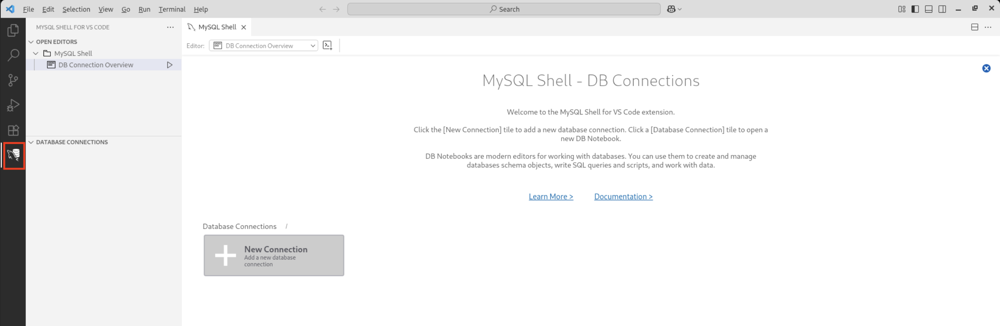
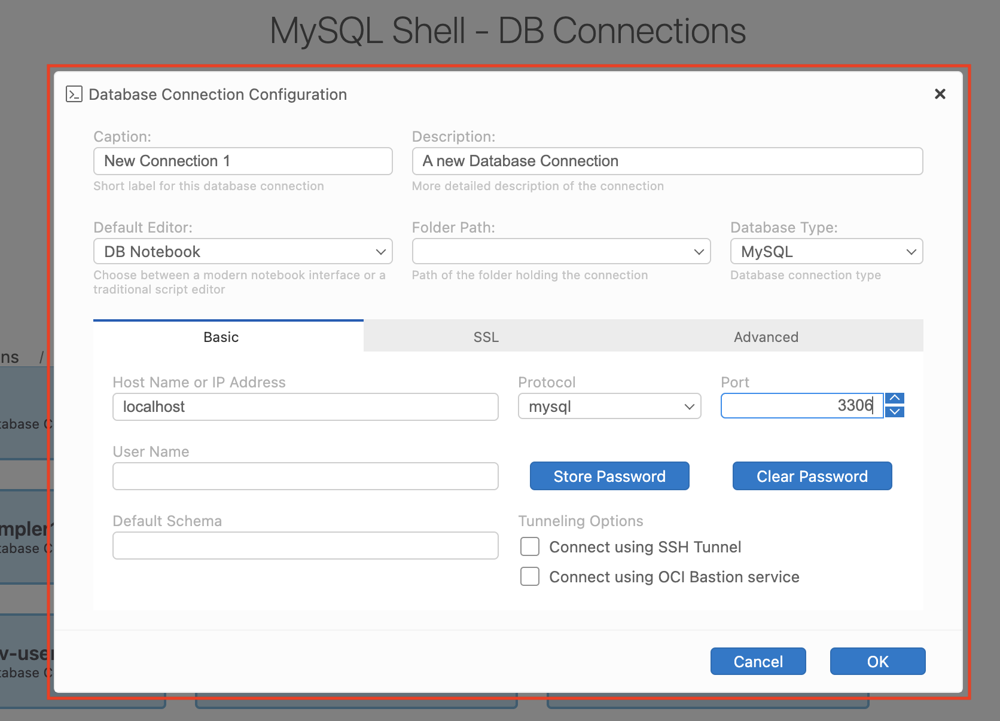
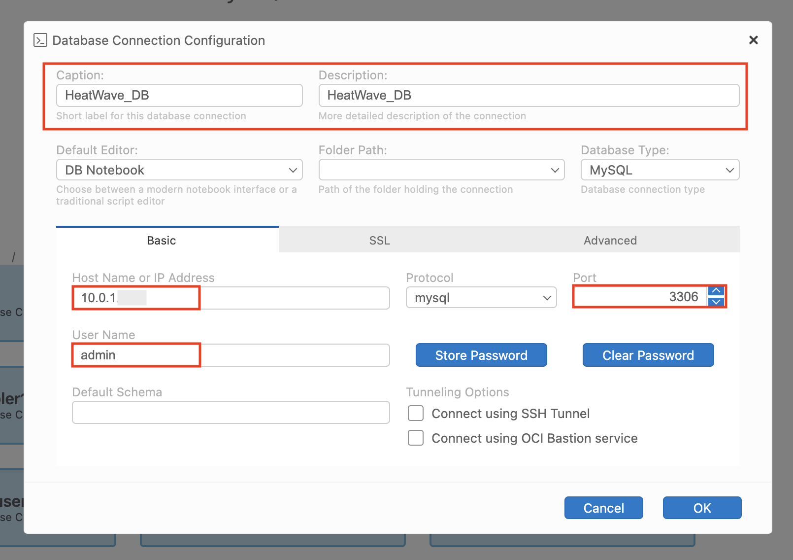
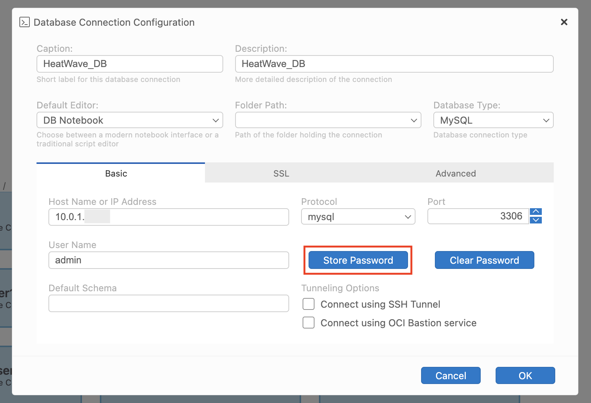
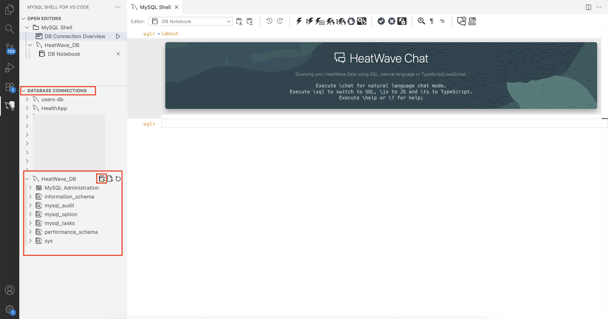

# Connect to MySQL HeatWave DB system

## Introduction

Modern application development demands tools that reduce context switching and improve developer productivity. The MySQL Shell extension for Visual Studio Code brings powerful database interaction directly into your development workspace.

With seamless support for SQL, Javascript, and TypeScript right inside the familiar VS Code environment developers can connect, query, and script against MySQL databases without ever leaving their IDE.

In this lab, you'll learn how to connect to a MySQL DB system using the MySQL Shell extension in Visual Studio Code. This setup is especially useful if you are working in a development environment and prefer using VS code interface to manage your databases.

Estimated time: 10 minutes

### Objectives

* Connect to a MySQL DB system using MySQL Shell extension for VS Code

## Task 1: Connect to a MySQL DB system using MySQL Shell extension for VS Code

1. Launch Visual Studio Code and click on the **MySQL Shell for VS Code icon** in the left sidebar. This opens the database panel where you can add and manage connections.

     

2. Click the **+ New Connection** button within the Database Connections panel or on the home tab. Either ways will work to create a new connection.

     

3. This opens up a new connection tab to fill in the required details in the dialog box.

     

4. Fill in the required fields:

    * **Caption**: A friendly name for your connection. In this example, use **HeatWave_DB**
    * **Description**: An optional but helpful description. Use **HeatWave_DB** as the description
    * **Host Name or IP Address**: Enter the hostname which you copied from the connections tab of the MySQL HeatWave DB system
    * **Port**: This is the port your MySQL server is running on. Typically, it is **3306**
    * **Username**: Enter the username as **admin**

    

5. Once you filled in the above details, click on **Store Password** to minimize entering the password every time for convenience. Enter password as **Welcome1!** to connect to the host.

    

6. Once the password is entered, click on **OK** to save the password.

    

7. You can securely connect to your HeatWave MySQL DB system using an SSH tunnel through a compute instance, which acts as a jump host or bastion host. OCI also provides the Bastion service as an alternative for secure access to private resources.

8. Check Connect Using SSH Tunnel box under Tunneling options.

    

9. Expand the SSH tunnel section and configure:

* SSH Host: Public IP or hostname of your Compute instance
* SSH Port: 22 (default SSH port)
* SSH Username: Username for the Compute instance (e.g., opc on Oracle Linux)
* SSH Key: Browse and Select your private key file

    

10. After all the details are entered, click on **OK** to save connection to the MySQL DB system.

    

> **Note:** _The MySQL Shell extension with route your connection securely through the tunnel._

11. If the connection is successful, you will see a connection created and the MySQL DB system connection name appears under Database Connections as well.

    

12. Clicking on the connection opens MySQL Shell DB Notebook for MySQL DB system.

    

13. You can also connect to your MySQL DB system from the left bar navigation by clicking on the **notebook** icon beside the connection name.

    

## Acknowledgements

* **Author** - Sindhuja Banka, MySQL HeatWave Product Manager
* **Contributors** - Sindhuja Banka
* **Last Updated By/Date** - Sindhuja Banka, November 2025
