# Create MySQL HeatWave DB system

## Introduction

In this lab, you will learn how to launch a MySQL HeatWave DB system on Oracle Cloud Infrastructure (OCI) and later connect to it using MySQL Shell extension for Visual Studio Code.

Estimated Time: 20 minutes

### About MySQL HeatWave Service

MySQL HeatWave is a fully-managed OCI service that is developed, managed, and supported by the MySQL team in Oracle.

### Objectives

In this lab, you will be guided through the following steps:

- Create a compartment
- Create a policy
- Create a virtual cloud network (VCN)
- Create a MySQL HeatWave DB system
- Create a client virtual machine

### Prerequisites

- An Oracle Free Tier, Always Free, Paid or LiveLabs Cloud Account
- Some Experience with MySQL Shell
- Create a local Secure Shell (SSH) key

## Task 1: Create a Compartment

You must have an OCI tenancy subscribed to your home region and enough limits configured for your tenancy to create a MySQL HeatWave Database System. Make sure to log in to the Oracle Cloud Console as an Administrator.

1. Click the **Navigation Menu** in the upper left, navigate to **Identity & Security** and select **Compartments**.

    

2. On the Compartments page, click **Create Compartment**.

    

   > **Note:** Two Compartments, _Oracle Account Name_ (root) and a compartment for PaaS, were automatically created by the Oracle Cloud.

3. In the Create Compartment dialog box, in the **NAME** field, enter **HeatWave_Sandbox**, and then enter a Description, select the **Parent Compartment**, and click **Create compartment**.

    

    The following screen shot shows a completed compartment:

    

## Task 2: Create a Policy

1. Click the **Navigation Menu** in the upper-left corner, navigate to **Identity & Security** and select **Policies**.

     

2. On the Policies page, in the **List Scope** section, select the Compartment (root) and click **Create Policy**.

    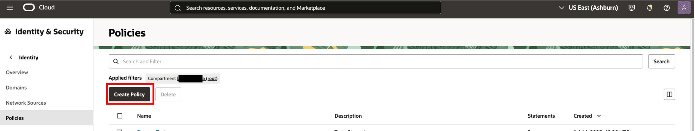

3. On the Create Policy page, in the **Description** field, enter **HeatWave_Policy** and select the root compartment.

4. In the **Policy Builder** section, turn on the **Show manual editor** toggle switch.

    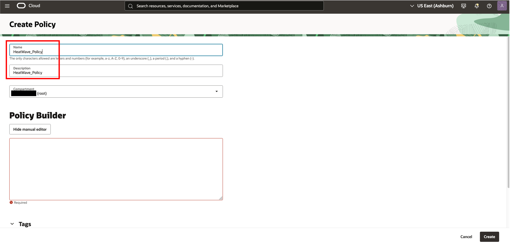

5. Enter the following required MySQL HeatWave policies:

    - Policy statement 1:

        ```bash
        <copy>Allow group Administrators to {COMPARTMENT_INSPECT} in tenancy</copy>
        ```

    - Policy statement 2:

        ```bash
        <copy>Allow group Administrators to {VCN_READ, SUBNET_READ, SUBNET_ATTACH, SUBNET_DETACH} in tenancy</copy>
        ```

    - Policy statement 3:

        ```bash
        <copy>Allow group Administrators to manage mysql-family in tenancy</copy>
        ```

6. Click **Create**.

    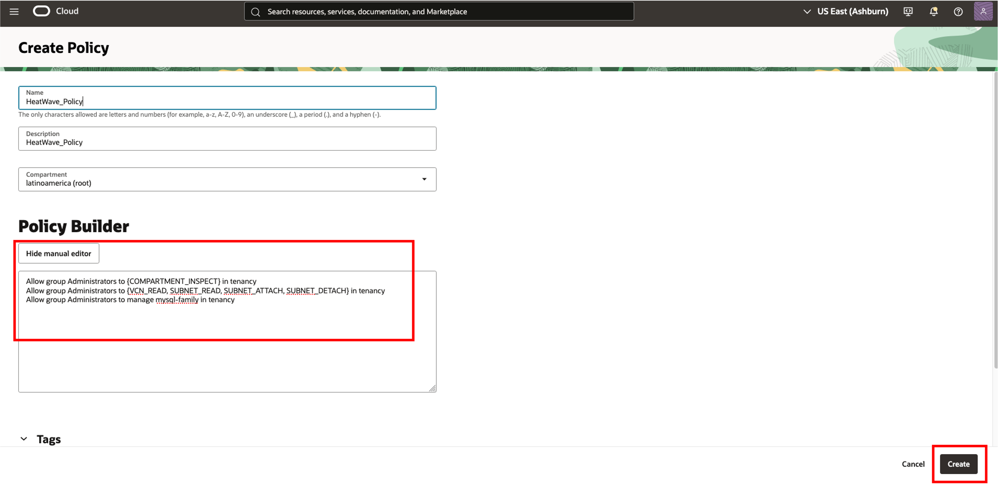

## Task 3: Create a VCN

1. Click the **Navigation Menu** in the upper-left corner, navigate to **Networking**, and select **Virtual Cloud Networks**.

   

2. Click **Start VCN Wizard**.

3. Select **VCN with Internet Connectivity** and click **Start VCN Wizard**.

    
    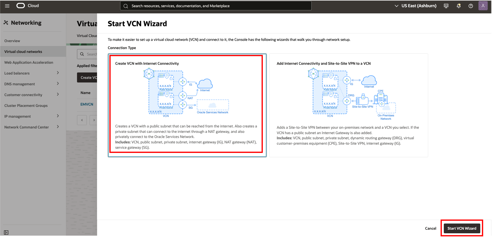

    

4. On the Create a VCN with Internet Connectivity page, in the **Basic Information** section, in the **VCN Name** field, enter `HeatWave_VCN` and from the **Compartment** drop-down list, select **HeatWave_Sandbox**.
    > **Note:** Your screen should look similar to the following screen shot:

    

5. Click **Next** at the bottom of the screen.

6. Review the **Oracle Virtual Cloud Network (VCN)**, **Subnets**, and **Gateways** sections and click **Create** to create the VCN.

    

    > **Note:** The VCN creation is completing.

    

7. Click **View Virtual Cloud Network** to display the created VCN.

    


8. On the Virtual Cloud Network Details page, select the **Security** tab, click on **Security List for Private Subnet-HeatWave_VCN**

     

## Task 4: Configure security list to allow MySQL incoming connection HeatWave_VCNs

1. In the **Security List for Private Subnet-HeatWave_VCN** section, in the **Ingress Rules** section, click **Add Ingress Rules**.

    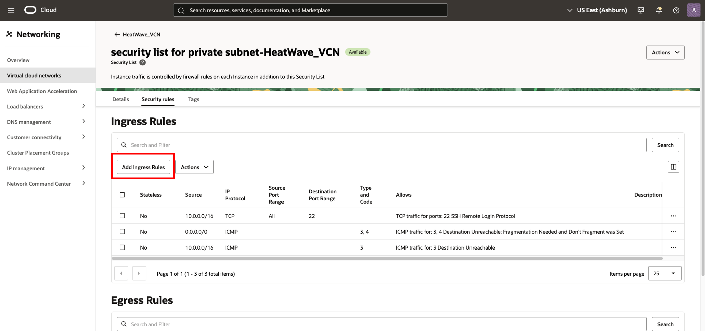

2. In the **Add Ingress Rule** dialog box, add an ingress rule with **Source CIDR** `0.0.0.0/0` and destination port number `3306, 33060` and click **Add Ingress Rule**.

    

3. On the Security List for Private Subnet-HeatWave_VCN page, the new ingress rules will be shown in the **Ingress Rules** list.

    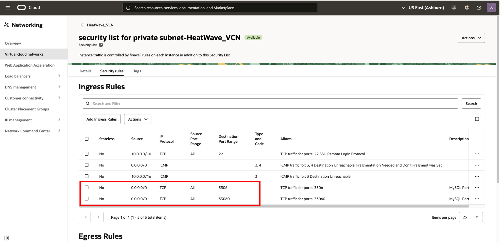

## Task 5: Create a MySQL HeatWave DB system

1. Click the **Navigation Menu** in the upper-left corner, navigate to **Databases**, and select **Database Systems**.

   

2. Click **Create MySQL HeatWave Database System**.

    

3. Select the Development or Testing Option

    

4. On the Create MySQL HeatWave Database System dialog box, complete the fields in each section:

    - Provide basic information for the database system
    - Set up your required database system
    - Create administrator credentials
    - Configure networking
    - Configure placement
    - Configure hardware
    - Configure backups
    - Show advanced options

5. In **Provide basic information for the DB System**, select the **HeatWave\_Sandbox** Compartment, in the **Name** field and **Description** field, enter **HeatWave_DB**.

    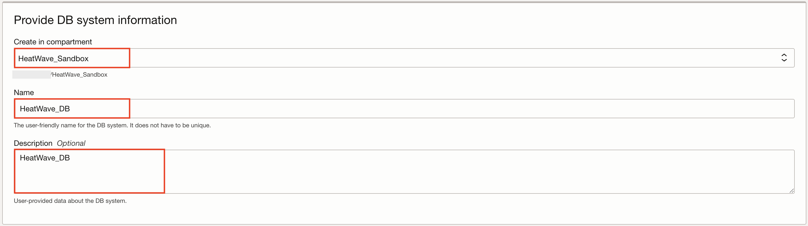

6. In **Create Administrator credentials**, enter **admin** for the user name, enter **Welcome1!** for the password, and then enter **Welcome1!** to confirm the password.

    

7. In **Setup your required Database System**, select **Standalone** to specify a single-instance database system.

    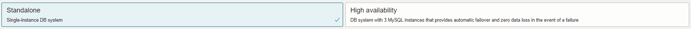

8. In **Configure networking**, keep default values **HeatWave\_VCN** for the VCH and **private subnet-HeatWave\_VCN (Regional)** for the subnet.

    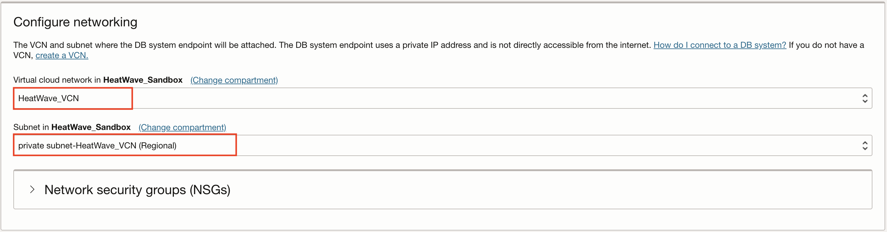

9. In **Configure placement**, keep **Availability Domain** selected.

    > **Note:** Do not select **Choose a Fault Domain** for this database system. Oracle will select the best placement for you.

    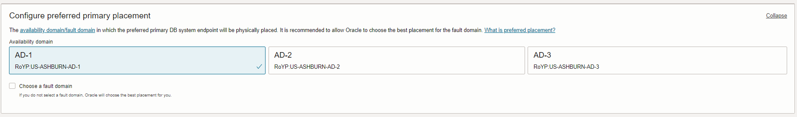

10. In **Configure hardware**:  
    - Remove the check mark from **Enable HeatWave**  
    - Set the default shape to **MySQL.2** 
    - Set the value **100** for the **Data Storage Size (GB)**.  

    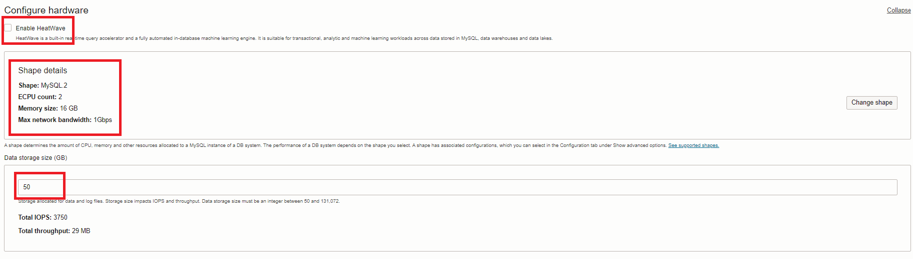

11. In **Configure Backups**, keep **Enable Automatic Backups** selected. Set the retention period to `7` and select **Default Backup Window**.

    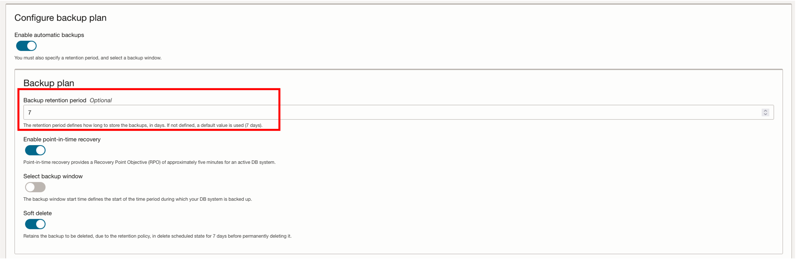

12. Expand advanced options at the end to select the database version.

    

13. Expand Configuration tab under advanced options to select the database version to **9.4.1** and click **Create**.

    

    > **Note:** The New MySQL HeatWave Database System will be ready to use after a few minutes. The state will be shown as **Creating** during the creation.

    

    > **Note:** The **Active** state indicates that the database system is ready to use.

14. The state **Active** indicates that the DB system is ready for use. On the **HeatWave_DB** page,select the **Connections** tab, check and save the Endpoint (Private IP Address). Later, you will need this value to connect to the Heatwave DB using the MySQL Shell client tool.

    

## Task 6: Create the Client Virtual Machine

> **Important:** If you have not already completed the **Create Local SSH Key** lab, please do so now. When you are finished, return to this task.

1. You need a client machine to connect to your brand new MySQL database. Click the **Navigation Menu** in the upper-left corner, navigate to **Compute**, and select **Instances**.

   

2. In the **Instances in HeatWave_Sandbox Compartment** section, click **Create Instance**.

    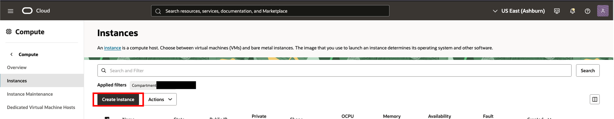

3. In the **Create Compute Instance** section, enter **HeatWave_Client** for the instance name.

4. Make sure the **HeatWave_Sandbox** compartment is selected.

5. Choose an operating system or image source (for this lab, select **Oracle Linux**).

6. In the **Configure placement and hardware** section, keep the default **Availability Domain** and keep the default **Shape**.

   

    > **Note:** For the **Security** section, click Next
    

    > **Note:** **Virtual cloud network**, make sure **HeatWave_VCN** is selected and **Assign a public IPv4 address** is **selected**

   

7. If you have not already created your SSH key, complete the **Create Local SSH Key** lab. When you are done, continue on to the next step.

8. In the **Add SSH keys** section, generate an SSH key pair or upload your own public key. Select one of the following options:

    - **Generate SSH key pair:** Oracle Cloud Infrastructure (OCI) generates an RSA key pair for the instance. Click **Save Private Key**, and then save the private key on your computer. Optionally, click **Save Public Key** and then save the public key.
    - **Choose public key files:** Upload the public key portion of your key pair. Either browse to the key file that you want to upload, or drag and drop the file into the field. To provide multiple keys, press and hold down the Command key (on Mac) or the CTRL key (on Windows) while selecting files.
    - **Paste public keys:** Paste the public key portion of your key pair in the field.
    - **No SSH keys:** Do _not_ select this option. You will not be able to connect to the compute instance using SSH.

    

    > **Note:** For the **Storage** section, click Next
    

9. Click the Create **button**

    
    **Note:** The new virtual machine will be ready to use after a few minutes. The state will be shown as **Provisioning** during the creation.

    

    > **Note:** The **Running** state indicates that the virtual machine is ready for use. **Save the Public IP Address** is under **Instance Access**  on the **HeatWave_Client** page.

    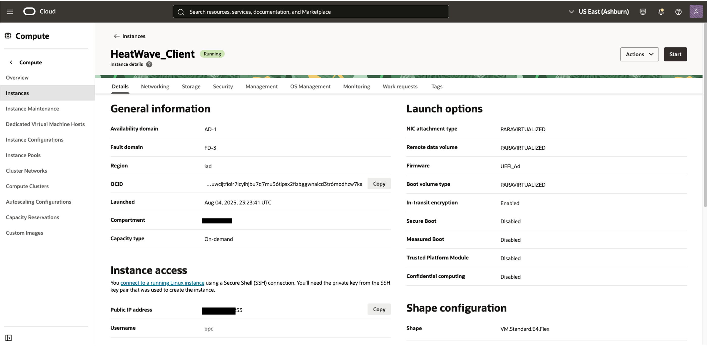

## Learn More

- [MySQL Heatwave Documentation](https://docs.oracle.com/en-us/iaas/mysql-database/)

- [MySQL HeatWave Database Documentation](https://www.mysql.com)

## Acknowledgements

- **Author** -  Sindhuja Banka, MySQL Product Manager
- **Contributors** -  Sindhuja Banka
- **Last Updated By/Date** - Sindhuja Banka, November 2025
