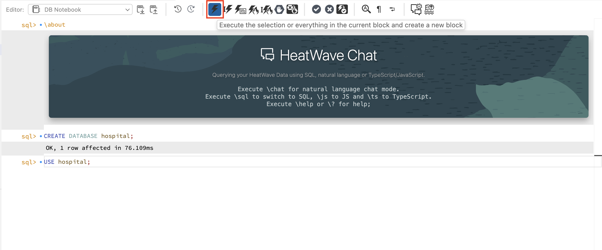
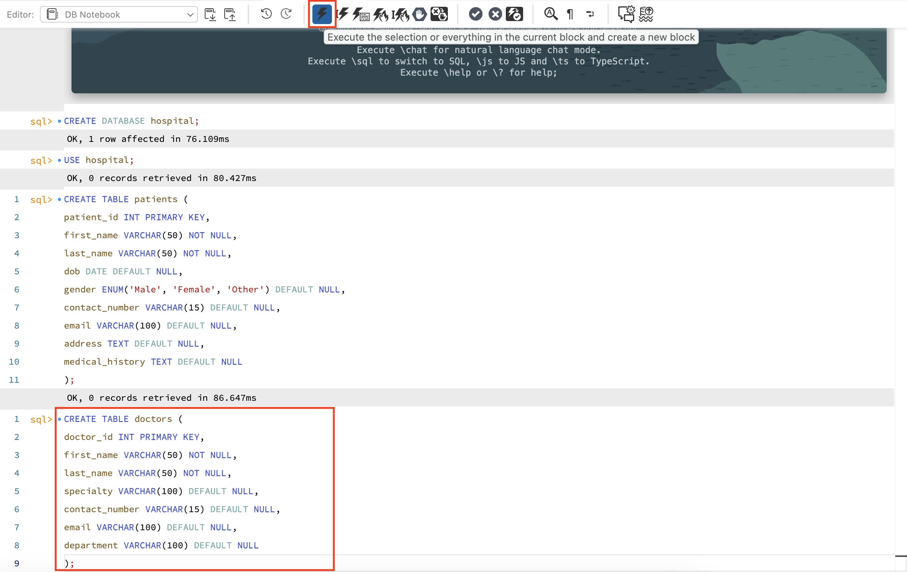
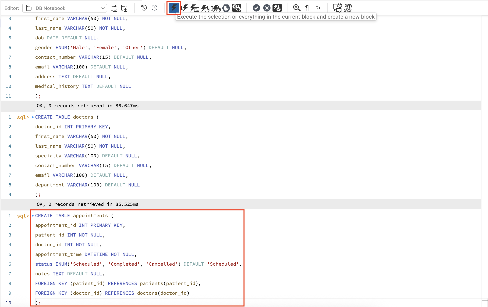
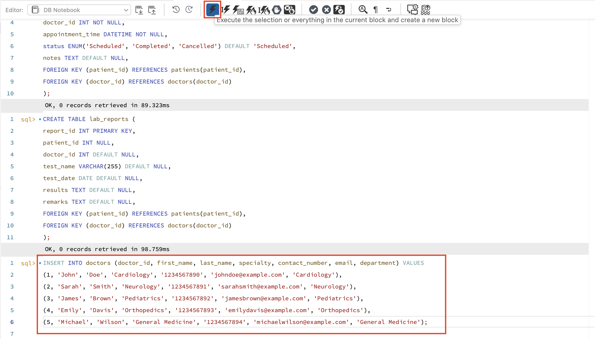
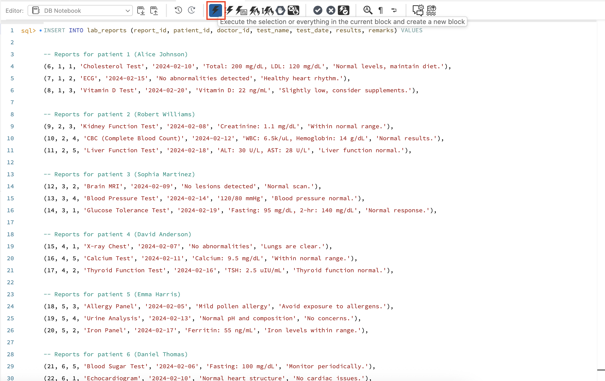

# Creating the Schema for JSON Duality Views

## Introduction

This lab guides you through the foundational steps required to set up a hospital database, its core relational tables, and initial data. This serves as the groundwork for exploring JSON Duality Views in upcoming lab sections. By the end, you’ll have a populated hospital database ready to leverage MySQL's dual relational/JSON capabilities.

Estimated Lab Time: 10 minutes

### Objectives

In this lab, you will be guided through the following tasks:

- Create the database and relational tables
- Populate the database with sample data needed for duality views

### Prerequisites

- An Oracle Trial or Paid Cloud Account
- Some Experience with MySQL
- Completed Lab 3

## Task 1: Create the database and relational tables

1. Let us begin by creating a database called **hospital** to add the relational tables.

     ```
     <copy>CREATE DATABASE hospital;</copy>
     ```
     

2. Switch to the newly created hospital database.

    ```
    <copy>USE hospital;</copy>
    ```
     

3. Once the database is created, we need to set up four key tables: patients, doctors, appointments, and lab reports.
These tables will store the main information for our hospital database, and later on, we’ll use them to build JSON Duality Views, which allow you to see and work with this data in both relational and JSON formats.

4. The patients table will store demographic and medical data for each patient, serving as a key entity for the hospital schema.

    ```
    <copy>CREATE TABLE patients (
    patient_id INT PRIMARY KEY,
    first_name VARCHAR(50) NOT NULL,
    last_name VARCHAR(50) NOT NULL,
    dob DATE DEFAULT NULL,
    gender ENUM('Male', 'Female', 'Other') DEFAULT NULL,
    contact_number VARCHAR(15) DEFAULT NULL,
    email VARCHAR(100) DEFAULT NULL,
    address TEXT DEFAULT NULL,
    medical_history TEXT DEFAULT NULL
);
</copy>
    ```
     

5. The doctors table holds information about healthcare providers and is related to both appointments and lab reports.

    ```
    <copy>
    CREATE TABLE doctors (
    doctor_id INT PRIMARY KEY,
    first_name VARCHAR(50) NOT NULL,
    last_name VARCHAR(50) NOT NULL,
    specialty VARCHAR(100) DEFAULT NULL,
    contact_number VARCHAR(15) DEFAULT NULL,
    email VARCHAR(100) DEFAULT NULL,
    department VARCHAR(100) DEFAULT NULL
);
</copy>
    ```
     

6. The Appointments connect patients and doctors and record scheduled meetings, including their dates, status, and remarks.

    ```
    <copy>
    CREATE TABLE appointments (
    appointment_id INT PRIMARY KEY,
    patient_id INT NOT NULL,
    doctor_id INT NOT NULL,
    appointment_time DATETIME NOT NULL,
    status ENUM('Scheduled', 'Completed', 'Cancelled') DEFAULT 'Scheduled',
    notes TEXT DEFAULT NULL,
    FOREIGN KEY (patient_id) REFERENCES patients(patient_id),
    FOREIGN KEY (doctor_id) REFERENCES doctors(doctor_id)
);
</copy>
    ```
     

7. Then Lab reports table tracks all laboratory test results for patients and records which doctor ordered or supervised them.

     ```
    <copy>
    CREATE TABLE lab_reports (
    report_id INT PRIMARY KEY,
    patient_id INT NULL,
    doctor_id INT DEFAULT NULL,
    test_name VARCHAR(255) DEFAULT NULL,
    test_date DATE DEFAULT NULL,
    results TEXT DEFAULT NULL,
    remarks TEXT DEFAULT NULL,
    FOREIGN KEY (patient_id) REFERENCES patients(patient_id),
    FOREIGN KEY (doctor_id) REFERENCES doctors(doctor_id)
);
</copy>
    ```
     

## Task 2: Insert records into the table

1. Add initial doctors to the doctors table to make relationships possible and have realistic datasets for querying and duality view experiments.

    ```
    <copy>
    INSERT INTO doctors (doctor_id, first_name, last_name, specialty, contact_number, email, department) VALUES
    (1, 'John', 'Doe', 'Cardiology', '1234567890', 'johndoe@example.com', 'Cardiology'),
    (2, 'Sarah', 'Smith', 'Neurology', '1234567891', 'sarahsmith@example.com', 'Neurology'),
    (3, 'James', 'Brown', 'Pediatrics', '1234567892', 'jamesbrown@example.com', 'Pediatrics'),
    (4, 'Emily', 'Davis', 'Orthopedics', '1234567893', 'emilydavis@example.com', 'Orthopedics'),
    (5, 'Michael', 'Wilson', 'General Medicine', '1234567894', 'michaelwilson@example.com', 'General Medicine');
    </copy>
    ```
     

2. Insert sample patients as these patients allow you to simulate various appointments and lab tests.

    ```
    <copy>
    INSERT INTO patients (patient_id, first_name, last_name, dob, gender, contact_number, email, address, medical_history) VALUES
    (1, 'Alice', 'Johnson', '1985-06-15', 'Female', '9876543210', 'alicejohnson@example.com', '123 Elm Street', 'Diabetes'),
    (2, 'Robert', 'Williams', '1990-09-22', 'Male', '9876543211', 'robertwilliams@example.com', '456 Oak Avenue', 'Hypertension'),
    (3, 'Sophia', 'Martinez', '2000-01-05', 'Female', '9876543212', 'sophiamartinez@example.com', '789 Maple Lane', 'Asthma'),
    (4, 'David', 'Anderson', '1982-04-17', 'Male', '9876543213', 'davidanderson@example.com', '159 Pine Road', 'No known conditions'),
    (5, 'Emma', 'Harris', '1995-07-30', 'Female', '9876543214', 'emmaharris@example.com', '753 Birch Blvd', 'Migraine'),
    (6, 'Daniel', 'Thomas', '1988-11-12', 'Male', '9876543215', 'danielthomas@example.com', '951 Cedar Dr', 'Allergic to Penicillin'),
    (7, 'Olivia', 'White', '1975-12-25', 'Female', '9876543216', 'oliviawhite@example.com', '852 Spruce St', 'High Cholesterol');
    </copy>
    ```
     

3. Insert Sample appointments to Connect patients and doctors with a set of realistic appointments. This is essential for join queries and dual views later on.

    ```
    <copy>
    INSERT INTO appointments (appointment_id, patient_id, doctor_id, appointment_time, status, notes) VALUES
    (1, 1, 1, '2024-02-05 10:00:00', 'Scheduled', 'Routine check-up'),
    (2, 2, 3, '2024-02-06 11:30:00', 'Scheduled', 'Follow-up on hypertension medication'),
    (3, 3, 2, '2024-02-07 14:00:00', 'Scheduled', 'Neurology consultation'),
    (4, 4, 4, '2024-02-08 09:15:00', 'Scheduled', 'Orthopedic assessment for knee pain'),
    (5, 5, 5, '2024-02-09 16:45:00', 'Scheduled', 'General health check-up'),
    (6, 6, 1, '2024-02-10 12:00:00', 'Scheduled', 'Heart condition follow-up'),
    (7, 7, 2, '2024-02-11 15:30:00', 'Scheduled', 'MRI scan review');
    </copy>
    ```
     

4. This data supports scenarios involving diagnostic results and enables you to explore JSON document construction in future steps.

    ```
    <copy>
    INSERT INTO lab_reports (report_id, patient_id, doctor_id, test_name, test_date, results, remarks) VALUES
    (1, 1, 1, 'Blood Sugar Test', '2024-02-01', 'Fasting: 110 mg/dL, Post-meal: 140 mg/dL', 'Slightly elevated, monitor regularly'),
    (2, 2, 3, 'Lipid Profile', '2024-02-02', 'Total Cholesterol: 220 mg/dL, LDL: 150 mg/dL', 'High cholesterol, dietary changes recommended'),
    (3, 3, 2, 'MRI Brain Scan', '2024-02-03', 'No abnormalities detected', 'Normal scan, no concerns'),
    (4, 4, 4, 'X-ray Knee', '2024-02-04', 'Mild arthritis detected', 'Physical therapy suggested'),
    (5, 5, 5, 'Complete Blood Count', '2024-02-05', 'Normal hemoglobin levels', 'No issues detected');
    </copy>
    ```
     

5. Insert Additional Lab Reports adding more variety and depth to the lab data, simulating multiple tests for patients.

    ```
    <copy>
    INSERT INTO lab_reports (report_id, patient_id, doctor_id, test_name, test_date, results, remarks) VALUES
    
    -- Reports for patient 1 (Alice Johnson)
    (6, 1, 1, 'Cholesterol Test', '2024-02-10', 'Total: 200 mg/dL, LDL: 120 mg/dL', 'Normal levels, maintain diet.'),
    (7, 1, 2, 'ECG', '2024-02-15', 'No abnormalities detected', 'Healthy heart rhythm.'),
    (8, 1, 3, 'Vitamin D Test', '2024-02-20', 'Vitamin D: 22 ng/mL', 'Slightly low, consider supplements.'),

    -- Reports for patient 2 (Robert Williams)
    (9, 2, 3, 'Kidney Function Test', '2024-02-08', 'Creatinine: 1.1 mg/dL', 'Within normal range.'),
    (10, 2, 4, 'CBC (Complete Blood Count)', '2024-02-12', 'WBC: 6.5k/uL, Hemoglobin: 14 g/dL', 'Normal results.'),
    (11, 2, 5, 'Liver Function Test', '2024-02-18', 'ALT: 30 U/L, AST: 28 U/L', 'Liver function normal.'),

    -- Reports for patient 3 (Sophia Martinez)
    (12, 3, 2, 'Brain MRI', '2024-02-09', 'No lesions detected', 'Normal scan.'),
    (13, 3, 4, 'Blood Pressure Test', '2024-02-14', '120/80 mmHg', 'Blood pressure normal.'),
    (14, 3, 1, 'Glucose Tolerance Test', '2024-02-19', 'Fasting: 95 mg/dL, 2-hr: 140 mg/dL', 'Normal response.'),

    -- Reports for patient 4 (David Anderson)
    (15, 4, 1, 'X-ray Chest', '2024-02-07', 'No abnormalities', 'Lungs are clear.'),
    (16, 4, 5, 'Calcium Test', '2024-02-11', 'Calcium: 9.5 mg/dL', 'Within normal range.'),
    (17, 4, 2, 'Thyroid Function Test', '2024-02-16', 'TSH: 2.5 uIU/mL', 'Thyroid function normal.'),

    -- Reports for patient 5 (Emma Harris)
    (18, 5, 3, 'Allergy Panel', '2024-02-05', 'Mild pollen allergy', 'Avoid exposure to allergens.'),
    (19, 5, 4, 'Urine Analysis', '2024-02-13', 'Normal pH and composition', 'No concerns.'),
    (20, 5, 2, 'Iron Panel', '2024-02-17', 'Ferritin: 55 ng/mL', 'Iron levels within range.'),

    -- Reports for patient 6 (Daniel Thomas)
    (21, 6, 5, 'Blood Sugar Test', '2024-02-06', 'Fasting: 100 mg/dL', 'Monitor periodically.'),
    (22, 6, 1, 'Echocardiogram', '2024-02-10', 'Normal heart structure', 'No cardiac issues.'),
    (23, 6, 2, 'Electrolyte Panel', '2024-02-14', 'Sodium: 140 mmol/L, Potassium: 4.0 mmol/L', 'Balanced electrolyte levels.'),

    -- Reports for patient 7 (Olivia White)
    (24, 7, 3, 'Bone Density Test', '2024-02-07', 'T-score: -1.0', 'Mild osteopenia, calcium intake recommended.'),
    (25, 7, 5, 'Lipid Profile', '2024-02-11', 'HDL: 50 mg/dL, LDL: 135 mg/dL', 'LDL slightly high, consider diet changes.'),
    (26, 7, 4, 'Thyroid Ultrasound', '2024-02-15', 'No nodules detected', 'Thyroid appears normal.');
    </copy>
    ```
     

6. Run the following command to validate that all the tables are created in the hospital database.

     ```
     <copy>SHOW TABLES;</copy>
     ```
     

## Acknowledgements

- Authors: Sindhuja Banka, MySQL HeatWave Product Manager
- Contributors: Sindhuja Banka, Farhan Tauheed
- Last Updated: Sindhuja Banka, November 2025
