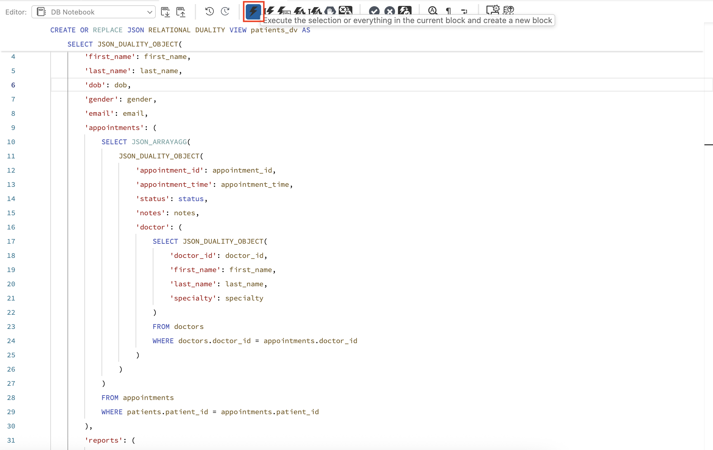
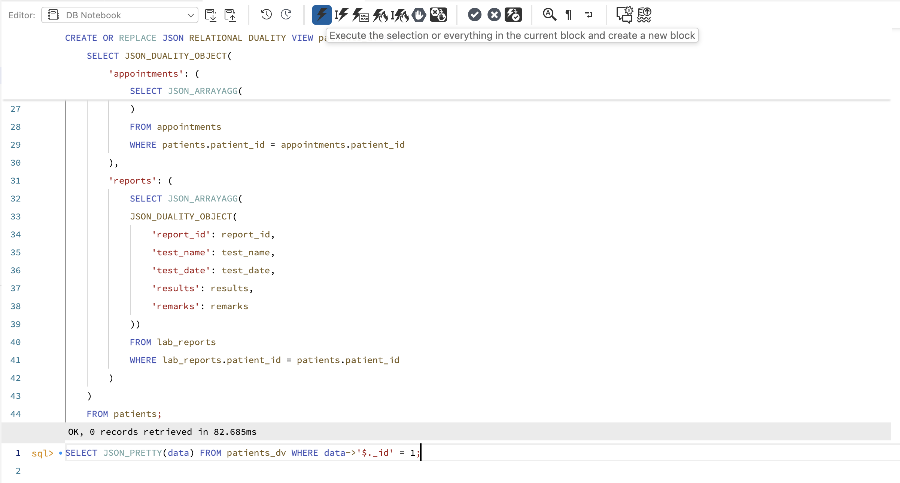
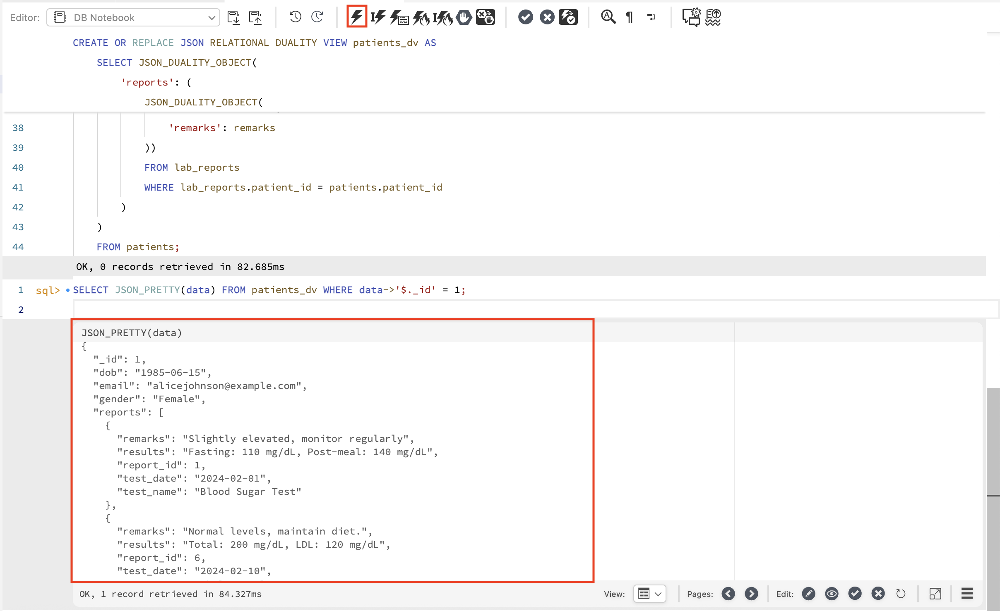
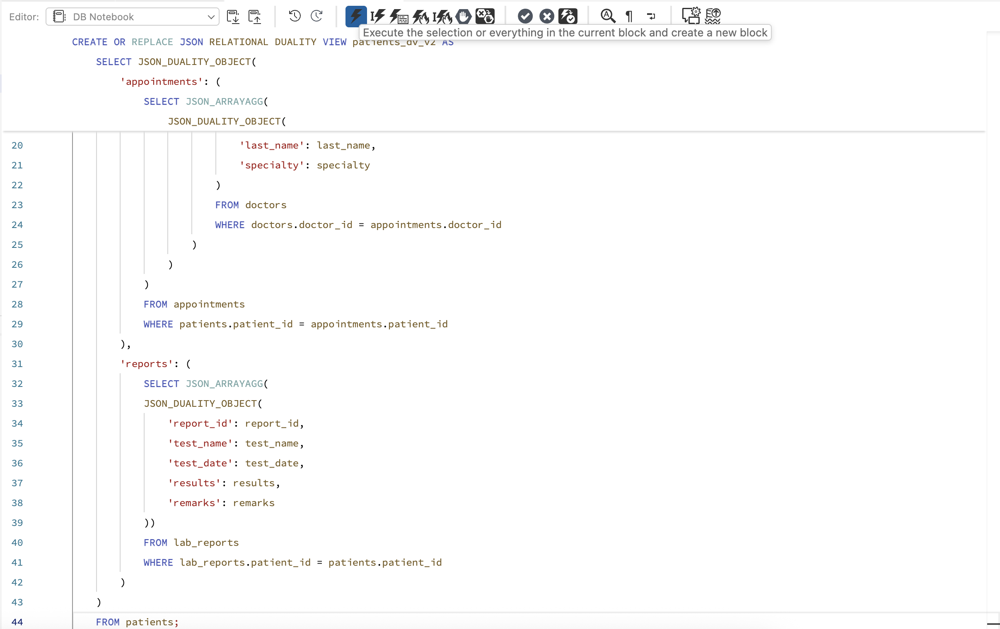

# Explore JSON Duality Views with MySQL

## Introduction

In this lab, you will learn how to create and use JSON Duality Views on a hospital database in MySQL HeatWave. JSON Duality Views allow you to work with your relational data as nested JSON objects making it easier to integrate with web and mobile applications.

Estimated Lab Time: 15 minutes

### Objectives

In this lab, you will be guided through the following tasks:

- Create a JSON Duality View from your hospital tables
- Query and view complex, nested JSON documents
- Understand the benefits of JSON Duality Views

### Prerequisites

- An Oracle Trial or Paid Cloud Account
- Some Experience with MySQL
- Completed Lab 4

## Task 1: Create a JSON Duality View

1. Switch to your hospital database so you’re working in the right context.

    ```
    <copy>USE hospital;</copy>
    ```
     

2. Let’s create a JSON Duality View called **patients_dv**. This view presents each patient as a JSON document, including all their appointments (with doctor details) and lab reports, all in a single nested JSON structure.

    ```
    <copy>
        CREATE OR REPLACE JSON RELATIONAL DUALITY VIEW patients_dv AS
        SELECT JSON_DUALITY_OBJECT(
            '_id': patient_id,
            'first_name': first_name,
            'last_name': last_name,
            'dob': dob,
            'gender': gender,
            'email': email,
            'appointments': (
                SELECT JSON_ARRAYAGG(
                    JSON_DUALITY_OBJECT(
                        'appointment_id': appointment_id,
                        'appointment_time': appointment_time,
                        'status': status,
                        'notes': notes,
                        'doctor': (
                            SELECT JSON_DUALITY_OBJECT(
                                'doctor_id': doctor_id,
                                'first_name': first_name,
                                'last_name': last_name,
                                'specialty': specialty
                            )
                            FROM doctors
                            WHERE doctors.doctor_id = appointments.doctor_id
                        )
                    )
                )
                FROM appointments
                WHERE patients.patient_id = appointments.patient_id
            ),
            'reports': (
                SELECT JSON_ARRAYAGG(
                JSON_DUALITY_OBJECT(
                    'report_id': report_id,
                    'test_name': test_name, 
                    'test_date': test_date, 
                    'results': results, 
                    'remarks': remarks
                ))
                FROM lab_reports
                WHERE lab_reports.patient_id = patients.patient_id
            )
        )
        FROM patients;
</copy>
    ```
     

3. This structure combines key information about a patient into an easily consumable JSON format, perfect for applications.

## Task 2: Dive Deeper into the JSON

1. You can look at the JSON generated for a specific patient and see all of their appointments and lab reports as nested objects.

    ```
    <copy>
        SELECT JSON_PRETTY(data) FROM patients_dv WHERE data->'$._id' = 1;
    </copy>
    ```
     

2. This makes it easy to send or consume patient data in modern applications without running multiple joins or additional queries.

3. Here is the output of how it looks for patient 1.

     

## Task 3: (Optional) Create More Views as Needed

1. You can create other versions of the view, or new views, to suit different application needs. For example, patients_dv_v2 might present the data slightly differently or include more information.

    ```
    <copy>
        CREATE OR REPLACE JSON RELATIONAL DUALITY VIEW patients_dv_v2 AS
        SELECT JSON_DUALITY_OBJECT(
            '_id': patient_id,
            'first_name': first_name,
            'last_name': last_name,
            'dob': dob,
            'gender': gender, 
            'email': email,
            'appointments': (
                SELECT JSON_ARRAYAGG(
                    JSON_DUALITY_OBJECT(
                        'appointment_id': appointment_id,
                        'appointment_time': appointment_time,
                        'status': status,
                        'notes': notes,
                        'doctor': (
                            SELECT JSON_DUALITY_OBJECT(
                                'doctor_id': doctor_id,
                                'first_name': first_name,
                                'last_name': last_name,
                                'specialty': specialty
                            )
                            FROM doctors
                            WHERE doctors.doctor_id = appointments.doctor_id
                        )
                    )
                )
                FROM appointments
                WHERE patients.patient_id = appointments.patient_id
            ),
            'reports': (
                SELECT JSON_ARRAYAGG(
                JSON_DUALITY_OBJECT(
                    'report_id': report_id,
                    'test_name': test_name, 
                    'test_date': test_date, 
                    'results': results, 
                    'remarks': remarks
                ))
                FROM lab_reports
                WHERE lab_reports.patient_id = patients.patient_id
            )
        )
        FROM patients;
    </copy>
    ```
     

2. This is how you can view both of your views created on the database connection panel.

     

## Acknowledgements

- Authors: Sindhuja Banka, MySQL HeatWave Product Manager
- Contributors: Sindhuja Banka, Farhan Tauheed
- Last Updated: Sindhuja Banka, November 2025
