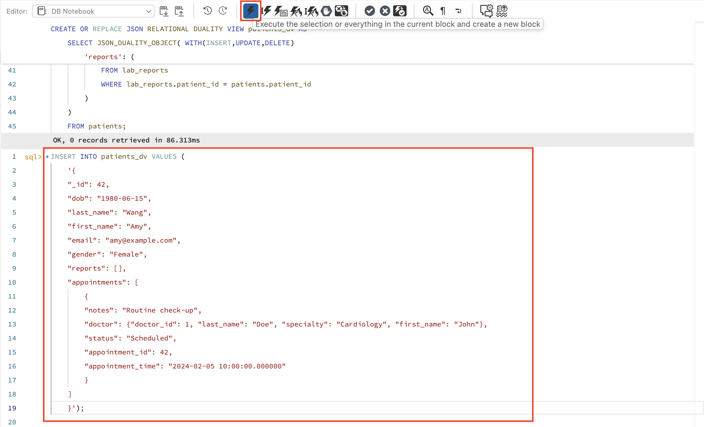

# Modify Data with JSON Relational Duality Views

## Introduction

This lab shows you how to use duality views to manage (insert, update, and delete) hospital data using JSON documents, while still enforcing relational integrity. You’ll see how modifications made via JSON documents are automatically reflected in your underlying relational tables.

Estimated Lab Time: 15 minutes

### Objectives

In this lab, you will be guided through the following tasks:

- Make duality views modifiable
- Insert JSON documents directly into duality views
- View data as JSON and as rows in base tables
- Control data changes and preserve integrity

### Prerequisites

- An Oracle Trial or Paid Cloud Account
- Some Experience with MySQL
- Completed Lab 5

## Task 1: Making Duality Views Modifiable

1. Switch to your hospital database so you’re working in the right context.

    ```
    <copy>USE hospital;</copy>
    ```
     

2. If you try to do an insert, update, or delete through this view now.

    ```
    <copy>
        INSERT INTO hospital.patients_dv VALUES (
        '{
        "_id": 42,
        "dob": "1985-06-15",
        "last_name": "Tauheed",
        "first_name": "Farhan",
        "email": "farhan@example.com",
        "gender": "Male",
        "reports": [],
        "appointments": [
            {
            "notes": "Routine check-up",
            "doctor": {"doctor_id": 1, "last_name": "Doe", "specialty": "Cardiology", "first_name": "John"},
            "status": "Scheduled",
            "appointment_id": 42,
            "appointment_time": "2024-02-05 10:00:00.000000"
            }
        ]
        }');
</copy>
    ```
     

3. You'll get an error because the view is read-only by default.

     

4. To allow INSERT, UPDATE, or DELETE operations, you must specify modification tags WITH (INSERT, UPDATE, DELETE) in your view definition for each updatable object.

    ```
    <copy>
        CREATE OR REPLACE JSON RELATIONAL DUALITY VIEW patients_dv AS
        SELECT JSON_DUALITY_OBJECT( WITH(INSERT,UPDATE,DELETE)
            '_id': patient_id,
            'first_name': first_name,
            'last_name': last_name,
            'dob': dob,
            'gender': gender,
            'email': email,
            'appointments': (
                SELECT JSON_ARRAYAGG(
                    JSON_DUALITY_OBJECT( WITH(INSERT,UPDATE,DELETE)
                        'appointment_id': appointment_id,
                        'appointment_time': appointment_time,
                        'status': status,
                        'notes': notes,
                        'doctor': (
                            SELECT JSON_DUALITY_OBJECT(
                                'doctor_id': doctor_id,
                                'first_name': first_name,
                                'last_name': last_name,
                                'specialty': specialty
                            )
                            FROM doctors
                            WHERE doctors.doctor_id = appointments.doctor_id
                        )
                    )
                )
                FROM appointments
                WHERE patients.patient_id = appointments.patient_id
            ),
            'reports': (
                SELECT JSON_ARRAYAGG(
                    JSON_DUALITY_OBJECT( WITH(INSERT,UPDATE,DELETE)
                        'report_id': report_id,
                        'test_name': test_name,
                        'test_date': test_date,
                        'results': results,
                        'remarks': remarks
                    )
                )
                FROM lab_reports
                WHERE lab_reports.patient_id = patients.patient_id
            )
        )
        FROM patients;
    </copy>
    ```
     

5. Now, inserts, updates, and deletes are allowed on the views.

6. This will create the patient, their appointment, and any reports (even if empty) in one step.

    ```
    <copy>
        INSERT INTO patients_dv VALUES (
        '{
        "_id": 42,
        "dob": "1985-06-15",
        "last_name": "Wang",
        "first_name": "Amy",
        "email": "amy@example.com",
        "gender": "Male",
        "reports": [],
        "appointments": [
            {
            "notes": "Routine check-up",
            "doctor": {"doctor_id": 1, "last_name": "Doe", "specialty": "Cardiology", "first_name": "John"},
            "status": "Scheduled",
            "appointment_id": 42,
            "appointment_time": "2024-02-05 10:00:00.000000"
            }
        ]
        }');
</copy>
    ```
     

7. You can query the Inserted JSON using the following command

    ```
    <copy>SELECT JSON_PRETTY(data) FROM patients_dv WHERE data->'$._id' = 42;</copy>
    ```
     

8. Output is as follows.
     

9. To remove the patient and all related child rows (appointments, reports), maintaining relational integrity, run the following command.

    ```
    <copy>DELETE FROM patients_dv WHERE data->'$._id' = 42;</copy>
    ```
     

9. To allow modifications (INSERT, UPDATE, DELETE) via duality views, always add WITH (INSERT, UPDATE, DELETE) in your JSON\_DUALITY\_OBJECTS.

10. Modifying through duality views automatically keeps all related tables synchronized and enforces data integrity where your application can now work with your relational schema using just JSON!

     

## Acknowledgements

- Authors: Sindhuja Banka, MySQL HeatWave Product Manager
- Contributors: Sindhuja Banka, Farhan Tauheed
- Last Updated: Sindhuja Banka, November 2025
