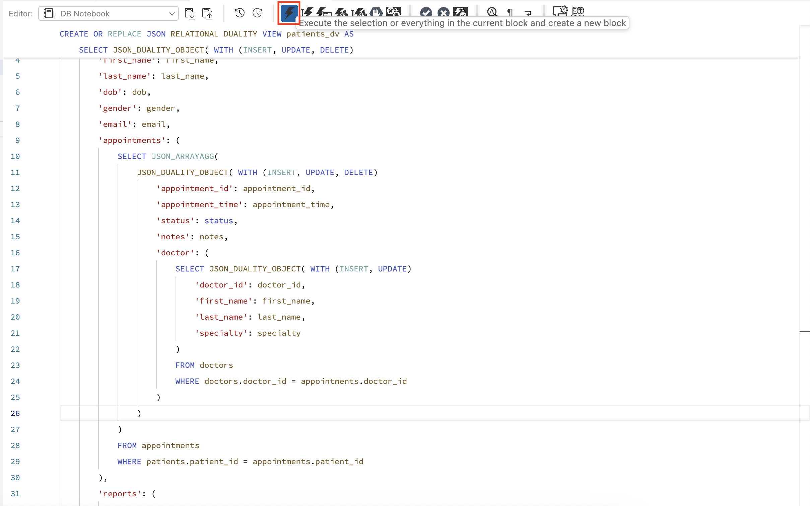
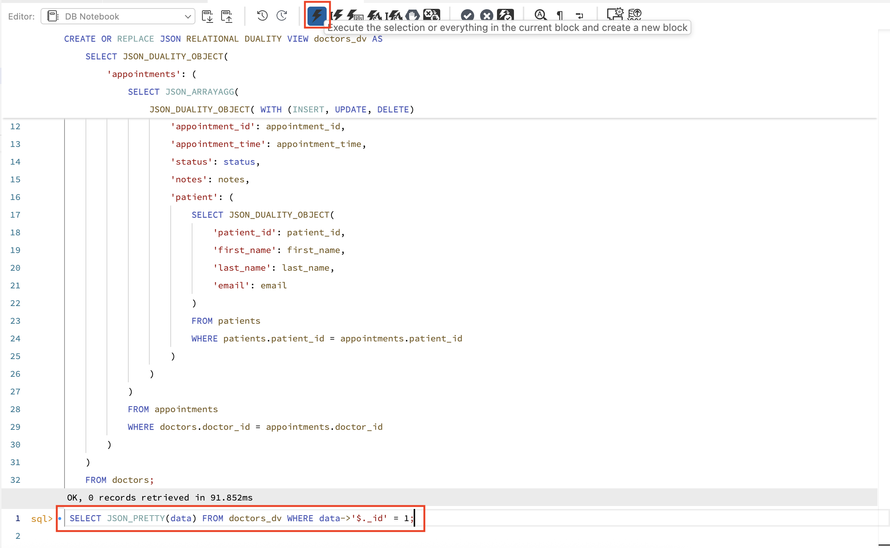
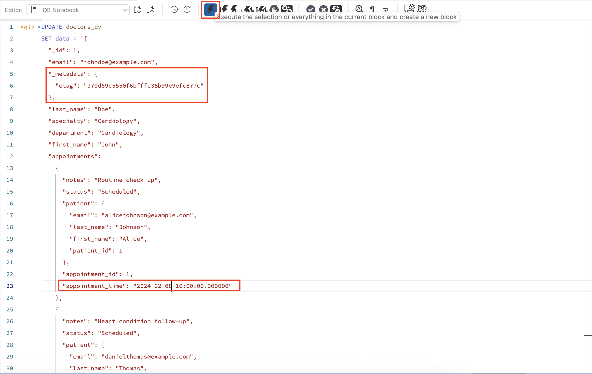
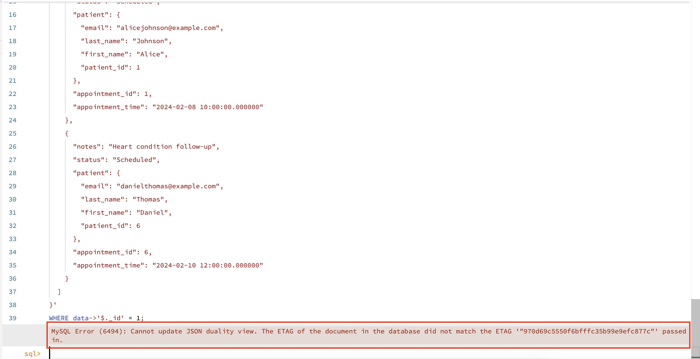
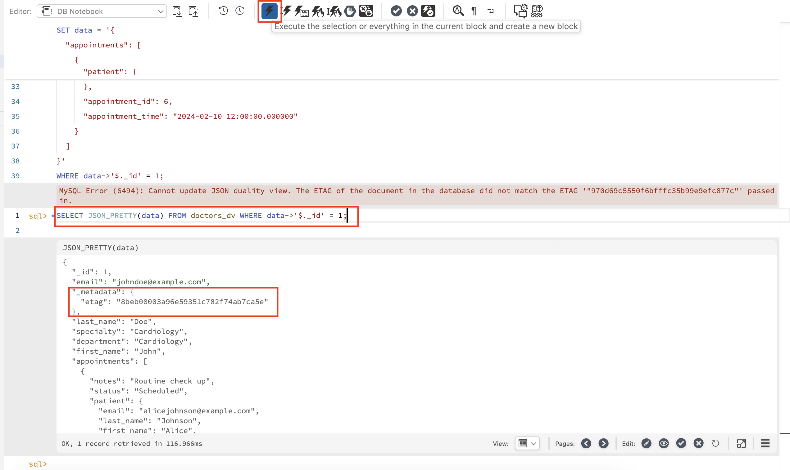
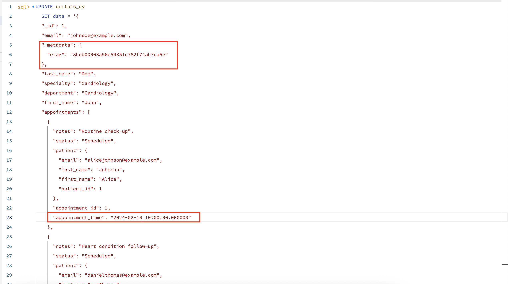

# Optimistic Concurrency Control with JSON Duality Views

## Introduction

This lab shows you how when two users (like a patient and a doctor) try to update the same appointment at almost the same time from different apps, it’s possible for one user's changes to overwrite the other's. Optimistic Concurrency Control (OCC) avoids this risk by using an ETAG which is a special value that changes every time data is updated so that the updates only succeed if the data hasn't changed since it was read.

Estimated Lab Time: 15 minutes

### Objectives

In this lab, you will be guided through the following tasks:

- Make duality views modifiable
- Insert JSON documents directly into duality views
- View data as JSON and as rows in base tables
- Control data changes and preserve integrity

### Prerequisites

- An Oracle Trial or Paid Cloud Account
- Some Experience with MySQL
- Completed Lab 6

## Task 1: Setup Duality Views

1. Switch to your hospital database so you’re working in the right context.

    ```
    <copy>USE hospital;</copy>
    ```
     

2. We already have a view exposes patient records as JSON. Specifying WITH (INSERT, UPDATE, DELETE) allows you to insert, update, or delete patient records as JSON documents. Nested (child) tables such as appointments and lab reports are also included and can be modified directly from the JSON structure.

    ```
    <copy>
        CREATE OR REPLACE JSON RELATIONAL DUALITY VIEW patients_dv AS
        SELECT JSON_DUALITY_OBJECT( WITH (INSERT, UPDATE, DELETE)
            '_id': patient_id,
            'first_name': first_name,
            'last_name': last_name,
            'dob': dob,
            'gender': gender,
            'email': email,
            'appointments': (
                SELECT JSON_ARRAYAGG(
                    JSON_DUALITY_OBJECT( WITH (INSERT, UPDATE, DELETE)
                        'appointment_id': appointment_id,
                        'appointment_time': appointment_time,
                        'status': status,
                        'notes': notes,
                        'doctor': (
                            SELECT JSON_DUALITY_OBJECT( WITH (INSERT, UPDATE)
                                'doctor_id': doctor_id,
                                'first_name': first_name,
                                'last_name': last_name,
                                'specialty': specialty
                            )
                            FROM doctors
                            WHERE coctors.doctor_id = appointments.doctor_id
                        )
                    )
                )
                FROM appointments
                WHERE patients.patient_id = appointments.patient_id
            ),
            'reports': (
                SELECT JSON_ARRAYAGG(
                JSON_DUALITY_OBJECT( WITH (INSERT, UPDATE, DELETE)
                    'report_id': report_id,
                    'test_name': test_name,
                    'test_date': test_date,
                    'results': results,
                    'remarks': remarks
                ))
                FROM lab_reports
                WHERE lab_reports.patient_id = patients.patient_id
            )
        )
        FROM patients;
    </copy>
    ```
     

2. A client (such as a web or mobile app) retrieves the patient record from the duality view as a JSON document. This includes ETAG metadata needed for concurrency control.

    ```
    <copy>
        SELECT JSON_PRETTY(data) FROM patients_dv WHERE data->'$._id' = 1;
    </copy>
        ```
     

3. Output is as follows.
     

4. The record is formatted nicely as JSON for the application. The ETAG value is included, acting as a “version” so later updates can safely check for conflicts.

5. You also have a view that exposes doctor records as JSON. It also lists their appointments, and each appointment includes linked patient information. Making the appointments JSON object modifiable enables direct updates from the doctor’s perspective.

    ```
    <copy>
        CREATE OR REPLACE JSON RELATIONAL DUALITY VIEW doctors_dv AS
        SELECT JSON_DUALITY_OBJECT(
            '_id': doctor_id,
            'first_name': first_name,
            'last_name': last_name,
            'specialty': specialty,
            'department': department,
            'email': email,
            'appointments': (
                SELECT JSON_ARRAYAGG(
                    JSON_DUALITY_OBJECT( WITH (INSERT, UPDATE, DELETE)
                        'appointment_id': appointment_id,
                        'appointment_time': appointment_time,
                        'status': status,
                        'notes': notes,
                        'patient': (
                            SELECT JSON_DUALITY_OBJECT(
                                'patient_id': patient_id,
                                'first_name': first_name,
                                'last_name': last_name,
                                'email': email
                            )
                            FROM patients
                            WHERE patients.patient_id = appointments.patient_id
                        )
                    )
                )
                FROM appointments
                WHERE doctors.doctor_id = appointments.doctor_id
            )
        )
        FROM doctors;
    </copy>
    ```
     

6. A client for the doctor (web or mobile) fetches the doctor’s details and all related appointments as a JSON document. Again, ETAG is included for concurrency control.

    ```
    <copy>
        SELECT JSON_PRETTY(data) FROM doctors_dv WHERE data->'$._id' = 1;
    </copy>
    ```
     

3. Output is as follows.
     

7. Doctor can see their complete schedule and appointment information as a structured JSON. The ETAG helps ensure updates don’t overwrite each other.

8. A single appointment row appears in both the patient and doctor views because it is linked by foreign keys (relational integrity), and both users may attempt to update it from their respective views.

9. The patient’s app updates the JSON with new appointment information. The ETAG from the most recent read is included in the update WHERE clause. This way, the update only succeeds if the data has not changed since last read.

    ```
    <copy>
        UPDATE patients_dv
        SET data = '{
        "_id": 1,
        "dob": "1985-06-15",
        "email": "alicejohnson@example.com",
        "gender": "Female",
        "reports": [
            {
            "remarks": "Slightly elevated, monitor regularly",
            "results": "Fasting: 110 mg/dL, Post-meal: 140 mg/dL",
            "report_id": 1,
            "test_date": "2024-02-01",
            "test_name": "Blood Sugar Test"
            },
            {
            "remarks": "Normal levels, maintain diet.",
            "results": "Total: 200 mg/dL, LDL: 120 mg/dL",
            "report_id": 6,
            "test_date": "2024-02-10",
            "test_name": "Cholesterol Test"
            },
            {
            "remarks": "Healthy heart rhythm.",
            "results": "No abnormalities detected",
            "report_id": 7,
            "test_date": "2024-02-15",
            "test_name": "ECG"
            },
            {
            "remarks": "Slightly low, consider supplements.",
            "results": "Vitamin D: 22 ng/mL",
            "report_id": 8,
            "test_date": "2024-02-20",
            "test_name": "Vitamin D Test"
            }
        ],
        "_metadata": {
            "etag": "b2803e8ec2c8144dc47ffbb677b4284d"
        },
        "last_name": "Johnson",
        "first_name": "Alice",
        "appointments": [
            {
            "notes": "Routine check-up",
            "doctor": {
                "doctor_id": 1,
                "last_name": "Doe",
                "specialty": "Cardiology",
                "first_name": "John"
            },
            "status": "Scheduled",
            "appointment_id": 1,
            "appointment_time": "2024-02-12 10:00:00.000000"
            }
        ]
        }'
        WHERE data->'$._id' = 1;
</copy>
    ```
     

10. If the ETAG matches what’s in the database, the update goes through. If not, someone else has made a change; the update fails to protect data integrity.

11. If the doctor, working with old data (including a stale ETAG), attempts to update the appointment, the database compares ETAGs.

    ```
    <copy>
        UPDATE doctors_dv
        SET data = '{
        "_id": 1,
        "email": "johndoe@example.com",
        "_metadata": {
            "etag": "970d69c5550f6bfffc35b99e9efc877c"
        },
        "last_name": "Doe",
        "specialty": "Cardiology",
        "department": "Cardiology",
        "first_name": "John",
        "appointments": [
            {
            "notes": "Routine check-up",
            "status": "Scheduled",
            "patient": {
                "email": "alicejohnson@example.com",
                "last_name": "Johnson",
                "first_name": "Alice",
                "patient_id": 1
            },
            "appointment_id": 1,
            "appointment_time": "2024-02-08 10:00:00.000000"
            },
            {
            "notes": "Heart condition follow-up",
            "status": "Scheduled",
            "patient": {
                "email": "danielthomas@example.com",
                "last_name": "Thomas",
                "first_name": "Daniel",
                "patient_id": 6
            },
            "appointment_id": 6,
            "appointment_time": "2024-02-10 12:00:00.000000"
            }
        ]
        }'
        WHERE data->'$._id' = 1;
    </copy>
        ```
     

12. If the appointment was already changed by the patient (and ETAG updated), this doctor’s update is blocked. The doctor must reload current data, get the new ETAG, and then try again.

     

13. ETAG is a hidden version column that tracks changes. Every update to the record causes ETAG to change. OCC ensures only one user’s update succeeds unless they both work from the most up-to-date version.

14. So, if your app gets a concurrency error, simply:

- Re-read the data and get the current ETAG
- Merge your intended changes
- Try the update again

     

    ```
    <copy>
        UPDATE doctors_dv
        SET data = '{
        "_id": 1,
        "email": "johndoe@example.com",
        "_metadata": {
            "etag": "8beb00003a96e59351c782f74ab7ca5e"
        },
        "last_name": "Doe",
        "specialty": "Cardiology",
        "department": "Cardiology",
        "first_name": "John",
        "appointments": [
            {
            "notes": "Routine check-up",
            "status": "Scheduled",
            "patient": {
                "email": "alicejohnson@example.com",
                "last_name": "Johnson",
                "first_name": "Alice",
                "patient_id": 1
            },
            "appointment_id": 1,
            "appointment_time": "2024-02-12 10:00:00.000000"
            },
            {
            "notes": "Heart condition follow-up",
            "status": "Scheduled",
            "patient": {
                "email": "danielthomas@example.com",
                "last_name": "Thomas",
                "first_name": "Daniel",
                "patient_id": 6
            },
            "appointment_id": 6,
            "appointment_time": "2024-02-10 12:00:00.000000"
            }
        ]
        }'
        WHERE data->'$._id' = 1;
    </copy>
        ```
     

     

## Acknowledgements

- Authors: Sindhuja Banka, MySQL HeatWave Product Manager
- Contributors: Sindhuja Banka, Farhan Tauheed
- Last Updated: Sindhuja Banka, November 2025
