# Creating a Windows based Compute VM with RDP

## Introduction
In this lab, you will learn how to create Windows-based compute instance (VM - Virtual machine) and how to login from your computer via RDP (Remote Desktop Connection) to this VM. Furthermore, you will configure the OCI network, so that port 3389 (RDP) is allowed to connect to you Windows Instance using a Remote Desktop client.

Estimated time: 15 minutes

### Objectives
* Create a Windows compute instance
* Enable RDP port in OCI 

### Prerequisites
* A VCN must exist, with one public subnet. 

## Task 1: Create a Windows Instance

1. Using the hamburger menu, navigate to _Compute -> Instances_ and click on the _Create Instance_.

  
  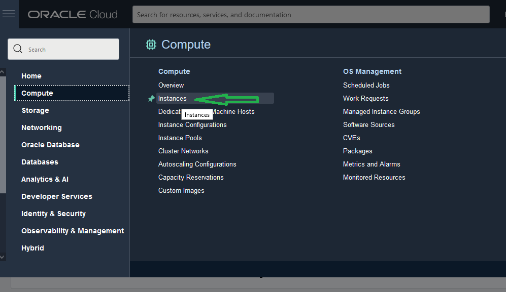
  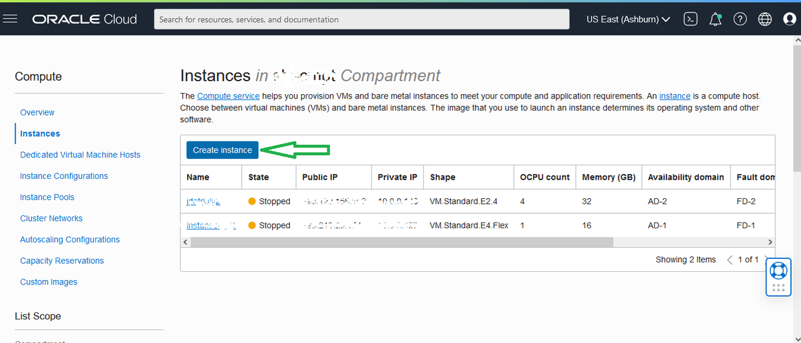

2. Now. create the instance based on a Windows Image (you can choose any Windows instance). We chose Windows Server Standard 2019. Provide name of the instance, eg win-inst4SQL. Select the appropriate compartment and any Availability Domain (AD), we chose AD1. Then, scroll down!
  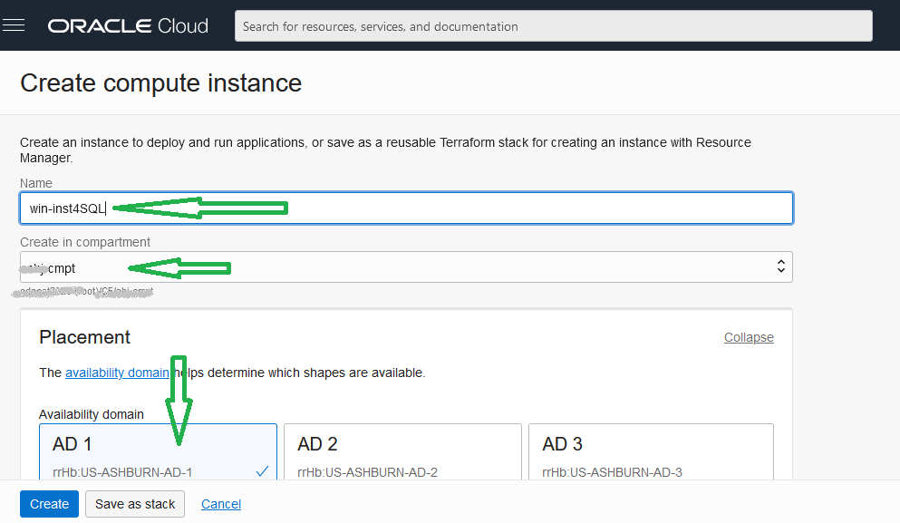

3. We are going to change the default Image as well as the Shape. For the shape type, we will choose the **VM.Standard.E4.Flex**. Click on _Change Image_

  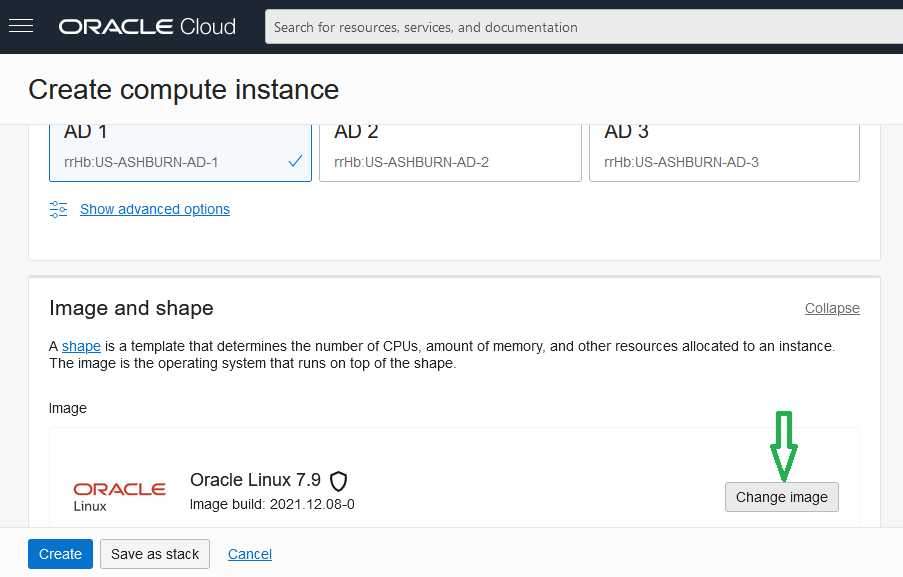

4. Under Image source, keep Platform Images and make sure correct compartment is selected. _Scroll Down_
  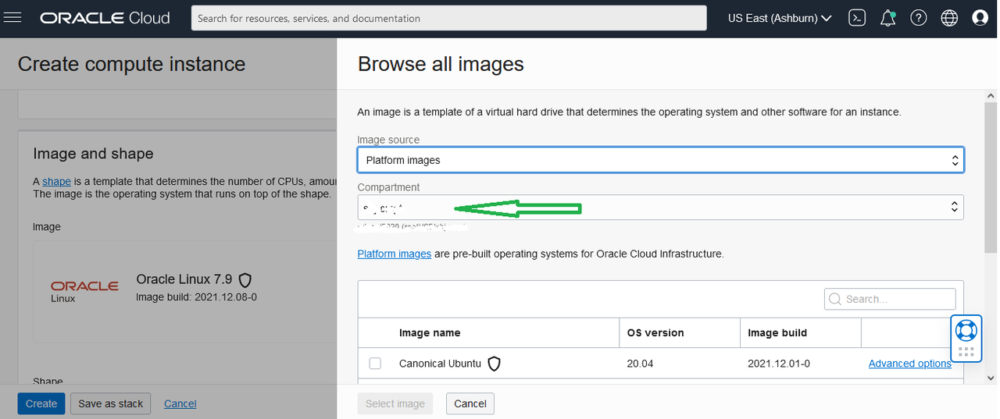

5. Choose Windows and then select the version. We chose Server 2019 Standard. Check mark, to confirm you understand Microsoft Windows licence usage terms and agree to it and click _Select Image_. 
  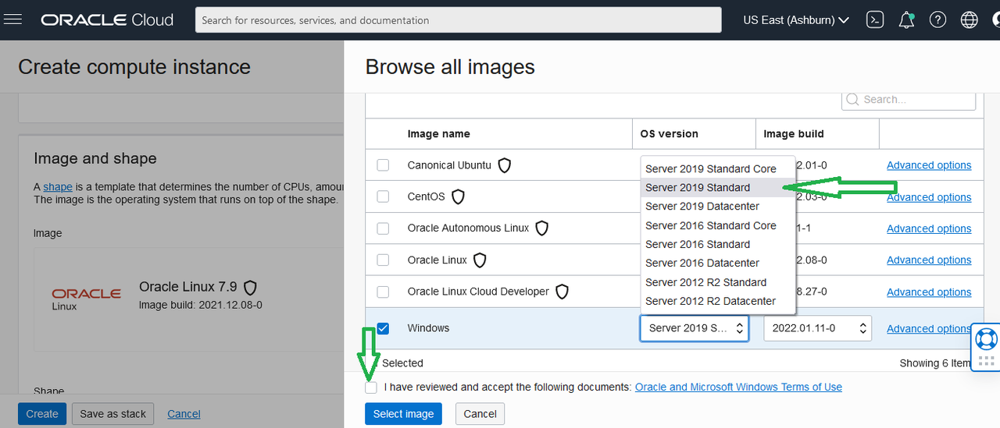

6. Once appropriate Windows Image selected, click _Change Shape_
  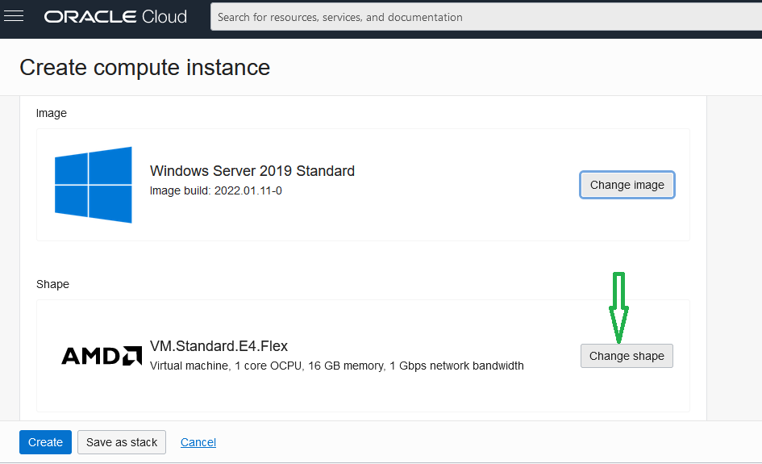

7. Keep the image type as Virtual Machine and Shapes series as AMD, then scroll down.. 
  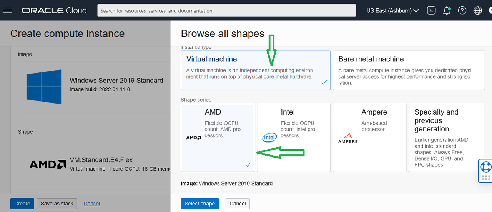

8. Now increase OCPU to 2. Note that the Memory will also increase. Then click _Select Shape_. 
  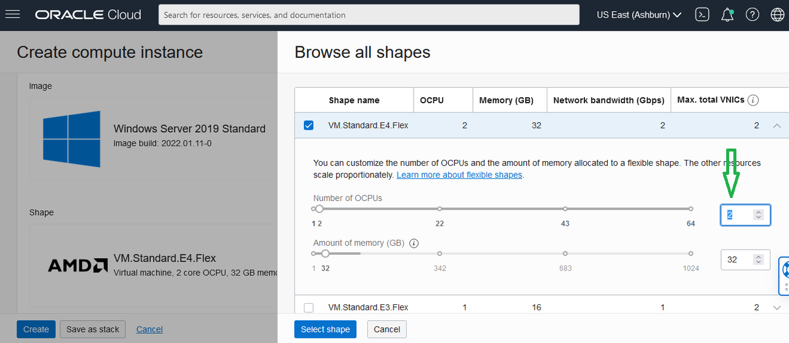

> **Note:** You can equally run Windows instance on intel or AMD or with 1 OCP. 

9. Scroll down and select appropriate network configurations. Choose the suitable VCN and the subnet (should have public subnet). Choose _Define Public IP_ address. You can leave rest of the fields as default. Click the _Create_ button and the instance creation process will start. This will take a few minutes. While waiting for the instance to be up and running, you can configure the network configuration, that will configure RDP access from remote compters.
 
  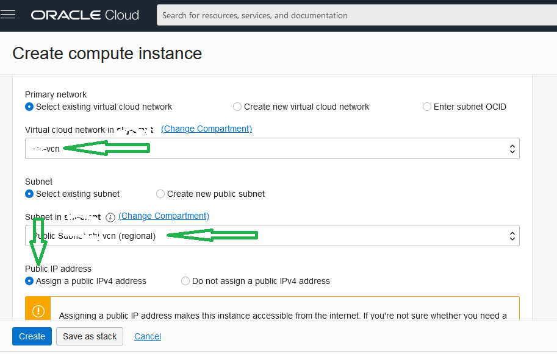

10. Now, you will see the instance icon change color to orange, with the message 'Provisioning'. Once created, you  will see the IP's, username, and password for this instance, on the instance details (as follows).  
  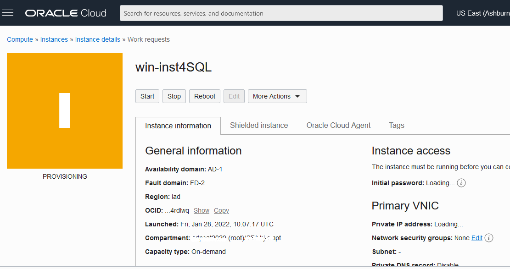

11. Once the icon changes to green (Status: Running), instance is created and ready to use. You can note down the Public IP, private IP, Windows Oracle user (opc) and its password. Click _Copy_, to copy Public IP address and also click _Show_ (besides password), to unhide the password. You will need to keep that window open to type this password into your windows VM instance. 

> **Note:** There's no option to copy paste this password into windows instance. You've to manually type i out. For your ease, OCI provides numbers in color. 

  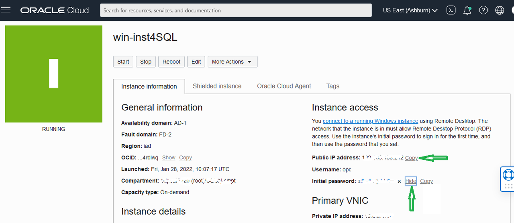

## Task 2: Configure OCI Network for RDP access

1. This assumes, you've VCN created with appropriate public subnet default. While staying under the Instance details page (from Step 11 from last task), scroll down, and look at the left side, under Instance Details > Virtual Cloud Network (VCN), click on your VCN link (as shown below). It will open your VCN details. 
  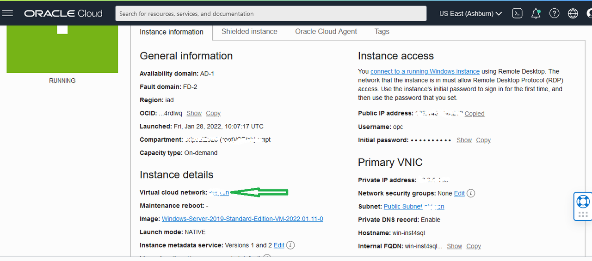

2. Scroll down, and click on the link for default security link (public). It will open details page. 
  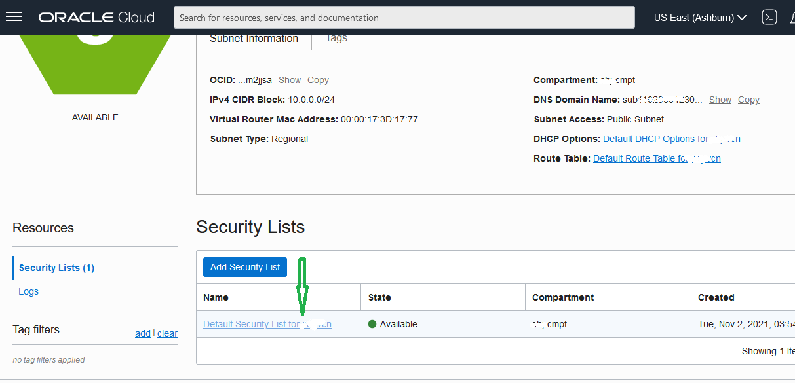
  
3. Scroll down and click _Add Ingress Rules_. 
  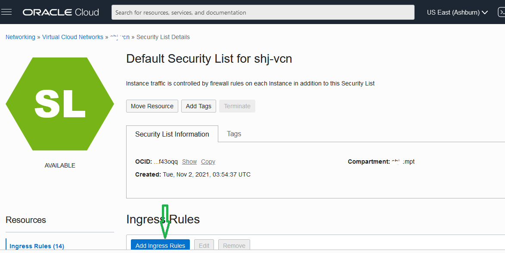

4. Now you want everyone to be able to connect to this Windows VM instance on RDP port, which is 3389. So, you select Source Type as CIDR, enter Source CIDR: 0.0.0.0/0 and Destination Port as 3389. And then hit _Create_. Port is now enabled in this VCN under the public subnet.  
  

  > **Note:** This will allow anyone from any network/IP to connect to your server. You can also restrict access from only certain IP or IP range. 

## Task 3: Connect to the Windows Instance Desktop Mirror

1. On your local Windows PC: In the search box on the taskbar, type Remote Desktop Connection (or RDP), and then select Remote Desktop Connection and click _Open_
  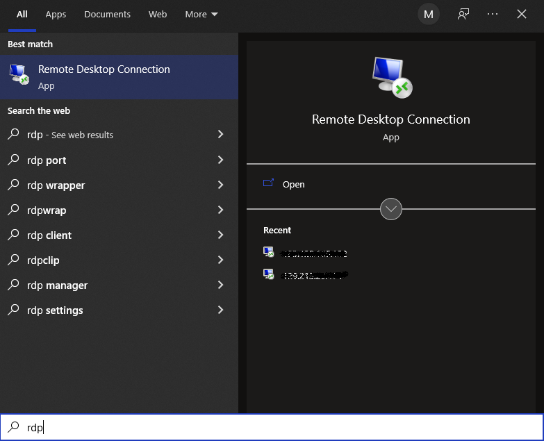

2. Paste the IP address, which you copied at step 11 (of Task 1 above) and hit connect. It will start to establish connectivity. 
  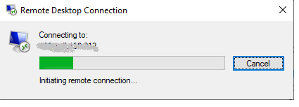

> **Note:** Make sure, your laptop/desktop windows doesn't have firewall to block connecting outwards to the Virtual Machine IP and 3389 port. Otherwise, you will need to open that port. 
  
3. You will be prompted to confirm, authentication to connect to the server. Select, _Yes_. 
  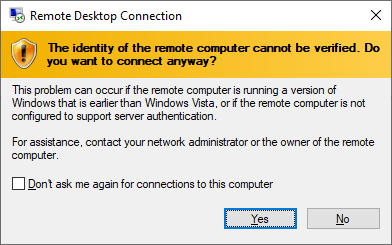
  
4. After this step, you will access (mirror) screen of your windows virtual machine server and you are all set to use it. 

5. You can login with (opc) user and provided password (you can find the password from Step 11 page). On the first login, you will be asked to change your password. Please, follow windows password policy. For further details regarding RDP access, you can refer: [Here](https://docs.oracle.com/en-us/iaas/Content/GSG/Tasks/testingconnectionWindows.htm)

## Acknowledgements
* **Author** - Muhammad Shuja, Principal Cloud Solution Engineer, ODP - ANZ
* **Reviewer** - Kaylien Phan, Outbound Product Manager
* **Last Updated By/Date** - Muhammad Shuja, January 2022
