# Setup and Run Migration in SQL Developer 

## Introduction

This is the core migration tasks lab. This will cover, from downloading and installing Oracle SQL Developer, to setting up appropriate user credentials and then create migration repository and connections and run the Wizard to complete the database migration from MySQL to Oracle Autonomous Database (ADB) instance in the cloud. This also provides extra labs, if you need additional help with certain tasks, eg how to make connection in SQL Developer to an Autonomous Database, etc. 

Estimated Workshop Time: 1 hour

### Objectives

In this lab, you will perform following: 
* Download Latest Version & Install
* Create Connections for the Target (ADB) database
* Load MySQL JDBC Driver and Source Connection
* Create User for Migration Repository
* Create Migration Connection
* Create Migration Repository
* Complete Migration with the Wizard

### Prerequisite

Make sure you have followed the prerequisites requirement, mentioned in detail in the [Introduction] (?lab=intro), i.e. you've following in place: 

1. Source: MySQL Database. 
2. Target: ATP (Autonomous Transactions Processing) instance 
3. Client: A Windows system to install SQL Developer (Desktop or VM)
4. Network connectivity among all 3 above environments. 

## Task 1: Download Latest Version of SQL Developer & Install

  Use the latest version of Oracle SQL Developer (which is v 21.2 as of writing of this workshop). This task will walk you through downloading and installing Oracle SQL Developer in a Windows environment.
 
  Download and install SQL Developer on any Windows pc (laptop/OCI), which has network access to both databases (source and target) as well as the repository database you choose (ADB in our case). You can download latest version of Oracle SQL Developer from following link for your appropriate platform. For this workshop, we'll choose Windows 64-bit with JDK 8 included from [https://www.oracle.com/tools/downloads/sqldev-downloads.html](https://www.oracle.com/tools/downloads/sqldev-downloads.html)


  **From Doc: 1.2 Installing and Getting Started with SQL Developer** 

  1. To install and start SQL Developer, you simply download its ZIP file and unzip it into a desired parent directory or folder, and then double-click the exe file named (sqldeveloper.exe) to open. 
  
  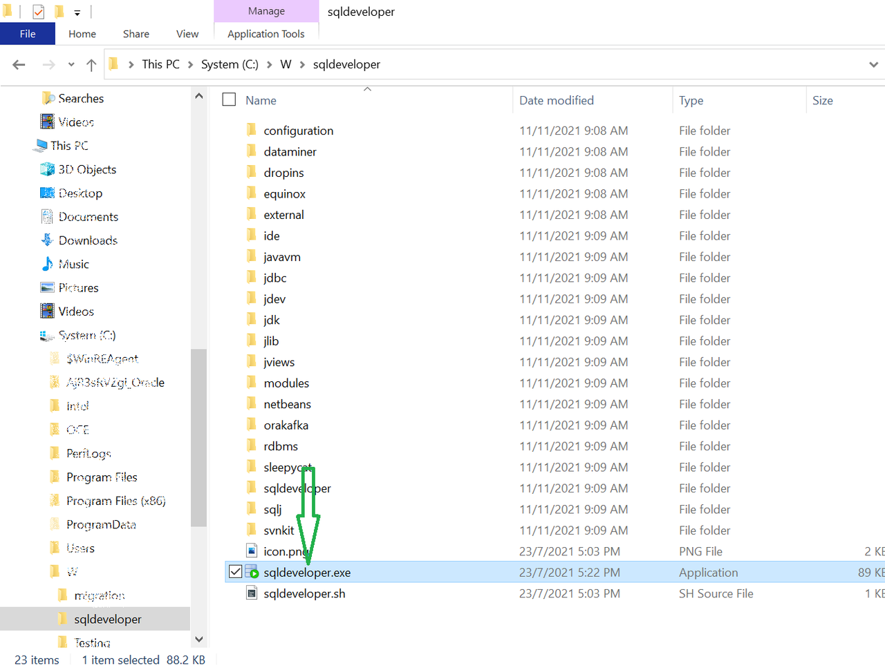

  When you launch SQL Developer first time, it'll ask you importing project etc, select No. 


## Task 2: Create Connection for the Target (ADB) database

  Now, you'll need to create appropriate user for the target schema, in the ATP database. You can use SQL Developer as well, to create such user. First, you will need to establish connection to ATP from SQL Developer. There are two guides you can follow to create ATP connection in SQL Developer:

1. You can follow this link, for how to create connection to Autonomous Database from SQL Developer: [Connecting SQL Developer to Autonomous Transaction Processing](https://www.oracle.com/webfolder/technetwork/tutorials/obe/cloud/atp/OBE_Connecting%20SQL%20Developer%20to%20Autonomous%20Transaction%20Processing/connecting_sql_developer_to_autonomous_transaction_processing.html) (step 1 only). 
  
2. OR you can follow next task: **Task 2a:** to make such connection. I would prefer this. 
 
## Task 2a: Appendix: How to Connect to Autonomous Database from SQL Developer
  
  Click this link to follow the lab:  [Appendix: How to Connect to Autonomous Database from SQL Developer] (?lab=adw-connection-wallet). You should create connection named ATP with user ADMIN. Once complete, please return back to the **Task 2b** of this lab. This is how the connection will look like at the end. 
  
  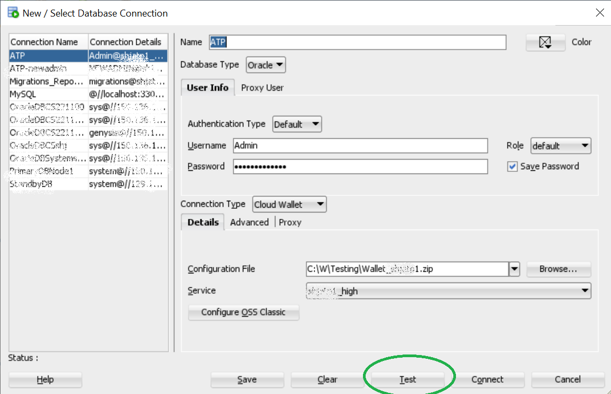

## Task 2b: Create User in Target Database

  Once you've setup connectivity with ATP from SQL Developer, as described above, you can use that "ATP" connection to create new user as migration target schema in Oracle Autonomous Database. Here's sample command to follow. You can run these commands using SQL Developer Worksheet. Set password appropriately before copying below command, replacing xxxxx.

  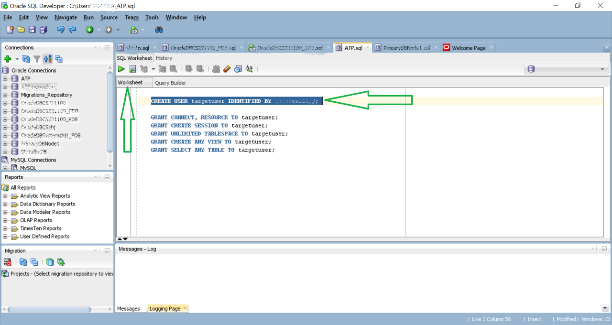 

  ```
   <copy> 
   CREATE USER targetuser IDENTIFIED BY xxxxxxxx; 
   </copy>
   ```
   ```
   <copy>
   GRANT CONNECT, RESOURCE TO targetuser;
   GRANT CREATE SESSION TO targetuser;
   GRANT UNLIMITED TABLESPACE TO targetuser;
   GRANT CREATE ANY VIEW TO targetuser;
   GRANT SELECT ANY TABLE TO targetuser; 
   </copy>
   ```
  
  > **Note:** SQL Developer does not migrate grant information from the source database. The Oracle DBA must adjust (as appropriate) user, login, and grant specifications after the migration.
 
## Task 3: Load MySQL JDBC Driver and Create Source Connection

  - Setup MySQL JDBC driver and make connection in the SQL Developer
  
  Fist you'll need to download the jar file for MySQL JDBC connectivity. Go to [http://dev.mysql.com/downloads/connector/j](http://dev.mysql.com/downloads/connector/j) and click on Operating system dropdown, select "Platform Independent", then it will show you the options to download tar.gz file or zip file. Download the zip file and extract it, and within that folder you will find mysql-connector-XXX.jar file. In my case, I chose, mysql-connector-8.0.27.jar 

  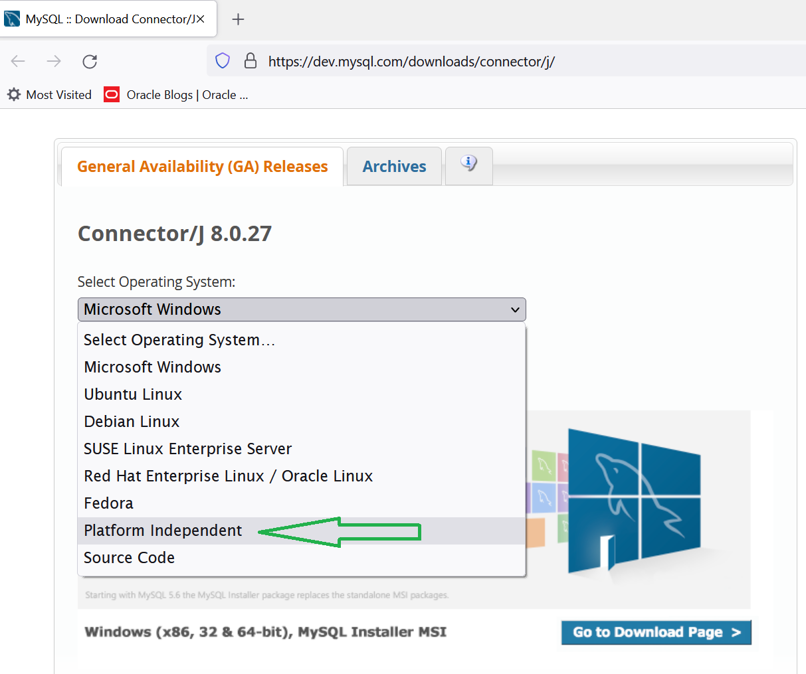  

  Follow the instructions below to attach this jar file in SQL Developer.
  
  **From Doc: 3.2.4.3 Before Migrating From MySQL**

  To configure a MySQL database for migration, install MySQLConnector/J release 3.1.12 or 5.0.4 on the system where you have installed SQL Developer and set the appropriate SQL Developer preference. Follow these steps:
  
    1. Ensure that you can connect to the MySQL database from the system where you have installed SQL       Developer.
  
    2. Ensure that you have downloaded the MySQLConnector/J API from the MySQL website at http://www.mysql.com/.
  
    3. In SQL Developer, if you have not already installed the MySQL JDBC driver using Check for Updates  (on the Help menu), do the following:
  
    4. Click Tools, then Preferences, then Database, then Third Party JDBC Drivers.
  
    5. Click Add Entry.
  
    6. Select the jar file for the MySQL driver you downloaded from http://www.mysql.com/.
  
    7. Click OK.
    
    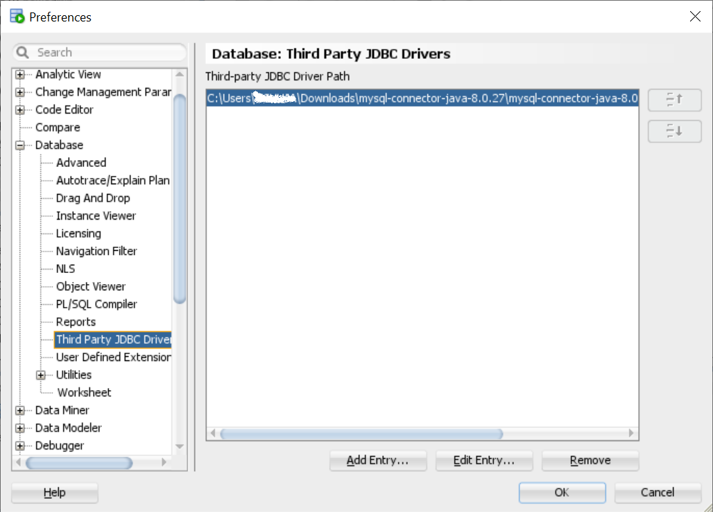  

    8. Ensure that the source database is accessible by the MySQL user that is used by SQL Developer for the  source connection. This user must be able to see any objects to be captured in the MySQL database; objects that the user cannot see are not captured. For example, if the user can execute a stored procedure but does not have sufficient privileges to see the source code, the stored procedure cannot be captured.
 
    9. Under the Connections page, click on green plus sign to create New Database Connection. Once you perform above steps for JDBC driver, when you create a new connection, the "Database Type" dropdown includes the MySQL option. Provide MySQL User Name, Password, Host and Port info appropriately and set the name of the connection as MySQL in SQL Developer. Then Test the connection, Save and Close. For multi-schema migration, choose the user that has access to all other schemas that needs to be migrated. Here's how you make MySQL connection, with your appropriate credentials. 

    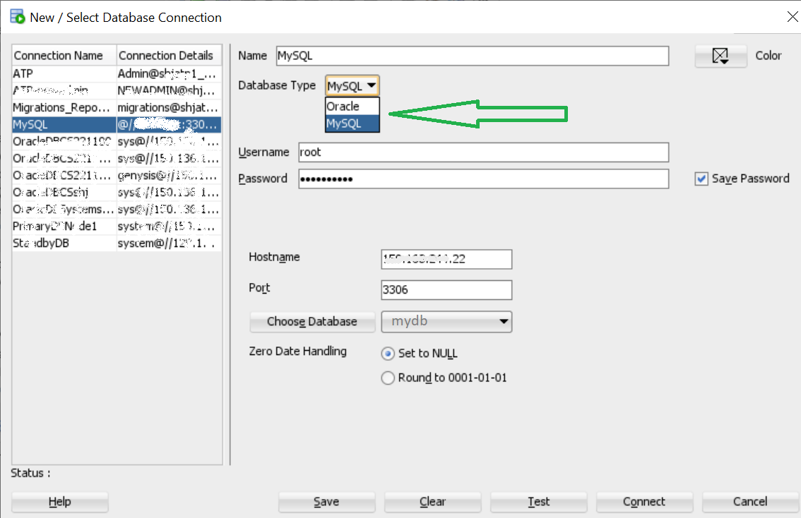    

## Task 4: Create User for Migration Repository

  Since, we have planned to create repository in the ATP database, let’s create separate user for migration, in the target (ATP) database named: MIGRATIONS, with the required roles and privileges and tablespace quotas. We will use this connection(in SQL Developer) and user(database) to run our migration jobs in SQL Developer.
  
  > **Note: Remove Repository:** How to cleanly remove existing repository. If you already have a repository associated with a user/database, you can use that. Otherwise, if you want to re-create the repository, you should follow these steps to cleanly remove it first:
     a.    Migration --> Repository Management --> Truncate Repository
     b.    Select menu Migration --> Repository Management --> Delete Repository
     c.    Then drop that migration (db) user with cascade and start over from previous step. That is, create new migration user with above roles and Privileges, etc. and so on.
 
  You can copy following (SQL) script and execute via SQL Developer – Worksheet. Make sure, you’re connected as ADMIN user in the worksheet in ATP (and not with the target DB user or any other user). Set password appropriately before copying the commands below, replacing xxxxx and execute in order.
 
  ``` 
  <copy>
  CREATE USER migrations IDENTIFIED BY xxxxxxx DEFAULT TABLESPACE data TEMPORARY TABLESPACE temp;
  </copy>
  ```
  ```
  <copy>
  ALTER USER migrations QUOTA UNLIMITED ON data;
  </copy>
  ```
  ```
  <copy>
  GRANT CONNECT, RESOURCE, CREATE VIEW, CREATE MATERIALIZED VIEW, CREATE PUBLIC SYNONYM TO migrations WITH ADMIN OPTION;
  </copy>
  ``` 
  ```
  <copy>
  GRANT ALTER ANY ROLE, ALTER ANY SEQUENCE, ALTER ANY TABLE, ALTER TABLESPACE, ALTER ANY TRIGGER, COMMENT ANY TABLE, CREATE ANY SEQUENCE, CREATE ANY TABLE, CREATE ANY TRIGGER, CREATE ROLE, CREATE TABLESPACE, CREATE USER, DROP ANY SEQUENCE, DROP ANY TABLE, DROP ANY TRIGGER, DROP TABLESPACE, DROP USER, DROP ANY ROLE, GRANT ANY ROLE, INSERT ANY TABLE, SELECT ANY TABLE, UPDATE ANY TABLE TO migrations;
  </copy>
  ``` 
        
  > **Note:** Once you are done with migration, you may like to revoke back those high privileges from MIGRATIONS user for security purposes.   

## Task 5: Create Migration Connection

  In SQL Developer, create a database connection named *Migration\_Repository* using the *MIGRATIONS* user created in previous step, to connect to ATP. Open *ATP* connection properties, change *ATP* name to *Migration_Repository* and username/password to *MIGRATIONS*/passwordxx, Test and Save. This will add new connection named Migration\-Repository, while keeping ATP connection as is. For detailed help with making such connection, you can refer back to the above lab: [Appendix: How to Connect to Autonomous Database from SQL Developer] (?lab=adw-connection-wallet). Once completed, return back to Task 6 in Migration Workshop Lab. 

  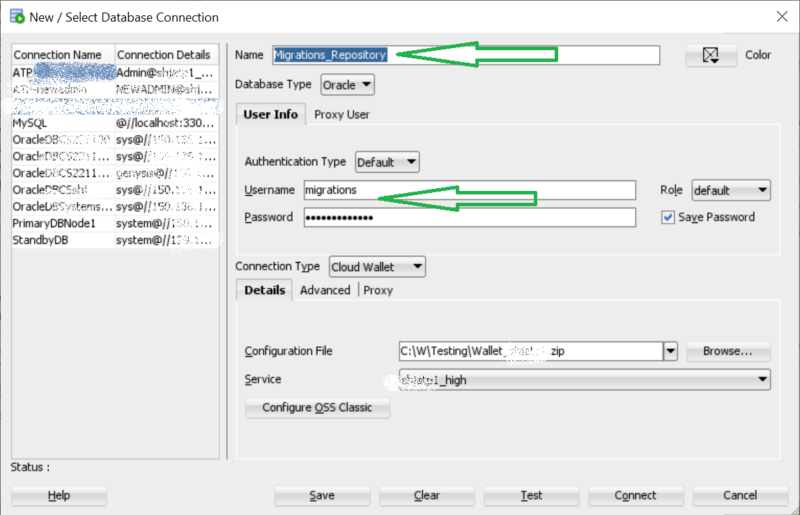   

## Task 6: Create Migration Repository

  Right click on *Migrations\_Repository* connection that you created in the previous step and select Migration Repository and then select Associate Migration Repository. It will take some time to create the repository in the ATP database in the *MIGRATIONS* schema.
  
  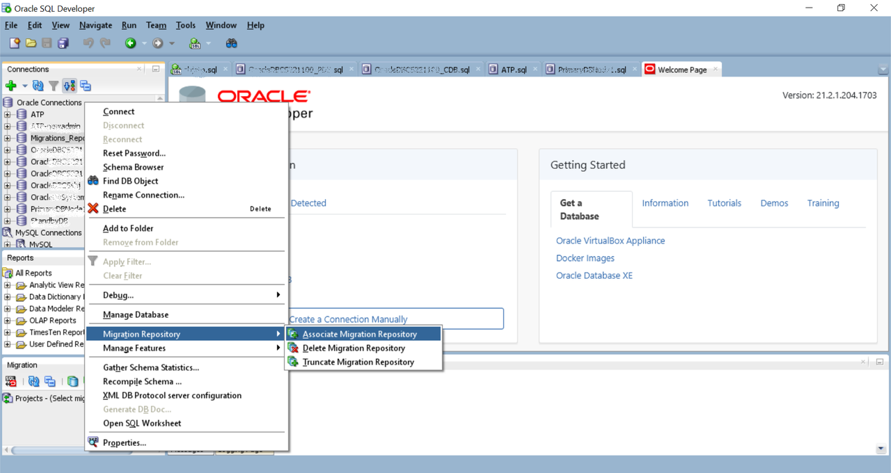  

## Task 7: Complete Migration with the Wizard

  The migration wizard can be invoked in a variety of contexts. You can right-click a third-party database connection (MySQL connect in our case) and select “Migrate to Oracle” or you can click from the menu “Tools>Migration>Migrate…”.

  1. Here is the Migration Wizard link:
    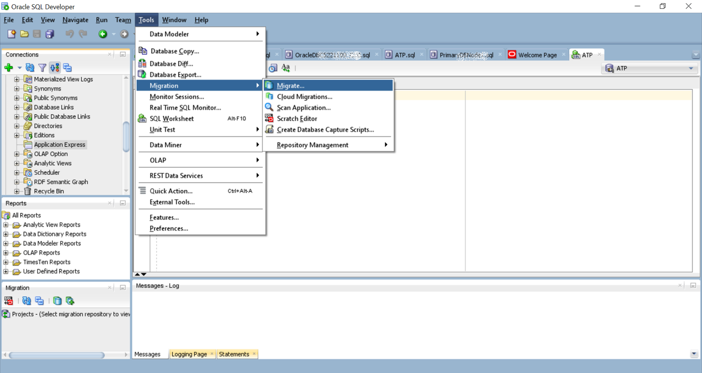  

  2. Wizard first page listing all the steps (or optional steps): 
    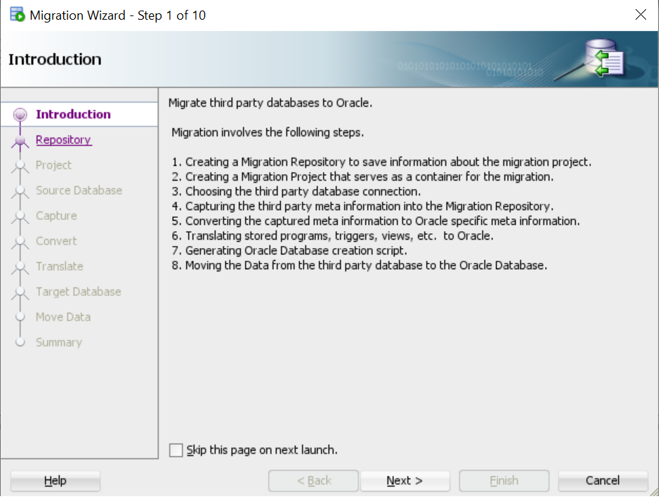  

  3. Specify Repository connection: 
      

  4. Specify Project Name: 
    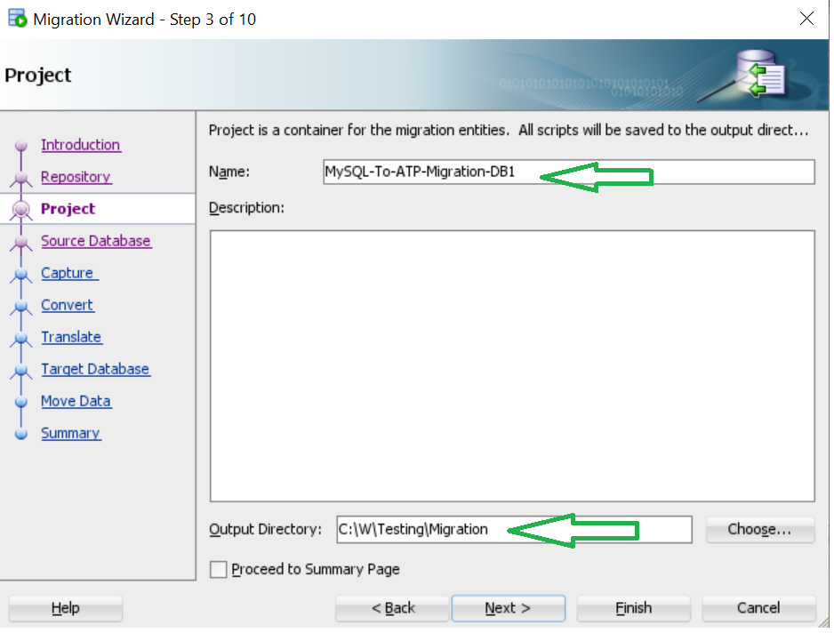  

  5. Specify Source Database and choose online (if small data) else choose offline (if large data): 
    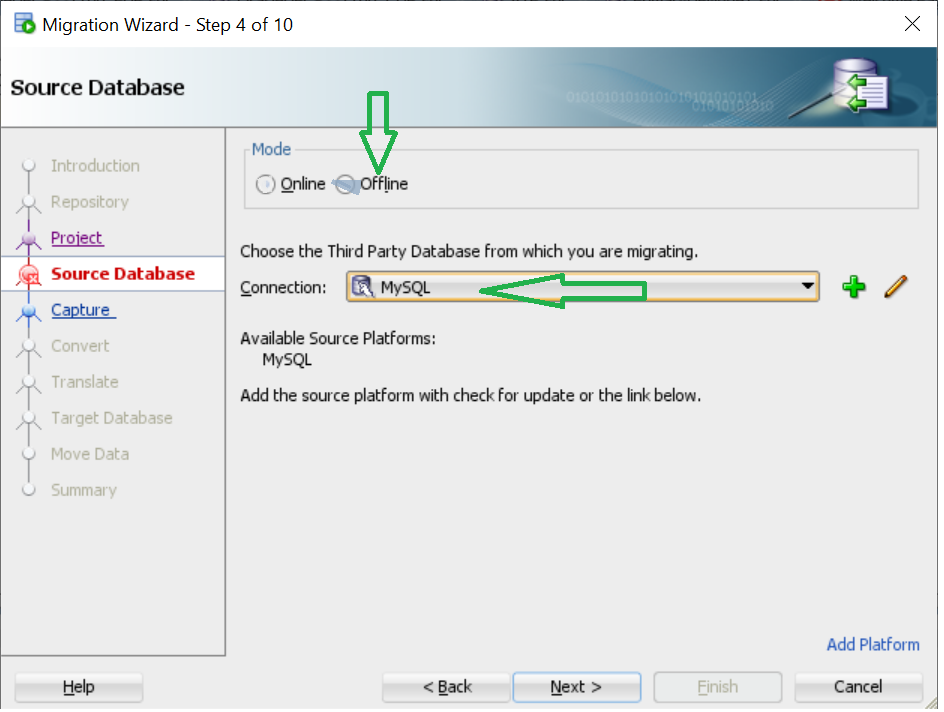  


  You can follow the self-explanatory Wizard to provide details about the source and target connection, repository connection, database selected for migration, and objects under the database to be migrated and any data-type conversion required etc and at the end choose to create an offline script file for migration. You can refer to the [documentation](https://docs.oracle.com/en/database/oracle/sql-developer/19.4/rptug/migrating-third-party-databases.html#GUID-51B0F243-D970-43A0-BFA4-97477CB14C48) for explaination of the steps of this wizard, if you need. 


## Conclusion
  
  This is the end of the workshop. This workshop walked you through one scenario of moving data from MySQL Database to Oracle Autonomous Database (ADB) using Oracle SQL Developer. 

  Here's background Blog post on the same topic:
  * [Migrating MySQL Database to Oracle Autonomous Database](https://blogs.oracle.com/cloud-infrastructure/post/migrating-mysql-database-to-oracle-autonomous-database)

## Acknowledgements
* **Author** - Muhammad Shuja, Principal Cloud Solution Engineer, ODP - ANZ
* **Reviewer** - Kaylien Phan, Outbound Product Manager, Arabella Yao Product Manager, Nicole Champoin, Senior Product Manager. 
* **Last Updated By/Date** - Muhammad Shuja, January 2022
