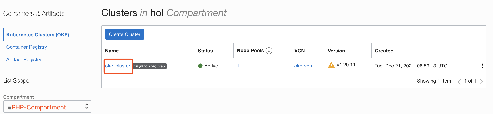
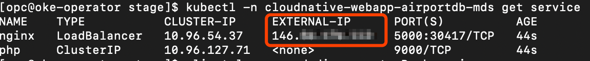
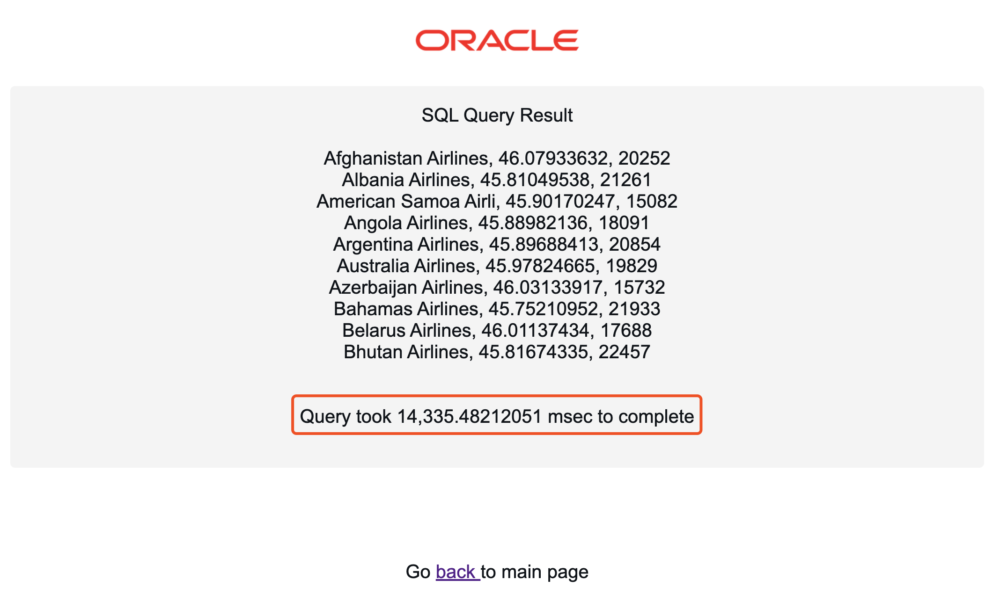

# Deploy PHP application to OCI Kubernetes

## Introduction

**Oracle Container Engine for Kubernetes (OKE)** is an Oracle-managed container orchestration service that can reduce the time and cost to build modern cloud native applications. Unlike most other vendors, Oracle Cloud Infrastructure provides Container Engine for Kubernetes as a free service that runs on higher-performance, lower-cost compute shapes.

In this lab, you will deploy a PHP application on **OKE**, and connect it to **MySQL**.

Estimated Time: 15 minutes

### Objectives

In this lab, you will:

* Deploy a PHP application to the OKE cluster
* Test the deployed PHP application against MySQL database

### Prerequisites

This lab assumes you have:

* An Oracle account
* You have enough privileges to use OCI

## Task 1: Verify OKE cluster

1. Click the **Hamburger Menu**  in the upper left, navigate to **Developer Services** and select **Kubernetes Cluster (OKE)**

	

2. Select the Compartment (e.g. PHP-Compartment) that you provisioned the OKE cluster, and verify that the status of OKE cluster 'oke_cluster' is Active

	

3. Click 'oke_cluster' to view the status of the OKE cluster and the worker nodes in your OKE cluster. You will deploy a PHP application to this OKE cluster soon.

	

## Task 2: Connect to **oke-operator** compute instance

1. Connect to the **oke-operator** compute instance again using OCI Cloud Shell

## Task 3: Deploy Application to OKE

1. Download yaml deployment file [mds_connection.yaml](mds-connection.yaml) to the operator VM.

	```
	<copy>
	wget https://raw.githubusercontent.com/kuanrcl/mysql-migration/main/lab4/mds_connection.yaml
	</copy>
	```

2. Update parameter **“mds-host”** in mds_connection.yaml. Replace **TO BET SET** below with the IP address of your MySQL instance, and execute the script.

	```
	<copy>
	sed -i 's/mds-host: "<TO BE SET>"/mds-host: "<IP ADDRESS>"/g' mds_connection.yaml
	</copy>
	```

	For example, if the IP address of your MDS instance is "10.0.30.41", your script should be:

	```
	<copy>
	sed -i 's/mds-host: "<TO BE SET>"/mds-host: "10.0.30.41"/g' mds_connection.yaml
	</copy>
	```

3. (Skip this step if you use default password  for MySQL) Update parameter **“mds-password”** in mds_connection.yaml. Replace **MySQL Password** with the password you gave when provisioning MySQL in Resource Manager, and execute the script.

	```
	<copy>
	sed -i 's/Oracle#123/<MySQL Password>/g' mds_connection.yaml
	</copy>
	```

  For example, if your new password is "MySQL#12345", your script should be:

	```
	<copy>
	sed -i 's/Oracle#123/MySQL#12345/g' mds_connection.yaml
	</copy>
	```

4. Print your mds_connection.yaml file and verify it has the correct IP address and password for MySQL.

	```
	<copy>
	cat mds_connection.yaml
	</copy>
	```

    

5. Create Kubernetes configmap and secret to store MySQL connection metadata.

	```
	<copy>
	kubectl apply -f  mds_connection.yaml
	</copy>
	```

	

6. Download yaml deployment file [deploy_webapp.yaml](deploy_webapp.yaml).

	```
	<copy>
	wget https://raw.githubusercontent.com/kuanrcl/mysql-migration/main/lab4/deploy_webapp.yaml
	</copy>
	```

7. Deploy the PHP application into OKE.

	```
	<copy>
	kubectl apply -f deploy_webapp.yaml
	</copy>
	```

	

8. Check the status of pods and wait until all pods are up and running

	```
	<copy>
	kubectl -n cloudnative-webapp-airportdb-mds get pod
	</copy>
	```

	

9. Get the external IP address of your load balancer. Wait 30 seconds if the external IP address is not ready.

	```
	<copy>
	kubectl -n cloudnative-webapp-airportdb-mds get service --watch
	</copy>
	```

  Once you have the External IP provisioned, you can execute CTL+C to kill the command

	

## Task 4: Access the application

1. Open a browser and access your PHP application using the external IP address. (e.g. http://xxx.xxx.xxx.xxx:5000/index.php). You will get a page to submit SQL statement against MySQL.

	

2. Submit a SQL statement to verify that PHP application connects well with MySQL.

	```
	<copy>
	SELECT
	airline.airlinename,
	AVG(datediff(departure,birthdate)/365.25) as avg_age,
	count(*) as nb_people
	FROM
	booking, flight, airline, passengerdetails
	WHERE
	booking.flight_id=flight.flight_id AND
	airline.airline_id=flight.airline_id AND
	booking.passenger_id=passengerdetails.passenger_id AND
	country IN ('GERMANY', 'SPAIN', 'GREECE')
	GROUP BY 
	airline.airlinename
	ORDER BY 
	airline.airlinename, avg_age
	LIMIT 10;
	</copy>
	```

3. After a while, you should get the query result together with the execution time. Note down the execution time, you will see performance improvement in next lab after HeatWave is enabled.

	

  You may now **proceed to the next lab.**

## Acknowledgements
* **Author**
	* Rayes Huang, Cloud Solution Architect, OCI APAC
	* Ryan Kuan, MySQL Cloud Engineer, MySQL APAC

* **Contributors**

	* Perside Foster, MySQL Solution Engineering
	* Howie Owi, OCI Solution Specialist, OCI APAC

* **Last Updated By/Date** - Ryan Kuan, March 2022
