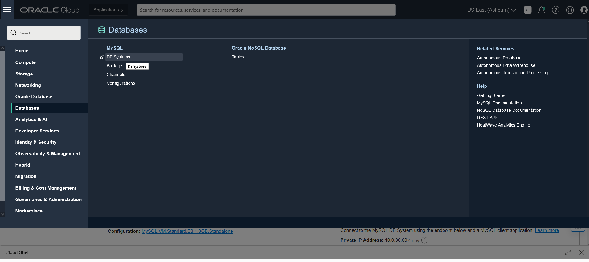
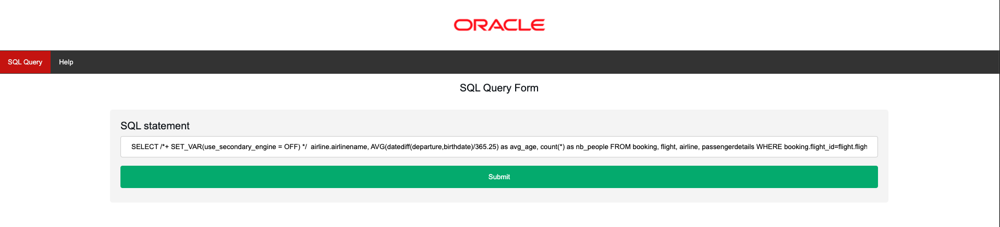
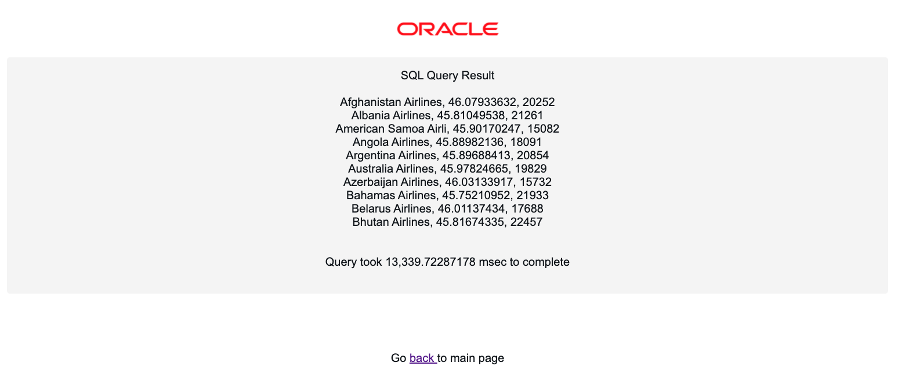

# Enable MySQL HeatWave Cluster

## Introduction

In this lab we will enable the HeatWave cluster and accelerate your long running queries. The MySQL DB System and HeatWave cluster must use the same shape, the shape defines the number of CPU cores, the amount of RAM, and so on. The size of the HeatWave cluster needed depends on tables and columns required to load, and the compression achieved in memory for this data. By enabling HeatWave you will deploy a standalone DB System characterized by a HeatWave-compatible shape (MySQL.HeatWave.VM.Standard.E3) and 1TB of data storage that will accelerate processing of analytic queries. For more information, check HeatWave Documentation.

Estimated Time: 15 minutes

### Objectives

In this lab, you will:

* Enable **MySQL HeatWave** Cluster to MySQL Database System in Oracle Cloud.

### Prerequisites

This lab assumes you have:

* An Oracle account
* You have enough privileges to use Oracle Cloud resources

## Task 1: Add HeatWave Cluster to MySQL Database Service

1. Navigate to MDS console by clicking on the **Hamburger Menu** , select **Databases**, and click on **DB System**
	

2. Select the **MDSInstance**
	

3. From the menu on the left bottom side select HeatWave, and click on the button Add HeatWave Cluster located on the right.
	

4. Check that Shape looks as per picture below and that Node Count is set to 2, and then click the button Add HeatWave Cluster.
	

5. You will be brought back to the main page where you can check for the creation status. After some seconds you should see the nodes in Creating status.
	

6. You can check the HeatWave creation progress by selecting the **Work Request**
	

7. After completion, the node status will switch to Active status. The process will take some time to be completed. You can go to the next Task in the meantime.

## Task 2: Accelerate long running queries on HeatWave

1. Before we can explore all the cool features of MySQL HeatWave, we need to load the data from MySQL into the HeatWave Cluster so that the data is distributed to the memory of the 2 HeatWave cluster nodes we just added

	```
	<copy>
	mysqlsh --user=admin --password=**PASSWORD** --host=<mysql_private_ip_address> --port=3306 --sql
	</copy>
	```

   We will use this AutoPilot feature, **heatwave_load** function to offload the data from MySQL to HeatWave cluster

	```
	<copy>
	CALL sys.heatwave_load(JSON_ARRAY('airportdb'), NULL);
	</copy>
	```
	

2. We can verify the data offloading from MySQL to HeatWave cluster

      ```
      <copy>
      USE performance_schema;
      </copy>
      ```
      ```
      <copy>
      SELECT NAME, LOAD_STATUS FROM rpd_tables,rpd_table_id WHERE rpd_tables.ID = rpd_table_id.ID;
      </copy>
      ```
      

3. By default, MySQL will offload SELECT queries to HeatWave. There is a magic switch, **use&#95;secondary&#95;engine** that is enabled.

      ```
      <copy>
      SHOW VARIABLES LIKE 'use_secondary_engine%';
      </copy>
      ```

4. Now we can test the turbo engine of HeatWave with the SQL query we executed earlier.

      ```
      <copy>
      USE airportdb;
      </copy>
      ```
      ```
      <copy>
      SELECT
      airline.airlinename,
      AVG(datediff(departure,birthdate)/365.25) as avg_age,
      count(*) as nb_people
      FROM
      booking, flight, airline, passengerdetails
      WHERE
      booking.flight_id=flight.flight_id AND
      airline.airline_id=flight.airline_id AND
      booking.passenger_id=passengerdetails.passenger_id AND
      country IN ('GERMANY', 'SPAIN', 'GREECE')
      GROUP BY
      airline.airlinename
      ORDER BY
      airline.airlinename, avg_age
      LIMIT 10;
      </copy>
      ```

  You will notice that this query will complete in less than 1s comparing to 10s earlier!

## Task 3: Test SQL on migrated PHP application

  Now that we have enabled HeatWave cluster, lets test our migrated PHP application

1. Access your PHP application via http://xxx.xxx.xxx.xxx:5000/index.php (replace xxx.xxx.xxx.xxx with your IP address). Once HeatWave cluster is enabled on MDS, all the SELECT SQL statements will be offloaded to HeatWave automatically via the default **use&#95;secondary&#95;engine=ON** setting. First, we will test the PHP application by executing the SQL on MDS, we will use an optimizer hint (to set the **use&#95;secondary&#95;engine=OFF** so that we will force the SELECT SQL to execute in MDS)

	

	```
	<copy>
	SELECT /*+ SET_VAR(use_secondary_engine = OFF) */  airline.airlinename, 
	AVG(datediff(departure,birthdate)/365.25) as avg_age, 
	count(*) as nb_people 
	FROM 
	booking, flight, airline, passengerdetails 
	WHERE 
	booking.flight_id=flight.flight_id AND 
	airline.airline_id=flight.airline_id AND 
	booking.passenger_id=passengerdetails.passenger_id AND 
	country IN ('GERMANY', 'SPAIN', 'GREECE') 
	GROUP BY 
	airline.airlinename 
	ORDER BY 
	airline.airlinename, avg_age 
	LIMIT 10;
	</copy>
	```

  The query will take around 13s to complete just like what we saw in [Lab 3: Load data to MySQL HeatWave](../data-load/data-load.md)

	

2. Next, we will execute the query against the HeatWave cluster without the optimizer hint (/*+ SET_VAR(use&#95;secondary&#95;engine=OFF) */))

	```
	<copy>
	SELECT
	airline.airlinename,
	AVG(datediff(departure,birthdate)/365.25) as avg_age,
	count(*) as nb_people
	FROM
	booking, flight, airline, passengerdetails
	WHERE
	booking.flight_id=flight.flight_id AND
	airline.airline_id=flight.airline_id AND
	booking.passenger_id=passengerdetails.passenger_id AND
	country IN ('GERMANY', 'SPAIN', 'GREECE')
	GROUP BY 
	airline.airlinename
	ORDER BY 
	airline.airlinename, avg_age
	LIMIT 10;
	</copy>
	```

	

  The query will complete in less than 1s without any modification to the original SQL statement! This is 10x improvement on HeatWave!
	

  You may now **proceed to the next lab.**

## Acknowledgements
* **Author**
	* Rayes Huang, Cloud Solution Architect, OCI APAC
	* Ryan Kuan, MySQL Cloud Engineer, MySQL APAC

* **Contributors**

	* Perside Foster, MySQL Solution Engineering
	* Howie Owi, OCI Solution Specialist, OCI APAC

* **Last Updated By/Date** - Ryan Kuan, March 2022
