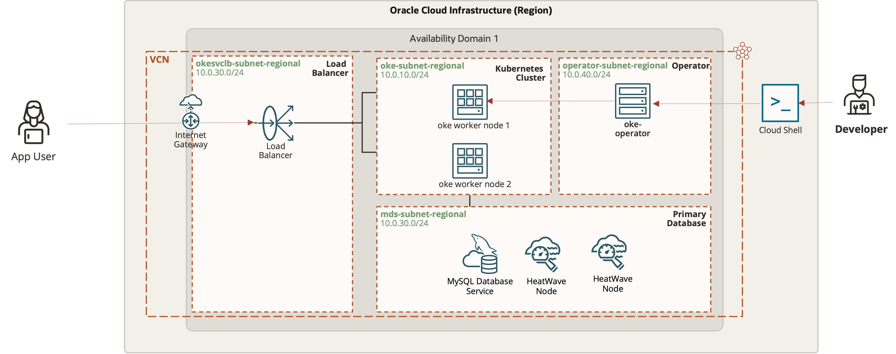

# Introduction

## About this Workshop

This workshop will cover the migration of a conventional LAMP stack application from any cloud or on-premises environment to Oracle Cloud Infrastructure (OCI). We will walk you through the process of

* Deploying a conventional PHP/Apache/MySQL application to OCI Kubernetes and MySQL HeatWave
* Automating OCI resource provision using Terraform with OCI Resource Manager
* Loading data into MySQL HeatWave using MySQL shell utility and Autopilot features
* Speeding up SQL queries with MySQL HeatWave

Estimated Time: 90 minutes

### About Oracle MySQL Database Service

**Oracle MySQL Database Service** is a fully managed database service that lets developers quickly develop and deploy secure, cloud native applications using the world’s most popular open source database. MySQL Database Service is the only MySQL cloud service with an integrated, high performance and in-memory query accelerator,
**HeatWave**. It enables you to run sophisticated analytics directly against your operational MySQL databases and thus eliminating the need of complex, time-consuming, and expensive data movement and integration with a separate analytics database. **HeatWave** accelerates MySQL performance by orders of magnitude for analytics and mixed workloads. Optimized for Oracle Cloud Infrastructure (OCI), MySQL Database Service is 100% built, managed, and supported by the OCI and MySQL engineering teams.

### About HeatWave

HeatWave is a distributed, scalable, shared-nothing, in-memory, hybrid columnar, query processing engine designed for extreme performance. It is enabled when you add a HeatWave cluster to a MySQL DB System. To know more about HeatWave Cluster <a href="https://dev.mysql.com/doc/heatwave/en/heatwave-introduction.html" target="\_blank">**Click Here**</a>

### Objectives

In this workshop, you will learn how to:

* Provision the OCI Kubernetes Engine and MySQL HeatWave cluster
* Deploy a PHP application to OCI Kubernetes Engine
* Load data into MySQL HeatWave
* Improve query performance with MySQL HeatWave

### Architecture Overview

The following OCI architecture diagram depicts all the resources to be created as part of this lab that consists of

* Compute Instance
* Virtual Cloud Network
* Oracle Container Engine for Kubernetes
* MySQL HeatWave

	

### Prerequisites (Optional)

* You have an Oracle account
* You have enough privileges to use OCI
* You have one Compute instance having <a href="https://dev.mysql.com/doc/mysql-shell/8.0/en/mysql-shell-install.html" target="\_blank">**MySQL Shell**</a> installed on it.

## Acknowledgements

* **Author**

  * Rayes Huang, Cloud Solution Architect, OCI APAC
  * Ryan Kuan, MySQL Cloud Engineer, MySQL APAC

* **Contributors**
  * Perside Foster, MySQL Solution Engineering
  * Howie Owi, OCI Solution Specialist, OCI APAC

* **Last Updated By/Date** - Ryan Kuan, March 2022
