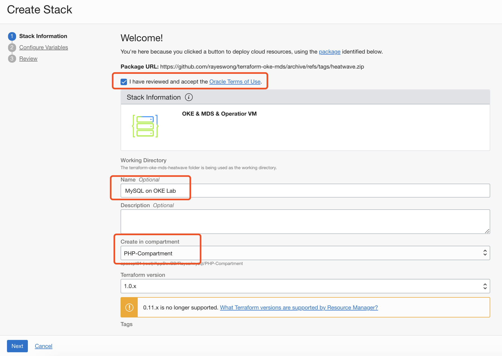
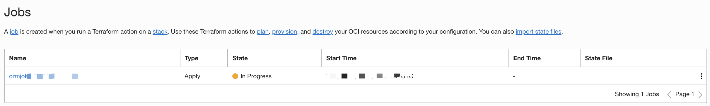

# Provision OCI Kubernetes and MySQL HeatWave using OCI Resource Manager

## Introduction

Resource Manager is an Oracle Cloud Infrastructure service that allows you to automate the process of provisioning your Oracle Cloud Infrastructure resources. Using Terraform, Resource Manager help you install, configure, and manage resources through the "infrastructure-as-code" model.

Estimated Time: 30 minutes

### Objectives

In this lab, you will provision the following OCI resources using Resource Manager:

* Virtual Cloud Network with related network resources and policies
* Oracle Container Engine for Kubernetes and a node pool with 2 worker nodes
* MySQL Database System
* An Operator Virtual Machine with kubectl utility and MySQL client tools installed

### Prerequisites (Optional)

* You have an Oracle account
* You have enough privileges to use OCI
* You have one Compute instance having <a href="https://dev.mysql.com/doc/mysql-shell/8.0/en/mysql-shell-install.html" target="\_blank">**MySQL Shell**</a> installed on it

## Task 1: Create stack in Resource Manager

1. Visit the [Terraform scripts](https://github.com/rayeswong/terraform-oke-mds) in a browser, and click the image **"Deploy to Oracle Cloud"** at the bottom of the page. It would redirect you to OCI console to create a new stack in Resource Manager.

    

2. Sign in to **Oracle Cloud** if you haven't yet. On the page of 'Create Stack', check to accept terms, give a name to your stack (e.g. "MySQL on OKE Lab"), select the compartment (e.g. PHP-Compartment) to provision OCI resources, and click **Next**.

    

3. Review the values pre-populated for your OCI Resources, update the password for "MDS Admin User's Password" (default password: Oracle#123), and click **Next**.

    

4. Check **Run Apply** and click **Create** to create the stack and apply the Terraform scripts.

    

5. A job will be created to apply your Terraform scripts to provision OCI resources.

    

6. It takes about **20 minutes** to complete this job. At the meanwhile, you can click on your Terraform job to view logs of progress of your job.

    

    

7. Once your job has been executed successfully, you can find the public IP address of your operator VM, and the private IP address of the MySQL Database from the outputs.

>**Note** down these two IP addresses that will be used in the subsequent labs.

  

## Acknowledgements
* **Author**
	* Rayes Huang, Cloud Solution Architect, OCI APAC
	* Ryan Kuan, MySQL Cloud Engineer, MySQL APAC

* **Contributors**

	* Perside Foster, MySQL Solution Engineering
	* Howie Owi, OCI Solution Specialist, OCI APAC

* **Last Updated By/Date** - Ryan Kuan, March 2022
