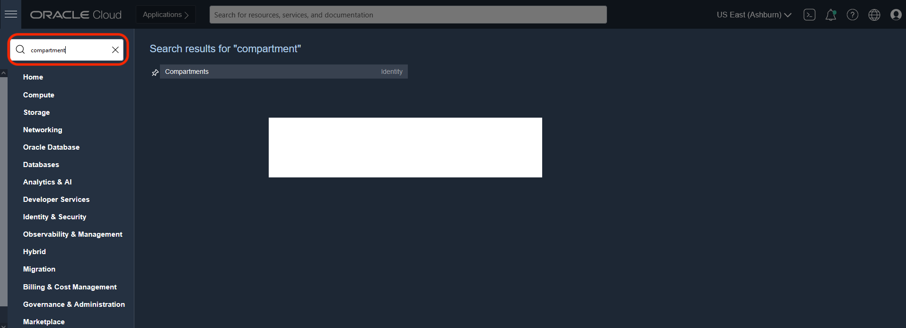
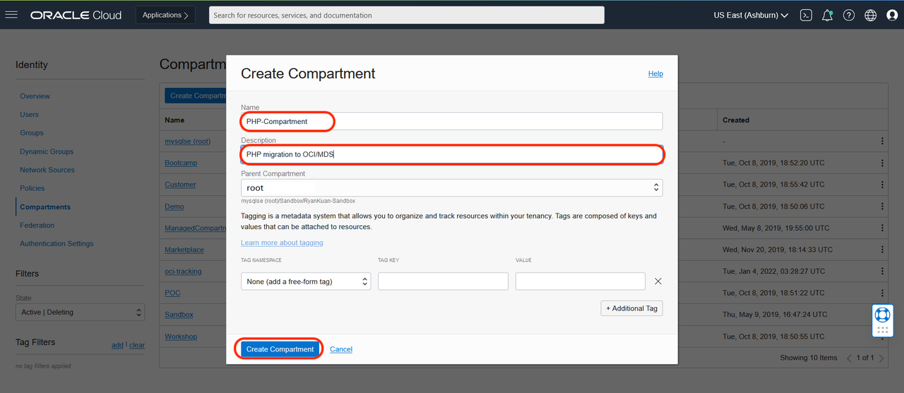

# Create compartment

## Introduction

Before you start to provision any OCI resources, it is a good practice to create a **compartment** as an isolated environment for your work.
In this lab, we will create a compartment for all the OCI resources required to host our PHP application as well as MySQL HeatWave cluster

Estimated Time: 2 minutes

## Task 1: Create compartment

1. Log in to **OCI** and click on the **Hamburger Menu** at the top left corner of the OCI console, and type **compartment** in the search box. Click on the **Compartments** in the search result

    

2. Specify the name of the compartment such as **PHP-Compartment** with a description, click on **Create Compartment**

    

You may now **proceed to the next lab.**

## Acknowledgements
* **Author**
	* Rayes Huang, Cloud Solution Architect, OCI APAC
	* Ryan Kuan, MySQL Cloud Engineer, MySQL APAC

* **Contributors**

	* Perside Foster, MySQL Solution Engineering
	* Howie Owi, OCI Solution Specialist, OCI APAC

* **Last Updated By/Date** - Ryan Kuan, March 2022
