# Provision the Required Resources for the Workshop

## Introduction

In this lab, you will provision the complete cloud infrastructure required for an AI-powered eCommerce application using **Oracle Cloud Infrastructure (OCI) Resource Manager** and **Terraform**.

Modern AI applications require a combination of compute, database, networking, and AI services. Instead of manually creating and configuring each resource through the OCI Console, you will use Infrastructure as Code (IaC) to automate the deployment process using Terraform.

OCI Resource Manager simplifies Terraform execution by providing a fully managed automation service within Oracle Cloud. Using pre-built Terraform scripts, you will provision the foundational infrastructure needed for the workshop environment, including:

- Compute Virtual Machine (VM)
- MySQL HeatWave Database System
- Networking resources

After provisioning the infrastructure, you will validate connectivity to the deployed resources and configure your development environment for AI-powered application development.

You will also configure **Visual Studio Code** with **OCI Generative AI integration**, enabling AI-assisted development workflows directly from your coding environment.

By the end of this lab, you will have a fully functional cloud environment ready for building intelligent applications.

Estimated Time: 30-40 minutes

### Objectives

In this lab, you will provision the infrastructure required for the AI-powered eCommerce application using Oracle Cloud Infrastructure (OCI) Resource Manager and Terraform. You will also validate connectivity to the Compute VM and MySQL HeatWave database and configure Visual Studio Code with OCI Generative AI integration and Enabled Cline for prompt driven AI development.

### Prerequisites

Before starting this lab, ensure you have:

- You must have an [Oracle Cloud Infrastructure](https://cloud.oracle.com/en_US/cloud-infrastructure) enabled account and subscribed to Chicago region.

## Task 1: Provision Infrastructure Using OCI Resource Manager
In this task, you will provision the cloud infrastructure required for the workshop using a pre-built Terraform script.

1. Download the Resource File

    Download the ZIP package containing the Terraform infrastructure scripts.

    [Download terraform script](https://objectstorage.us-chicago-1.oraclecloud.com/p/HEmIqMo-tzyNpfkieGjVIIdtE33TSHBMZv8FuKBi0JDmBNuHiLJ0yh2io6rkPjJk/n/sehubjapaciaas/b/heatwave_genai/o/Version_3_AI_Demo_infrastructure.zip)


2. Login to OCI Console
    1. Login to OCI Console
    2. Navigate to:
    - **Developer Services → Resource Manager → Stacks**

    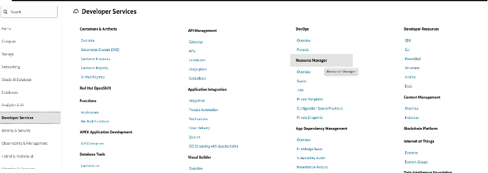
    
    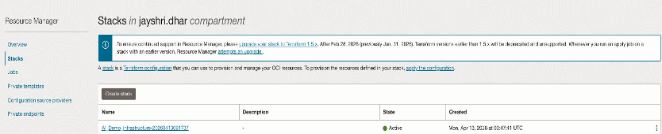


3. Create a Stack

    1. Click **Create Stack**
    2. Choose:
    - **My Configuration**
    3. Upload the downloaded ZIP file.

    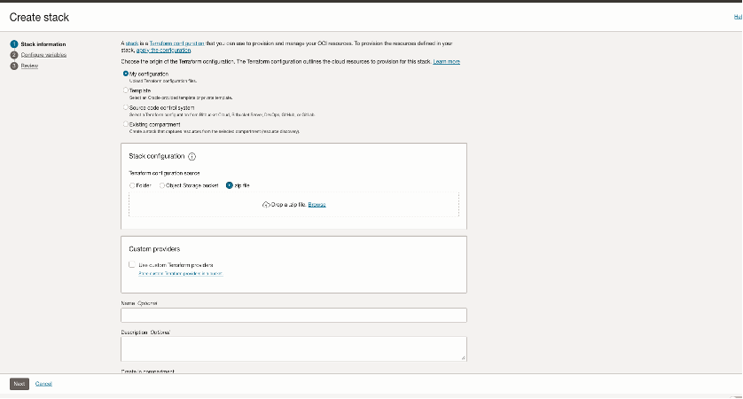


4. Upload Terraform ZIP File

    1. Browse and select the ZIP file.
    2. Click **Next**.


5. Configure Stack Variables

    Fill in the required details:

    | Parameter | Description |
    |---|---|
    | Compartment OCID | Update with your workshop compartment |
    | mysql admin password | Set your MySQL administrator password |

    > Note: Other values are automatically populated from the Terraform scripts and can be modified if needed.

    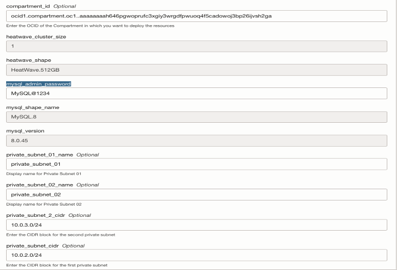
    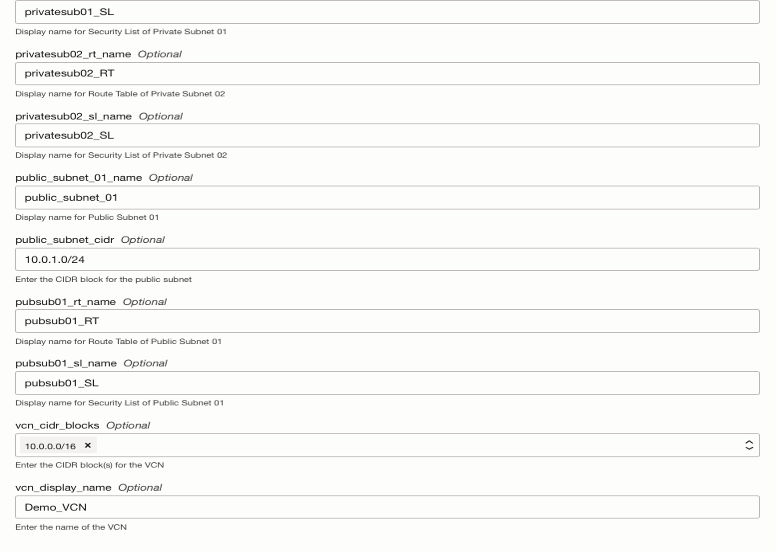


6. Create the Stack

    Click **Create**.

    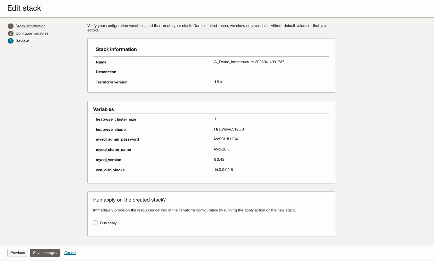


7. Run Terraform Plan

    1. Open created stack.
    2. Click on **Actions** and **Plan**
    3. Check the plan name and click on **Plan**
    4. Wait for validation and resource planning to complete successfully.

    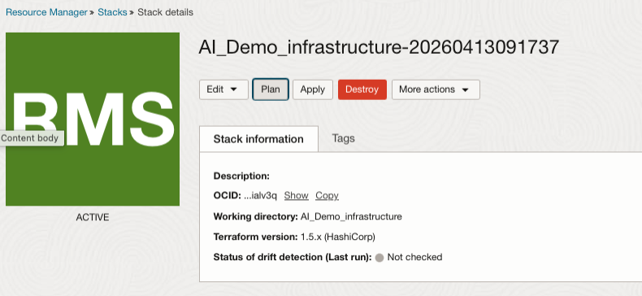
    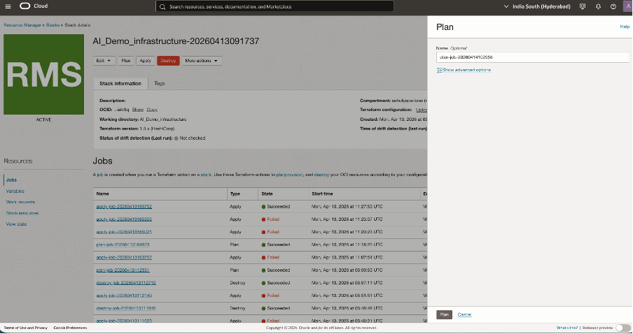


8. Apply the Stack

    1. Once the plan succeeds, click  on **Actions** and **Apply**
    2. Check the apply job name and under **apply job plan resolution**, select the **latest successfull plan** and click on **Apply**
    3. Wait for the infrastructure deployment to complete.

    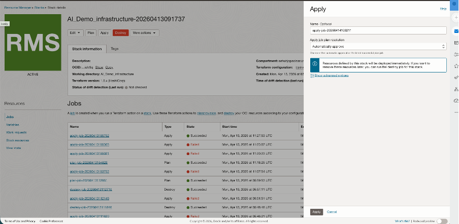
    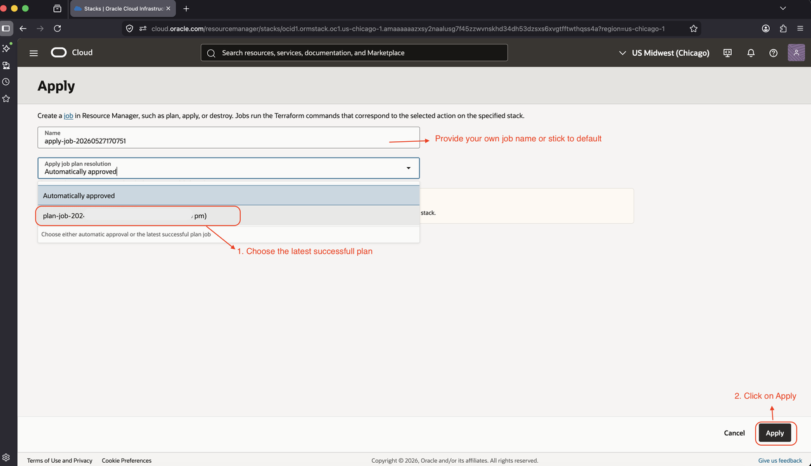

    Resources created include:
    - Virtual Cloud Network (VCN)
    - Compute VM
    - MySQL HeatWave DB System
    - Networking Components


9. Validate Infrastructure Deployment

After deployment completes successfully, verify that the infrastructure resources are available in your OCI compartment.


### Important Notes

- The delivered ZIP file contains the SSH key pair required for VM access.
- The compute instance is configured with the public key from the ZIP package.
- Use the corresponding private key to SSH into the VM.

You may also modify:
- MySQL version
- HeatWave version

using the `terraform.tfvars` configuration file.

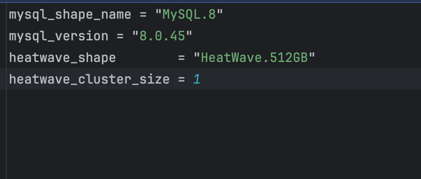


## Task 2: Validate Compute VM Access

In this task, you will validate connectivity to the VM

1. Retrieve Public IP Address

    1. Navigate to:
      - **Compute → Instances**
    2. Select your compartment and region.
    3. Select your VM isntance
    4. Copy the **Public IP Address**.


    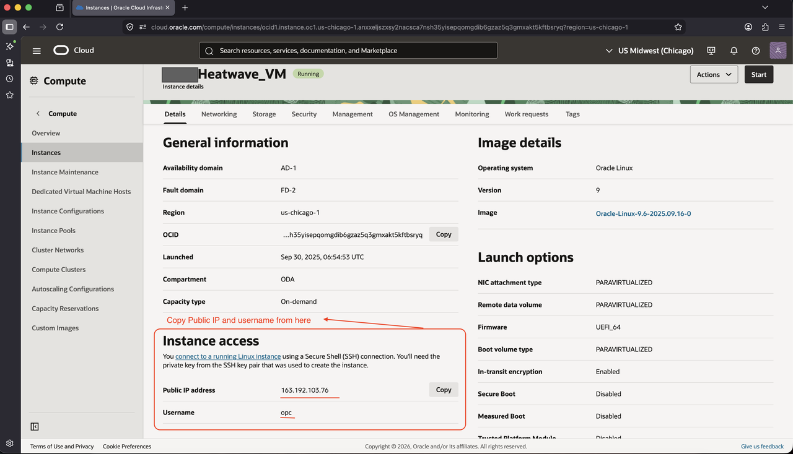


2. Locate SSH Private Key

    Extract the downloaded infrastructure ZIP package and locate the `.key` file.


3. For MacOS/Linux users.
    1. Open Terminal 

    2. Set Key Permissions (Linux/macOS)

        ```bash
        chmod 400 ~/Downloads/workshop-key.key
        ```

    3. Connect to the VM

        ```bash
        ssh -i ~/Downloads/workshop-key.key opc@<PUBLIC_IP>
        ```

        Example:

        ```bash
        ssh -i ~/Downloads/workshop-key.key opc@129.154.xx.xx
        ```

    4. Verify SSH Access

        Successful connection should display:

        ```bash
        [opc@workshop-vm ~]$
        ```

4. For Windows users.
    1. Open PowerShell

    2. Navigate to the Folder Containing the SSH Key

        Example:

        ```powershell
        cd C:\Users\YourUsername\Downloads
        ```

    3. Run:

        ```powershell
        ssh -i mykey.pem opc@<VM_PUBLIC_IP>
        ```

    4. Accept the Fingerprint

        The first time you connect, you may see:
        ```text
        Are you sure you want to continue connecting (yes/no)?
        ```

        Type:
        ```text
        yes
        ```    
    5. Verify SSH Access

        Successful connection should display:

        ```bash
        [opc@workshop-vm ~]$
        ```

> Note: Default Oracle Linux username is `opc`.


## Task 3: Validate MySQL HeatWave Connectivity

In this task, you will validate mysql heatwave connectivity

Retrieve Database Private IP

1. Navigate to:
    - **Databases → MySQL HeatWave → DB Systems**
2. Select your compartment and region.
3. Select your DB system.
4. Copy the **Private IP Address**.

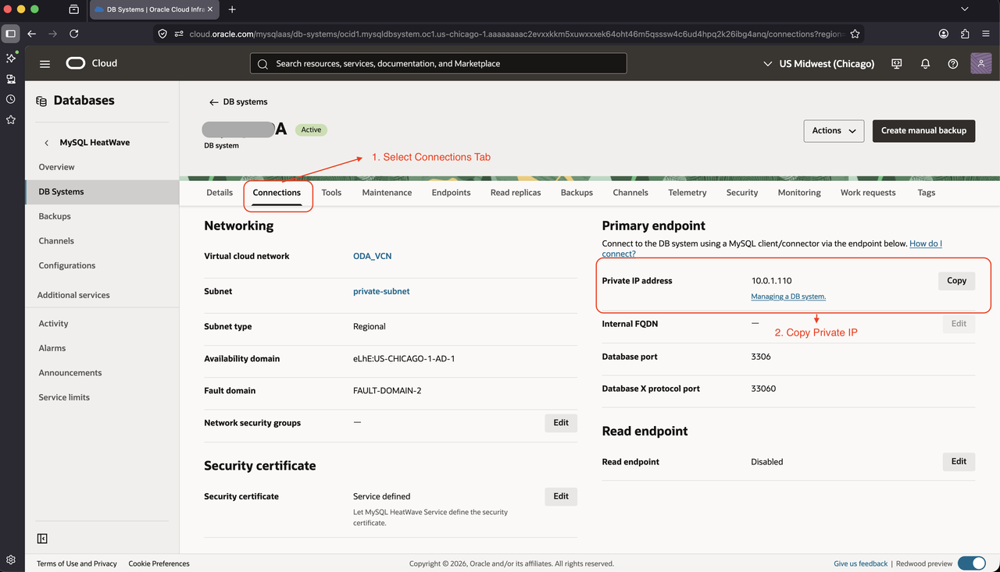


## Task 4: Connect MySQL HeatWave Using Visual Studio Code

Since the database resides in a private subnet, connectivity is established through the Compute VM using SSH tunneling.


1. Install Required VS Code Extensions

    Install:
    - **MySQL Shell Extension**

    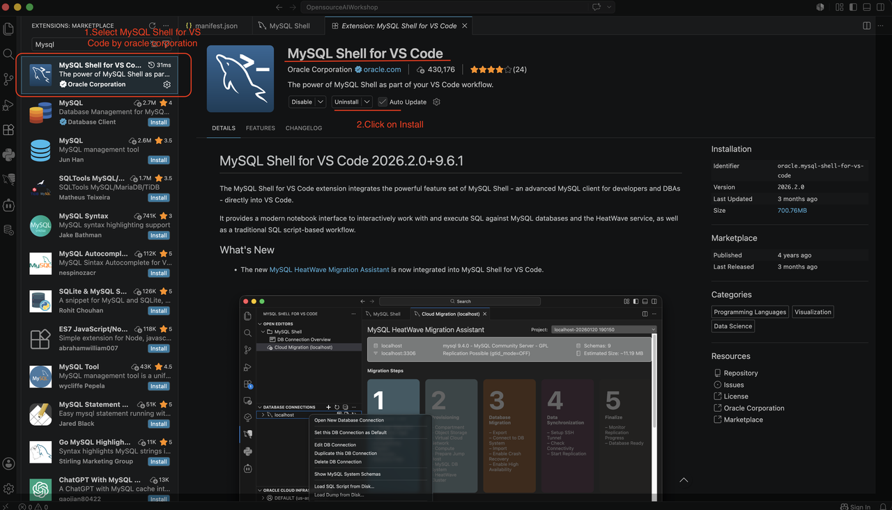


2. Configure Database Connection

    In Visual Studio Code:

    1. Open the MySQL Shell Extension.
    2. Click **+ New Connection**
    3. Enter the following details:

    | Field | Value |
    |---|---|
    | Host | Private DB IP |
    | Port | 3306 |
    | Username | admin |
    | Password | Your DB password |


    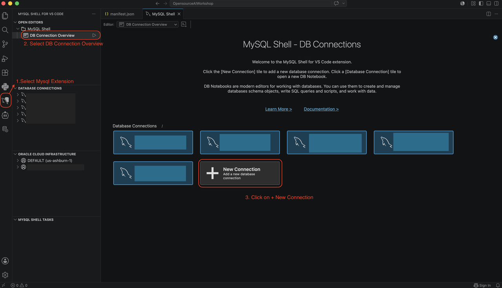

    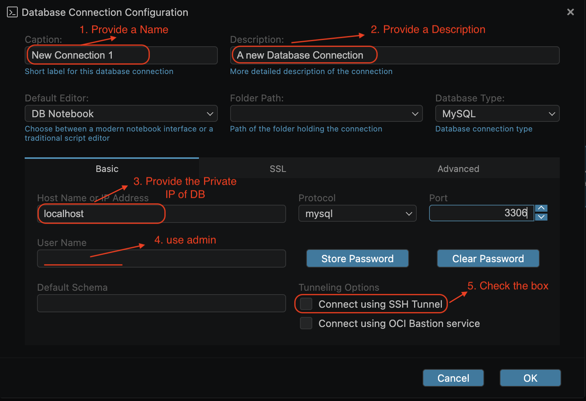


3. Configure SSH Tunnel

    Enter:

    | Field | Value |
    |---|---|
    | SSH Username | opc |
    | SSH Host | Public VM IP |
    | SSH Private Key | Path to private key |

    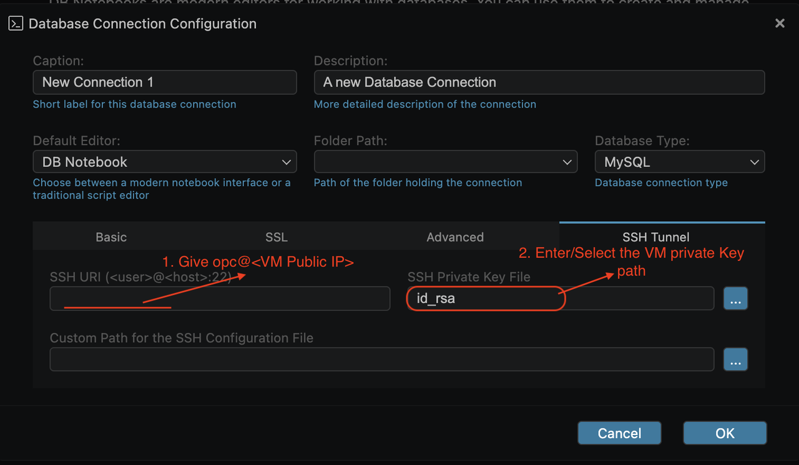


4. Test Database Connectivity

Execute:

```sql
SELECT NOW();
```

You should receive the current database server timestamp.


### Final Validation Checklist

-  VM accessible through SSH
-  MySQL HeatWave reachable from VS Code
-  Database query execution successful


## Task 5: Configure OCI Generative AI with Cline in Visual Studio Code

Configure OCI Generative AI integration with the Cline extension inside Visual Studio Code for prompt-driven AI application development.


1. Create IAM Policy for Generative AI Access

    Navigate to:

    - **Identity & Security → Policies**


    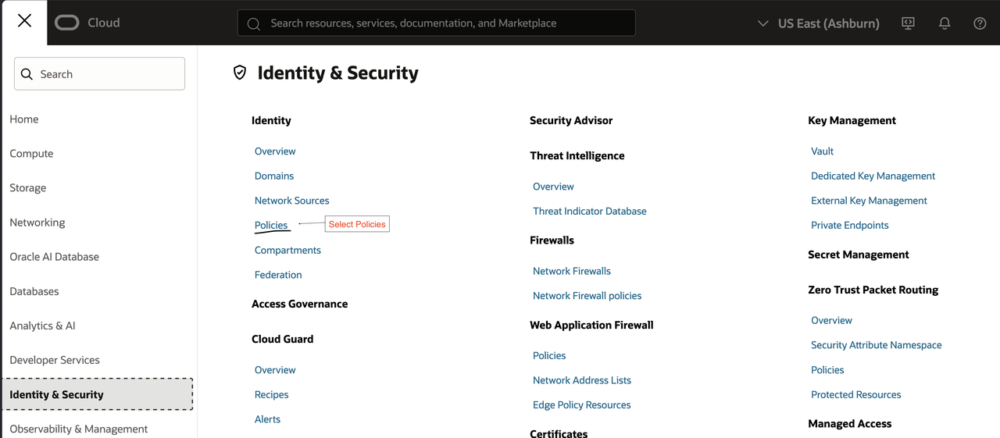
    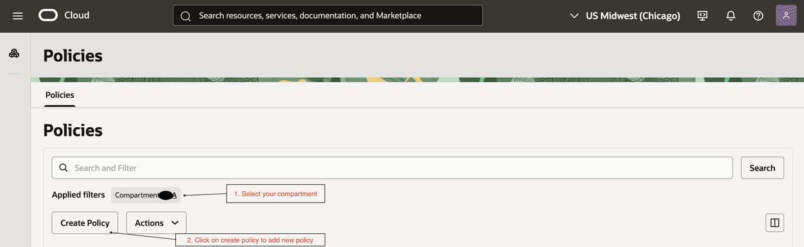

    Create the following policy:

    ```text
    Allow any-user to use generative-ai-family in compartment poc-compartment
    ```

    This policy grants access to OCI Generative AI services.

    Reference Documentation:  
    [Policy Basics](https://docs.oracle.com/en-us/iaas/Content/Identity/policieshow/Policy_Basics.htm)


2. Create OCI Generative AI API Key

    Navigate to:

    - **Analytics & AI → Generative AI**

    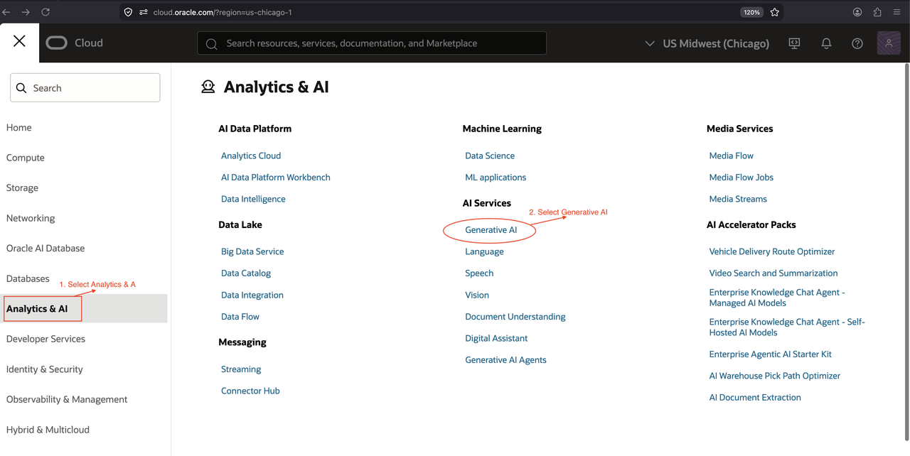

    Select:
    - Compartment: Your workshop compartment
    - Region: Chicago

    From the left navigation:
    - Select **API Keys**
    - Click **Create API Key**

    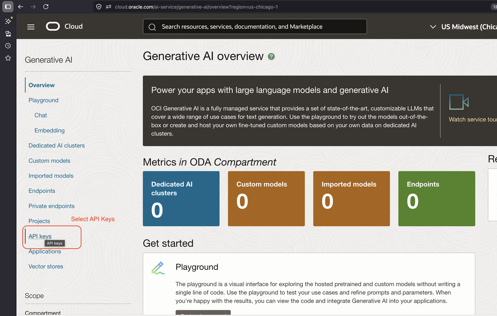

    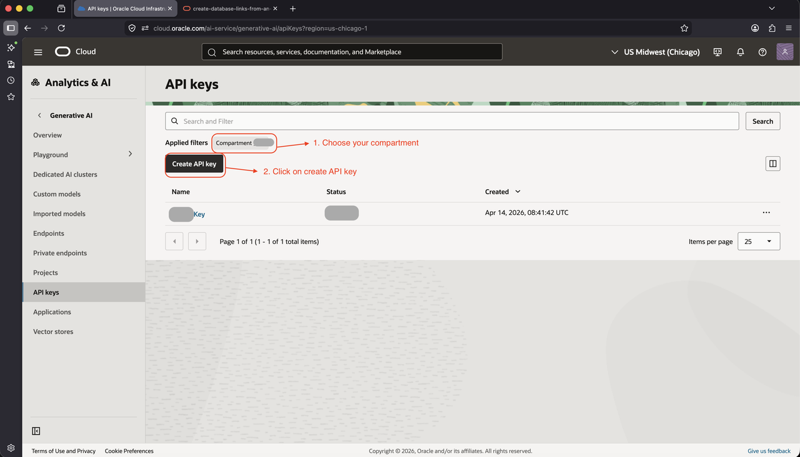
    Provide:
    - Name
    - Optional Description

    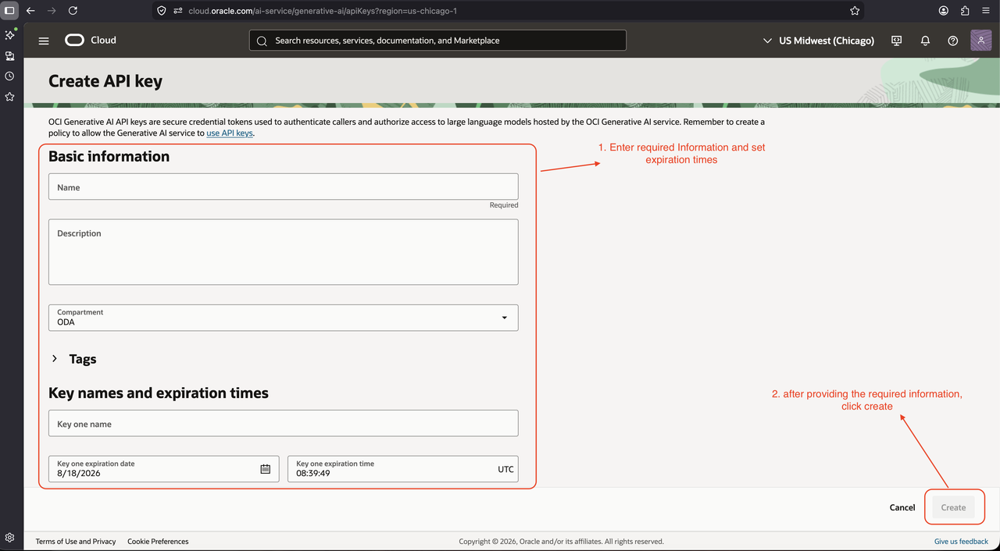

    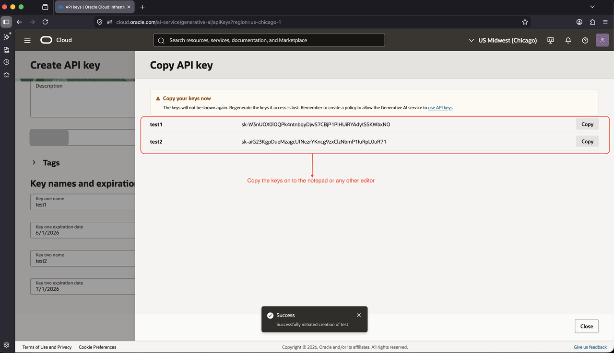


3. Install Cline Extension in VS Code

    1. Open Visual Studio Code
    2. Navigate to:
      - **Extensions**
    3. Search for:
      - `Cline`
    4. Click **Install**

    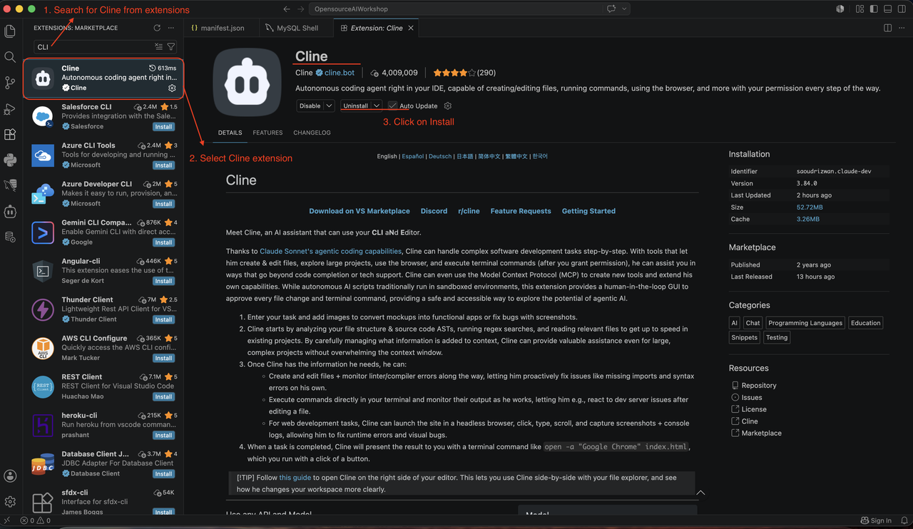


4. Configure Cline Settings

    Open Cline settings and configure:

    | Field | Value |
    |---|---|
    | Provider | Open AI Compatible |
    | Base URL | https://inference.generativeai.us-chicago-1.oci.oraclecloud.com |
    | Model ID | ocid1.generativeaimodel.oc1.us-chicago-1.amaaaaaask7dceya3bsfz4ogiuv3yc7gcnlry7gi3zzx6tnikg6jltqszm2q |

    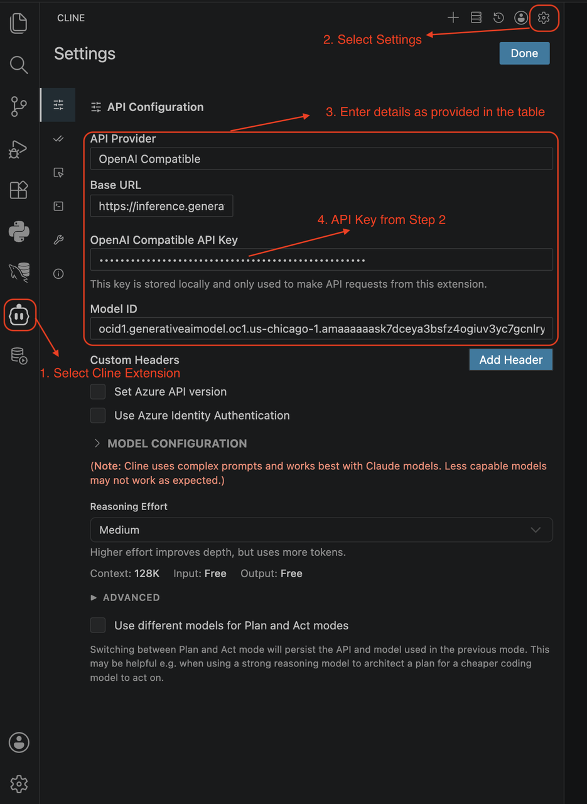

    > **Note:** The above Model ID is for xai.grok-4, If you want to configure other models instead of xai.grok-4 follow the below steps.

5. Navigate to:

    1. **Analytics & AI → Generative AI**

    

    2. Select:
    - Compartment: Your workshop compartment
    - Region: Chicago

    3. Select **Playground -> chat**
    4. Copy model ocid of your prefered model

    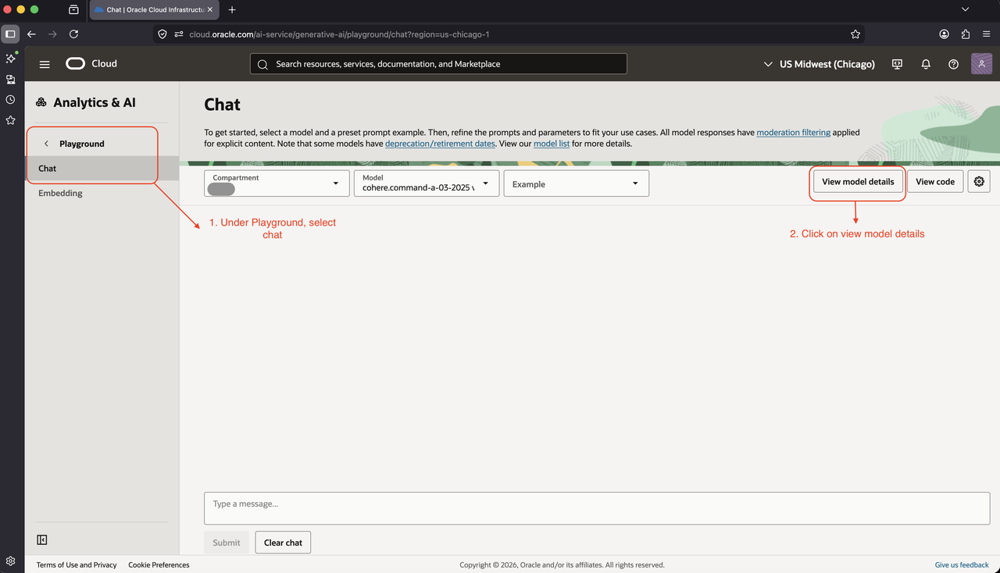

    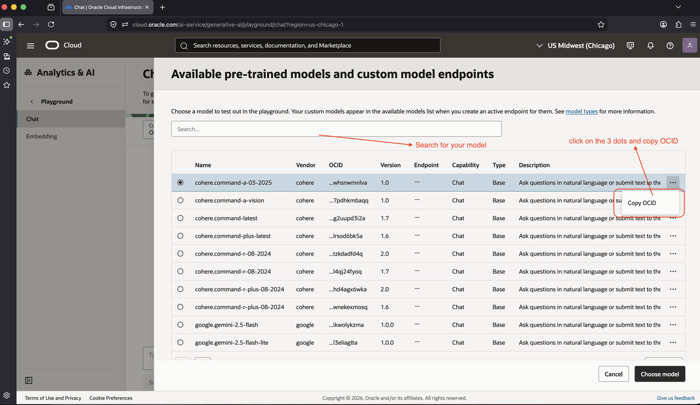

    5. Paste this in **model ID** under **Cline settings**


You may now **proceed to the next lab**.

## Acknowledgements

**Authors:**  
Lohith R and Jayshri Dhar from SEHUB

**Contributors:**  
Rahul Shringarpure from Mysql Heatwave
