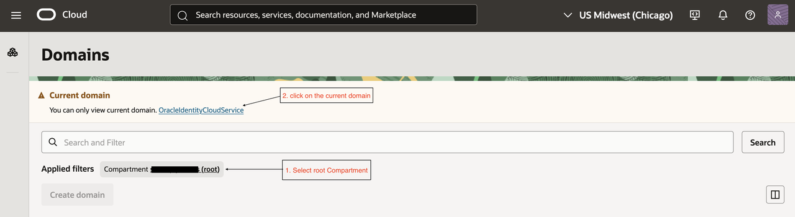
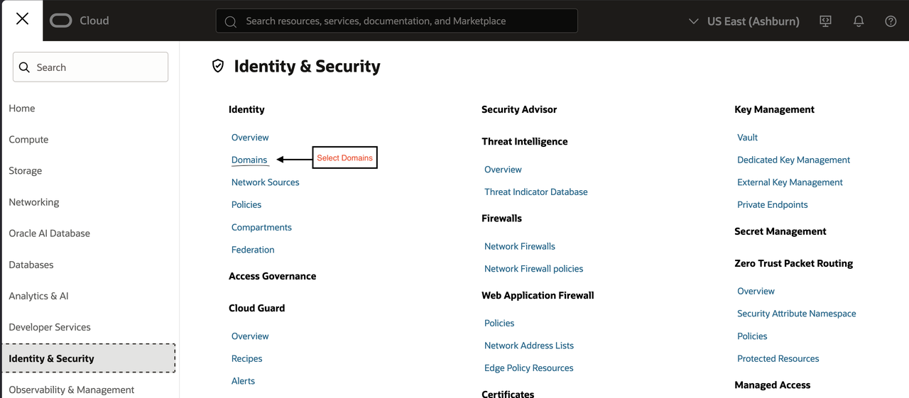
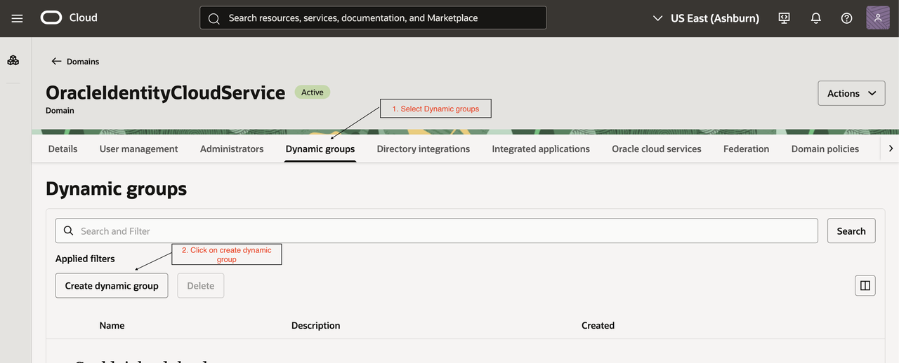

# Setup access to database 

### Objectives

In this lab, participants will connect to the MySQL HeatWave database, create an application database, provision a dedicated application user, and grant the required privileges including access to GenAI routines.

Estimated Time: 10 minutes

## Task 1: Create Database and user

Login to the MySQL HeatWave database using the **admin user credentials** in Visual Studio Code editor as you did in lab1.

Ensure you have administrative access before proceeding with database creation, user provisioning, and privilege grants.

1.  Create Application Database

```sql
CREATE DATABASE mydb;
```

Verify database creation:

```sql
SHOW DATABASES;
```

2.  Create Application User

Create a dedicated user for the application instead of using the admin account.

```sql
CREATE USER 'username'@'host' IDENTIFIED BY 'StrongPassword';
```

Recommended workshop example:

```sql
CREATE USER 'app_user'@'%' IDENTIFIED BY 'Workshop@1234';
```

> **Note:** Using `'%'` allows access from any host inside the permitted network. For production, restrict this to a specific host or subnet.

3.  Grant Database Access

Grant required privileges for the application database:

```sql
GRANT ALL PRIVILEGES
ON mydb.*
TO 'app_user'@'%';
```

Apply the changes:

```sql
FLUSH PRIVILEGES;
```

4.  Grant Access to GenAI Routines

Provide access to call GenAI / HeatWave system routines:

```sql
GRANT EXECUTE ON sys.* TO 'app_user'@'%';
```

Apply the changes:

```sql
FLUSH PRIVILEGES;
```

5.  Validate User Access

Create a **new database connection in Visual Studio Code** using the newly created application user credentials.

| Field | Value |
|---|---|
| Host | `<DB_PRIVATE_IP>` |
| Port | 3306 |
| Username | `app_user` |
| Password | The password set during user creation |
| Database | `mydb` |

Once connected, open a new SQL query window and run the following command to validate access:

```sql
SHOW DATABASES;
```

Expected result: the `mydb` database should be visible in the output.

You may also run:

```sql
USE mydb;
SHOW TABLES;
```

## Task 2: Enable HeatWave Access to OCI GenAI Services

To enable the DB system to access OCI services, perform the following steps in OCI.

1.  Create / Update Dynamic Group

Click on Hamburger Menu and select **Identity & Security → Domains -> select root compartment**.




Create a new dynamic group or update an existing one with the following matching rule:



```text
ALL{resource.type = 'mysqldbsystem', resource.compartment.id = 'ocid1.compartment.oc1..AlphanumericString'}
```

> **Note:** Replace `ocid1.compartment.oc1..AlphanumericString` with the **Compartment ID of the DB system**. Compartment ID is available under **Identity & Security -> Compartments -> select your compartment and copy the OCID**.

2.  Add Required Policies

Navigate to **Identity & Security → Policies** and add the following policies for the dynamic group:


```text
allow dynamic-group IdentityDomainName/GroupName to use generative-ai-chat in compartment CompartmentName
allow dynamic-group IdentityDomainName/GroupName to use generative-ai-text-embedding in compartment CompartmentName
allow dynamic-group IdentityDomainName/GroupName to inspect generative-ai-model in compartment CompartmentName
```

Replace the following values:

| Placeholder | Description |
|---|---|
| IdentityDomainName | The identity domain name |
| GroupName | The dynamic group name |
| CompartmentName | The compartment where GenAI access is required |

> **Note:** If the dynamic group belongs to the default identity domain, you can omit specifying the identity domain name.

## Expected Outcome

| Validation Item | Expected Result |
|---|---|
| Database Created | `mydb` visible in `SHOW DATABASES` |
| User Created | `app_user` login successful |
| DB Access | Can use `mydb` schema |
| GenAI Access | `EXECUTE` privilege on `sys` routines |


You may now **proceed to the next lab**.

## Acknowledgements

**Authors:**  
Lohith R and Jayshri Dhar from SEHUB

**Contributors:**  
Rahul Shringarpure from Mysql Heatwave
