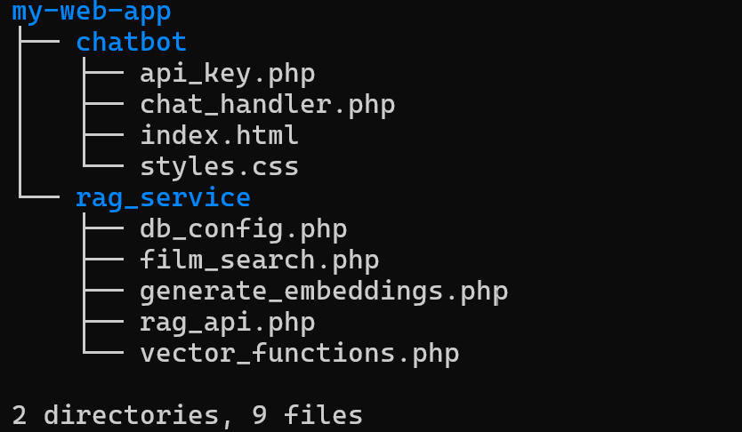
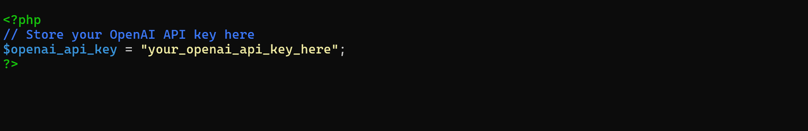
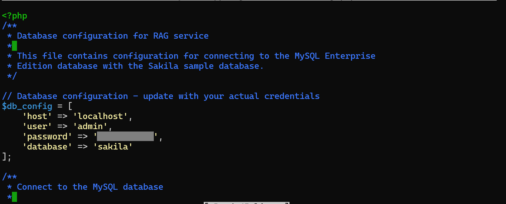
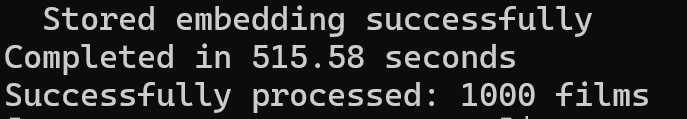
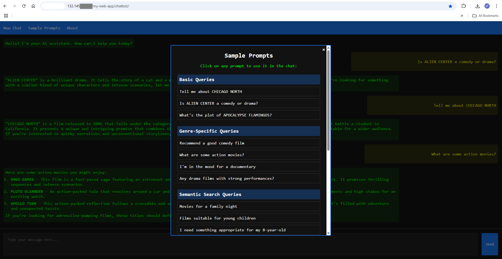

# FilmRAG: A LAMP-Based RAG Implementation Using MySQL Vector Capabilities

## Introduction

MySQL Enterprise Edition integrates seamlessly with the LAMP (Linux, Apache, MySQL, PHP) stack, enhancing open-source capabilities with enterprise features. MySQL EE works with the LAMP stack by:

- Storing and retrieving the Vector embedded film content in database.
- Using secure PHP connections (PDO) 
- Maintaining Apache/Linux compatibility

In this lab you will deploy the FilmRAG application that was built based on Lab 3 and then modified to connect to the prebuilt RAG service using MySQL's vector capabilities and OpenAI models. 

**Note:** The application code in this lab is intended for educational purposes only. It is designed to help developers learn and practice application development skills with MySQL Enterprise Edition. The code is not designed to be used in a production environment

_Estimated Lab Time:_ 30 minutes   

### Objectives

In this lab, you will be guided through the following tasks:

- Understand the application
- Review the application source files
- Deploy and configure the RAG application
- How to check for errors
- Generate the Film embedding content
- Run and test the RAG application


### Prerequisites

- An Oracle Trial or Paid Cloud Account
- Apache Web server with PHP 8.2+
- MySQL 9.2 or higher
- Access to Claude 3.7 Sonnet AI assistant  
- Access to OpenAI API, plus API key for 'gpt-4o-mini' and and 'text-embedding-3-small'  AI models
- Some Experience with MySQL SQL and  PHP
- Completed Lab 5

## Task 1: Understand the application

This is a film information chatbot built entirely on the LAMP stack (Linux, Apache, MySQL, PHP) that implements a Retrieval Augmented Generation (RAG) pipeline. What makes it special is that it leverages MySQL's vector capabilities for semantic search rather than requiring additional vector databases like Pinecone or Milvus.

### Directory Structure

```markdown
    my-web-app
    ├── chatbot
    │   ├── api_key.php          # Stores OpenAI API key (securely masked)
    │   ├── chat_handler.php     # Processes chat interactions
    │   ├── index.html           # Frontend UI
    │   └── styles.css           # CSS styling
    └── rag_service
        ├── db_config.php        # Database connection configuration
        ├── film_search.php      # Film search utilities
        ├── generate_embeddings.php  # Generates vector embeddings
        ├── rag_api.php          # Main RAG implementation
        └── vector_functions.php # Vector similarity functions
```

### Technical Components

#### 1. Frontend (HTML/CSS/JS)

The frontend is built with standard web technologies:

- HTML5 structure with flex layout
- CSS3 for styling with variables and modern selectors
- jQuery for AJAX calls and DOM manipulation
- Markdown rendering with Showdown.js
- Syntax highlighting with Prism.js
- Code block copy functionality with pirate icon (🏴‍☠️) button
- Sample prompts UI for quick testing and demonstration purposes

Key JavaScript functionality:

- AJAX calls to the PHP backend
- Chat history management
- Markdown processing
- Code block syntax highlighting and copy functions
- Menu system with About and Sample Prompts sections

#### 2. Backend (PHP)

The PHP implementation handles several responsibilities:

**Chat Handler (`chat_handler.php`):**

- Session management for chat history
- Communication with OpenAI's API (using gpt-4o-mini model)
- Integration with the RAG service via a crucial external URL (http://your-server-ip/my-web-app/rag_service/rag_api.php) that connects the chat system to the film database retrieval service - this URL ensures that user queries about movies trigger the proper context retrieval from the database as seen in the code below:
      ```markdown
      // Initialize cURL session to our RAG service
      // IMPORTANT: Update this URL to match your server setup
      //$rag_api_url = '../rag_service/rag_api.php'; 
      $rag_api_url = 'http://your-server-ip/my-web-app/rag_service/rag_api.php';
      error_log("[CHAT] Calling RAG service at: " . $rag_api_url);
      ```

- Request/response handling with comprehensive error logging
- Properly formatted responses with markdown support

**RAG Service:**

- Vector embedding generation via OpenAI (using text-embedding-3-small model)
- MySQL vector operations with `STRING_TO_VECTOR` and `VECTOR_TO_STRING` functions
- Similarity calculations via cosine similarity
- Context enhancement for the LLM
- Film query identification and processing

#### 3. Database (MySQL)

The application uses MySQL Enterprise Edition with vector capabilities:

- Uses the Sakila sample database with modifications
- Extends the film table with a VECTOR column type
- Leverages MySQL functions like `STRING_TO_VECTOR` and `VECTOR_TO_STRING`
- Secure connectivity with prepared statements throughout

### Vector Embeddings Generation

The primary file responsible for this is `generate_embeddings.php` in the `rag_service` directory. The embedding generation process works as follows:

1. **Database Connection**: The script first connects to the MySQL database using the connection details from `db_config.php`.

2. **Film Selection**: It queries the database for films that don't yet have embeddings (where `vector_embedding IS NULL`), limiting to 200 films at a time to manage processing load.

3. **Text Representation**: For each film, the script creates a comprehensive text representation using the `create_film_text()` function, which combines:
   - Film title
   - Description
   - Release year
   - Rating
   - Categories
   - Additional semantic information about audience suitability (e.g., whether it's family-friendly)

4. **OpenAI API Call**: The script sends this text representation to OpenAI's embedding API using the `generate_embedding()` function from `vector_functions.php`. It specifically uses the `text-embedding-3-small` model.

5. **Vector Storage**: Upon receiving the embedding (a vector of floating-point numbers), the script converts it to a string format and stores it in the database using MySQL's `STRING_TO_VECTOR` function:

   ```markdown
   $vector_str = "[" . implode(",", $embedding) . "]";
   $stmt = $conn->prepare("
       UPDATE film 
       SET vector_embedding = STRING_TO_VECTOR(?)
       WHERE film_id = ?
   ");
   ```

6. **Rate Limiting**: The script includes a small delay between processing films to avoid hitting API rate limits.

7. **Error Handling**: Comprehensive error logging is implemented throughout the process to capture any issues during embedding generation.

The embeddings serve as semantic representations of the films, capturing their meaning in a high-dimensional vector space. This allows the application to perform semantic searches later - when a user asks about a film, their query is also converted to an embedding, and the system finds films with similar embeddings, effectively matching based on meaning rather than just keywords.

These embeddings power the RAG (Retrieval-Augmented Generation) system, which enhances the AI's responses with relevant information from the database, making it more accurate and informative when discussing films.

### The RAG Pipeline Flow

The application includes a detailed architecture diagram (`FilmRAG Application Architecture.svg`) that visually represents the system components and their interactions. The diagram illustrates the flow from user input through the various processing stages to the final response generation.

From a developer perspective, here's the request flow:

1. User submits a query via the web interface
2. `chat_handler.php` receives the query and calls the RAG service
3. The RAG service determines if it's a film-related query
4. If film-related, it either:
   - Performs direct title lookup for specific film mentions
   - Generates a vector embedding for the query using OpenAI's API (text-embedding-3-small)
   - Searches for similar films using vector similarity in MySQL
5. Retrieved film information is formatted into an enhanced prompt
6. The enhanced prompt is sent to OpenAI's GPT model (gpt-4o-mini)
7. The response is returned to the frontend and displayed to the user

### Key PHP Implementation Details

The application implements two approaches to vector similarity:

1. **API-Based Vector Functions**: The `vector_functions.php` file contains the implementation for generating embeddings and calculating similarity.

2. **Database-Integrated Vector Operations**: The `rag_api.php` file leverages MySQL's built-in vector operations for more efficient searching when possible.

These two approaches work together, with the system using the most appropriate method based on the query type. For direct title lookups, the system can bypass vector similarity calculations entirely.

The application uses cURL for API calls with proper error handling and logging:

```markdown
// Example of error logging in the cURL implementation
if (curl_errno($ch)) {
    error_log("[RAG] cURL error: " . curl_error($ch));
    curl_close($ch);
    return null;
}
```

### Development Considerations

As a LAMP developer, here are some aspects you'd appreciate:

1. **Pure PHP Implementation** - No need for Python or Node.js dependencies
2. **Standard MySQL Integration** - Uses familiar PDO/mysqli methods
3. **Separation of Concerns** - Clean separation between components
4. **Error Handling** - Comprehensive error logging and handling throughout the codebase
5. **Security** - Prepared statements for all DB queries, masked API keys in configuration files
6. **Interactive UI Features** - Sample prompts, code copying, and intuitive chat interface

### Extending and Modifying

To adapt this for your own projects:

1. Make sure you have added the correct OpenAI API key
2. Replace the Sakila database with your own domain data
3. Modify the embedding generation to use your data schema
4. Adjust the vector similarity search based on your requirements
5. Update the prompt enhancement logic for your domain
6. Customize the front-end UI as needed

The beauty of this application is that it implements a sophisticated RAG system entirely within the LAMP stack, leveraging the powerful vector capabilities of MySQL Enterprise Edition without requiring additional specialized databases or services.


## Task 2: Review the application source files  

Here's a description of each file in the application structure:

### `/chatbot` Directory

   1. **`api_key.php`**
      - Contains the OpenAI API key storage (securely masked as 'sk-proj-ApXgHZgC7NOqIi0Jz8REAi...')
      - Stores the key in a PHP variable for secure access across the application
      - Protects the API key from being directly visible in client-side code

   2. **`chat_handler.php`**
      - Main backend processing script that handles user chat interactions
      - Manages communication between the frontend and OpenAI API (using gpt-4o-mini model)
      - Implements session management to maintain chat history
      - Integrates with the RAG service to enhance responses with film information
      - Formats and returns AI responses to the frontend
      - Includes comprehensive error logging throughout

   3. **`index.html`**
      - Main frontend interface of the chatbot application
      - Provides the chat UI with message history display
      - Includes interactive elements like the message input, send button, and menu options
      - Contains JavaScript for handling user interactions and AJAX requests
      - Implements markdown rendering and code syntax highlighting
      - Features a sample prompts menu for quick testing and demonstration
      - Includes code block copy functionality with pirate icon (🏴‍☠️)

   4. **`styles.css`**
      - Contains CSS styling for the chatbot interface
      - Implements the dark-themed, terminal-inspired UI
      - Defines styling for chat messages, buttons, code blocks, and other UI elements
      - Includes responsive design elements for various screen sizes
      - Defines styles for the pirate-themed copy button and its states

### `/rag_service` Directory

   1. **`db_config.php`**
      - Database configuration and connection management
      - Contains credentials for connecting to the MySQL database
      - Provides a function to establish a database connection
      - Used by other RAG service scripts that need database access
      - Includes error logging for connection issues

   2. **`film_search.php`**
      - Contains functions for identifying and processing film-related queries
      - Implements film title extraction from natural language queries
      - Provides functions to search for films by title or category
      - Creates enhanced prompts with film information for the AI
      - Includes pattern matching logic for extracting film titles from various query formats

   3. **`generate_embeddings.php`**
      - Script for generating vector embeddings for films in the database
      - Processes film data into text representations suitable for embedding
      - Calls the OpenAI API to generate embeddings for each film (using text-embedding-3-small)
      - Stores the embeddings in the MySQL database using VECTOR data type
      - Implements rate limiting to avoid API throttling

   4. **`rag_api.php`**
      - Main API endpoint for the RAG (Retrieval-Augmented Generation) service
      - Handles vectorized search using MySQL's VECTOR capabilities
      - Implements cosine similarity calculations for semantic search
      - Processes user queries to retrieve relevant film information
      - Works in conjunction with vector_functions.php to provide complete RAG functionality

   5. **`vector_functions.php`**
      - Contains utility functions for vector operations
      - Implements the VectorSimilarity class with cosine similarity calculations
      - Provides functions for performing vector searches in the database
      - Contains functions to generate embeddings using the OpenAI API
      - Complements rag_api.php with additional vector processing capabilities


This file structure separates the chatbot interface (in the `/chatbot` directory) from the retrieval mechanisms (in the `/rag_service` directory), creating a modular design that separates concerns and improves maintainability.


## Task 3: Deploy and configure MySQL Chatbot / RAG Application  

1. Go to the development folder

    ```bash
    <copy>cd /var/www/html</copy>
    ```

2. Download application code

    ```bash
    <copy> sudo wget https://objectstorage.us-ashburn-1.oraclecloud.com/p/Hr3FDn1RQEdwEqTcn4PQZ_os1JV6TnWtFLhu0dCNrbJF2Rp4cAMXq7PWrtU30fqm/n/idazzjlcjqzj/b/Applications/o/my-web-app.zip</copy>
    ```

3. unzip Application code

    ```bash
    <copy>sudo unzip my-web-app.zip</copy>
    ```

4. View files in application folder structure


    ```bash
    <copy>tree my-web-app</copy>
    ```
    

    
5. Update the OpenAI API Key 

    ```bash
    <copy>sudo nano my-web-app/chatbot/api_key.php</copy>
    ```

    


6. Update file db_config.php to change the following values if needed
    - 'host' => **'localhost'**,
    - 'user' => **'admin'**,
    - 'password' => **'Welcome#123'**,
    - 'database' => **'sakila'**

    ```bash
    <copy>sudo nano my-web-app/rag_service/db_config.php</copy>
    ```

    

6. Update the chat_handler.php file to use your server's IP address

    ```bash
    <copy>sudo nano my-web-app/chatbot/chat_handler.php</copy>
    ```

    Find the following section and replace with your server's IP address:
      **Note** - Easy search in nano ...  ctrl + w ... then enter **`$rag_api_url`**
    
    ```markdown
    // Initialize cURL session to our RAG service
    // IMPORTANT: Update this URL to match your server setup
    //$rag_api_url = '../rag_service/rag_api.php'; 
    $rag_api_url = 'http://your-server-ip/my-web-app/rag_service/rag_api.php';
    ```

## Task 4: How to Check for Errors

When running the FilmRAG application, you might need to check the PHP error logs to diagnose any issues. Here are some useful commands for error checking:

1. View the most recent PHP errors in real-time:

      ```bash
      <copy>sudo tail -f /var/log/php-fpm/www-error.log</copy>
      ```
   This command will display new error messages as they occur, which is useful for debugging while actively using the application.

2. Clear the error log if it becomes too large or cluttered:

      ```bash
      <copy>sudo truncate -s 0 /var/log/php-fpm/www-error.log</copy>
      ```
   This command will empty the error log file without deleting it, giving you a clean slate for new error messages.

3. These commands are particularly helpful when:

   - The application isn't responding as expected
   - You're seeing blank pages or incomplete responses
   - The RAG functionality isn't retrieving film information correctly
   - There are issues with the OpenAI API connections

The application is designed to log detailed error information, which can help identify issues with database connections, API calls, or vector operations.

## Task 5: Run and test MySQL Chatbot / RAG Application 

1. Run Script to generate film embeddings  
   Go to the Application folder

    ```bash
    <copy>cd /var/www/html</copy>
    ```

    ```bash
    <copy>cd my-web-app/rag_service</copy>
    ```

    ```bash
    <copy>php generate_embeddings.php</copy>
    ```

    This script will generate vector embeddings for each of the films in the Sakila database using the OpenAI API. 
    
    - The script execution may take about 10 minutes as it processes up to 1,000 films. 
    - The execution will sometime slow down to breathe... don't panic it will complete the job.

      

2. Run the application by navigating to:

    <http://your-server-ip/my-web-app/chatbot/>

    

3. Test the application by clicking the "Sample Prompts" menu. Select a prompt and hit _Send_

   The sample prompts are organized into different categories:
   - Basic Queries
   - Genre-Specific Queries
   - Semantic Search Queries
   - Thematic Queries
   - Complex Queries

4. **Try your own testing and have a little fun**

   Here are some example queries to try:
      - What movie is about a battle between a cow and a waitress?
      - Tell me about the movie ALIEN CENTER?
      - Click "New Chat" to start a fresh conversation
      - Tell me about the movie CHICAGO NOOOORTH? (Intentional typo)
      - Tell me about the movie CHICAGO NORTH? (Correct title)
      - Click "New Chat" again
      - Do you know when the movie Chicago N. was released?

5. Observe how the system handles:
   - Direct film title matches
   - Semantic similarities
   - Spelling variations
   - Incomplete title information
   - Natural language questions about films

This hands-on experience demonstrates the power of combining MySQL's vector capabilities with an LLM for creating a domain-specific chatbot with improved accuracy and relevance.

## Learn More

- [MySQL Vector Functions](https://dev.mysql.com/doc/refman/9.2/en/vector-functions.html)
- [MySQL Vector Datatype: create your operations](https://blogs.oracle.com/mysql/post/mysql-vector-datatype-create-your-operations-part-1)

## Acknowledgements

- **Author** - Craig Shallahamer, Applied AI Scientist, Viscosity North America
- **Contributor** - Perside Foster, MySQL Solution Engineering
- **Last Updated By/Date** - Perside Foster, MySQL Solution Engineering , April 2025
