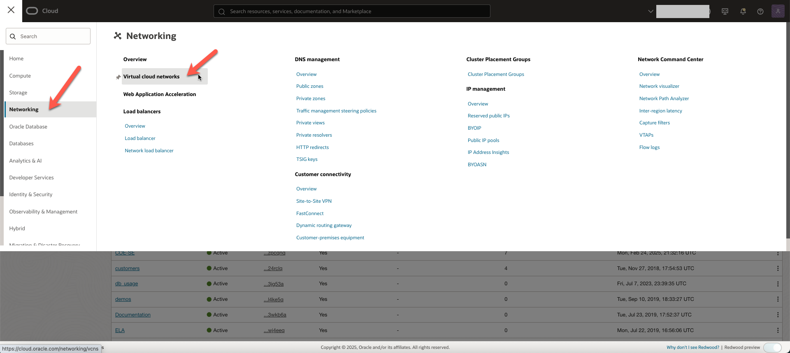
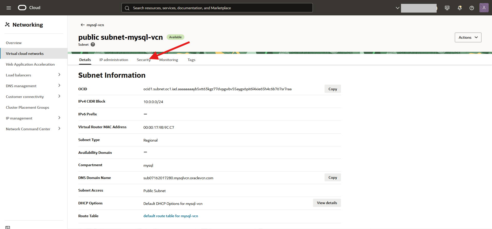

# Create the Virtual Cloud Network

## Introduction

In this lab, you will create a create a compartment, and a Virtual Cloud Network.

_Estimated Time:_ 15 minutes

### Objectives

In this lab, you will be guided through the following tasks:

- Create compartment.
- Create Virtual Cloud Network.
- Configure security list to allow incoming connections.
- Configure security list to allow HTTP incoming connections.

### Prerequisites

- An Oracle trial or paid cloud account.
- Some experience with MySQL Shell.
- You have logged into the OCI Console using the default identity domain.

## Task 1: Create Compartment

1. Click the **Navigation menu** in the upper left, navigate to **Identity & Security**, and under **Identity**, select **Compartments**.

    

2. On the Compartments page, click **Create Compartment**.

3. In the **Create Compartment** dialog box, enter the following:

    **Name**:

    ```bash
    <copy>mysql</copy>
    ```

    **Description**:

    ```bash
    <copy>Compartment for mysql</copy>
    ```

4. Click **Create Compartment**.

    

## Task 2: Create Virtual Cloud Network

1. Click the **Navigation menu** in the upper left, navigate to **Networking**, and select **Virtual cloud networks**.

    

2. Under **Compartment**, select **mysql**, and Click **Start VCN Wizard**.

    

3. In the **Start VCN Wizard** dialog box, select **Create VCN with Internet Connectivity**, and click **Start VCN Wizard**.

    

4. Scroll down to  **Basic information**, provide a **VCN name**:

    ```bash
    <copy>mysql-vcn</copy>
    ```

5. Ensure that **mysql** compartment is selected, and click **Next**.

    

6. Review Oracle Virtual Cloud Network (VCN), Subnets, and Gateways, and click **Create**.

    

7. When the Virtual Cloud Network is created, click **View VCN** to display the created VCN.

    

## Task 3: Configure security list to allow incoming connections

1. On the **mysql-vcn** page, under **Subnets**, click  **private subnet-mysql-vcn**.

     

2. On **private subnet-mysql-vcn** page, click **Security**

    

3. Click  **security list for private subnet-mysql-vcn**.

    

4. On the **security list for private subnet-mysql-vcn** page, click **Security rules**

    

5. On the **security list for private subnet-mysql-vcn** page, under **Ingress Rules**, click **Add Ingress Rules**.

    

6. On **Add Ingress Rules** panel, enter the following, and click **Add Ingress Rules**:

    **Source CIDR**:

    ```bash
    <copy>0.0.0.0/0</copy>
    ```

    **Destination Port Range**:

    ```bash
    <copy>3306,33060</copy>
    ```

    

7. On **security list for private subnet-mysql-vcn** page, the new ingress rules are shown under **Ingress Rules**.

    

## Task 4: Configure security list to allow HTTP incoming connections

1. Click the **Navigation menu** in the upper left, navigate to **Networking**, and select **Virtual cloud networks**.

    

2. Under **Compartment**, ensure **mysql** is selected, and click the VCN you created, **mysql-vcn**.

    

3. On **mysql-vcn** page, click **Subnets**

    

4. On the **mysql-vcn** page, under **Subnets**, click  **public subnet-mysql-vcn**.

    

5. On the **public subnet-mysql-vcn** page, click **Security**.

    

6. On the **public subnet-mysql-vcn** page, click **Default Security List for mysql-vcn**.

    

7. Under **Security**, click **Security Rules**.

    

8. On **Default Security List for mysql-vcn** page, under **Ingress Rules**, click **Add Ingress Rules**.

    

9. On **Add Ingress Rules** panel, enter the following, and click **Add Ingress Rules**:

    **Source CIDR**:

    ```bash
    <copy>0.0.0.0/0</copy>
    ```

    **Destination Port Range**:

    ```bash
    <copy>80,443</copy>
    ```

     

10. On **Default Security List for mysql-vcn** page, the new ingress rules are shown under **Ingress Rules**.

    


You may now **proceed to the next lab**.

## Acknowledgements

- **Author** - Craig Shallahamer, Applied AI Scientist, Viscosity North America
- **Contributor** - Perside Foster, MySQL Solution Engineering 
- **Last Updated By/Date** - Perside Foster, MySQL Solution Engineering , July 2025
