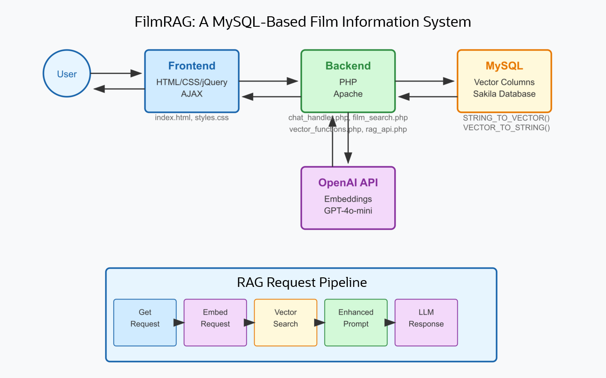

# Introduction

## About this Workshop

### Building Intelligent Applications with MySQL on-prem Vector Search

In this workshop, we'll explore the powerful combination of large language models, vector search, and relational databases to create a truly intelligent film recommendation application. We'll be working with a MySQL on-premise database, showing how this traditional relational system can be transformed into an AI-powered recommendation engine that understands not just what films people like, but why they like them.

### What You will Learn

During this workshop, you'll build a complete application that can answer detailed questions about movies by combining the Sakila film database, conversation history with AI-powered language generation. We'll start by building a standalone chatbot using Claude 3.7 Sonnet as our AI assistant, providing it with predefined prompts to generate the chatbot code based on our specifications. You'll get hands-on experience setting up RAG with MySQL's vector capabilities, and we'll leverage preexisting code to quickly deploy and test the finished application.

### Why This Matters

While large language models like GPT-4 are impressive, they have limitations - they can't access your specific data and sometimes generate incorrect information. RAG solves this problem by retrieving relevant facts from your database before generating responses, giving you:

- More accurate and reliable answers
- Responses based on your actual data
- Control over information sources
- Lower costs by using smaller models effectively

### Our Approach

We'll break this workshop into manageable phases:

1. First, we'll build a standalone chatbot with a terminal-themed interface
2. Next, we'll install MySQL Enterprise Edition, sample database, and its vector capabilities.
3. Finally, we'll deploy an application made up of a RAG service using MySQL's vector capabilities that is connected to the chatbot to create our intelligent movie assistant.

### System Architecture Diagram

The architecture diagram illustrates the overall structure and data flow of the FilmRAG system, showing:

1. The main components (Frontend, Backend, MySQL database, and OpenAI API)
2. How these components interact with each other
3. The detailed RAG pipeline workflow at the bottom
4. The specific technologies used in each component
5. The key MySQL vector functions being utilized

After completing this workshop, you'll have a working application and the knowledge to apply these techniques to your own data and use cases. The skills you learn are directly applicable to business applications like customer support, documentation search, and personalized recommendations.

Let's get started on our journey to building smarter, more context-aware AI applications!

_Estimated Workshop Time:_ 120 minutes

## About Product/Technology

MySQL Enterprise Edition is a comprehensive database solution with these key features:

- High performance and scalability for handling demanding workloads
- Advanced security features to protect sensitive data
- Reliability and high availability capabilities
- Simplified database administration tools
- 24/7 professional support services
- Cost-effective compared to alternative solutions
- Compatibility with various tools and technologies
- Support for JavaScript stored programs, and Vector Type functions

The solution is widely used across multiple industries including web/mobile applications, e-commerce, financial services, healthcare, and government sectors. Its popularity comes from delivering secure, high-performance, and scalable database capabilities that meet diverse organizational needs.

You can access MySQL Enterprise Edition for free during learning, development, and prototyping by downloading it from Oracle's Technology Network at: https://www.oracle.com/mysql/technologies/mysql-enterprise-edition-downloads.html. 

For production use, a commercial license must be purchased through MySQL's website: https://www.mysql.com/buy-mysql/.

## Objectives

In this lab, you will be guided through the following steps:

- Lab 1: Create a Virtual Cloud Network
- Lab 2: Create a Compute instance
- Lab 3: Build and Test Apache / PHP Installation
- Lab 4: Build Chatbot Application
- Lab 5: Install Enterprise Edition
- Lab 6: Setup Sakila Sample Database and configure Vector datatype
- Lab 7: Build and MySQL Vector AI Application

## Prerequisites

- An Oracle Free Tier, Paid  Cloud Account
- Claude 3.7 Sonnet Account -  AI assistant created by Anthropic
- OpenAI API Account - For models interacction

You may now **proceed to the next lab**

## Learn More

- [MySQL Enterprise Edition](https://www.oracle.com/mysql/enterprise/)

## Acknowledgements

- **Author** - Craig Shallahamer, Applied AI Scientist, Viscosity North America
- **Contributor** - Perside Foster, MySQL Solution Engineering 
- **Last Updated By/Date** - Perside Foster, MySQL Solution Engineering , July 2025