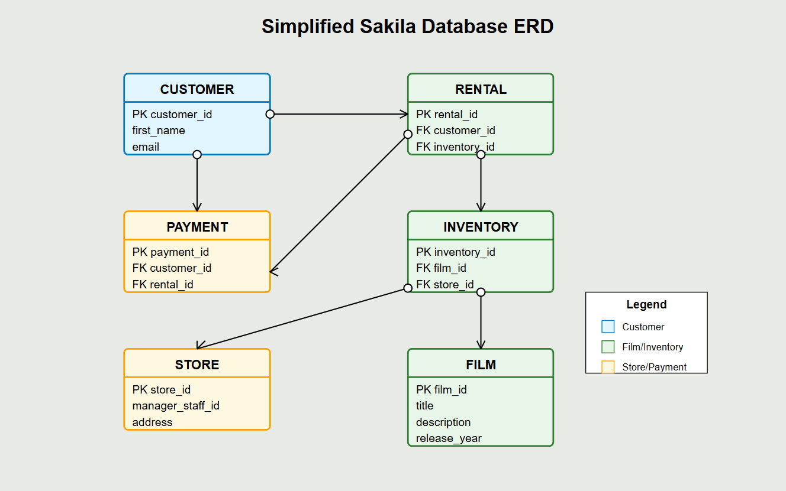

# Setup Sakila Sample Database and JavaScript Stored Function

## Introduction

The Sakila sample database was initially developed by Mike Hillyer, a former member of the MySQL AB documentation team. It is intended to provide a standard schema that can be used for examples in books, tutorials, articles, samples, and so forth. The Sakila sample database also serves to highlight features of MySQL such as Views, Stored Procedures, and Triggers.


_Estimated Time:_ 20 minutes

### Objectives

In this lab, you will be guided through the following tasks:

- Install  Sakila
- Explore the Sakila Database in MySQL
- Add the vector column to the Sakila film table

### Prerequisites

This lab assumes you have:

- Completed Labs 4

## Task 1: Install Sakila Database

1. Connect to **mysql-compute** instance using Cloud Shell (**Example:** ssh -i  ~/.ssh/id_rsa opc@132.145.17….)

    ```bash
    <copy>ssh -i ~/.ssh/id_rsa opc@<your_compute_instance_ip></copy>
    ```

    

2. Change to home directory

    ```bash
    <copy>cd /home/opc</copy>
    ```

3. Download the Sakila Database

    ```bash    
    <copy>wget https://objectstorage.us-ashburn-1.oraclecloud.com/p/bZJU1s_dUgBBWjMp34WFKqVGJvDBnC_yFg9PrOawSlCZ6GblRwjcb4r0pSPIrL5k/n/idazzjlcjqzj/b/mysql-ee-downloads/o/sakila-db.tar.gz</copy>
    ```

4. Extract the contents of the "sakila-db.tar.gz" archive file. you should see two .sql files: sakila-data.sql and sakila-schema.sql

    ```bash
    <copy>tar -xvf sakila-db.tar.gz</copy>
    ```

5. Change to the sakila directory

    ```bash
    <copy>cd sakila-db</copy>
    ```

6. Connect to the MySQL server. Enter your password when prompted

    ```bash
    <copy>mysqlsh -uadmin -hlocalhost -p</copy>
    ```

7. Execute the sakila-schema.sql script to create the database structure

    ```bash
    <copy>SOURCE sakila-schema.sql;</copy>
    ```

8. Execute the sakila-data.sql script to populate the database structure

    ```bash
    <copy>SOURCE sakila-data.sql;</copy>
    ```

9. Verify the installation

    ```bash
    <copy>show databases;</copy>
    ```

## Task 2: Explore the Sakila Database in MySQL

1. Point to the sakila dabase

    ```bash
    <copy>use sakila;</copy>
    ```

2. List the sakila tables

    ```bash
    <copy>show tables;</copy>
    ```

3. Here is a simplified ERD (Entity Relationship Diagram) of the Sakila Database. It includes six main tables:

    - CUSTOMER - Stores basic customer information
    - RENTAL - Tracks when customers rent films
    - PAYMENT - Records customer payments for rentals
    - INVENTORY - Represents physical copies of films available in stores
    - **FILM - Contains information about the movies themselves (focus table)**
    - STORE - Represents the physical store locations


    


4. List data from the film table

    ```bash
    <copy>SELECT * FROM film;</copy>
    ```

5. Add the vector column to the film table

    ```bash
    <copy>ALTER TABLE film ADD COLUMN vector_embedding VECTOR(1536);</copy>
    ```

6. View the vector column of the film table

    ```bash
    <copy>DESC film\G;</copy>
    ```

7. Exit

    ```bash
    <copy>\q</copy>
    ```

You may now **proceed to the next lab**

## Learn More

- [Sakila Sample Database](https://dev.mysql.com/doc/sakila/en/sakila-introduction.html)

## Acknowledgements

- **Author** - Craig Shallahamer, Applied AI Scientist, Viscosity North America
- **Contributor** - Perside Foster, MySQL Solution Engineering 
- **Last Updated By/Date** - Perside Foster, MySQL Solution Engineering , April 2025
