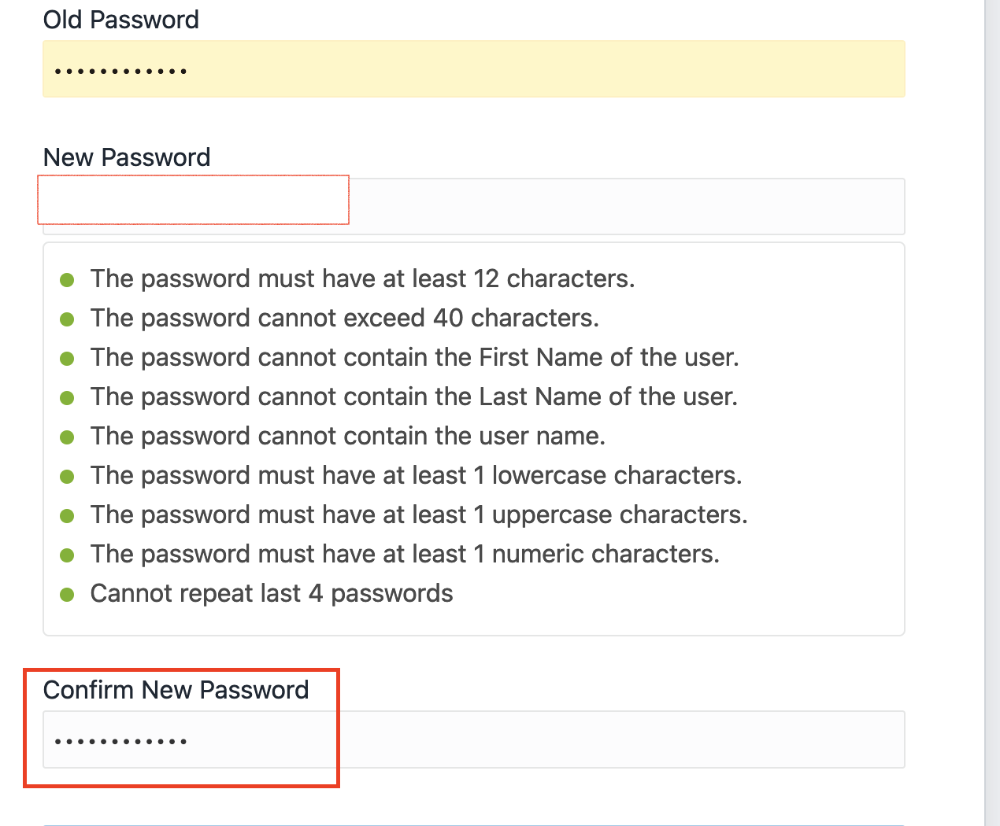

# Creating a non-CDB database in ExaCS.

## Introduction

This lab demonstrates how to create a non-cdb database in Exadata Cloud Service using dbaascli utility.

Estimated Time:  1 hour

### Objectives
In this lab, you will learn to:
* Create a non-cdb database in ExaCS using dbaacli utility.

### Prerequisites

This lab assumes you have:
- A Free or LiveLabs Oracle Cloud account.
- IAM policies to create resources in the compartment.
- Network setup for Exadata Cloud Infrastructure.
- Exadata Cloud Infrastructure Deployment.

##  Task 1: Create a non-CDB database in ExaCS using dbaascli utility.

1. Open the navigation menu, click **Marketplace**, and then click **All Applications**.

  

## Learn More
- You can find more information about Launching a Windows Instance [here](https://docs.oracle.com/en-us/iaas/Content/GSG/Tasks/launchinginstanceWindows.htm)

## Acknowledgements
* **Author** - Leona Dsouza, Senior Cloud Engineer, NA Cloud Engineering
* **Contributors** -  Ramesh Babu Donti, Principal Cloud Architect, NA Cloud Engineering
* **Last Updated By/Date** - Leona Dsouza, Senior Cloud Engineer, NA Cloud Engineering, July 2022
