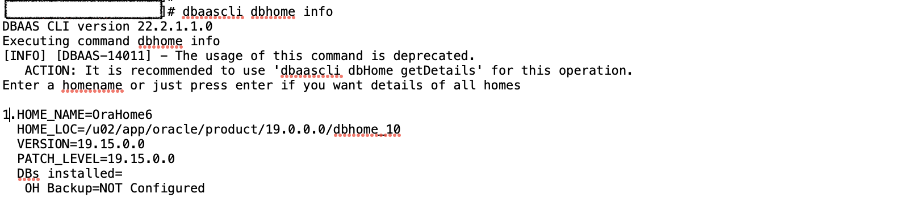
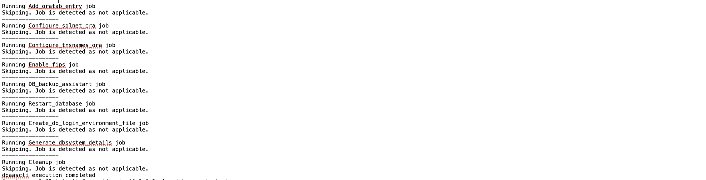
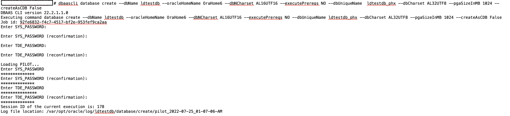
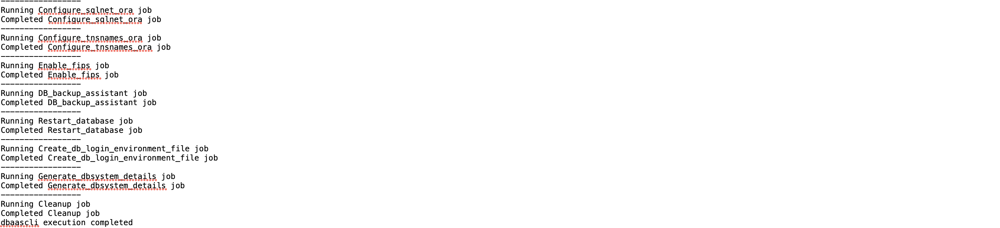
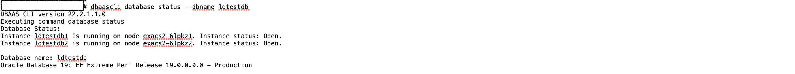

# Creating a non-container database in ExaCS using the dbaascli utility.

## Introduction

This lab demonstrates creating a non-container database in Exadata Cloud Service using the dbaascli utility.

You can use the dbaascli utility to perform various database lifecycle and administration operations on Exadata Cloud Infrastructure. Such as creating a database, deleting a database, changing the password of a database user, starting a database, managing pluggable databases (PDBs), and more. 

To use the utility, you must be connected to an Exadata Cloud Infrastructure virtual machine. You need root access to dbaascli to run all administration commands. 

You can use the dbaascli database create command to:

  * Create a Container Database (CDB) or Non-Container Database
  * Create a CDB with pluggable databases (PDBs)
  * Create an Oracle Database with the specified Character Set
  * Create Oracle Databases on a subset of cluster nodes
  * Create Oracle Database version 12.1.0.2 or higher with the release update JAN 2021 or higher. It is recommended to use the OCI Console-based API for databases with lower versions.

Estimated Time:  30 min

### Objectives
In this lab, you will learn to:
* Create a non-container database in ExaCS using the dbaascli utility.

### Prerequisites

This lab assumes you have:
- A Free or LiveLabs Oracle Cloud account.
- IAM policies to create resources in the compartment.
- Network setup for Exadata Cloud Infrastructure.
- Exadata Cloud Infrastructure Deployment with root access to the ExaCS VM

##  Task 1: Create a non-container database in ExaCS using the dbaascli utility.

1. Connect to the virtual machine as the **opc** user. 

2. Start a root user command shell.

        <copy>sudo -s

3. Run the below command to view the information about Oracle Home directory locations. 

        <copy>dbaascli dbhome info

  

4. Use the below command to run the prerequisites checks for database creation. Use the **--executePrereqs** command option. This option will perform only the prerequisite checks without the actual Oracle Database creation. 

        <copy>dbaascli database create --dbName database name --oracleHomeName Home Name --executePrereqs yes

    **Ex:**

        <copy>dbaascli database create --dbName testld --oracleHomeName OraHome6 --executePrereqs yes

  

  

5. To create a non-CDB, run the following command.

        <copy>dbaascli database create --dbName database name --oracleHomeName Home Name --dbNCharset Character set name --executePrereqs NO --dbUniqueName database unique name --dbCharset Character set name --pgaSizeInMB size in MB --createAsCDB False

    **Ex:**
    
        <copy>dbaascli database create --dbName ldtestdb --oracleHomeName OraHome5 --dbNCharset AL16UTF16 --executePrereqs NO --dbUniqueName ldtest_phx --dbCharset AL32UTF8 --pgaSizeInMB 1024 --createAsCDB False

  

  

6. You can check the database status using the below command.

        <copy>dbaascli database status --dbname database name

    **Ex:**

        <copy>dbaascli database status --dbname ldtestdb

  

## Learn More
- You can find more information about using the dbaascli utility [here](https://docs.oracle.com/en-us/iaas/exadatacloud/exacs/ecs-using-dbaascli.html)

## Acknowledgements
* **Author** - Leona Dsouza, Senior Cloud Engineer, NA Cloud Engineering
* **Contributors** -  Ramesh Babu Donti, Principal Cloud Architect, NA Cloud Engineering
* **Last Updated By/Date** - Leona Dsouza, Senior Cloud Engineer, NA Cloud Engineering, July 2022
