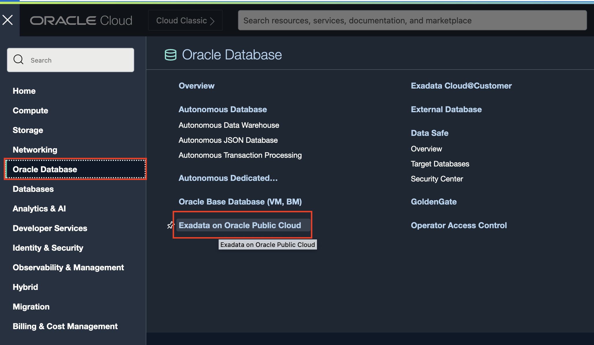
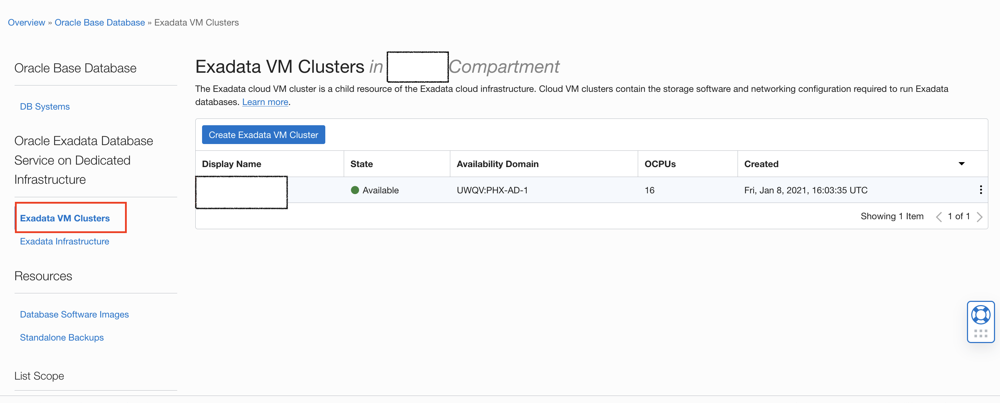
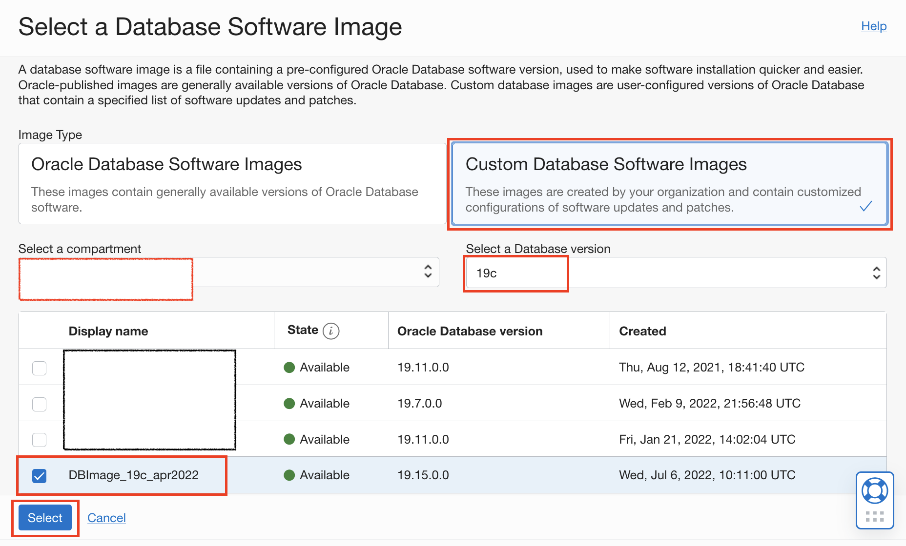

# Creating a DB Home in ExaCS using custom DB Software Image through OCI Console.

## Introduction

This lab walks you through the steps to create a Database Home in ExaCS using a custom Database Software Image.

Estimated Time:  30 min

### Objectives
In this lab, you will learn to :
* Create DB Home in ExaCS using custom Database Software Image in OCI Console.

### Prerequisites  

This lab assumes you have:
- A Free or LiveLabs Oracle Cloud account.
- IAM policies to create resources in the compartment.
- Network setup for Exadata Cloud Infrastructure.
- Exadata Cloud Infrastructure Deployment.

## Task 1: Create DB Home using a custom Database Software Image.

1. Open the navigation menu in the OCI Console. Click **Oracle Database**, then click **Exadata on Oracle Public Cloud**.

  

2. Choose your **Compartment**.

  

3. Navigate to the cloud VM cluster or DB system you want to create the new Database Home on:

    * Under **Oracle Exadata Database Service on Dedicated Infrastructure**, click on **Exadata VM Clusters**. 

    * In the list of VM clusters, find the VM cluster you want to access and click its **Display Name** to view the details page for the cluster.

   

4. Under Resources, 

    * Click on **Database Homes**.
    A list of Database Homes is displayed.
    
    * Click on **Create Database Home**.

    

5. In the Create Database Home dialog, enter the following:

    * Provide the **Database Home display name**. Avoid entering confidential information.
    
    * **Database image** determines what Oracle Database Version is used for the database. By default, the latest Oracle-published Database Software Image is selected.
    
    * Click **Change Database Image** to use an older Oracle-published image or a custom database software image that you have created in advance.

   
  
6. For Image Type, select **Custom Database Software Images**.
    
    * Select **compartment** and **Database version** of your custom DB software image. These selectors limit the list of custom database software images to a specific compartment or Oracle Database software major release version.
   

    * After **choosing** the software image, click **Select** to return to the Create Database dialog.

   

   > Note: The Custom Database Software Image must be based on the Oracle Database Release Version that is currently supported by Oracle Cloud Infrastructure and also supported by the hardware model on which you are creating the Database Home.

7. Click **Create**.

   

8. The status of the Database Home creation shows as **Provisioning**. 

   

9. When the Database Home creation is complete, the status changes from    **Provisioning** to **Available**.

   

You may now **proceed to the next lab**.

## Learn More
- You can find more information about Creating Oracle Database Homes on an Exadata Cloud Infrastructure System [here](https://docs.oracle.com/en-us/iaas/exadatacloud/exacs/creating-database-homes-exacc.html)

## Acknowledgements
* **Author** - Leona Dsouza, Senior Cloud Engineer, NA Cloud Engineering
* **Contributors** -  Ramesh Babu Donti, Principal Cloud Architect, NA Cloud Engineering
* **Last Updated By/Date** - Leona Dsouza, Senior Cloud Engineer, NA Cloud Engineering, July 2022
