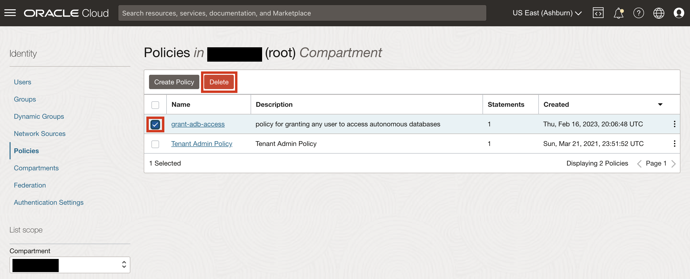
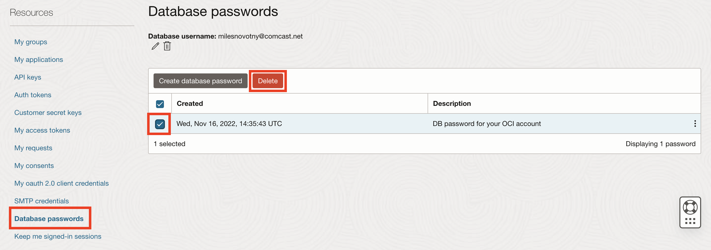

# Cleanup lab environment (optional)

## Introduction

This lab will walk you through the steps to delete all objects that are created throughout the
previous 3 labs

*Estimated Lab Time*: 10 minutes

### Objectives
- Delete the adb_wallet directory
- Delete the lltest ADB
- Delete all policies and Groups

### Prerequisites
This lab assumes that you have completed the previous labs and created all resources associated with them.

## Task 1: Delete all resources

1. With the cloud shell still open, navigate to the home directory if you are still in the **adb_wallet** directory.

    ```
    <copy>cd ..</copy>
    ```

2. Delete the **adb_wallet** directory and its contents with the following command.

    ```
    <copy>rm -r adb_wallet/</copy>
    ```

3. Next, delete the ADB **lltest**.

    ```
    <copy>oci db autonomous-database delete --autonomous-database-id $ADB_OCID</copy>
    ```

4. Remove your user from the **ALL\_DB\_USERS** and **DB_ADMIN** groups so that they can be deleted.

    ```
    <copy>oci iam group remove-user --user-id $OCI_CS_USER_OCID --group-id $ALL_DB_USERS_OCID</copy>
    ```

    ```
    <copy>oci iam group remove-user --user-id $OCI_CS_USER_OCID --group-id $DB_ADMIN_OCID</copy>
    ```


5. Delete the **ALL\_DB\_USERS** and **DB_ADMIN** groups.

    ```
    <copy>oci iam group delete --group-id $ALL_DB_USERS_OCID</copy>
    ```

    ```
    <copy>oci iam group delete --group-id $DB_ADMIN_OCID</copy>
    ```

5. You may now close your cloud shell session, as you will use the OCI Console to delete the final resources. Click on the hamburger icon in the top left corner. Choose **Identity and Security** then **Policies**.

    

6. Ensure that you are in your root compartment, and you should see the policiy called **grant-adb-access**. Check the box next to its name then click **Delete**.

    

7. Next you will click on the **Profile** icon in the top right corner and choose **My profile**.

    

8. Scroll down to the bottom of the page, choose **Database passwords**. Find the database password that you created in this lab, identified by the description "DB password for your OCI account". Check the box next to it and choose **Delete**.

    

## Appendix: Delete federated IAM user

1. This step is only necessary if you followed the steps in the Lab 1 appendix to create a federated IAM user. Log out of OCI with the federated user. Log back in with your original user and delete the federated user with the following command.

    ```
    <copy>oci iam user delete --user-id [Federated user OCID]</copy>
    ```

Your OCI tenancy should now be cleared of all lab resources.

## Acknowledgements
* **Author**
  * Richard Evans, Database Security Product Management
  * Miles Novotny, Solution Engineer, North America Specialist Hub
  * Noah Galloso, Solution Engineer, North America Specialist Hub
* **Last Updated By/Date** - Miles Novotny, April 2023
