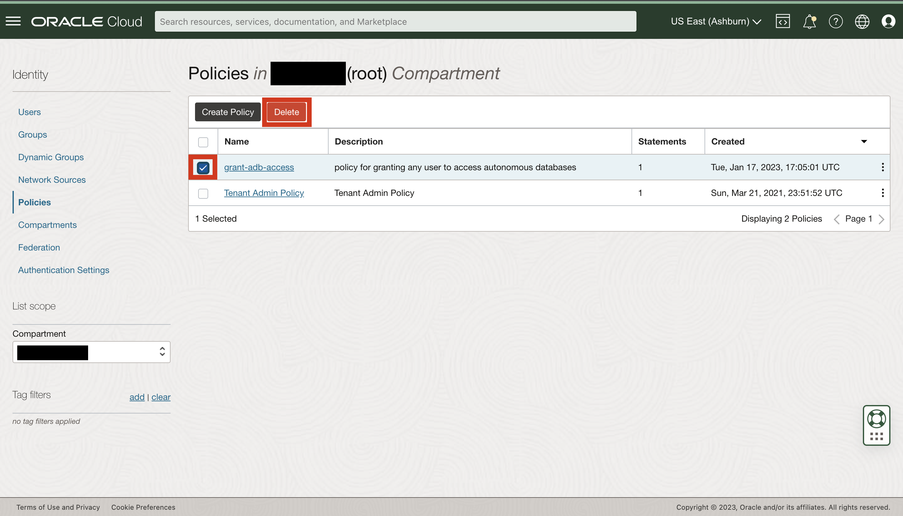

# Cleanup Lab Environment (Optional)

## Introduction

This lab will walk you through the steps to delete all objects that are created throughout the
previous 3 labs

*Estimated Lab Time*: 10 minutes

### Objectives
- Delete the adb_wallet directory
- Delete the lltest ADB
- Delete all policies and Groups

### Prerequisites
This lab assumes you have:
- Completed the previous 3 labs


## Task 1: Delete all resources

1. With the cloud shell still open, navigate to the home directory if you are still in the **adb_wallet** directory.

    ```
    cd ..
    ```

2. Delete the **adb_wallet** directory and its contents with the following command.

    ```
    rm -r adb_wallet/
    ```

3. Next, delete the ADB **lltest**.

    ```
    oci db autonomous-database delete --autonomous-database-id $ADB_OCID
    ```

4. Delete the **ALL\_DB\_USERS** and **DB_ADMIN** groups.

    ```
    oci iam group delete --group-id $ALL_DB_USERS_OCID
    ```

    ```
    oci iam group delete --group-id $DB_ADMIN_OCID
    ```

5. You may now close your cloud shell session, as you will use the OCI Console to delete the final resource. Click on the hamburger icon in the top left corner. Choose **Identity and Security** then **Policies**.

    

    

6. Ensure that you are in your root compartment, and you should see the policiy called **grant-adb-access**. Click the box next to its name then click delete.

    

## Acknowledgements
* **Author**
  * Miles Novotny, Solution Engineer, North America Specalist Hub
  * Noah Galloso, Solution Engineer, North America Specalist Hub
* **Contributors** - Richard Events, Database Security Product Management
* **Last Updated By/Date** - Miles Novotny, December 2022
