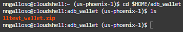
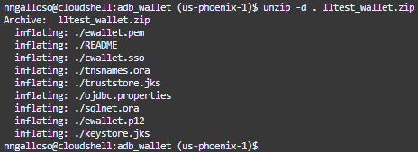

# Generate ADB Wallet and Set IAM as Identity Provider

## Introduction

In this lab you will generate a wallet file for your ADB. This wallet file can be used to connect to the database. Using it you will then connect to the database and enable IAM as its identity provider. You will also create database users and grant them permissions.

*Estimated Lab Time*: 20 minutes

### Objectives
- Generate a wallet file for your ADB
- Configure your ADB to use IAM as its identity provider with the help of the wallet file
- Create database users and grant them permissions
- unzip wallet (more detial here)

### Prerequisites
This lab assumes you have:
- Completed Lab 1: Create ADB and set up Environment

## Task 1: Generate Wallet in adb_wallet folder

1. Create adb_wallet directory.

    ```
    mkdir $HOME/adb_wallet
    ```

    ```
    ls -al $HOME/adb_wallet
    ```

2. Generate the wallet file in the adb_wallet directory. You should see a message that says a file was donwloaded to 100%.

    ```
    oci db autonomous-database generate-wallet --autonomous-database-id $ADB_OCID --password Oracle123+ --file $HOME/adb_wallet/lltest_wallet.zip
    ```

3. Navigate to the adb_wallet directory. If you use the command "ls" you should see a zip file.

    ```
    cd $HOME/adb_wallet
    ```
    

## Task 2: Enable OCI IAM as the identity provider

1. Connect to the database using the wallet file.

    ```
    sql /nolog <<EOF
    set cloudconfig $HOME/adb_wallet/lltest_wallet.zip
    conn admin/Oracle123+Oracle123+@lltest_high
    ```

2. Query to select the identity provider, and see that it is NONE by default.

    ```
    select name, value from v\$parameter where name ='identity_provider_type';
    ```

3. Now enable IAM as the identity provider. Query the idenity provider again to see it updated.

    ```
    exec dbms_cloud_admin.enable_external_authentication('OCI_IAM');

    select name, value from v\$parameter where name ='identity_provider_type';
    ```

4. Create the **user_shared** user and grant it permissions to create sessions. Create the **sr_dba_role** role and grant it permissions.

    ```
    create user user_shared identified globally as 'IAM_GROUP_NAME=All_DB_Users';
    grant create session to user_shared;
    create role sr_dba_role identified globally as 'IAM_GROUP_NAME=DB_Admin';
    grant pdb_dba to sr_dba_role;
    EOF
    ```

5. unzip your ADB wallet file.

    ```
    unzip -d . lltest_wallet.zip
    ```
    

6. Modify wallet files (need to ask Alan exactly what happens here)

    ```
    export TNS_ADMIN=$HOME/adb_wallet

    mv tnsnames.ora tnsnames.ora.orig
    mv sqlnet.ora sqlnet.ora.orig

    echo "WALLET_LOCATION = (SOURCE = (METHOD = file) (METHOD_DATA = (DIRECTORY="/home/`whoami`/adb_wallet")))
    SSL_SERVER_DN_MATCH=yes" >> sqlnet.ora

    cat sqlnet.ora

    head -1 tnsnames.ora.orig | sed -e 's/)))/)(TOKEN_AUTH=OCI_TOKEN)))/' > tnsnames.ora

    cat tnsnames.ora
    ```
