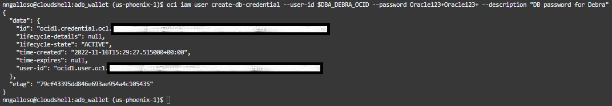

# Creat3 IAM Credentials and Log into the Database

## Introduction

*Estimated Lab Time*: 30 minutes (TEMP)

### Objectives
- Create IAM credentials for users of your ADB
- Use IAM credentials to log into and query the database
- Use a IAM Token to connect to and query the database

### Prerequisites
This lab assumes you have:
- Completed Lab 1 & Lab 2

1. Create IAM credentials for user Debra.

    ```
    oci iam user create-db-credential --user-id $DBA_DEBRA_OCID --password Oracle123+Oracle123+ --description "DB password for Debra"
    ```
    

2. Connect to database with IAM credentials as Debra. (Note: origionally was "sqlplus /nolog <<EOF", but that was not working for some reason)

    ```
    sql /nolog <<EOF

    connect dba_debra/Oracle123+Oracle123+@lltest_high

    select * from session_roles order by 1;
    select sys_context('USERENV','CURRENT_USER') from dual;
    select sys_context('USERENV','AUTHENTICATED_IDENTITY') from dual;
    select sys_context('USERENV','ENTERPRISE_IDENTITY') from dual;
    select sys_context('USERENV','AUTHENTICATION_METHOD') from dual;
    select sys_context('USERENV','IDENTIFICATION_TYPE') from dual;
    select sys_context('USERENV','network_protocol') from dual;
    EOF
    ```

3. Create IAM credentials for your OCI user

    ```
    oci iam user create-db-credential --user-id $OCI_CS_USER_OCID --password Oracle123+Oracle123+ --description "DB password for your OCI account"
    ```

4. Connect to database with IAM credentials as your OCI user. (needs adjustment)

    ```
    sql /nolog <<EOF
    connect ocid1.user.oc1..aaaaaaaaplljk7dt2it6l5jzojrlyufz7elkvajksann4bm2tgu6xkgfho7a/Oracle123+Oracle123+@lltest_high
    select * from session_roles order by 1;
    select sys_context('USERENV','CURRENT_USER') from dual;
    select sys_context('USERENV','AUTHENTICATED_IDENTITY') from dual;
    select sys_context('USERENV','ENTERPRISE_IDENTITY') from dual;
    select sys_context('USERENV','AUTHENTICATION_METHOD') from dual;
    select sys_context('USERENV','IDENTIFICATION_TYPE') from dual;
    select sys_context('USERENV','network_protocol') from dual;
    EOF
    ```

5. Finally, try connecting to the database with a token.  (need better explanation here)

    ```
    oci iam db-token get

    sql /@lltest_high <<EOF
    select * from session_roles order by 1;
    select sys_context('USERENV','CURRENT_USER') from dual;
    select sys_context('USERENV','AUTHENTICATED_IDENTITY') from dual;
    select sys_context('USERENV','ENTERPRISE_IDENTITY') from dual;
    select sys_context('USERENV','AUTHENTICATION_METHOD') from dual;
    select sys_context('USERENV','IDENTIFICATION_TYPE') from dual;
    select sys_context('USERENV','network_protocol') from dual;
    EOF
    ```
