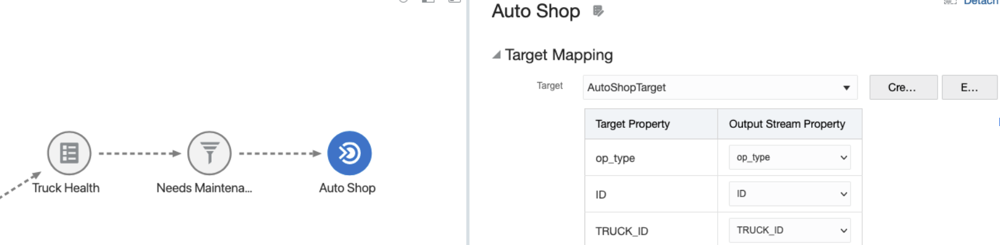
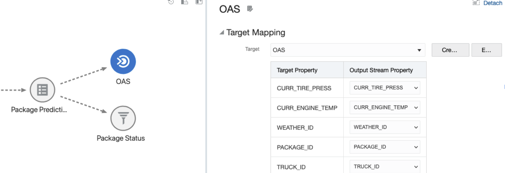
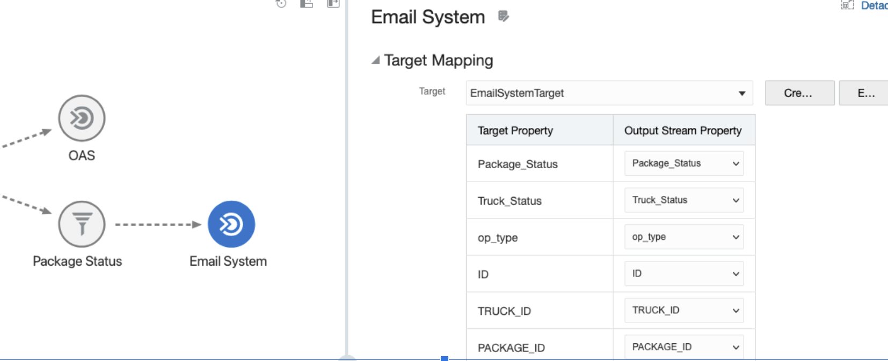

# Streaming Truck Data

## Introduction
In this scenario a company wants to manage their trucks which are completing deliveries around the US.  The trucks are each equipped with various sensors that send live data to a central server alerting about any malfunctions such as engine temperature or tire pressure variations.  The input data in this use case comes from a file simulating a live data stream that includes information such as Truck ID, Engine Temperature and Tire Pressure.

The company would like to enrich the data using database tables that contain information such as weather details, geographic location, specific truck details, and product information. They would then like to run analytics to alert them about truck health and delivery estimates so that they can act and send the appropriate responses.

*Estimated Lab Time*: 30 minutes

### About Product/Technology
Golden Gate Stream Analytics (GGSA) is a tool designed to consume a stream of data from any source such as a database, GoldenGate, Kafka, JMS, REST or even a file system file.  Once the data is in GGSA you can run analytics on live data in real-time using transformation and action functionality of Spark and send the data downstream to any target of your choice.

### Objectives
- Understand the Truck Stream scenario
- Create an extensive Pipeline
- Apply a Machine Learning model to streaming data
- Define targets for the streaming data

### Prerequisites
This lab assumes you have:
- A Free Tier, Paid or LiveLabs Oracle Cloud account
- You have completed:
    - Lab: Prepare Setup (*Free-tier* and *Paid Tenants* only)
    - Lab: Environment Setup
    - Lab: Initialize Environment

## Task 1: Create the Truck Health Path

1. Right click the LogisticsStream stage on the pipeline and add a new query stage called "TruckEnrichment"

    

2. Add a rule stage which determines whether or not to set the truck status to “Needs Maintenance”

    

3. Add a new filter stage in order to proceed with only trucks who’s status = “Needs Maintenance”

    

4. This path has focused on truck health. Here we add a new target stage and send the trucks which need maintenance to a Kafka topic. Our auto shop team will monitor this in order to perform maintenance on the trucks as needed.

    

## Task 2: Create Weather ML Path

1. Create a filter stage to the truck enrichment stage which adds weather data to our stream from the static weatherEnrichmentData database table

NOTE:  your pipeline will have the truck health stage coming off of truck enrichment already

  

2. This next stage in our pipeline utilizes a machine learning model to predict if
a package is going to be on time, early, or late based on the current weather. The machine learning model scoring column is the accuracy percentage of
the model. This percentage will then be used in later steps.

OML Server URL: https://adb.us-phoenix-1.oraclecloud.com
Tenant:ocid1.tenancy.oc1..aaaaaaaagctxgby6z2mf5ku3ulentxsuxepzzsqndvtdlarpju72du4shkva
OML Services Name: DPIADW
Username: DMINTEGRATION
Password: GGSAdm_1234#
OML Model: SVML_for_delivery

 

3. Create a filter stage to which combines the machine learning fields with the previous truck enrichment fields. We will then use the scoring field from machine learning in our next step.

 

4. Based on weather, packages have received a score. Create a rule stage that determines the package status based on this score.

 

5. Filter packages based on status. This will be used in our email target stage soon.

 

6. Add a new target mapping stage. Here, we are taking all those changes, including our machine learning prediction and truck status and send that to an Oracle database where we have a connection with Oracle analytics server to further data visualizations, data enhancements, and reporting.

 

7. Add a new target mapping stage. This will help us to create a kafka topic which incorporates an automated email system allowing users to stay up to date on their delivery information

 

8. At this point, you pipeline should look similar to this:

  

9. Clik on *Done* to exit the pipeline.

You may now [proceed to the next lab](#next).

## Learn More
* [GoldenGate Stream Analytics](https://www.oracle.com/middleware/technologies)

## Rate this Workshop
When you are finished don't forget to rate this workshop!  We rely on this feedback to help us improve and refine our LiveLabs catalog.  Follow the steps to submit your rating.

1.  Go back to your **workshop homepage** in LiveLabs by searching for your workshop and clicking the Launch button.
2.  Click on any of the **Brown Buttons** to re-access the workshop  

    

3.  Click **Rate this workshop**

    

If you selected the **Green Button** for this workshop and still have an active reservation, you can also rate by going to My Reservations -> Launch Workshop.

## Learn More

* [GoldenGate Microservices](https://docs.oracle.com/en/middleware/goldengate/core/19.1/understanding/getting-started-oracle-goldengate.html#GUID-F317FD3B-5078-47BA-A4EC-8A138C36BD59)

## Acknowledgements
* **Author**- Matt W, Andrew Selius, Solution Engineer, NA Cloud and Technology, August 2022
* **Contributors** - X
- **Last Updated By/Date** - Brian Elliott, Data Integration, August 2022

