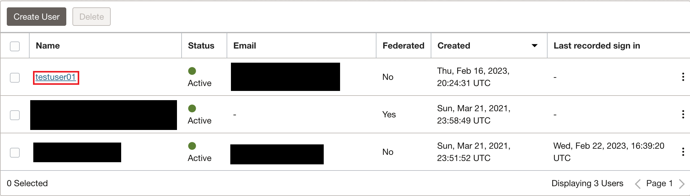
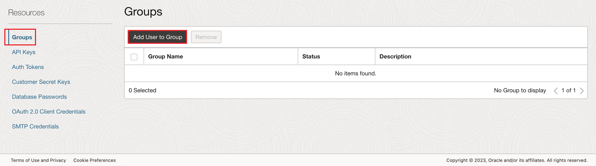
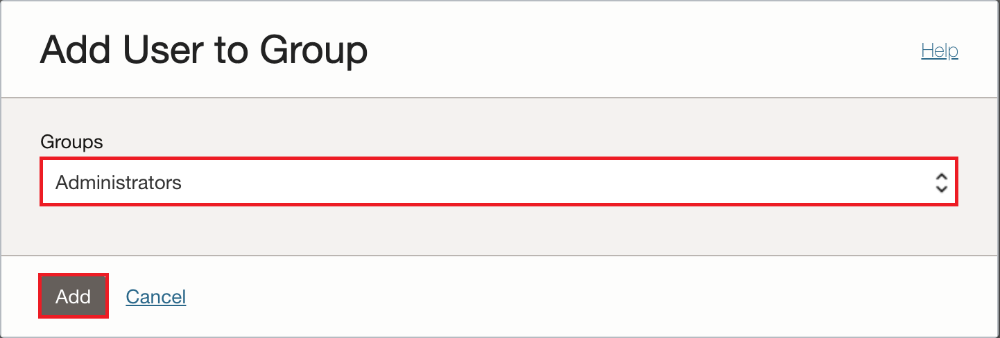

# Create Autonomous Database and set up environment

## Introduction

Most tasks will be completed using Oracle Cloud Infrastructure (OCI) Cloud Shell. OCI Cloud Shell is a browser-based terminal accessible from the Oracle Cloud Console. As a Linux shell, pre-configured with the OCI CLI, Cloud shell allows you to quickly and easily perform operations such as provisioning resources and connecting to database services. We will use the cloud shell throughout this workshop, and in this lab will use it to provision items such as an Autonomus Database, users, groups, and policies.

*Estimated Time*: 15 minutes

### Objectives
- Provision an Autonomous Database (ADB)
- Create Groups and Policies to be used later
- Add your OCI user to greated groups

### Prerequisites
This lab assumes that you have completed the introduction lab.

>**Note:** If you have a slightly older tenancy with the option to sign in with Single Sign-On or Direct Sign-In, sign in with Direct Sign-In as you will not have the needed permissions with Single Sign-On. You can see which way your signed in by looking at the account that is signed into the tenancy. If it starts with "oracleidentitycloudservice" than you are using Single Sign-On and need to switch over. If you are not able to sign in using Direct Sign-In, you must create a non-federated user in IAM to use for this lab. You can look to the Appendix of this lab to see how to do so.


## Task 1: Provision the Autonomous Database
>**Note:** It is advised that you do not perform this lab in a production tenancy due to policies created in this lab that give all users access to all ADBs in the tenancy.

1. Beginning at your Oracle Cloud Infrastructure home page, access the Cloud Shell
by clicking on the **Developer tools** icon in the top right corner and choose **Cloud Shell**. You will use the Cloud Shell
throughout this workshop.

    

2. Using the Cloud Shell, identify the root compartment ID and save it as a Bash variable named ROOT\_COMP\_ID.
    >**Note:** If at any point in this workshop you exit out of the Cloud Shell, you may need to reexecute
    this step and any others that use the "export" command. The environment variables created with "export" that are used in future steps are deleted when the Cloud Shell session ends.  

    ```
    <copy>export ROOT_COMP_ID=`oci iam compartment list --include-root --raw-output --query "data[?contains(\"id\",'tenancy')].id | [0]"`</copy>
    ```

3. Create the name for your ADB

    ```
    <copy>export DB_NAME=lltest</copy>
    ```

4. Create the password for your ADB

    ```
    <copy>export ADMIN_PWD=Oracle123+Oracle123+</copy>
    ```

5. Identify and save your OCI user name as a Bash variable to be used in future commands.

    ```
    <copy>export OCI_USER_NAME=`oci iam user list --raw-output --query "data[?contains(\"id\",'"${OCI_CS_USER_OCID}"')].name| [0]"`
    echo $OCI_USER_NAME</copy>
    ```

6. Create the ADB with the name and password defined in previous steps.

    ```
    <copy>oci db autonomous-database create --compartment-id $ROOT_COMP_ID --db-name ${DB_NAME} --display-name ${DB_NAME} --is-free-tier true  --admin-password $ADMIN_PWD --cpu-core-count 1 --data-storage-size-in-tbs 1</copy>
    ```

7. Create a policy to allow any user in the tenancy to access the ADB.

    ```
    <copy>oci iam policy create  --name grant-adb-access --compartment-id $ROOT_COMP_ID  --statements '[ "allow any-user to use autonomous-database-family in tenancy"]' --description 'policy for granting any user to access autonomous databases'</copy>
    ```

## Task 2: Create and assign groups

1. Create two groups in IAM, one for all database users and one for database admins.

    ```
    <copy>oci iam group create --name ALL_DB_USERS --description "Group for all of the DB Users"</copy>
    ```
    ```
    <copy>oci iam group create --name DB_ADMIN --description "Group for DB Admins"</copy>
    ```

2. Setup and verify environment variables for ease of use in commands later.
    >**Note:** If at any point after this step you exit out of the cloud shell, these commands may need to be executed again to reset the environment variables.

    ```
    <copy>export ADB_OCID=`oci db autonomous-database list --compartment-id $ROOT_COMP_ID --raw-output --query "data[?contains(\"db-name\",'lltest')].id | [0]"`
    echo $ADB_OCID</copy>

    <copy>export DB_ADMIN_OCID=`oci iam group list --raw-output --query "data[?contains(\"name\",'DB_ADMIN')].id | [0]"`
    echo $DB_ADMIN_OCID</copy>

    <copy>export ALL_DB_USERS_OCID=`oci iam group list --raw-output --query "data[?contains(\"name\",'ALL_DB_USERS')].id | [0]"`
    echo $ALL_DB_USERS_OCID</copy>
    ```

3. Add your OCI user to the ALL\_DB\_USERS group
    >**Note:** If you run into an error here with permission, look to the note at the beginning of the lab to sign in properly with permissions.

    ```
    <copy>oci iam group add-user --user-id $OCI_CS_USER_OCID --group-id $ALL_DB_USERS_OCID</copy>
    ```

You may now **proceed to the next lab.**

## Appendix: Creating an account to use Direct Sign-On with

1. Create a New User

   a) Click the **Navigation Menu** in the upper left, navigate to **Identity & Security** and select **Users**.

	

   b) Click **Create User**.

   In the **Create User** dialog box, enter the following:

      - **Name:** Enter a unique First and Last name for the new user (for example, **testuser**).
      - **Description:** Enter a short description (for example **"This is a test user"**)
      - **Email:**  Preferably use a personal email address to which you have access (GMail, Yahoo, etc).

    Click **Create**.

      

2. Set a Temporary Password for the newly created User.

   a) From the list of users, click on the **user that you created** to display its details.

   b) Click **Create/Reset Password**.  

      

   c) In the dialog, click **Create/Reset Password**.

      

   d) The new one-time password is displayed.
      Click the **Copy** link and then click **Close**. Make sure to copy this password to your notepad.

      

3. Make the user an administrator.
    
    a) Click the **Navigation Menu** in the upper left, navigate to **Identity & Security** and select **Users**.

	

    b) Click the user you have made.

    

    c) Scroll to the bottom of the page, click **Groups**, and then click **Add User to Group**.

    

    d) Select the administrator group and click **Add**.

    

4. Sign in as the new user using a different web browser or an incognito window.

   a) Click **Sign Out** from the user menu and log out of the admin user account completely.

      

   b) Open a supported browser and go to the Console URL:  [https://cloud.oracle.com](https://cloud.oracle.com).

   c) Click on the portrait icon in the top-right section of the browser window, then click **Sign in to Oracle Cloud**.

   d) Enter the name of your cloud account (aka your tenancy name, not your user name), then click the **Next** button.

   

   e) This time, you will sign in using **Oracle Cloud Infrastructure Direct Sign-In** box with the user you created. Note that the user you created is not part of the Identity Cloud Services.

   f) Enter the password that you copied. Click **Sign In**.

      

      >**Note:** Since this is the first-time sign-in, the user will be prompted to change the temporary password, as shown in the screenshot below.

   g) Set the new password. Click **Save New Password**.
      

## Learn More

* [Identity and Access Management (IAM) Overview](https://docs.oracle.com/en-us/iaas/Content/Identity/Concepts/overview.htm)

## Acknowledgements
* **Author**
  * Richard Evans, Database Security Product Management
  * Miles Novotny, Solution Engineer, North America Specialist Hub
  * Noah Galloso, Solution Engineer, North America Specialist Hub
* **Last Updated By/Date** - Miles Novotny, December 2022
