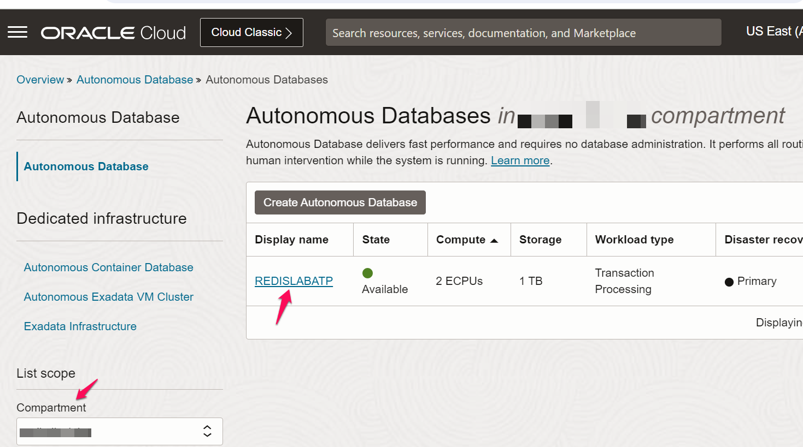
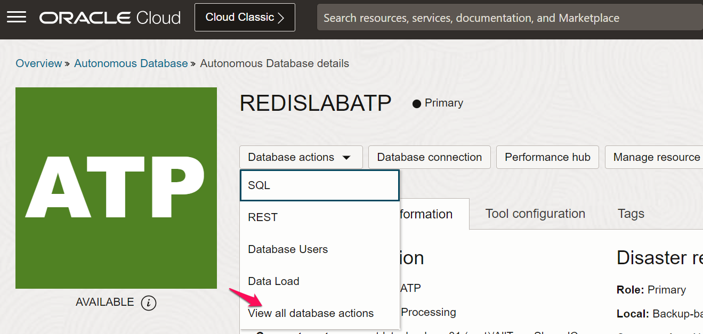
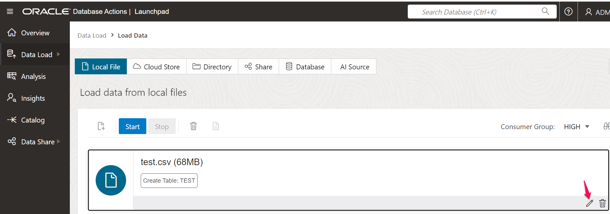

# Load Data into ATP

## Introduction

This lab walks you through the steps to Load taxi trip data into ATP database..

Estimated Time: 15 minutes

### Autonomous Transaction Processing (ATP) 
Oracle Autonomous Transaction Processing is a fully automated database service optimized to run transactional, analytical, and batch workloads concurrently. To accelerate performance, it’s pre-configured for row format, indexes, and data caching while providing scalability, availability, transparent security, and real-time operational analytics. Application developers and DBAs can rapidly, easily, and cost-effectively develop and deploy applications without sacrificing functionality or atomicity, consistency, isolation, and durability (ACID) properties. Built on Oracle Database and Oracle Exadata, Autonomous Transaction Processing is available on Oracle Cloud Infrastructure (OCI) for serverless or dedicated deployments and on-premises with Exadata Cloud@Customer and OCI Dedicated Region.

### Objectives

In this lab, you will:
* Download taxi trip data
* Upload taxi trip data into ATP

### Prerequisites 

This lab assumes you have:
* An Oracle Cloud account
* All previous labs successfully completed

## Task 1: Download taxi trip data

1. Click [here] (https://www.kaggle.com/c/nyc-taxi-trip-duration/data) and select **test.zip** file and hit download icon.

  

2. Once the data is downloaded , unzip and extract the file **test.csv**.

  
## Task 2: Upload data into ATP

1. From OCI console go to Databases > Autonomous transaction Processing. Choose your compartment and select the database **REDISLABATP** you created

  

2. Click on Database actions and select **All Database Actions** and then click on **Data Load**

  

  

3. Click on **Load Data** and select the file **test.csv** to upload

  

  

4. When file is ready to upload , click on **pencil** icon to edit the table name

  

5. Change the table name to **TAXI_TRIPS** and click on close

  

6. Click **Start** and then click **Run** .

  

7. Once load is completed, click on **Done**  ad close the window.

  

  You may now **proceed to the next lab**.

## Learn More

* [About Autonomous transaction processing](https://www.oracle.com/in/autonomous-database/autonomous-transaction-processing/)
* [About Kaggle datasets](https://www.kaggle.com/datasets)

## Acknowledgements
* **Author**
* Pavan Upadhyay, Principal Cloud Engineer, NACI 
* Saket Bihari, Principal Cloud Engineer, NACI
* **Last Updated By/Date** - Pavan Upadhyay, Saket Bihari, Feb 2024
