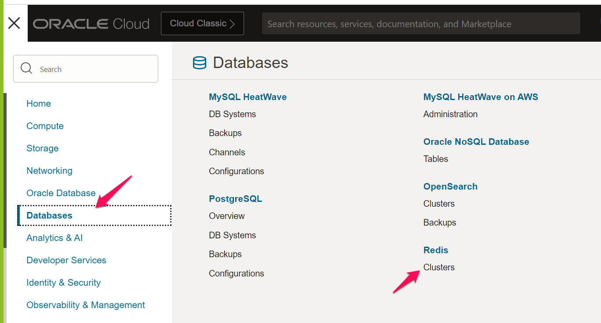
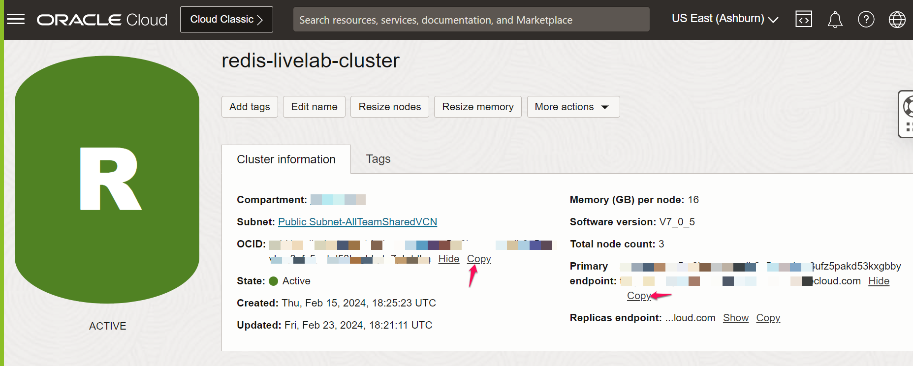
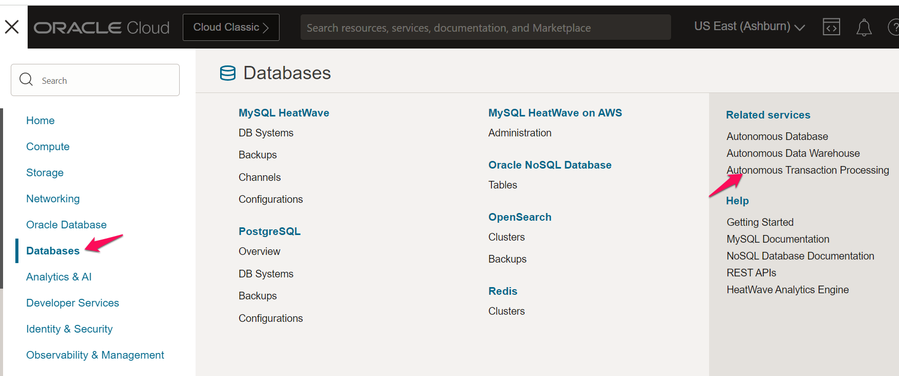
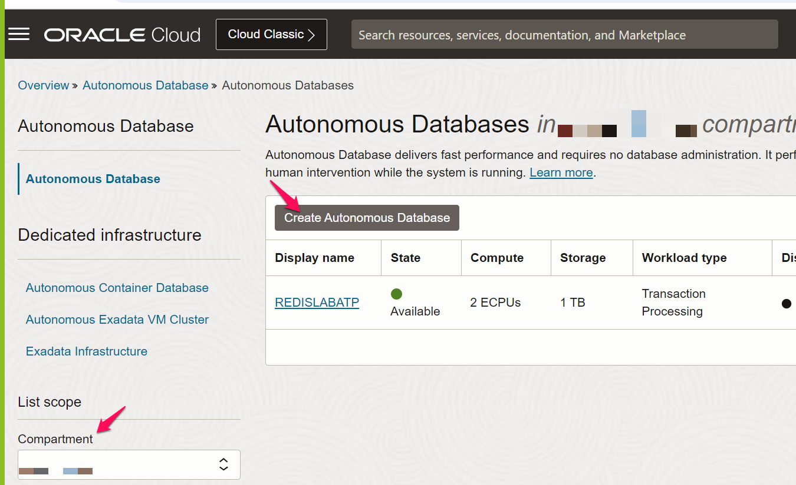
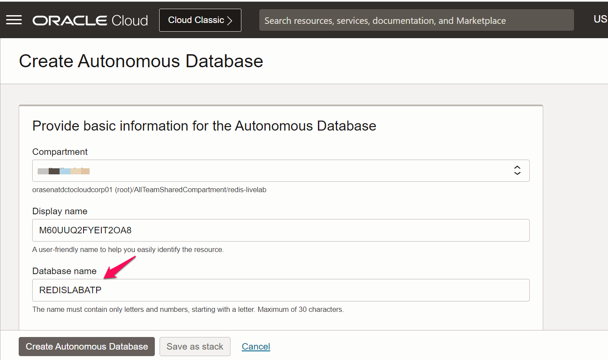
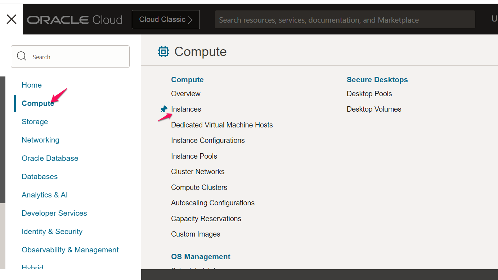
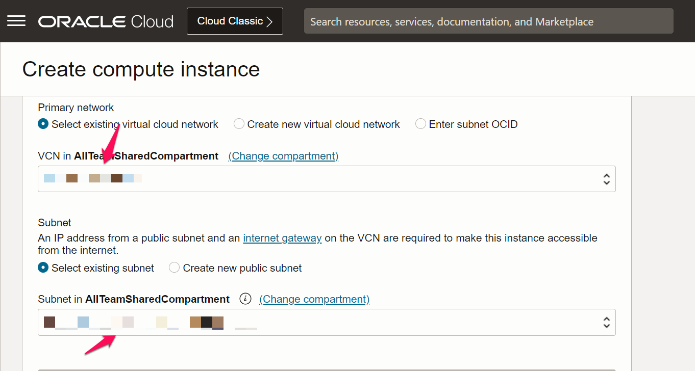

# Provision OCI services

## Introduction

This lab walks you through the steps to provision Redis, ATP and OCI VM instance.

Estimated Time: 45 minutes

### Objectives

In this lab, you will:
* Provision ATP database
* Provision Redis cluster
* Provision VM instance

### Prerequisites

This lab assumes you have:
* OCI Compartment created
* IAM policies setup done already

## Task 1: Prepare Redis Cluster

1. Log in to the Oracle Cloud Console as the Cloud Administrator, if you are not already logged in. On the Sign In page, select your tenancy, enter your username and password, and then click Sign In. The Oracle Cloud Console Home page is displayed

2. Follow below link to create VCN

  [Create OCI VCN](https://docs.oracle.com/en/learn/lab_virtual_network/index.html#introduction)

3. Click the Navigation menu and navigate to Databases > Redis > Clusters

   
  
  Choose the Compartment you created and click **Create cluster**.

4. Provide the cluster name **redis-livelab-cluster** , choose compartment  and click **Next**.
   

5. Keep the default configuration in Configure nodes tab and click **Next**.
   

6. Choose your VCN and Subnet created as part of prerequisite and click **Next**.
   

7. Review the details filled in and click **Create Cluster**.
   

8. Once cluster up and running, copy **OCID** and **Primary endpoint** and keep it ready for flask app configuration in lab-3.
   

## Task 2: Provision ATP Database

1. Click the Navigation menu and navigate to Databases > Autonomous Transaction Processing

   

2. Choose the compartment and click **Create Autonomous Database**

   

3. Give Database name as **REDISLABATP**

  

4. Choose a password and keep rest of the fields with default values and click **Create Autonomous Databse**

  

5. Once the ATP is created , click on **Database Connection**.

  

6. Click on **Download Wallet** and keep this wallet zip file for lab-3.

  

## Task 3: Provision Linux Instance

1. Click the Navigation menu and navigate to Compute > Instances 

  
 
2. Choose the compartment and click **Create Instance**. 

  

3. Give Instance name **redis-livelab-instance** , choose VCN and public subnet of that VCN , and choose 'Generate a key pair for me' option and leave rest values as default and hit 'Create'

  

  

  

   **Note:** Please save private & public key for login into instance in lab-3

  You may now **proceed to the next lab**.
  
## Learn More

* [About create Compartment](https://docs.oracle.com/en-us/iaas/Content/Identity/compartments/To_create_a_compartment.htm)
* [About creating IAM policies for Redis](https://docs.oracle.com/en-us/iaas/Content/redis/permissions.htm)
* [About creating IAM policies for ATP](https://docs.oracle.com/en-us/iaas/Content/Identity/Reference/adbpolicyreference.htm)

## Acknowledgements
* **Author** 
* Pavan Upadhyay, Principal Cloud Engineer, NACI 
* Saket Bihari, Principal Cloud Engineer, NACI
* **Last Updated By/Date** - Pavan Upadhyay, Saket Bihari, Feb 2024
