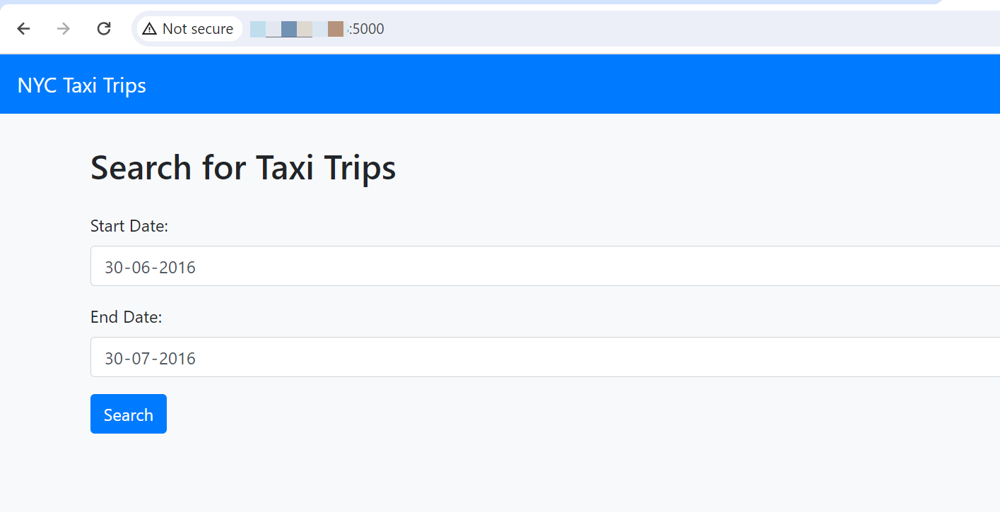

# Run application and test the performance

## Introduction

This lab walks you through the steps to run the flask app.

Estimated Lab Time: 15 minutes

### Objectives

In this lab, you will:
* Run the Flask app
* Check the log for query performance with ATP/Redis

### Prerequisites 

This lab assumes you have:
* An Oracle Cloud account
* All previous labs successfully completed


## Task 1: Run the Flask application

1. In VM go to folder **nyctaxi** and run command below.
  
  Use command below to create the above directory structure.
  ```
    <copy>python run.py</copy>
    ```
  

2. Open a browser and enter below URL

     ```
    <copy>http://&ltpublic ip of VM&gt:5000</copy>
    ```

3. Enter start and end date and click on **search**. 
    
    

4. Once the result are displayed, click on **New Search** and enter the same date range and **search** again
    
    

**Note** - New search will always get data from ADW and repeated search will get data from Redis

## Task 2: Check the performance of the query from logs

1. Go to the terminal where app is running and see the console log for print statements **Time taken to retrieve data...**. You will see the significant difference between ATP & Redis query performance
    
    

## Learn More

* [About OCI](https://www.oracle.com/in/cloud/)

## Acknowledgements
* **Author** 
* Pavan Upadhyay, Principal Cloud Engineer, NACI 
* Saket Bihari, Principal Cloud Engineer, NACI
* **Last Updated By/Date** - Pavan Upadhyay, Saket Bihari, Feb 2024
