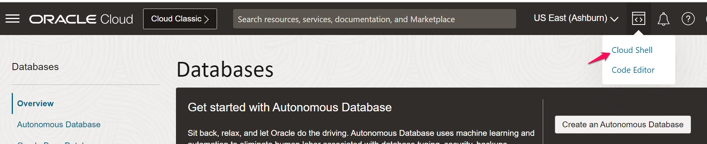

# Setup & Deploy Flask Application in VM

## Introduction

This lab walks you through the steps to setup the necessary environment for the flask application to run in the Linux VM.

Estimated Lab Time: 45 minutes

### About Flask Application
Flask is a small and lightweight Python web framework that provides useful tools and features that make creating web applications in Python easier. The flask application used in this lab will be used to query the data from ATP/Redis. When the user requests trip data between two dates, The application first checks if the requested data is in the OCI Redis Cache.If Cached, The data is retrieved from Redis and displayed immediately and If Not Cached then application queries Oracle ADW for the data and Cache the result before displaying it to user.

### Objectives

In this lab, you will:
* Install necessary softwares (Flask,redis,pandas,cx_Oracle and its basic client) in VM for flask application to run
* Deploy the application

### Prerequisites (Optional)

* An Oracle Cloud account
* All previous labs successfully completed


## Task 1: Login into VM

1. In OCI console click on the **Cloud Shell** from the top right icon 

	

2. In OCI console choose Compute > instance and goto your instance created in Lab-1 and copy the public IP 

	

3. Upload the private key file (downloaded in lab-1) using cloud shell **upload** option

  

4. Use below ssh command to login to the VM

    ```
    <copy>ssh -i &ltpath/to/ssh-key-file&gt opc@&ltpublic ip&gt</copy>
    ```

5. Once logged in successfully , elevate user to root using command below 

    ```
    <copy>sudo su</copy>
    ```

## Task 2: Install necessary software/packages in VM

1. install flask using command below

    ```
    <copy>pip3 install Flask</copy>
    ```
2. install redis using command below

    ```
    <copy>pip3 install redis</copy>
    ```
3. install pandas using command below

    ```
    <copy>pip3 install pandas</copy>
    ```
4. install cx_Oracle using command below

    ```
    <copy>pip3 install Install cx_Oracle</copy>
    ```
5. install basic client for cx_Oracle using link below.

    [Basic client installation](https://cx-oracle.readthedocs.io/en/latest/user_guide/installation.html)

   In the link above follow instructions (1~5) under **Oracle Instant Client Zip Files** section

    


## Task 3: Create folders and deploy Flask app in it

1. Create below folder structure.

   
  
  Use command below to create the above directory structure.
  ```
    <copy>mkdir -p nyctaxi/app/templates
  mkdir -p nyctaxi/app/static/css</copy>
    ```
  

2. Copy `__init__.py` code and paste under the desired directory structure above

     ```
    <copy>from flask import Flask
    from config import Config
    app = Flask(__name__)
    app.config.from_object(Config)
    from app import routes</copy>
    ```

3. Copy `routes.py` code and paste under the desired directory structure above

     ```
    <copy>from flask import render_template, request
from app import app
from .models import get_trip_data
@app.route('/', methods=['GET', 'POST'])
@app.route('/search', methods=['GET', 'POST'])
def index():
      if request.method == 'POST':
        start_date = request.form.get('start_date')
        end_date = request.form.get('end_date')
        trip_data = get_trip_data(start_date, end_date)
        return render_template('results.html',trip_data=trip_data.to_html(index=False))

    return render_template('index.html')</copy>
    ```
4. Copy `models.py` code and paste under the desired directory structure above

    ```
    <copy>import cx_Oracle
    import pandas as pd
    import redis
    import time
    from config import Config
    from datetime import datetime
    # Setup Redis connection
    try:
    # Attempt to create a connection to the Redis cluster
        redis_conn = redis.StrictRedis(host=Config.REDIS_PRIMARY_ENDPOINT,port=Config.REDIS_PORT,charset='utf-8',ssl=True,decode_responses=True)
        pong = redis_conn.ping()
        if pong:
            print("Successfully connected to the Redis cluster.")
        else:
            print("Connected to Redis, but ping failed.")
    except ConnectionError as e:
        print(f"Failed to connect to Redis cluster. Error: {e}")
    # Oracle connection
    try:
        oracle_conn = cx_Oracle.connect(Config.ORACLE_USER,
                                    Config.ORACLE_PASSWORD, Config.ORACLE_DSN,encoding="UTF-8")
        # Check the connection by executing a simple query
        cursor = oracle_conn.cursor()
        cursor.execute("SELECT 1 FROM DUAL")
        result = cursor.fetchone()
        if result:
            print("Successfully connected to Oracle Database.")
        else:
            print("Connected to Oracle Database, but query execution failed.")
    except cx_Oracle.DatabaseError as e:
        # If connection fails, print error message
        print("Connection failed:", e)

    def get_trip_data(start_date, end_date):
        # Measure time taken to retrieve data from Redis
        start_time_redis = time.time()
        cache_key = f"trips-{start_date}-{end_date}"
        cached_data = redis_conn.get(cache_key)

        if cached_data:
            print("Returning cached data!!")
            end_time_redis = time.time()
            print(f"Time taken to retrieve data from Redis: {end_time_redis - start_time_redis} seconds")
            return pd.read_json(cached_data)
        else:
            # Measure time taken to retrieve data from Oracle
            start_time_oracle = time.time()
            # Convert input dates to the expected format (YYYY-MM-DD HH:MI:SS)
            start_date = datetime.strptime(start_date, '%Y-%m-%d').strftime('%Y-%m-%d 00:00:00')
            end_date = datetime.strptime(end_date, '%Y-%m-%d').strftime('%Y-%m-%d 23:59:59')
            # Print the input dates for debugging
            print("Start Date:", start_date)
            print("End Date:", end_date)
            print("Returning data from ATP database!!")
            # Construct the query with placeholders
            query = "SELECT * FROM taxi_trips WHERE PICKUP_DATETIME BETWEEN TO_TIMESTAMP(:start_date, 'YYYY-MM-DD HH24:MI:SS') AND TO_TIMESTAMP(:end_date, 'YYYY-MM-DD HH24:MI:SS') and rownum<10"
            df = pd.read_sql(query, con=oracle_conn, params={"start_date":start_date, "end_date": end_date})
            end_time_oracle = time.time()
            print(f"Time taken to retrieve data from Oracle: {end_time_oracle - start_time_oracle} seconds")
            redis_conn.setex(cache_key, 3600, df.to_json()) # Cache for 1 hour
            # Close the cursor and connection
            cursor.close()
            oracle_conn.close()
            return df</copy>
    ```

5. Copy `base.html` code and paste under the desired directory structure above

     ```
    <copy><!-- base.html -->
<!DOCTYPE html>
<html lang="en">
<head>
    <meta charset="UTF-8">
    <meta name="viewport" content="width=device-width, initial-scale=1.0">
    <title>NYC Taxi Trips</title>
    <!-- Bootstrap CSS -->
    <link rel="stylesheet" href="https://stackpath.bootstrapcdn.com/bootstrap/
4.5.2/css/bootstrap.min.css">
    <!-- Custom CSS -->
    <link href="{{ url_for('static', filename='css/style.css') }}" rel="stylesheet">
</head>
<body>
<nav class="navbar navbar-expand-lg navbar-dark bg-primary">
    <a class="navbar-brand" href="/">NYC Taxi Trips</a>
</nav>
<div class="container mt-4">
<!--  -->
    
<!--  -->
</div>
</body>
</html></copy>
    ```
**Note:** Please remove <!--  --> and <!--  --> from above code to make html work

6. Copy `index.html` code and paste under the desired directory structure above

     ```
    <copy><!-- index.html -->
<!--  -->


<!--  -->
<h2>Search for Taxi Trips</h2>
<form action="/search" method="post" class="mt-4">
    <div class="form-group">
        <label for="start_date">Start Date:</label>
        <input type="date" class="form-control" id="start_date"
               name="start_date" required>
    </div>
    <div class="form-group">
        <label for="end_date">End Date:</label>
        <input type="date" class="form-control" id="end_date" name="end_date"
               required>
    </div>
    <button type="submit" class="btn btn-primary">Search</button>
</form>
<!--  -->

<!--  --></copy>
    ```

**Note:** Please remove <!--  --> and <!--  --> from above code to make html work

7. Copy `index.html` code and paste under the desired directory structure above

     ```
    <copy><!-- results.html -->
<!--  -->


<!--  -->
<h2>Search Results</h2>
<div class="table-responsive mt-4">
    {{ trip_data|safe }}
</div>
<a href="/" class="btn btn-secondary mt-3">New Search</a>
<!--  -->

<!--  --></copy>
    ```
**Note:** Please remove <!--  --> and <!--  --> from above code to make html work

8. Copy `style.css` code and paste under the desired directory structure above

     ```
    <copy>/* style.css */
body {
 background-color: #f8f9fa;
}
h2 {
 margin-top: 20px;
 margin-bottom: 20px;
}
.navbar {
 margin-bottom: 30px;
}
.table-responsive {
 margin-top: 20px;
}</copy>
    ```
9. Copy `config.py` code and paste under the desired directory structure above

     ```
    <copy>class Config:
    ORACLE_DSN = "&ltunzip the wallet.zip downloaded in previous lab and get the value of redislabatp_low from tnsnames.ora file&gt"
    ORACLE_USER = "ADMIN"
    ORACLE_PASSWORD = password while creating ATP>
    REDIS_OCID = 'put the redis cluster OCID here'
    REDIS_PRIMARY_ENDPOINT = 'put the redis cluster primary end point'
    REDIS_PORT = '6379'</copy>
    ```
10. Copy `run.py` code and paste under the desired directory structure above

     ```
    <copy>from app import app
if __name__ == "__main__":
    app.run(host='0.0.0.0' , debug=True)</copy>
    ```

## Task 4: Open port for application in VCN

1. In OCI console go to networking > virtual cloud networks and choose your compartment

2. Select the VCN where you launched the VM and choose security list of public subnet

3. Open port 5000 for ingress traffic. Click [here](https://docs.oracle.com/en-us/iaas/Content/Network/Concepts/creating-securitylist.htm) to know more about creating/updating security list 

## Task 5: Open port in firewall (if needed)

1. Run command below to check if port 5000 open in the firewall

    ```
    <copy>sudo firewall-cmd --list-all</copy>
    ```
2. If port 5000 is not added in the fire wall, run below command to add in it.

    ```
    <copy>sudo firewall-cmd --add-port=5000/tcp --permanent</copy>
    ```

    You may now **proceed to the next lab**.

## Learn More

* [About Flask](https://flask.palletsprojects.com/en/3.0.x/)

## Acknowledgements
* **Author** 
* Pavan Upadhyay, Principal Cloud Engineer, NACI 
* Saket Bihari, Principal Cloud Engineer, NACI
* **Last Updated By/Date** - Pavan Upadhyay, Saket Bihari, Feb 2024
