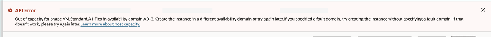

# Common Issues

## Introduction

Most Compute instance creation problems come from capacity, quota, policy, image, shape, or network constraints. This lab highlights one capacity error and points you to the Oracle Compute FAQ.

Estimated Time: 10 minutes

### Objectives

In this lab, you will:

* Recognize the no-host-capacity error.
* Choose practical next steps for a capacity error.
* Find the Oracle Compute FAQ.

## Task 1: No Host Capacity

1. Review the error message shown during instance creation.

    

2. Read the message carefully.

    A no-host-capacity error means OCI cannot place the requested shape in the selected availability domain or fault domain.

3. Try a different placement option.

    Select another availability domain or fault domain when your region provides more than one option.

4. Try a different shape.

    If your workload allows it, choose another shape or reduce flexible shape resources.

5. Retry later if you need the selected shape and placement.

    Capacity can change over time. If you need the exact shape and placement, wait and try again, or contact Oracle Support.

## Task 2: Link to FAQs

1. Open the Oracle Compute FAQ.

    [Oracle Cloud Infrastructure Compute FAQ](https://www.oracle.com/cloud/free/faq/)

2. Review the FAQ sections for instance types, shapes, operating systems, pricing, and operational behavior.

3. Use the FAQ with OCI documentation and Oracle Support when an error involves limits, capacity, permissions, or network policies.

## Acknowledgements

* **Author** - Oracle LiveLabs
* **Last Updated By/Date** - Oracle LiveLabs, July 2026
