# Creating a Compute Instance

## Introduction

The Create compute instance page collects the settings OCI needs. OCI uses them to place, secure, network, and start an instance. This lab follows the page order in the Console.

Estimated Time: 30 minutes

### Objectives

In this lab, you will:

* Enter a clear instance name.
* Choose availability and fault domain placement.
* Select an image and shape.
* Review security settings.
* Attach the instance to a VCN and subnet.
* Choose public or private IP assignment.
* Add SSH keys.
* Review boot volume storage.
* Confirm the summary and create the instance.

## Task 1: Basic Information (Instance Name)

1. On the **Create compute instance** page, locate the **Name** field.

    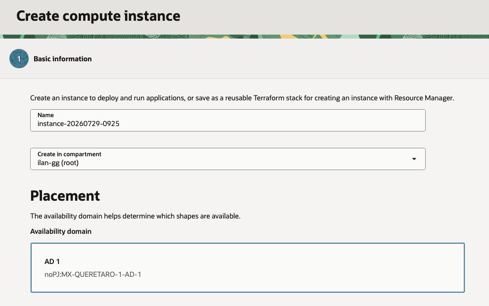

2. Enter a meaningful instance name.

    Use a name that shows the workload, environment, and purpose. For example, use `web01-dev` or `app01-test`.

3. Confirm the compartment.

    The compartment controls where OCI creates and lists the instance. If you see the wrong compartment, choose the correct one before you continue.

## Task 2: Availability and Fault Domains

1. Locate the placement section.

    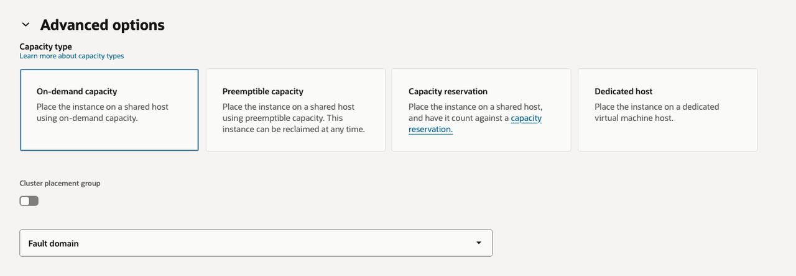

2. Select an availability domain if your region has more than one.

    An availability domain identifies the data center location where OCI places the instance.

3. Select a fault domain when you need explicit placement.

    Fault domains help distribute instances within an availability domain. For a single workshop instance, use the default value.

## Task 3: Images and Shape

1. Locate the **Image and shape** section.

    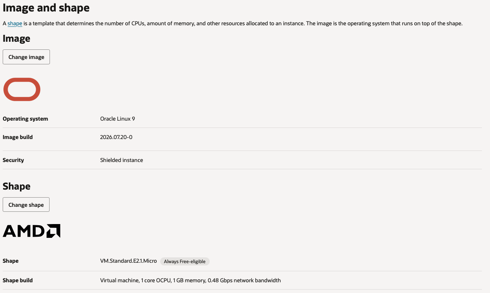

2. Select **Change image** when you need a different operating system.

    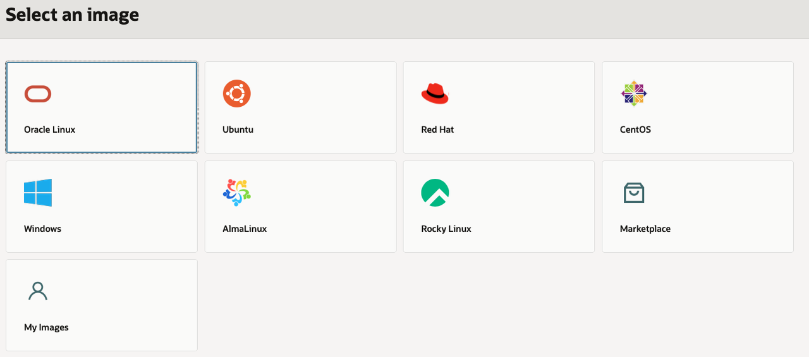

3. Review the available image list and choose the image required for your workload.

    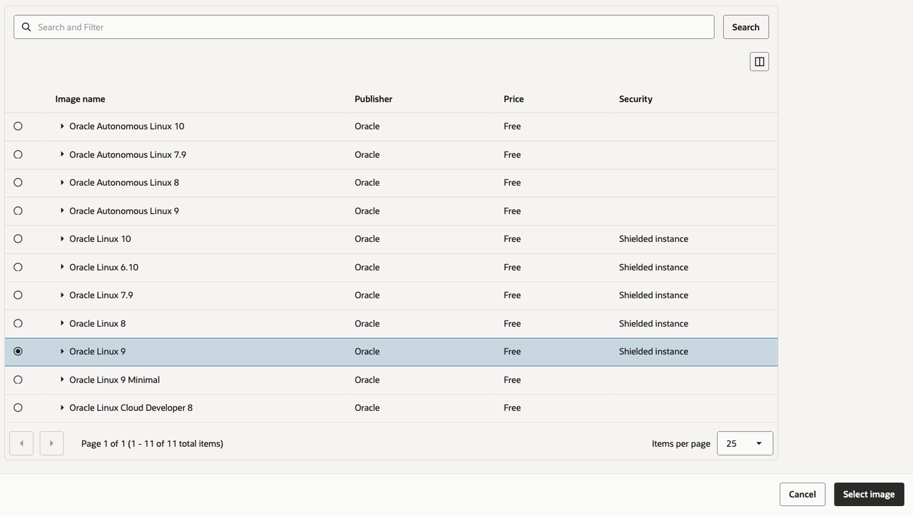

4. Select **Change shape** when you need to change the CPU, memory, or processor type.

    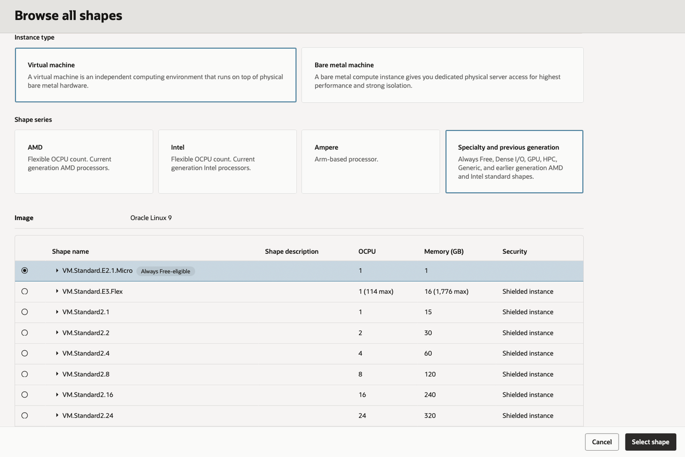

5. Review the shape information before you apply the selection.

    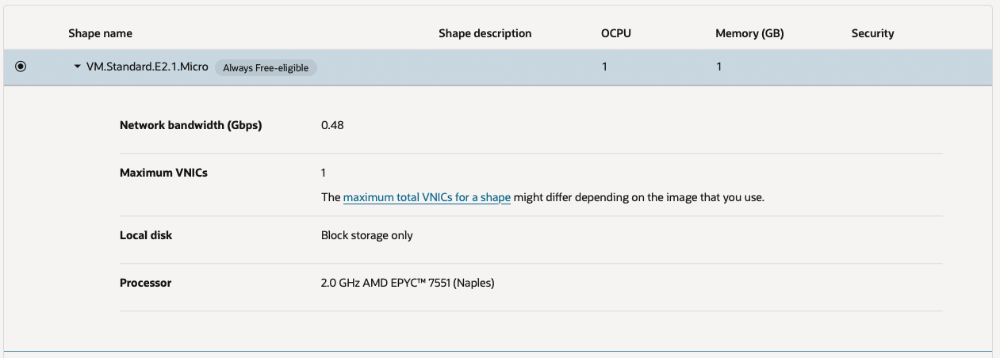

6. Personalize the shape when the selected shape supports flexible OCPU and memory values.

    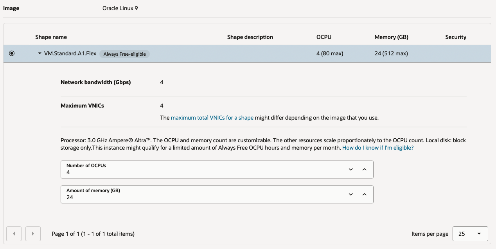

## Task 4: Security Settings

1. Locate the security settings section.

    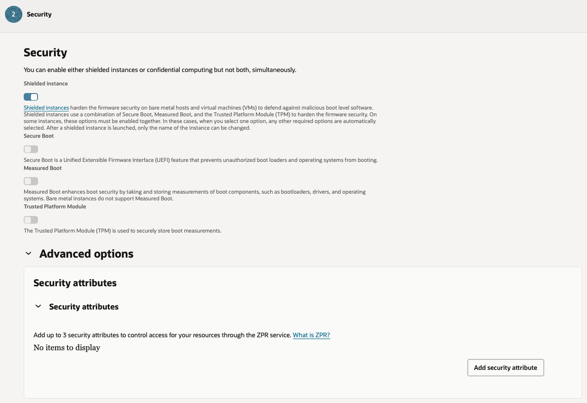

2. Review the available security options.

    Keep the defaults unless your workload needs a specific security setting. Some options affect boot behavior, firmware, or access controls.

3. Confirm that the selected settings match the operating system and workload requirements.

## Task 5: Networking, VCNs and Subnets

1. Locate the networking section.

    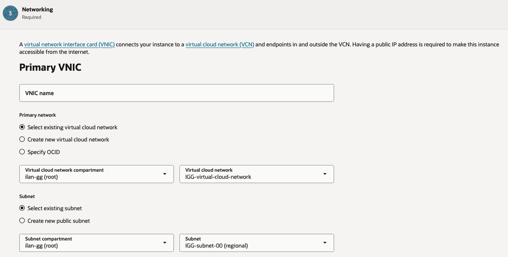

2. Select an existing virtual cloud network, or create a new VCN if the workshop environment requires one.

3. Select a subnet in the selected VCN.

    Use a public subnet when learners need direct internet access to the instance. Use a private subnet for access through a bastion, VPN, FastConnect, or another controlled path.

4. Confirm that the subnet has the required route rules, security list rules, or network security group rules.

## Task 6: IP Assigment

1. Locate the IP assignment option.

    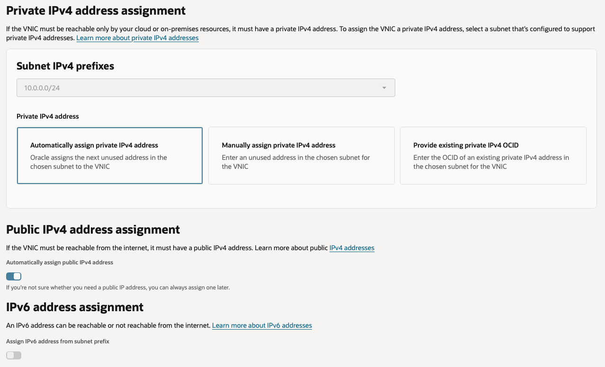

2. Choose whether OCI should assign a public IPv4 address.

    Select a public IP address only when the instance needs internet access and the subnet supports public IP assignment.

3. Leave public IP assignment disabled for private-only workloads.

    Private instances still receive a private IP address from the subnet.

## Task 7: SSH Keys

1. Locate the SSH keys section.

    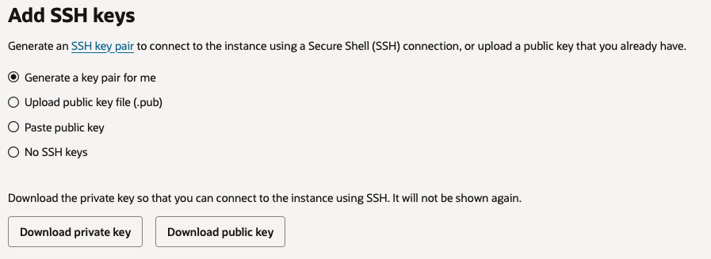

2. Choose how to provide the SSH public key.

    Generate a key pair, upload a public key file, or paste a public key value.

3. Store the matching private key securely.

    You need the private key to connect to the instance after OCI provisions it.

## Task 8: Storage

1. Locate the boot volume section.

    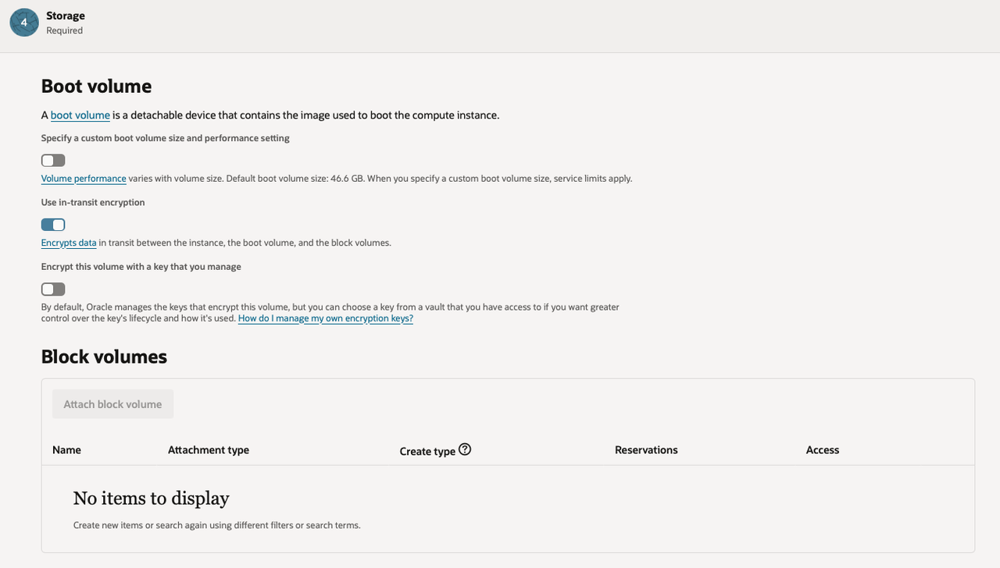

2. Review the default boot volume size and performance options.

    The defaults are usually sufficient for a basic workshop instance.

3. Adjust storage only when the operating system image or workload needs a larger boot volume or a specific performance setting.

## Task 9: Summary and Confirmation

1. Review the instance summary.

    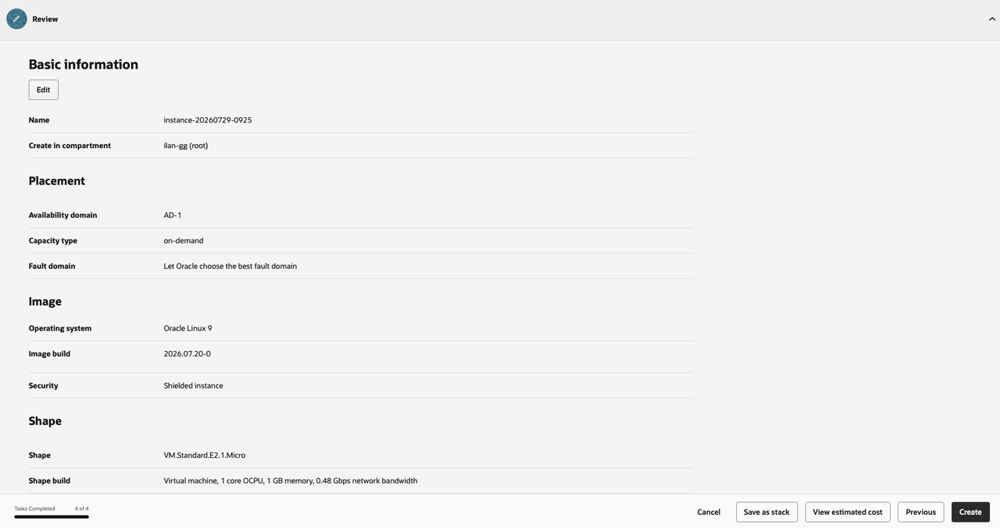

2. Confirm the name, compartment, placement, image, shape, network, IP assignment, SSH key, and boot volume.

3. Select **Create**.

    OCI starts the instance. The instance moves through provisioning states before it becomes available.

4. Wait for the instance lifecycle state to become **Running**.

    After the instance runs, use its assigned IP address and your SSH private key to connect. Your network path and security rules must allow access.

## Acknowledgements

* **Author** - Oracle LiveLabs
* **Last Updated By/Date** - Oracle LiveLabs, July 2026
