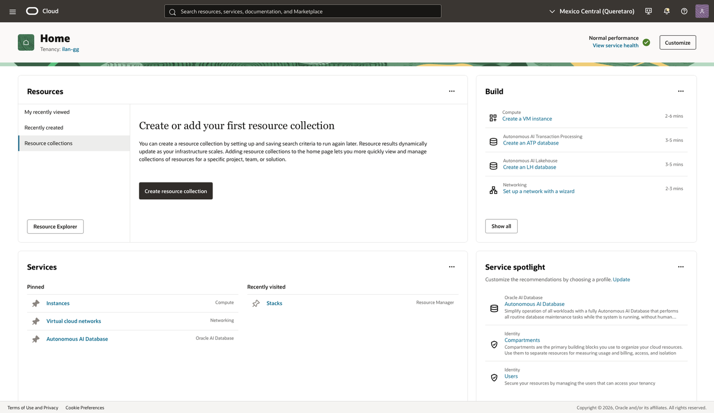
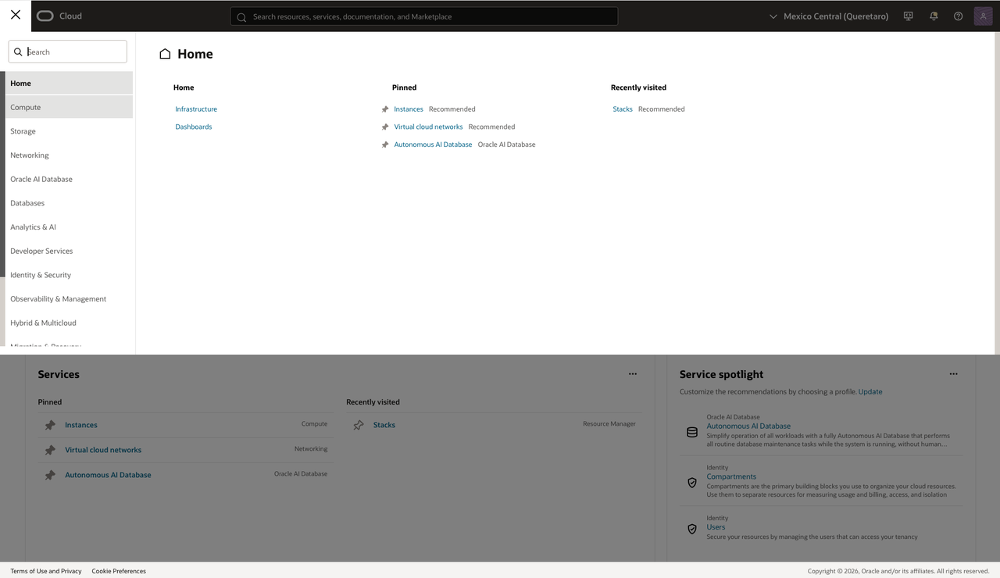
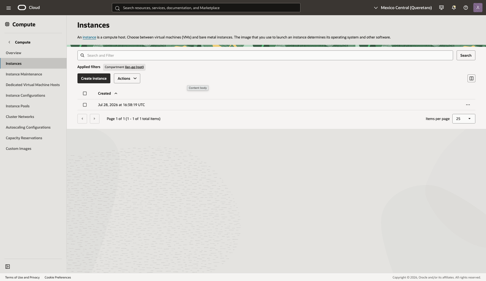

# Knowing OCI Interfaces

## Introduction

The OCI Console lists infrastructure services in the navigation menu. Before you create a Compute instance, find the Compute service and the page that starts the workflow.

Estimated Time: 5 minutes

### Objectives

In this lab, you will:

* Open the OCI navigation menu.
* Locate the Compute service.
* Open the Instances page.
* Start the Compute instance creation workflow.

## Task 1: Where to Create a Compute Instance

1. Sign in to the OCI Console.

    Confirm that you are working in the correct tenancy and region for this workshop.

2. Open the navigation menu in the upper-left corner of the Console.

    

3. In the navigation menu, select **Compute**.

    The Compute service contains virtual machines, bare metal servers, instance pools, and related compute features.

    

4. Select **Instances**.

    The Instances page lists Compute instances in the selected compartment. It also starts the workflow for a new instance.

    

5. Select **Create instance**.

    OCI opens the instance creation page. You will review each section of that page in the next lab.

## Acknowledgements

* **Author** - Ilan Gómez Guerrero
* **Last Updated By/Date** - Ilan Gómez Guerrero, July 2026
