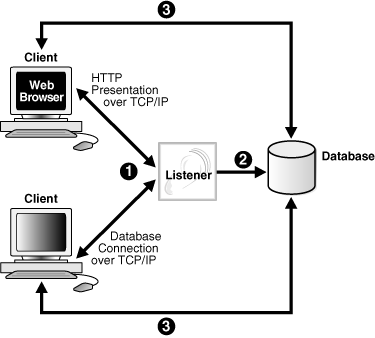
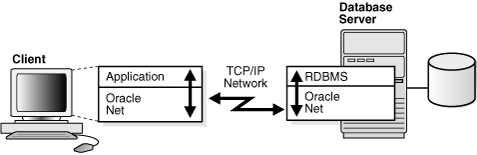

# Oracle Net Listener Configuration

## About this workshop

This workshop focuses on the network environment for Oracle Database 21c which includes listener configuration, listener operations, and HTTPS ports for Container Database (CDB) and Pluggable Database (PDB).

Estimated Workshop Time: 1 hour 15 minutes

### What is a Listener?

**Oracle Net Listener (or Listener)** is a network service that runs on the Oracle Database server.

The primary role of a listener is to:
 - Manage connection requests between Oracle Database and clients
 - Manage network traffic

The default name of an Oracle listener is *LISTENER*.



### Objectives

This workshop helps you learn how to start and stop a listener and view listener configuration. You can also set the https port for CDB and PDB.  

### Prerequisites

- A Free Tier, Paid or LiveLabs Oracle Cloud account

> **Note:** If you have a **Free Trial** account, when your Free Trial expires your account will be converted to an **Always Free** account. You will not be able to conduct Free Tier workshops unless the Always Free environment is available. **[Click here for the Free Tier FAQ page.](https://www.oracle.com/cloud/free/faq.html)**

## Appendix 1: About Listener Configuration

After installing Oracle Database, you have a fully functional database with a client/server network environment. *Oracle Net* is a software layer that resides on the client and on the Oracle Database server. It establishes and maintains the connection between the client application and the database over a network, and exchanges messages between them using industry standard protocols.

To view a list of all supported protocols, see [Learn More] (?lab=intro-configure-network#LearnMore).



**Client**   
A client is an application that connects to Oracle Database to send and receive data. An Oracle Database client application resides on the host where the Oracle Database client software is installed.

**Service**   
The client application uses a *Service name* to identify an Oracle Database instance and connect to it . A service name is a logical representation of an Oracle Database. A database can have one or more services associated with it.

For example, the listener status returns a service name *CDB1* which represents an Oracle Database instance.

```
...
Service "CDB1" has 1 instance(s).
  Instance "CDB1", status READY, has 1 handler(s) for this service...
```

A single instance Oracle Database can interface with a client as multiple services.

### Default Listener Configuration file

The listener configuration is stored in a file, *listener.ora*, located in the Oracle Base home under the `network/admin` subdirectory.  

The *listener.ora* file carries configuration parameters that determine the behavior of the listener. The parameters include:

 - Name of the listener
 - Protocol addresses that the listener can accept connection requests on
 - Valid nodes that the listener allows to register with Oracle Database
 - Oracle Database services
 - Control parameters

The following example gives a glimpse of the `listener.ora` file. Here, the listener assumes the default name, *LISTENER*. The values may differ depending on the system you are using.

```
...

LISTENER =
  (DESCRIPTION_LIST =
    (DESCRIPTION =
      (ADDRESS = (PROTOCOL = TCP)(HOST = sale-server.us.oracle.com)(PORT = 1521))
      (ADDRESS = (PROTOCOL = IPC)(KEY = EXTPROC1521))
    )
  )

...
```

You can configure multiple listeners, each with a unique name, in one `listener.ora` file. However, Oracle recommends that you run only one listener for each node in customer environments.

*Listener Registration (LREG)* is an instance background process that performs dynamic registration of services and databases with the listener.

### Client Connections

The elements involved in client connections to Oracle Database are:

 - **Connect descriptors** -   
   The client uses a connect descriptor to specify the Oracle Database to which it wants to connect. The connect descriptor contains a protocol and the Oracle Database service name.
 - **Connection requests** -   
   Users initiate a connection request to Oracle Database using a connect string. The connect string comprises a username and password, and a connect identifier. The connect identifier can be the connect descriptor or a name that represents the connect descriptor.
 - **Naming methods** -   
   While connecting to an Oracle Database service, the client application uses a resolution method, called the *naming method*. This method resolves the connect identifier to a connect descriptor.

The following example shows a connect descriptor that enables a client to connect to Oracle Database with the service name *CDB1*. The values may differ depending on the system you are using.

```
...

DESCRIPTION=
   (ADDRESS=(PROTOCOL=tcp)(HOST=my-server)(PORT=1521))
   (CONNECT_DATA=
      (SERVICE_NAME=CDB1))
...
```

### Tools for Network Configuration

Oracle Net Services provides user interface tools and command-line utilities to configure, manage, and monitor the network.

 - **Oracle Net Configuration Assistant (NETCA)**
 - **Oracle Net Manager**

Use Net Configuration Assistant for initial network configuration right after the database installation. Henceforth, you can use Oracle Net Manager to configure and administer your networks.

Oracle Enterprise Manager Cloud Control (Oracle EMCC) combines configuration functionality across multiple file systems, along with listener administrative control to provide an integrated environment for configuring and managing Oracle Net Services.

**About Oracle Net Configuration Assistant (NETCA)**   
Oracle Net Configuration Assistant (NETCA) is a standalone tool that helps you configure listeners and naming methods. During a typical installation of Oracle Database, Net Configuration Assistant automatically configures a listener with a TCP/IP listening protocol address for the database. Whereas, in advanced installation of Oracle Database, Net Configuration Assistant prompts you to specify a listener name and a port number of your choice.

**About Oracle Net Manager**   
Oracle Net Manager provides configuration functionality for an Oracle home on a local client or server host. It offers built-in wizards and utilities to test connectivity, migrate data from one naming method to another, and create additional network components.

Click on the next lab to **Get Started**.

## Learn More

- [Understanding Oracle Net Services](https://docs.oracle.com/en/database/oracle/oracle-database/21/netag/part-I-understanding-oracle-net-services.html#GUID-A436DD5C-DF46-45E0-8F9B-54C7EFE40BA6)
- [Oracle Database Component Port Numbers and Protocols](https://docs.oracle.com/en/database/oracle/oracle-database/21/ladbi/oracle-database-component-port-numbers-and-protocols.html)

## Acknowledgements

- **Author**: Manish Garodia, Principal User Assistance Developer, Database Technologies
- **Contributors**: Suresh Rajan, Prakash Jashnani, Malai Stalin, Subhash Chandra, Dharma Sirnapalli, Subrahmanyam Kodavaluru, Manisha Mati
- **Last Updated By/Date**: Manish Garodia, February 2022
