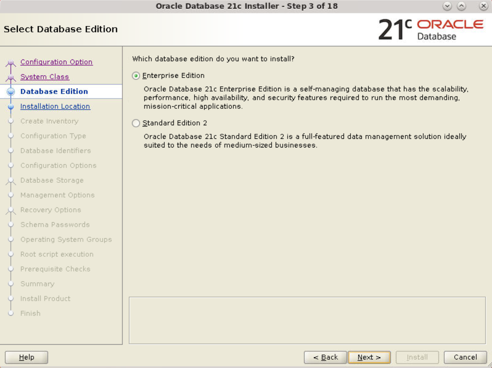
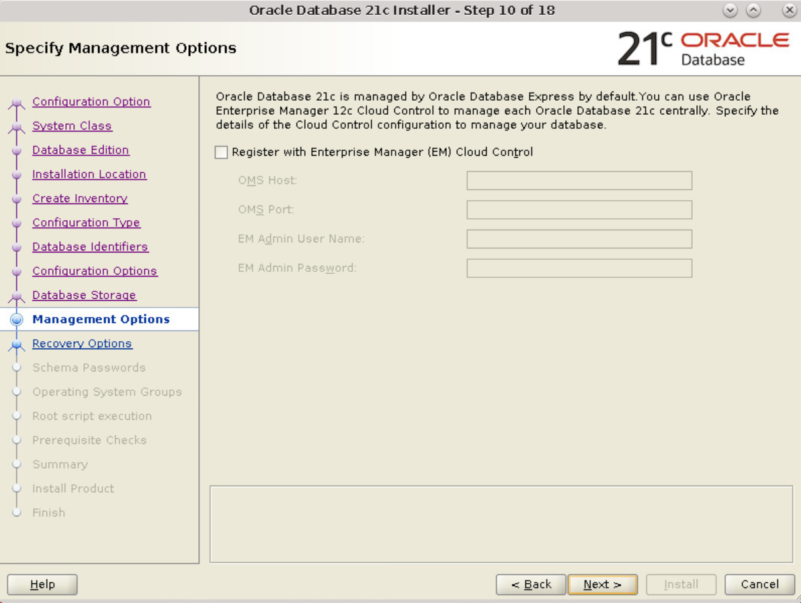

# Install Oracle Database

## Introduction

This lab walks you through the steps for installing Oracle Database 21c and configuring it. With the database installer, you can perform two types of installation.

-  *Desktop class* with minimal configuration  
  Estimated Time: 20 minutes

- *Server class* with advanced configuration  
  Estimated Time: 30 minutes

To install both system classes on the same host, you need different Oracle home locations.  

### Objectives

Install the Oracle Database software and create a starter database for Desktop class or for Server class using Oracle Database Setup Wizard (Installer).

### Prerequisites

- A Free Tier, Paid or LiveLabs Oracle Cloud account
- You have completed:
	- Lab: Prepare Setup (*Free-tier* and *Paid Tenants* only)
	- Lab: Setup Compute Instance

## Task 1: Start Database Installer

1. Log in to your host as *oracle*, the user who is authorized to install the Oracle Database software and create Oracle Database.  

2. Open a terminal window and change the current working directory to Oracle home. This is the directory where the database installer is located.

	```
	$ <copy>cd /u01/app/oracle/product/21.0.0/dbhome_1</copy>
	```

3. From Oracle home, run this command to start Oracle Database Setup Wizard.

	```
	$ <copy>./runInstaller</copy>
	```

## Task 2: Options to Install Oracle Database
You can now select Task 2A or Task 2B options to install Oracle Database.

## Task 2A: Install Oracle Database (Desktop Class)

Run the database installer from Oracle home as explained in *Task 1*. The installer starts with the Configuration Option window.

At any point, you can go **Back** to the previous window or **Cancel** the installation. You can click **Help** to view more information on the current window.

1. The Configuration Option window opens with the default option **Create and configure a single instance database** selected. This option helps you create a starter database. Click **Next**.

   

	If you select *Set Up Software Only*, the setup wizard installs only the Oracle Database software but does not create the database. To create a container database, run Oracle DBCA after you complete the software installation.

	For this lab, do not select this option.

2. The System Class window displays the default option **Desktop class** selected. Using this option, you can perform the installation with minimal configuration. Click **Next**.

   

	The *Server class* option is used for advanced installation with detailed configuration.

3. The Typical Install Configuration window displays pre-filled names and values for configuration parameters.

	For this lab, enter the following.  
	* **OSDBA group** - *dba*  
	* **Global database name** - Specify a unique name, for example, *orcl.us.oracle.com*  
	* **Password** - Set the password for admin user accounts  
	* **Pluggable database name** - *orclpdb*  

	The values may differ depending on the system you are using. For the remaining fields, leave the defaults and click **Next**.

   

	You cannot create multiple Oracle Databases on a host with the same **Global database name**. If an Oracle Database with the specified name already exists, enter a different name, for example, *orcl2.us.oracle.com*.  

	The password created in this window is associated with admin user accounts, namely SYS, SYSTEM, and PDBADMIN. After you create Oracle Database, enter the admin username and use this password to connect to the database.

	**Note:** The password must conform to the Oracle recommended standards.

	Along with CDB, Oracle DBCA also creates a PDB as per the Pluggable database name.

4. The first time you install Oracle Database on your host, the installer prompts you to specify the location of `oraInventory`, the directory for Oracle Database inventory. This directory provides a centralized inventory for all Oracle software products installed on the host. 

	For this lab, do not change the **Inventory Directory**, select the operating system group for Oracle inventory as *dba* and click **Next**.

	

	If you have installed Oracle Database earlier, the next time you run the database installer, it does not display the Create Inventory window. The inventory location for Oracle Database is already set. 

5. You need to run root scripts to configure your Oracle Database. 
	<!--If you select **Automatically run configuration scripts** then skip step 7-A.-->
	For this lab, do not select the checkbox and run the scripts manually as explained in the later steps. Click **Next**.

	

6. The database installer performs prerequisite checks to verify the installation and configuration requirements on the target environment. The installer generates a script to fix the issues automatically.

	 - If the verification result shows failure to meet a requirement, then click **Fix & Check Again**.   
	 - If the issues are minor in nature, then you may **Ignore All** and proceed with the installation.

	

7. Review the summary and click **Install** to start the installation.

	

	The Install Product window displays the progress of the Oracle Database installation.

8.	The installer pops-up a window and displays the configuration scripts that you need to run.

	**Note:** Do not close this window.

    

	You had opted to run the scripts manually in a previous step. 

9. Open a new terminal window and run the script *`orainstRoot.sh`* located in the `oraInventory` folder.

	```
	$ <copy>sudo /u01/app/oraInventory/orainstRoot.sh</copy>
	```

	**Note:** You can run this script as `root` if you have the privileges. For this lab, use the `sudo` command. 

	It returns the following output.

	```
	Changing permissions of /u01/app/oraInventory.
	Adding read,write permissions for group.
	Removing read,write,execute permissions for world.

	Changing groupname of /u01/app/oraInventory to dba.
	The execution of the script is complete.
	```

10. In the same terminal window, run another script *`root.sh`* located in the Oracle home.

	```
	$ <copy>sudo /u01/app/oracle/product/21.0.0/dbhome_1/root.sh</copy>
	```

	**Note:** You can run this script as `root` if you have the privileges. For this lab, use the `sudo` command. 

	It returns the following output.

	```
    The following environment variables are set as:
	ORACLE_OWNER= oracle
    ORACLE_HOME=  /u01/app/oracle/product/21.0.0/dbhome_1

	Enter the full pathname of the local bin directory: [/usr/local/bin]: Enter

	/usr/local/bin is read only.  Continue without copy (y/n) or retry (r)? [y]: y

    Warning: /usr/local/bin is read only. No files will be copied.

	Entries will be added to the /etc/oratab file as needed by
	Database Configuration Assistant when a database is created
	Finished running generic part of root script.
	Now product-specific root actions will be performed.
	```

	Close the terminal window.  

	This step is applicable for Linux and UNIX operating systems only. If you have installed Oracle Database earlier, then the next time you run the database installer, it displays only one script `root.sh`.

	<!--B. If you provided the privileged user credentials in step 13, click **Yes** in the dialog box to run the configuration script automatically.

   -->

11. Return to the Execute Configuration Scripts window and click **OK** to continue. The installer proceeds with creating Oracle Database as per your configuration.

	

	Congratulations! You have successfully installed Oracle Database.

	Click **Close** to exit Oracle Database Setup Wizard.

  You may now **proceed to the next lab**.

## Task 2B: Install and Configure Oracle Database (Server Class)

Run the database installer from Oracle home as explained in *Task 1*. The installer starts with the Configuration Option window.

At any point, you can go **Back** to the previous window or **Cancel** the installation. You can click **Help** to view more information on the current window.

1. The Configuration Option window opens with the default option **Create and configure a single instance database** selected. This option helps you create a starter database. Click **Next**.

   

	If you select *Set Up Software Only*, the setup wizard installs only the Oracle Database software but does not create the database. To create a container database, run Oracle DBCA after you complete the software installation.

	For this lab, do not select this option.

2. Select **Server class** in the System Class window to customize your installation and perform advanced configuration. Click **Next**.

   

	The *Desktop class* option is used for basic installation with minimal configuration.

3. The default option, **Enterprise Edition**, installs a database suitable for large enterprises. Click **Next**.

   

	*Standard Edition 2* is suitable for small and medium-sized businesses.

4. The Installation Location window prompts you to select the Oracle base location. For this lab, leave the default value and click **Next**.

   

5. The first time you install Oracle Database on your host, the installer prompts you to specify the location of `oraInventory`, the directory for Oracle Database inventory. This directory provides a centralized inventory for all Oracle software products installed on the host. 

	For this lab, do not change the **Inventory Directory**, select the operating system group for Oracle inventory as *dba* and click **Next**.

	

	If you have installed Oracle Database earlier, the next time you run the database installer, it does not display the Create Inventory window. The inventory location for Oracle Database is already set. 

6. The Configuration Type window displays the default option **General Purpose / Transaction Processing** selected. Click **Next**.

   

	<!--
	Removed this note as per review comments from Malai Stalin

	**Note:** The General Purpose or Transaction Processing template and the Data Warehouse template create an Oracle Database with the `COMPATIBLE` initialization parameter set to `12.2.0.0.0`. This ensures that the new features in Oracle Database 21c are compatible with older versions of the database up to version 12c Release 2.
	-->

7. The Database Identifiers window displays pre-filled names and the System Identifier (SID) for Oracle Database.

	For this lab, enter the following and click **Next**.  
	* **Global database name** - Specify a unique name, for example, *orcl.us.oracle.com*  
	* **Oracle system identifier (SID)** - *orcl*  
	* **Pluggable database name** - *orclpdb*  

	The values may differ depending on the system you are using.

   

	_**Oracle SID**_ is a unique name given to an Oracle Database. It distinguishes this instance of Oracle Database from other instances on the host.

	You cannot create multiple Oracle Databases on a host with the same SID. If an Oracle Database with the specified SID already exists, enter a different SID, for example, *orcl3*. 

	Similarly, specify a *unique Global database name* for each Oracle Database on the same host.


8. In the Configuration Options window, you can allocate the memory and select the character sets.

    - **Memory** - Specify the memory you want to allocate for your Oracle Database, for example, *5906* MB.  
	For this lab, leave the default value.  
	For more information on memory management, see [About Automatic Memory Management Installation Options](https://docs.oracle.com/en/database/oracle/oracle-database/21/ladbi/about-automatic-memory-management-installation-options.html#GUID-38F46564-B167-4A78-A974-8C7CEE34EDFE).

     

	- **Character sets** - The *Use Unicode (AL32UTF8)* option is selected by default.

	 

		> *AL32UTF8* is Oracle's name for the standard Unicode encoding UTF-8, which enables universal support for virtually all languages of the world.

	For this lab, leave the defaults and click **Next**.

9. In the Database Storage window, leave the default **File system** option and click **Next**.

    

	Oracle Automatic Storage Management (Oracle ASM) allows you to store your data files in ASM disk groups.
	For this lab, do not select this option.

10. In the Management Options window, do not select the checkbox **Register with Enterprise Manager (EM) Cloud Control**. Leave the default settings and click **Next**.

    

	If you have Oracle EMCC details, such as OMS hostname, port number, and the admin credentials, you can specify in this window and register your Oracle Database.  

	However, instead of registering from this window, it is much easier to use the discovery process from Oracle EMCC and add your Oracle Database 21c as a managed target.

   <!-- Add a link to WS2 lab on how to add managed targets.
   For more information on managed targets, see [Manage your targets in EMCC](?lab=lab-2-manage-your-targets).
   -->

11. Select **Enable Recovery** in the Recovery Options window to allow restoration of Oracle Database in event of a failure. Leave the default settings for recovery area storage and click **Next**.

    

12. Set the password for admin user accounts, namely SYS, SYSTEM, and PDBADMIN, in the Schema Passwords window.  

	Though you can specify different passwords for each admin user, for this lab, select **Use the same password for all accounts**. Note the **Password** you entered in this window and click **Next**.

	

	After you install Oracle Database, enter the admin username and use this password to connect to the database. 

	**Note:** The password must conform to the Oracle recommended standards.

13. In the Privileged Operating System groups window, you can grant your user account administrative access to Oracle Database. For this, select the value for each OS Group listed below. The values represent the OS groups to which your user belong.  

    For this lab, select *dba* for all groups and click **Next**.

    

<!--13. You need to run a root script to configure the database. If you select **Automatically run configuration scripts** skip step 16-A.  
	For this lab, do not select this option and run the script manually as root user. Click **Next**.-->

14. You need to run root scripts to configure your Oracle Database. 
	<!--If you select **Automatically run configuration scripts** then skip step 7-A.-->
	For this lab, do not select the checkbox and run the scripts manually as explained in the later steps. Click **Next**.

	

15. The database installer performs prerequisite checks to verify the installation and configuration requirements on the target environment. The installer generates a script to fix the issues automatically.

	 - If the verification result shows failure to meet a requirement, then click **Fix & Check Again**.   
	 - If the issues are minor in nature, then you may **Ignore All** and proceed with the installation.

	

16. Review the summary and click **Install** to start the installation.

	

	The Install Product window displays the progress of the Oracle Database installation.

17.	The installer pops-up a window and displays the configuration scripts that you need to run.

	**Note:** Do not close this window.

    

	You had opted to run the scripts manually in a previous step. 

18. Open a new terminal window and run the script *`orainstRoot.sh`* located in the `oraInventory` folder.

	```
	$ <copy>sudo /u01/app/oraInventory/orainstRoot.sh</copy>
	```

	**Note:** You can run this script as `root` if you have the privileges. For this lab, use the `sudo` command. 

	It returns the following output.

	```
	Changing permissions of /u01/app/oraInventory.
	Adding read,write permissions for group.
	Removing read,write,execute permissions for world.

	Changing groupname of /u01/app/oraInventory to dba.
	The execution of the script is complete.
	```

19. In the same terminal window, run another script *`root.sh`* located in the Oracle home.

	```
	$ <copy>sudo /u01/app/oracle/product/21.0.0/dbhome_1/root.sh</copy>
	```

	**Note:** You can run this script as `root` if you have the privileges. For this lab, use the `sudo` command. 

	It returns the following output.

	```
    The following environment variables are set as:
	ORACLE_OWNER= oracle
    ORACLE_HOME=  /u01/app/oracle/product/21.0.0/dbhome_1

	Enter the full pathname of the local bin directory: [/usr/local/bin]: Enter

	/usr/local/bin is read only.  Continue without copy (y/n) or retry (r)? [y]: y

    Warning: /usr/local/bin is read only. No files will be copied.

	Entries will be added to the /etc/oratab file as needed by
	Database Configuration Assistant when a database is created
	Finished running generic part of root script.
	Now product-specific root actions will be performed.
	```

	Close the terminal window.  

	This step is applicable for Linux and UNIX operating systems only. If you have installed Oracle Database earlier, then the next time you run the database installer, it displays only one script `root.sh`.

	<!--B. If you provided the privileged user credentials in step 13, click **Yes** in the dialog box to run the configuration script automatically.

   -->

20. Return to the Execute Configuration Scripts window and click **OK** to continue. The installer proceeds with creating Oracle Database as per your configuration.

	

	Congratulations! You have successfully installed the Oracle Database software and configured the database.

	Click **Close** to exit Oracle Database Setup Wizard.

You may now **proceed to the next lab**.

## Acknowledgements

- **Author**: Manish Garodia, Principal User Assistance Developer, Database Technologies

- **Contributors**: Suresh Rajan, Prakash Jashnani, Subhash Chandra, Subrahmanyam Kodavaluru, Dharma Sirnapalli, Malai Stalin

- **Last Updated By/Date**: Manish Garodia, June 2022
