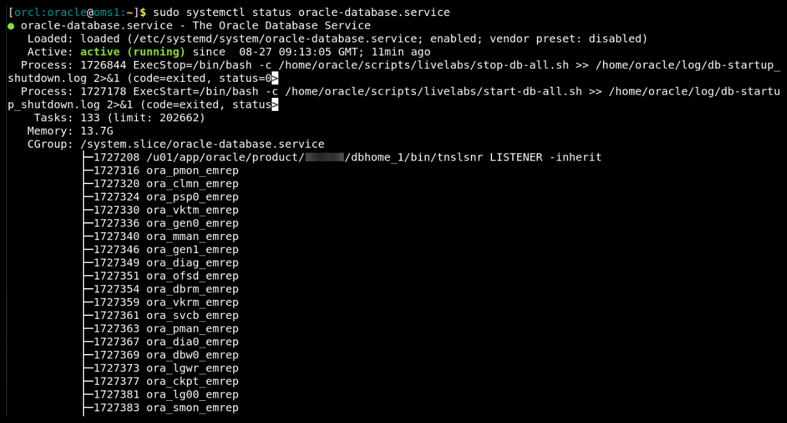
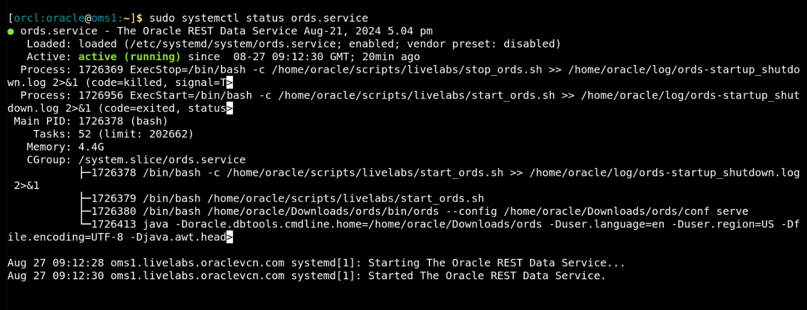
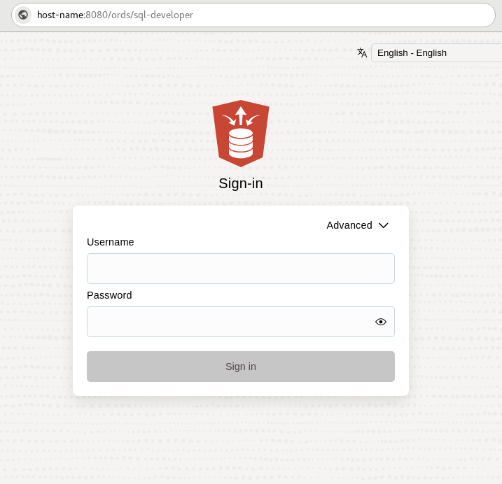
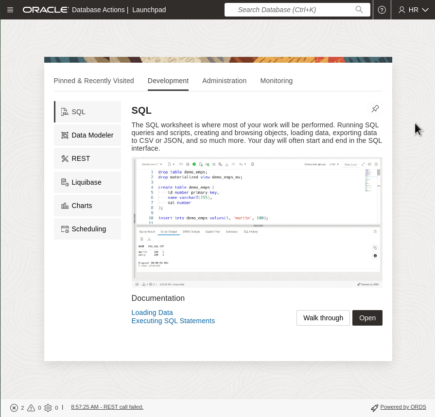

# Initialize environment

## Introduction

This lab helps you start and administer the components and services required for this workshop. 

**Background**   
When you establish a remote desktop session, check the environment and verify that the dependent processes are up and running. After instance provisioning, it takes around 15 minutes for all processes and services to start. If a component is not running, you can start it manually as explained in this lab. 

Estimated time: 10 minutes

### Objectives

 - Ensure that the following are running:
	- Database Listener - *LISTENER_ORCL*
	- Oracle Database Instance - *orcl*
	- Oracle REST Data Services (ORDS) - *ords*
 - Log in to Oracle Database Actions in a web browser.

### Prerequisites

This lab assumes you have -
 - An Oracle Cloud account
 - Oracle Database and ORDS installed on your system

## Task 1: Verify that the dependent components are running

In this task, you will verify that the required components, such as Listener, Oracle Database, and ORDS, are running on the host. 

1. 	Verify that the listener service, *oracle-db-listener*, is running.

    ```
    $ <copy>sudo systemctl status oracle-db-listener</copy>
    ```

    

	The status *active* indicates that the listener service is running. If the listener service is not running, you can restart it with the following command. 

    ```
    $ <copy>sudo systemctl restart oracle-db-listener</copy>
    ```

1. 	Verify that the Oracle Database service, *oracle-database*, is running.

    ```
    $ <copy>sudo systemctl status oracle-database</copy>
    ```

    

	The status *active* indicates that the database service is running. If the database service is not running, you can restart it with the following command. 

    ```
    $ <copy>sudo systemctl restart oracle-database</copy>
    ```

1. 	Verify that the ORDS service, *ords*, is running.

    ```
    $ <copy>sudo systemctl status ords</copy>
    ```

    

	> **Note**: You can access the Database Actions login page in a web browser only if ORDS is running. 

	The status *active* indicates that the ords service is running. If the ords service is not running, you can restart it with the following command. 

    ```
    $ <copy>sudo systemctl restart ords</copy>
    ```

	If still unsuccessful, then run the following script to start ORDS. 

    ```
    $ <copy>source ~/run_ords.sh</copy>
    ```

If the dependent components are running, you can access the Oracle Database Actions login page in a web browser.

## Task 2: Log in to Oracle Database Actions

In this task, you will log in to the Oracle Database Actions console using a web browser. 

If you have reserved a Livelabs environment, then the remote desktop session will have a web browser open and display the *Oracle Database Actions* login page. If it does not display the Database Actions login page, you can access it as follows. 

1. Open a web browser and go to the Database Actions login URL.   
	For this lab, the login URL is:

	```
	<copy>http://oms1:8080/ords/sql-developer</copy>
	```

1. Specify the user credentials for Oracle Database Actions. 

    

	For this lab, the credentials are:

	- **Username**: *HR*
	- **Password**: *oracle*

	Click **Sign in** to log in to the Oracle Database Actions console. 

    

On successful login, the browser displays the Database Actions landing page. Your environment is now ready. 

## Appendix 1: Manage startup services

You can manage the startup services using various options, for example, start, stop, restart, and status.

1. Database services (All databases and Standard Listener)

    - Start

		```
		$ <copy>sudo systemctl start oracle-database</copy>
		```

    - Stop

		```
		$ <copy>sudo systemctl stop oracle-database</copy>
		```

    - Restart

		```
		$ <copy>sudo systemctl restart oracle-database</copy>
		```

    - Status

		```
		$ <copy>systemctl status oracle-database</copy>
		```

1. Listener Service (Non-Standard Listener)

    - Start

		```
		$ <copy>sudo systemctl start oracle-db-listener</copy>
		```

    - Stop

		```
		$ <copy>sudo systemctl stop oracle-db-listener</copy>
		```

    - Restart

		```
		$ <copy>sudo systemctl restart oracle-db-listener</copy>
		```

    - Status

		```
		$ <copy>systemctl status oracle-db-listener</copy>
		```

1. Oracle REST Data Services (ORDS)

    - Start

		```
		$ <copy>sudo systemctl start ords</copy>
		```

    - Stop

		```
		$ <copy>sudo systemctl stop ords</copy>
		```

    - Restart

		```
		$ <copy>sudo systemctl restart ords</copy>
		```

    - Status

		```
		$ <copy>systemctl status ords</copy>
		```

## Appendix 2: External web access

You have an option to log in to Database Actions from a location outside your remote desktop session, for example, a workstation or laptop. 

1. Open a web browser and go to the Database Actions login page. A Database Actions login URL contains the following: 

    ```
    http://[Your instance public IP]:8080/ords/sql-developer
    ```

1. Specify the user credentials for Oracle Database Actions. For this lab, the credentials are:

	- **Username**: *HR*
	- **Password**: *oracle*

	Click **Sign in** to log in to the Oracle Database Actions console. 

You may now **proceed to the next lab**.

## Acknowledgments

 - **Author**: Manish Garodia, Database User Assistance Development
 - **Contributors**: Aayushi Arora, Manisha Mati
 - **Last Updated By/Date**: Manish Garodia, October 2024
