# Manage indexes and views using Database Actions

## Introduction

This lab walks you through the steps to view and create schema objects such as indexes and views using Database Actions.

Estimated Time: 20 minutes

### Objectives

Perform these tasks in your Oracle Database to manage schema objects from Oracle Database Actions:

-   View an existing index
-   Create a new index
-   View an existing view
-   Create a new view

### Prerequisites

This lab assumes you have-

-   Completed all previous labs successfully
-   An Oracle Cloud account
-   Installed Oracle Database Actions
-   *HR* schema enabled to access Database Actions
-   Logged in to Oracle Database Actions in a web browser as *HR*

## Task 1: View indexes using Oracle Database Actions

You can view indexes for *HR* schema.

1. Log in to Database Actions as *HR* if you are not logged in.

2. Click the SQL card. This opens the SQL page in Database Actions.

   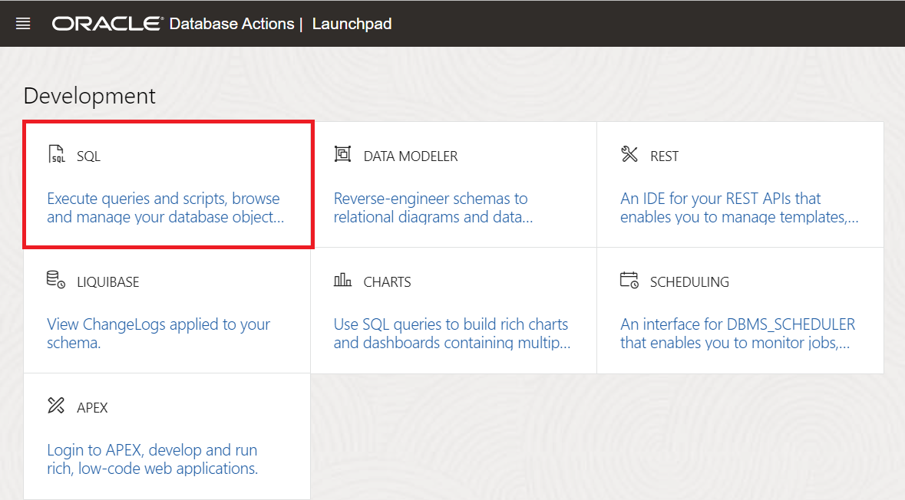

3. From the **Navigator** tab, select **HR** schema from the drop-down and select **Indexes** from the Object type drop-down list. The navigator pane displays the list of indexes of the selected schema HR.

   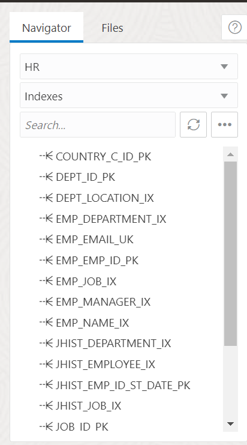

4. Click on an index of your choice. For example, *COUNTRY_ C_ ID_PK*. Right click on it and select **Open**.This opens a dialog box that displays information about the selected index.

5. Click the Columns pane to view the properties of each column in the index.

   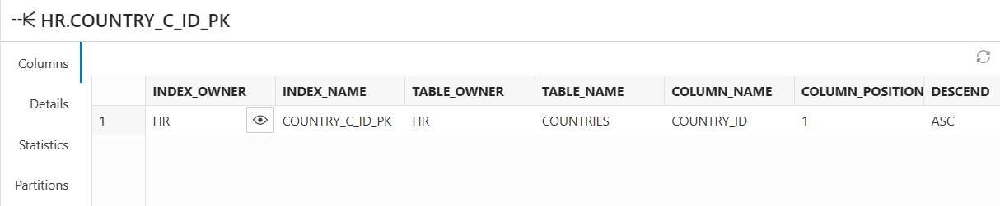

   The Columns pane displays the following fields:
       - INDEX_OWNER
       - INDEX_NAME
       - TABLE_OWNER
       - TABLE_NAME
       - COLUMN_NAME
       - COLUMN_POSITION
       - DESCEND

6. Click on the Details pane to view additional information about the index.

   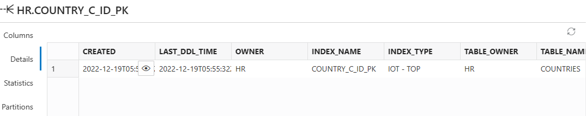

   The Details pane displays the following few important fields:
       - CREATED
       - LAST_DDL_TIME
       - OWNER
       - INDEX_NAME
       - INDEX_TYPE
       - TABLE_OWNER
       - TABLE_TYPE
       - UNIQUENESS
       - COMPRESSION
       - PREFIX_LENGTH
       - TABLESPACE_NAME

7. Click on the Statistics pane.

   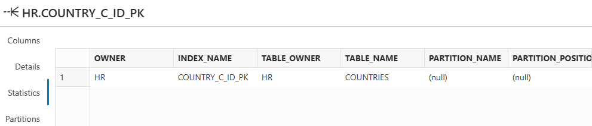

   You can view statistical information about the index.

8. Click the Partition pane.

   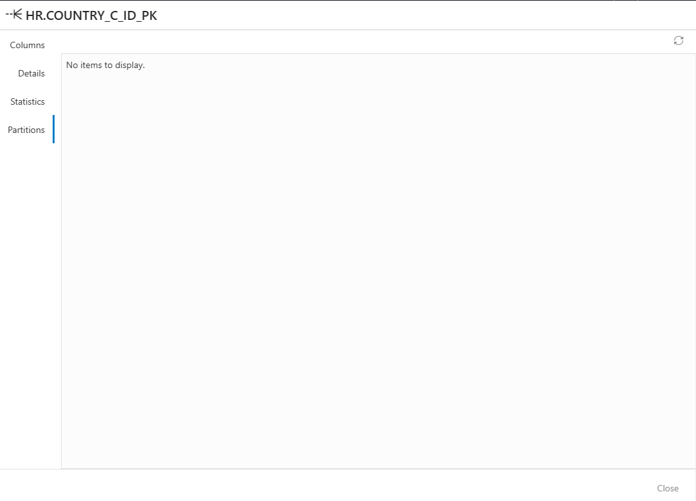

   This pane indicates whether the index is partitioned or not. You will view *No items to display* in the Partitions tab if an index is not partitioned.

## Task 2: Create an index using Database Actions

In this task, you will create an index for *HR* schema.

1. Click Object submenu in the Navigator tab and select **Create Object**.

   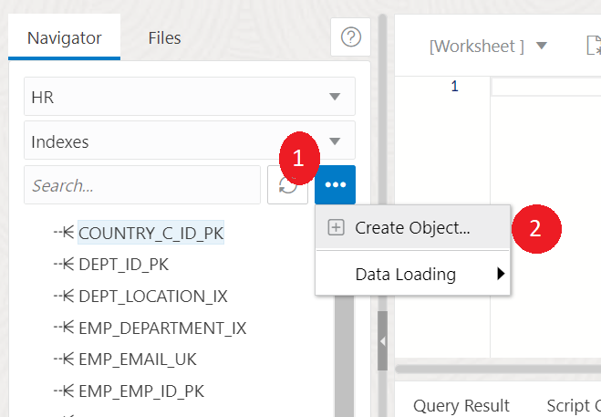

   This opens the Index Properties dialog box.

2. Click the Definition pane of the Index Properties dialog box and specify the following fields.

    - **Schema:** *HR*. This is the database schema that owns the table associated with the index.

    - **Table:** *COUNTRIES*. This is the table associated with the index. 

    - **Tablespace:** *SYSTEM*. This is the tablespace for the index.

    - **Name:** *NEW_INDEX*. This is the name of the index.

    - **Type:** *Non-Unique*. This is the type of index which can consist of multiple identical values

   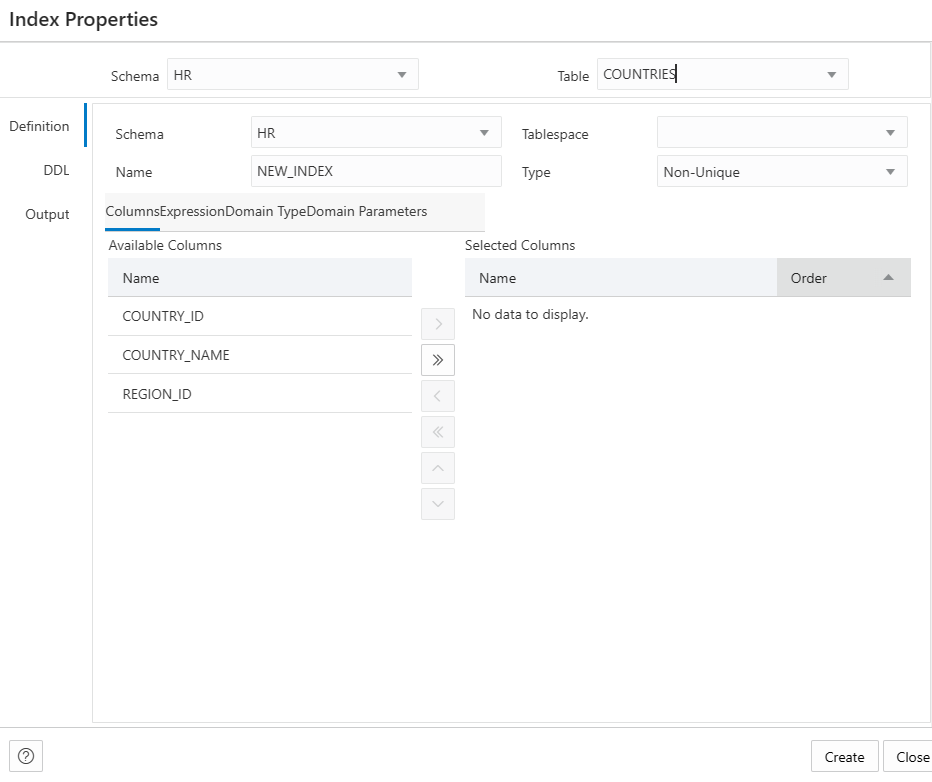

   In the Columns tab, click the Columns you wish to select for the index from the list of columns available in the table. You can specify a column expression in the Expression tab of the Definition pane.

3. Click the DDL pane of the Index Properties dialog box to review the SQL statements generated while creating the index. Navigate to the Definition pane to make changes to the properties of the index.

   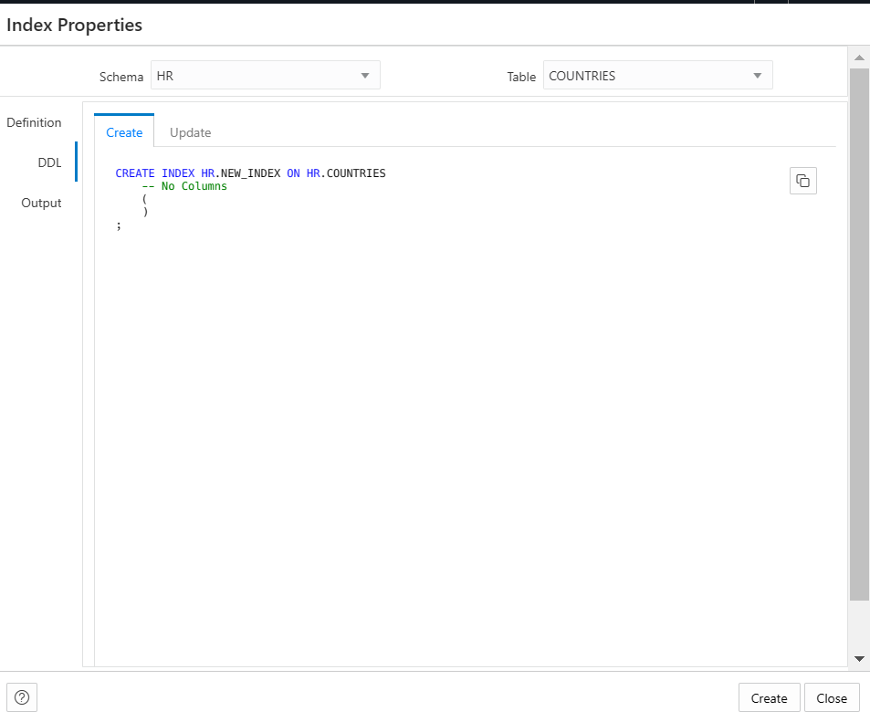

4. Click **Create**.

   The Output pane displays the generated DDL commands. In case of errors, fix them in the Definition pane and click **Create**.

5. After successful creation of the index, you can view the **Apply** icon. Click **Apply**. You can now view the new index in the list of indexes displayed in the Navigator pane.

   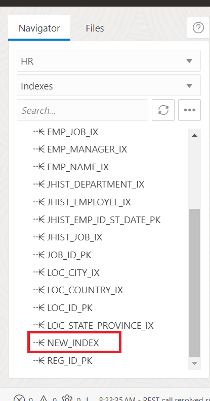

## Task 3: See a view

You can see all the existing views in your database. In this lab, you will use the *HR* schema to achieve this task.

1. From the **Navigator** tab, select **HR** schema from the drop-down and select **Views** from the Object type drop-down list.

   The navigator pane displays the list of views of the selected schema HR.

2. To open and view the properties of the existing view, right-click a view object and select **Open**.

   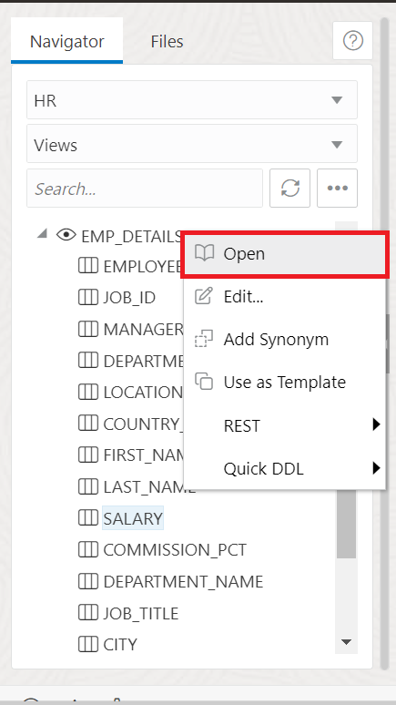

3. The different panes in the dialog are as follows:
 
       - **Columns pane:** You can view all the columns of the view.

       - **Data pane:** You can insert a row in this pane. Double click on the cell to fill the values of the row you insert.

       - **Grants:** This pane displays the roles you grant for the selected view.

       - **Dependencies:** This pane displays the dependency information of all the tables used in the selected view.

       - **Details:** You can view information like the Creation date, owner of the view, Name of the view, the SQL statement you use to create the view.

       - **Triggers:** This displays the trigger actions you used to update the tables underlying the view.

       - **Errors:** This pane displays the errors if there are any. 

   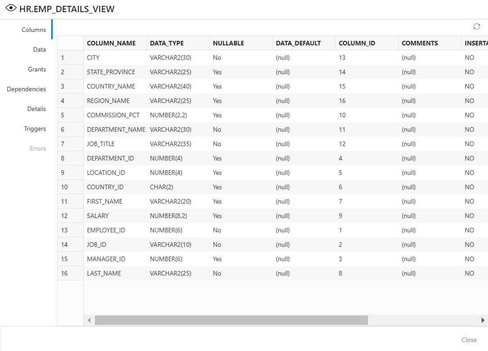

## Task 4: Create a View

You can create a view for *HR* Schema.

1. From the **Navigator** tab, select **HR** schema from the drop-down and select **Views** from the Object type drop-down list.

2. Click the Object submenu (three vertical dots next to Search field) and select **Create Object**.

   >Note: To create a view from an existing template for a selected schema, in the Navigator tab, select the view to create from, right-click and select **Use as Template**.

   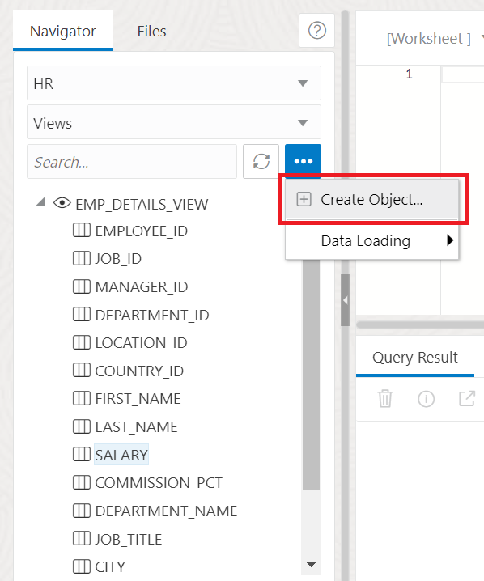

   A View Properties dialog box opens.

3. Specify the following field values:

   **Schema:** *HR*. This is the schema in which you wish to create your view.

   **Name:** *NEW_VIEW*. This is the name of the view.

   In the SQL Query pane, enter the following:

    ```
    <copy>
    SELECT * FROM hr.employees WHERE manager_id = 100
    </copy>
    ```
   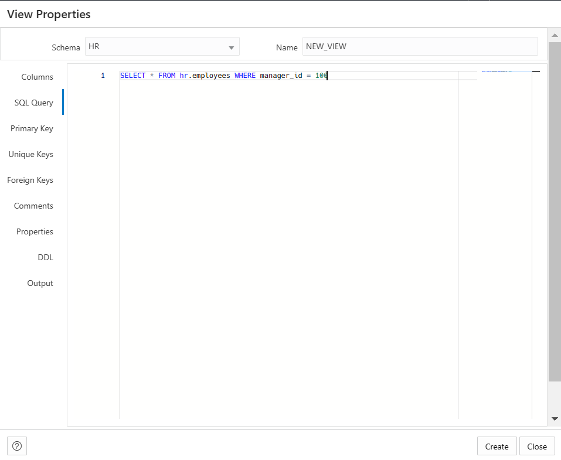

   You will see a successful creation of view message.

   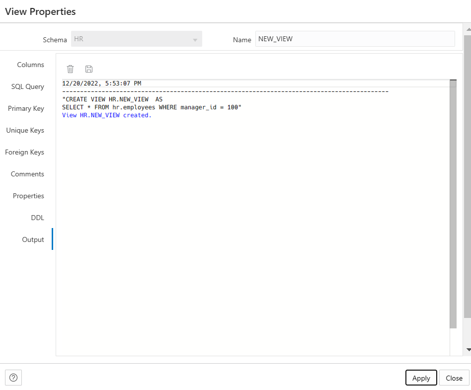

5. Click **Apply**.

   The Database Actions tool creates a new view named *NEW_VIEW* that appears in the list of views for the *HR* schema.

   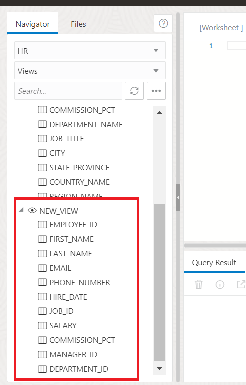

   You may now **proceed to the next lab**.

## Acknowledgements 

- **Author** - Manisha Mati, Database User Assistance Development team
- **Contributors** - Suresh Rajan, Victor Martinez, Manish Garodia, Aayushi Arora
- **Last Updated By/Date** - Manisha Mati, March 2023
