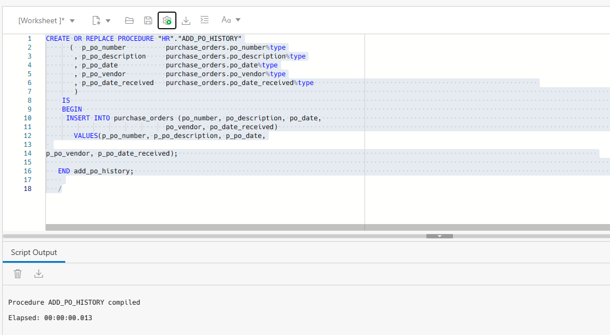
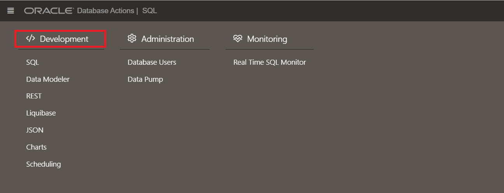

# Manage Program code stored in the database using Database Actions

## Introduction

In this lab you will use Database Actions to validate invalid Schema objects. You will create a new PL/SQL procedure and also change the table that is referenced in the procedure. As a database administrator (DBA), you may be asked to revalidate schema objects that have become invalid. Schema objects (such as triggers, procedures, or views) can be invalidated when changes are made to objects on which they depend. For example, if a PL/SQL procedure contains a query on a table and you modify table columns that are referenced in the query, then the PL/SQL procedure becomes invalid. You revalidate schema objects by compiling them.
   
Estimated Time: 30 minutes

### Objectives  

-   Create an invalid PL/SQL procedure 
-   Validate invalid schema objects in the procedure

In this lab you will use Database Actions to validate invalid Schema objects. You will create a new PL/SQL procedure and also change the table that is referenced in the procedure.   
Estimated Time: 30 minutes

**Background**
As a database administrator (DBA), you may be asked to revalidate schema objects that have become invalid. Schema objects (such as triggers, procedures, or views) can be invalidated when changes are made to objects on which they depend. For example, if a PL/SQL procedure contains a query on a table and you modify table columns that are referenced in the query, then the PL/SQL procedure becomes invalid. You revalidate schema objects by compiling them.

### Objectives  

Create an invalid PL/SQL procedure and validate the invalid schema objects in the procedure.

### Prerequisites

This lab assumes you have-

-   Completed all previous labs successfully
-   An Oracle Cloud account
-   Installed Oracle Database Actions
-   *HR* schema enabled to access Database Actions
-   Logged in to Oracle Database Actions in a web browser as *HR*
-   Created a table named *`PURCHASE_ORDERS`* with *`PO_NUMBER`*, *`PO_DATE`*, *`PO_VENDOR`* and *`PO_DATE_RECIEVED`* as columns.

## Task 1: Create a PL/SQL procedure 

You can create a new procedure in your Oracle Database using Database Actions. 

1. From the **Navigator** tab in the SQL, select **HR** schema from the drop-down and select Procedures from the Object type drop-down list.  

     

2.  Execute the following script in the PL/SQL editor to create a new procedure named *`ADD_PO_HISTORY`*. This procedure creates a new procedure named *`ADD_PO_HISTORY`*. 

    ```
    <copy>
    CREATE OR REPLACE PROCEDURE "HR"."ADD_PO_HISTORY"
          (  p_po_number          purchase_orders.po_number%type
           , p_po_description     purchase_orders.po_description%type
           , p_po_date            purchase_orders.po_date%type
           , p_po_vendor          purchase_orders.po_vendor%type
           , p_po_date_received   purchase_orders.po_date_received%type                                                         
           )                                                                                                         
        IS
        BEGIN                                                                                                          
        INSERT INTO purchase_orders (po_number, po_description, po_date, po_vendor, po_date_received)       VALUES(p_po_number, p_po_description, p_po_date, p_po_vendor, p_po_date_received);                                                                                        
         END add_po_history;      
       /
       </copy>
       ```

3. Click the compile icon in the SQL toolbar to compile the procedure.  

   

4. The Script Output of the output pane displays the following result.

    ```
    <copy>
    Procedure ADD_PO_HISTORY compiled
    Elapsed: 00:00:00.004
    </copy>
    ```

   You can view the newly compiled procedure in the list of procedures in the navigator tab for HR schema.  

     

   You will now remove a column from the table *`PURCHASE_ORDERS`* referenced in the *`ADD_PO_HISTORY`* procedure.    
     
5. From the Navigator tab of the HR schema, select Tables from the Object type drop-down list.   

   You can view a list of tables associated with the HR schema.  

6. Select *`PURCHASE_ORDERS`* table and right-click to select **Edit**.   

     

   This opens the Table properties dialog box of the *`PURCHASE_ORDERS`* table.

7. Click the Columns pane of the dialog.  

     

8. Click on the *`PO_DESCRIPTION`* column and click - to remove the column from the table.  

     

9. Click **Apply**.  

      

   You will view an alter table message in the Output pane of the dialog box after the PO_DESCRIPTION column is removed. You now have ADD_PO_HISTORY procedure in your database that is invalid.

   You will now check for invalid objects and perform the following steps to validate the invalid procedure *`ADD_PO_HISTORY`*.  

10. Click the Selector icon to go to the Overview page and then select **Development**.  

      

11. The Invalid Objects widget displays the *`ADD_PO_HISTORY`* procedure.  

      


    The status of the procedure is shown as INVALID.

## Task 2: Validate invalid schema objects in the procedure

You can validate an invalid procedure in your Oracle Database using Database Actions.

1. Click the Selector icon and select **SQL** under Development.  

2. From the **Navigator** tab, select **HR** schema from the drop-down and select Procedures from the Object type drop-down list.  

    You can view a list of procedures associated with the HR schema.  

3. Click on the *`ADD_PO_HISTORY`* procedure.   


      

    You can view a red cross mark on the procedure. This indicates that the SQL statements did not compile due to an error.  

4. Right click on the procedure and select Open.   


      

    You can view the SQL statements of the procedure in SQL editor.  

5. Click the **Compile** icon in the SQL toolbar to compile the procedure.  

      

6. The Script Output of the output pane displays the following result.  


      

    ```
    component 'PO_DESCRIPTION' must be declared
    ```

    The result clearly means that you need to add the column *`PO_DESCRIPTION`* back to the *`PURCHASE_ORDERS`* table to validate the *`ADD_PO_HISTORY`* procedure.  


7. From the Navigator tab of the HR schema, select Tables from the Object type drop-down list.  

8. Select *`PURCHASE_ORDERS`* table and right-click to select **Edit**.


      

    This opens the Table properties dialog box of the *`PURCHASE_ORDERS`* table.  


9. Click the Columns pane of the dialog.  

10. After you add the column back, the procedure is not displayed in the Invalid Objects widget.  


    > **Note:** It is not always possible to make an object valid by recompiling it. You may have to take remedial actions first. For example, if a view becomes invalid because a table that it references is deleted, then compiling the view produces an error message that indicates that the table does not exist. You cannot validate the view until you re-create the table.  

    Congratulations! You have successfully completed this workshop on *Schema Objects management in Oracle Database*.

    In this workshop, you not only learned ways to create tables, views and indexes but also how to load data into the new table. You also created a new PL/SQL procedure. You invalidated the procedure by removing a column from a table referenced in the procedure. You validated the procedure by adding the removed column back into the table and checked for its status. 

## Acknowledgements

- **Author** - Manisha Mati, Database User Assistance Development team
- **Contributors** - Suresh Rajan, Victor Martinez, Manish Garodia, Aayushi Arora
- **Last Updated By/Date** - Manisha Mati, March 2023
