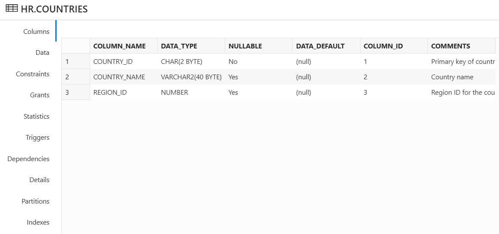
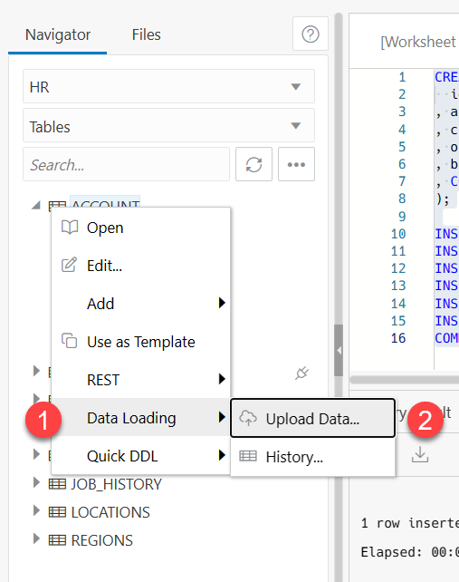
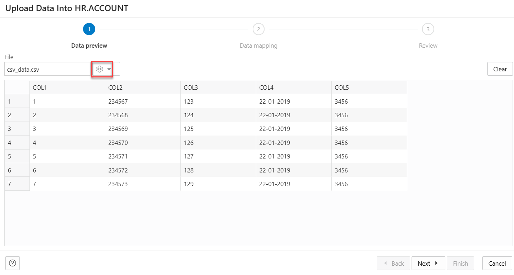
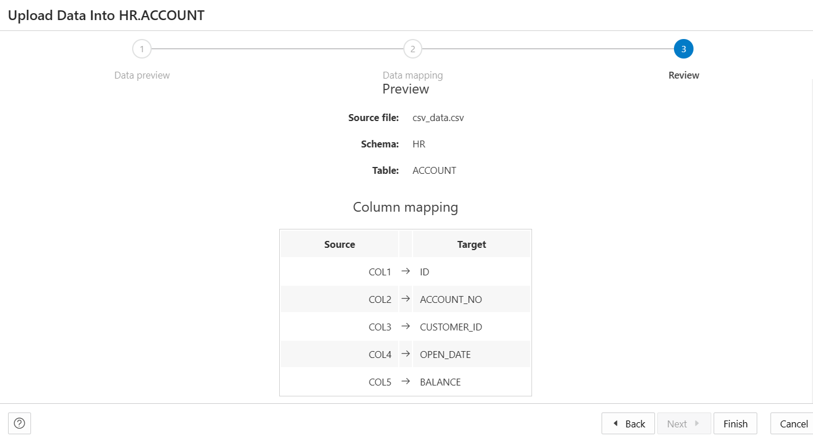

# Manage Table using Database Actions

## Introduction

In this lab you will use Database Actions to view table definitions and table data. You will also learn to create a new table and modify it.

Estimated Time: 20 minutes

### Background

Database Actions, a browser-based application that provides database development, management and monitoring features in Autonomous Databases. Therefore, you can use it without downloading or installing additional software on your system. Database Actions was earlier known as SQL Developer Web.

> **Note:** By default, only the ADMIN database user has access to Database Actions.

### Objective

Perform these tasks in your Oracle Database from Oracle Database Actions:

-   View an existing table
-   Create a new table
-   Load data into the table

### Prerequisites

This lab assumes you have-

-   Completed all previous labs successfully
-   An Oracle Cloud account
-   Installed Oracle Database Actions
-   *HR* schema enabled to access Database Actions
-   Logged in to Oracle Database Actions in a web browser as *HR*

## Task 1: View an existing table using Oracle Database Actions

From Oracle Database Actions, you can view existing tables in your Autonomous Database.

1. Log in to Database Actions as *HR*.

2. Click the **SQL** card under Development. This opens the SQL page in Database Actions.

   

   > **Note:** If this is your first time accessing the SQL Worksheet, click the binocular icon to access hopscotch tour. Click the X in the tour popup window to quit the tour.

3. From the **Navigator** tab, select **HR** schema from the drop-down and select **Tables** from the Object type drop-down list.

   

   The navigator pane displays the list of tables of the selected schema HR.

4. Right click on one of the tables, for example, *COUNTRIES* and select **OPEN**.

   

  This option opens a window that displays the properties of the selected table. The properties window displays information for the following properties of the table:

      - the Columns
      - the Data
      - the Constraints
      - the Grants
      - the Statistics
      - the Triggers
      - the Dependencies
      - the Details
      - the Partitions
      - the Indexes

   

5. Select the Columns tab from the properties window to view the column names and their definitions.

   

6. Select the Data tab from the properties window to view the data stored in COUNTRIES. The Data tab displays the rows stored in the COUNTRIES table.

   

Click **Close** to close the properties dialog box.

## Task 2: Create a new table

You can create a new table and insert data in your Oracle Database using the SQL card in the Database Actions. The code editor in the SQL page enables you to run SQL statements, PL/SQL scripts, and JavaScript code. You can enter SQL and PL/SQL statements to create a table and insert data into the table.

1. Click the **Clear** icon in the SQL Toolbar to remove the statements from the editor if they exist.

   

2. Copy and paste the following SQL statements in the editor.

    ```
    <copy>
      CREATE TABLE account (
      id NUMBER NOT NULL
      , account_no VARCHAR2(20)
      , customer_id NUMBER
      , open_date VARCHAR2(20)
      , balance NUMBER
      , CONSTRAINT account_pk PRIMARY KEY (id)
      );
      INSERT INTO account VALUES (201,'xxx-yyy-201',101,'2015-10-04',1500);
      INSERT INTO account VALUES (202,'xxx-yyy-202',102,'2012-09-13',200);
      INSERT INTO account VALUES (203,'xxx-yyy-203',103,'2016-02-04',2100);
      INSERT INTO account VALUES (204,'xxx-yyy-204',104,'2018-01-05',100);
      INSERT INTO account VALUES (211,'xxx-zzz-211',NULL,NULL,NULL);
      INSERT INTO account VALUES (212,'xxx-zzz-212',NULL,NULL,NULL);
      COMMIT;
    </copy>
    ```

3. Select **Run Script** icon to run the script.

   

   The SQL statements above creates a new table named *account* and adds values into it.

4. Specify the following values in the Navigator tab to view the table list.

    - **Schema**: *HR*
    - **Object Type**: Tables

   You can view the newly added account table in the tables list.

   

## Task 3: Load data from a file to an existing table

You can load data from a file to an existing table named *account*.

1. In the Navigator tab, on the left pane, right-click the ACCOUNT table.

2. Click **Data Loading** and select **Upload Data**.

   

   An Upload Data into HR.ACCOUNT dialog box appears.

3. Drag and drop the file that contains data, which you want to load into the table. You can also click **Add Files** to browse for the file in your system and upload it. 

  

   > **Note:** The file formats that you can load are CSV, XLS, XLSX, TSV, TXT, XML, JSON, and AVRO.
   After the file uploads, you can preview the file in the Data preview tab of the **Upload Data into HR.ACCOUNT** dialog box.

4. Click the **Show/hide options** icon to view and modify the following options for the data preview

   

    - **Column names:** Select **Get from file** to display column headers in the first row.

    - **Encoding:** You can view the *UTF-8* value from the drop-down. This is the default value. 

    - **Text enclosure and Field delimiter:** Enter "(single quote) in the Text enclosure field and","(comma) in the Field delimiter field. These options are visible only when the selected file is in plain text format (CSV, TSV, or TXT).

    - **Rows to skip:** Select the number of rows to skip. For example, *0*.

    - **Preview size:** Select the number of rows to preview. For example, *100*.

    - Select **Limit rows to upload** checkbox to specify the number of rows to load.

   

5. Click **Next** to progress to the Data mapping tab of the dialog box.

6. In the Data mapping tab, select the **Show/hide options** icon to view and modify the following options. 

    -   **Match columns by:** *Name*. You can select Position if you want to match columns based on the position of   the column in the target table. You can select None to remove the current selections and to select the target column for each source column from the drop-down list.

    > **Note:** Matching is done by default using column name.*

    - **Preview:** Use the up and down arrow to select the number of rows you want to preview. For example, *7*. If you select None in the **Match columns by** field, you need to select the Target columns present in the target table ACCOUNT from the drop-down to match the data in the file you uploaded in the previous step. If there are any issues with the data mapping, you will view a notification on the top right of the dialog box.

  

7. Click **Next**. You can view the Column Mapping data with Source and Target columns in the Review tab.

   

8. Select **Finish** to finish uploading data from the csv file into the table. An Uploading Data notification appears.

   

   After the data upload process is complete, an entry is added to the log with the status.

   Right-click the *account* table in the Navigator tab, click **Data Loading** and select **History** to view the summary of the data upload. You can view the total number of rows that fail if the data fails to upload.

You may now **proceed to the next lab**.

## Acknowledgements 

- **Author** - Manisha Mati, Database User Assistance Development team
- **Contributors** - Suresh Rajan, Victor Martinez, Manish Garodia, Aayushi Arora
- **Last Updated By/Date** - Manisha Mati, March 2023
