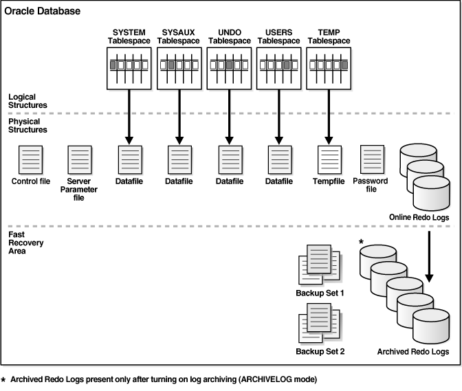

# Storage structures in Oracle Database

## About this workshop

This workshop helps you explore the storage structures of your Oracle Database.

View information about the various database storage structures using Oracle Enterprise Manager Cloud Control (Oracle EMCC).
Monitor and manage the storage that is in use and available for the database and optimize the backups by multiplexing the online redo log files. Improve flashback features and recover from database failures using Undo Advisor by obtaining historical data.

Estimated workshop time: 2 hours

### Objectives

In this workshop, you will learn to perform the following tasks in your database from Oracle EMCC:

-   View Control File information
-   View Archived Logs
-   View and multiplex Online Redo Log information
-   View and create tablespaces
-   View undo information and compute minimum undo tablespace size

### Prerequisites

This lab assumes you have -

-   A Free Tier, Paid or LiveLabs Oracle Cloud account

## Appendix 1: Insights into database storage structures

The following image shows the relationships between logical and physical structures of Oracle Database. This image also shows recovery-related structures that are optionally kept in the fast recovery area.

Oracle Database is composed of the following storage structures:

-   **Logical structures**   
    Oracle Database creates and recognizes these structures that are unknown to the operating system, for example, tablespaces.

-   **Physical structures**  
	These structures are the physical files that store data on the disk. The operating system displays and operates the physical structures.

-   **Recovery related structures**  
	These structures help recover the database if the operating system fails. The Redo Log files are examples of these structures.

### About Archived Redo Log information

The Archived Redo Log File option enables Oracle Database to copy the online redo log files to another location before they are overwritten. The copies of the online redo log files are referred to as the *Archived Redo Log* files. These files increase the redo data that is used for recovery purposes. The process of converting the online redo log files to archived redo log files is *archiving*. You use archived redo logs to recover the database and update a standby database.

> **Note:** Oracle Database becomes unavailable if any of the control files fail. Hence, it is important to have copies of the control files.

### What is a control file?

A control file is a small binary file which records the physical structure of the database. This file tracks the physical components of the Container Database (CDB). 

The control file includes:
-   Database name
-   Name and location of the associated data files and the redo log files
-   Timestamp of the database creation
-   Current log sequence number
-   Checkpoint information

> **Note:** Oracle recommends that you multiplex the control files of your database. It means creating copies of the control files at multiple locations. Oracle Database Configuration Assistant (Oracle DBCA) automatically generates three copies of the control files.

### Multiplexing Online Redo Log File

Oracle Database has a set of two or more online redo log files. These log files are collectively known as *redo log* for the database.

> **Note**: The online redo log files help recover the database in event of a failure of any component, for example, hardware, software, or media.

You can multiplex the online redo log file so that you have two or more identical copies of the online redo log files on different disks.

The online redo log for a database consists of groups of online redo log files. A group consists of an online redo log file and its multiplexed copies. Each identical copy is considered to be a member of that group. The backup and recovery features of the database enable you to back up or recover at the tablespace level.

> **Note**: Oracle recommends that you multiplex the online redo log file. Multiplexing provides better protection for data if an instance or media failure occurs.

### Tablespaces: Definition and purpose

A database contains logical storage units called *tablespaces* which groups related logical structures, such as tables, views, and other database objects. For example, you can group all application objects into a single tablespace to simplify maintenance operations.

A tablespace consists of one or more physical data files. It helps the database to physically locate data on storage. When you define the data files that comprise a tablespace, you specify a storage location for these files.

You can set a tablespace to automatically extend itself by a specified amount when it reaches its size limit.

> **Note**: Oracle recommends that you create at least one tablespace to store your application data.  

You need tablespaces to:

-   Allocate and control the disk space in the database
-   Perform backup and recovery of individual tablespaces
-   Create a *transportable tablespace* that you can copy or move from one database to another

**Tablespace modes**

The modes determine the accessibility of the tablespace. TBD ***Every tablespace is in a write mode that specifies whether it can be written to.*** The various tablespace modes are:

-   **Read or write mode**  
	When you create a tablespace, initially it is the read or write mode.  

     >**Note:** The `SYSTEM` and `SYSAUX` tablespaces and temporary tablespaces are always in read/write mode. You cannot change these tablespaces to read-only.

-   **Read-only mode**   
    This mode does not allow write operations on the tablespaces. The read-only tablespaces do not change, hence they do not require multiple backups. If you recover a database after a media failure, then you need not recover the read-only tablespaces.

-   **Offline mode**   
	This mode does not allow you to access the tablespace. You can recover and maintain the data files associated with the tablespace with this mode.

### Undo Data

When a transaction modifies the data, Oracle Database copies the original data before the modification. This original copy of the data is the *undo data*.

Saving this information is necessary since it enables certain Oracle Flashback features, such as Oracle Flashback Query and Oracle Flashback Table which help you view or recover data from a previous point in time.

### Automatic Undo Management

Oracle Database automatically manages undo data and the undo tablespace. If your database installation uses Oracle Flashback features, then ensure that sufficient undo data is retained to support these operations, else it returns an error. 

The database has a group of features, known as *flashback features*, which provide options to view the older states of database objects or return the database objects to a previous state. These features use the Automatic Undo Management capability to obtain metadata and historical data for transactions. They are based on undo information that allows you to access database information from a previous point in time. With automatic undo management, the database stores the undo data in an undo tablespace.

Even after committing a transaction, it is useful to retain (and not overwrite) its undo data. This ensures proper functioning of the Oracle Flashback features and consistency of long-running queries. The database maintains and automatically tunes an undo retention period using Undo Advisor.
The undo retention period plays an important role in Oracle Flashback features. You must select an undo retention period that is slightly longer than the longest running active query.

The following methods help improving the Oracle Flashback operations:

-   Set the minimum undo retention period for the autoextending tablespace greater than the longest expected Oracle Flashback operation.
	For an autoextending undo tablespace, Oracle Database automatically tunes up the undo retention period. However, this autotuned retention period can be insufficient to accommodate Oracle Flashback operations.

-   Change the undo tablespace to a fixed size.
    To change the undo tablespace to a fixed size, select a larger size for the tablespace. If the undo tablespace size is not sufficiently large, then you will receive a Data Manipulation Language (DML) error.

Click on the next lab to **Get started**.

## Learn More

-   [Automatic Undo Management](https://docs.oracle.com/en/database/oracle/oracle-database/21/admin/managing-undo.html#GUID-281C5BFE-BAED-47C3-BFF7-806C0954F3EC)

-   [Oracle Database Structure and Storage](https://docs.oracle.com/en/database/oracle/oracle-database/21/admin/oracle-database-structure-and-storage.html#GUID-F11D30A7-BF12-4D8F-A1C2-D7437D38F8C7)

## Acknowledgements

- **Author** - Manisha Mati, Database User Assistance team
- **Contributors** - Suresh Rajan, Manish Garodia, Ashwini R, Jayaprakash Subramanian
- **Last Updated By/Date** - Manisha Mati, May 2022