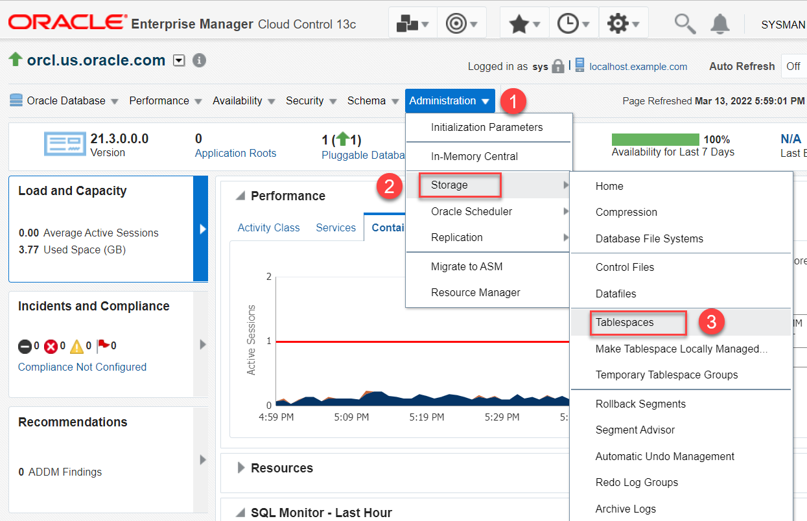
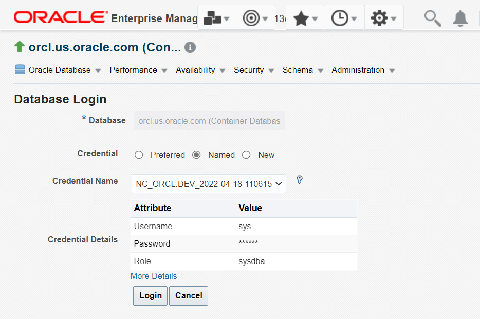
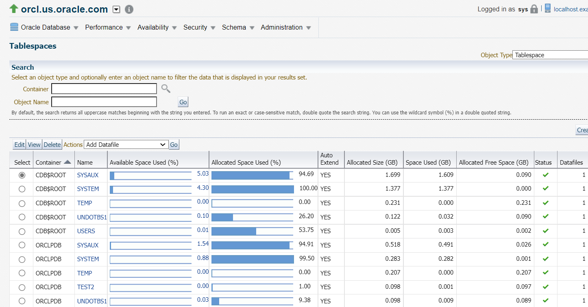
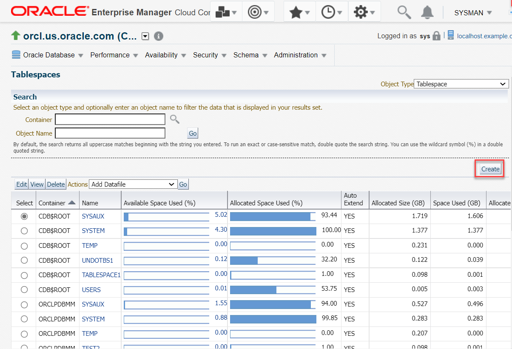
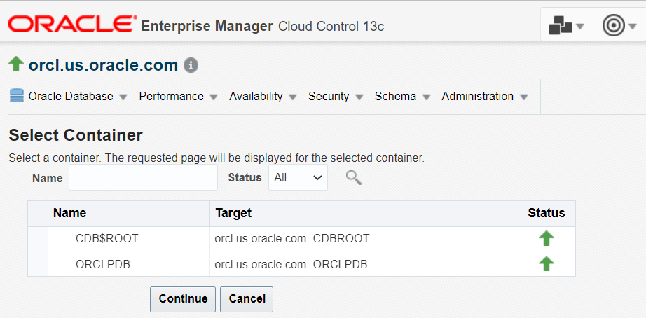
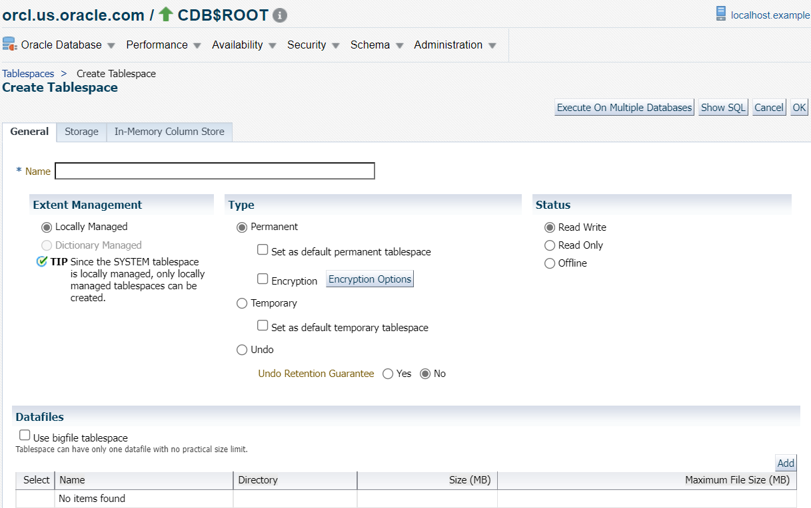
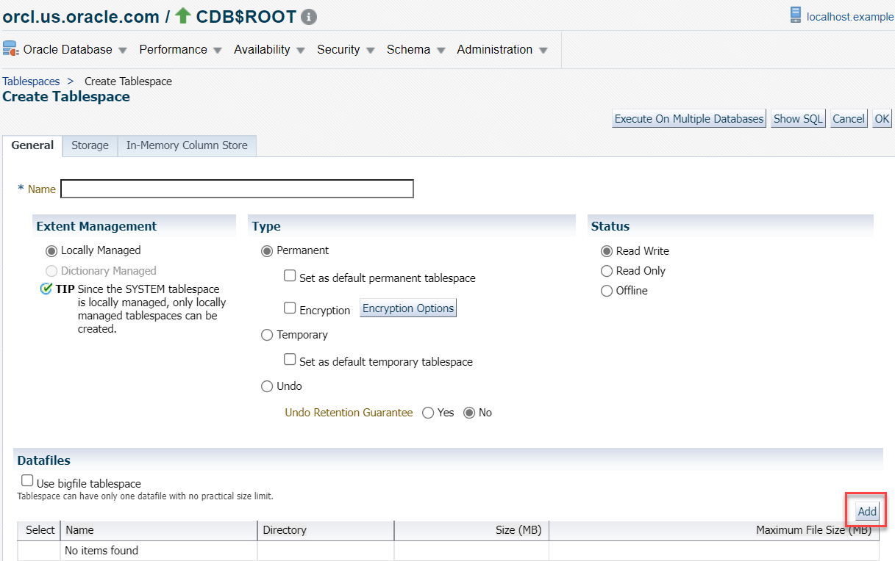
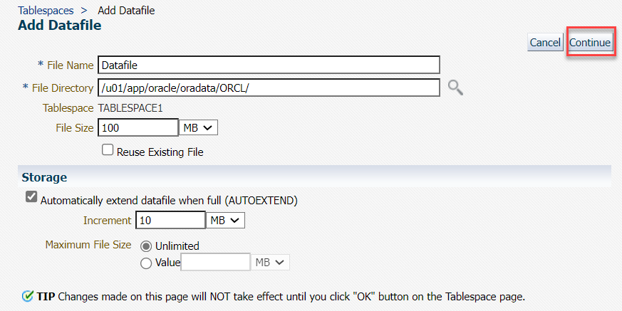
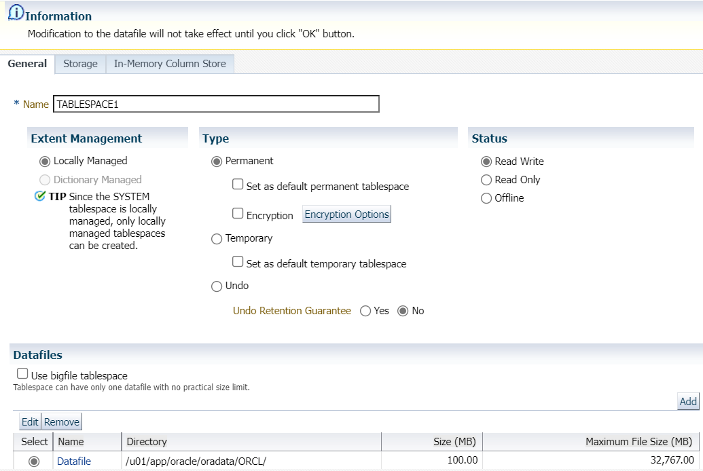
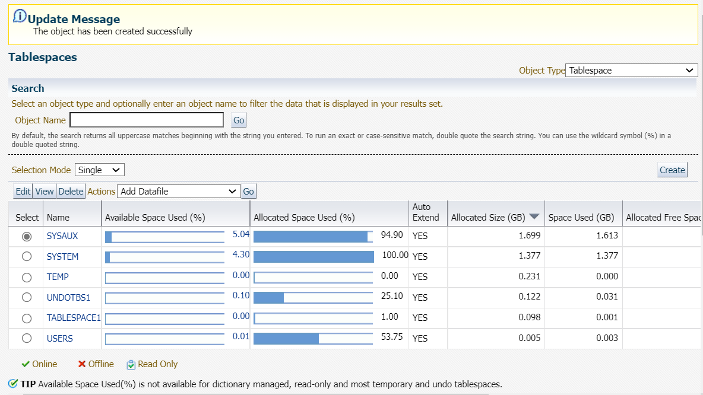

# Manage tablespaces

## Introduction

This lab walks you through the steps to view the tablespaces in your Oracle Database and create a new tablespace.  
  
Estimated time: 15 minutes

### Objectives

Perform these tasks in your Oracle Database from Oracle Enterprise Manager Cloud Control (Oracle EMCC):  

-   View the existing tablespaces
-   Create a new tablespace

### Prerequisites

This lab assumes you have -

-   A Free Tier, Paid or LiveLabs Oracle Cloud account
-   Completed -
    -   Lab: Prepare setup (*Free-tier* and *Paid Tenants* only)
    -   Lab: Setup compute instance
    -   Lab: Initialize environment
-   Logged in to Oracle EMCC in a web browser as *sysman*

## Task 1: View the tablespaces in Oracle Database

For this lab, view the tablespaces in the database from Oracle EMCC. You can view information, such as the configuration, size, and status of the tablespaces.

1.  From the **Targets** menu, select **Databases**.

    

    The Databases page displays a list of Oracle Databases added to Oracle EMCC as managed targets.

    The values may differ depending on the system you are using.

    

2.  On the Database pages, click the Database Instance name, for example, *orcl.us.oracle.com*.

    

    It opens the instance home page.

3.  From the **Administration** menu, go to **Storage** and select **Tablespaces**.

    

    The Database Login Credential page appears.

4.  Select the *Named Credential* option, if not already selected, and click **Login** to connect to the Oracle Database.

    The values may differ depending on the system you are using.

    

    The window displays the tablespaces in the database, including the default tablespaces, such as `SYSTEM` and `SYSAUX`. The values may differ depending on the system you are using.

    

	The table displays the following information for each tablespace:  
	- the Container where the tablespace resides 
	- the name of the tablespace
	- the Available Space in percentage and in size (GB)  
	- the Allocated Space in percentage and in size (GB)  
	- the Allocated Free Space in size (GB)
	- whether the Auto Extend feature is enabled
	- the Status of the tablespace indicating that it is online, offline, or read-only 
	- the Number of Datafiles  
	- the type of Tablespace
	- the type of Extent Management 
	- the type of Segment Management

## Task 2: Create a new tablespace

You can create new tablespaces to keep your application data separate for backup and recovery. If the application data is kept in a separate tablespace, then you can take that tablespace offline and recover it, without affecting the operation of other database applications.

For this lab, create a new tablespace *Tablespace1* in the Container Database (CDB).

1.  On the Tablespaces home page, click **Create** to initiate creating a new tablespace.  
	The values may differ depending on the system you are using.

    

    > **Note:** The **Create Like** option from the Actions drop-down list creates a tablespace similar to an existing tablespace. For this lab, do not use this option.

2.	The window prompts to select the container where you want to create the tablespace.   
	For this lab, select the root container *CDB$ROOT* and click **Continue**.  
	The values may differ depending on the system you are using.

    

3.  On the Create Tablespace page in the **General** tab, specify the details of the new tablespace.

    

	For this lab, specify the following:
     - **Name** - Enter a name for the tablespace, for example, *Tablespace1*.
     - **Extent management** - Leave the default option, *Locally Managed*.
     - **Type** - *Permanent*. This option stores permanent data, such as system data.
     - **Status** - Leave the default option, *Read Write*. This option allows you to read and write to the tablespace after creating it.

4.  In the **Datafiles** section of the **General** tab, click **Add** to add one or more data files to the tablespace.

    

     > **Note:** The **Use bigfile tablespace** option allows a tablespace to have only one data file with no practical size limit. For this lab, do not select this option.

5.  The Add Datafile page appears. Specify the following for the Datafile.
     - **File Name** - Enter a name, for example, *Datafile*.
     - **File Directory** - It displays a pre-filled value. You can click the magnifier icon besides this field to change the current directory. For this lab, do not change the default value.
     - **Tablespace** - It displays the tablespace name. You cannot modify this value.
     - **File Size** - *100 MB*

    

6.  In the Storage section, specify the following.

     - Select **Automatically extend data file when full (AUTOEXTEND)**. This sets the tablespace to automatically extend itself by a specified amount when it reaches its size limit.

         > **Note**: You can set a tablespace to automatically extend itself by a specified amount when it reaches its size limit. If you do not enable the autoextend option, then the database gives an alert when the tablespace reaches its critical or warning threshold size.

     - **Increment** - *10 MB*. This is the amount of disk space added to the data file when it needs more storage space.
     - **Maximum File Size** - *Unlimited*. This option permits the file size to increase without any limits.  

	Click **Continue** to proceed.

	The Create Tablespace page appears and displays a message stating that the changes are not confirmed until you click the **OK** button.

    

7.  Leave the default values for the **Storage** and **In-Memory Column Store** tabs. Review the information on the **General** tab and click **OK** to create the tablespace.  
	The values may differ depending on the system you are using.

	

    Oracle EMCC displays a message confirming that you have created the tablespace. The page displays the newly created tablespace in the given table.

You may now **proceed to the next lab**.

## Acknowledgements

- **Author** - Manisha Mati, Database User Assistance team
- **Contributors** - Suresh Rajan, Manish Garodia, Ashwini R, Jayaprakash Subramanian
- **Last Updated By/Date** - Manisha Mati, May 2022