# Manage undo data

## Introduction

This lab walks you through the steps to view and manage the undo data from Oracle Enterprise Manager Cloud Control (Oracle EMCC).  

Estimated time: 15 minutes

### Objectives

Perform these tasks in your Oracle Database from Oracle EMCC:

-   View the undo data
-   Compute the minimum undo tablespace size using the Undo Advisor
-   Set the undo tablespace size to a fixed size using the Undo Advisor

> **Note:** For the minimum undo tablespace size, you have two options. You can either compute the size automatically or set it manually.

### Prerequisites

This lab assumes you have -

-   A Free Tier, Paid or LiveLabs Oracle Cloud account
-   Completed -
    -   Lab: Prepare setup (*Free-tier* and *Paid Tenants* only)
    -   Lab: Setup compute instance
    -   Lab: Initialize environment
-   Logged in to Oracle EMCC in a web browser as *sysman*

## Task 1: View undo information

1.  From the **Targets** menu, select **Databases**.

    

	The Databases page displays a list of target databases added to Oracle EMCC.

    The values may differ depending on the system you are using.

    

2.  On the Database pages, click the Database Instance name, for example, *orcl.us.oracle.com*.

    

    It opens the instance home page.

3.  From the **Administration** menu, go to **Storage** and select **Automatic Undo Management**.

    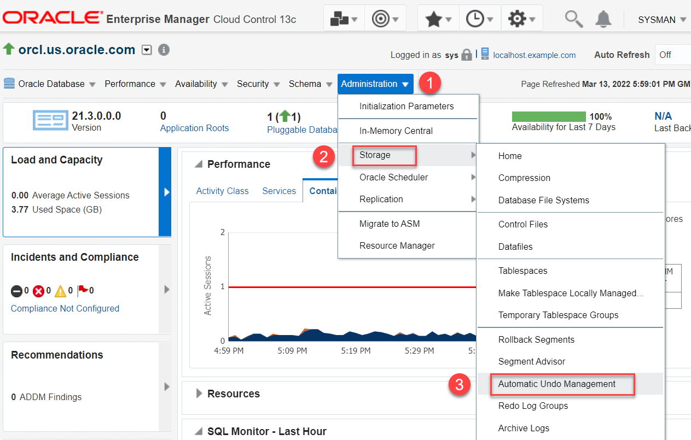

    The Database Login Credential page appears if you are not already logged in.

4.  Select the *Named Credential* option, if not already selected, and click **Login** to connect to the Oracle Database.

    The values may differ depending on the system you are using.

    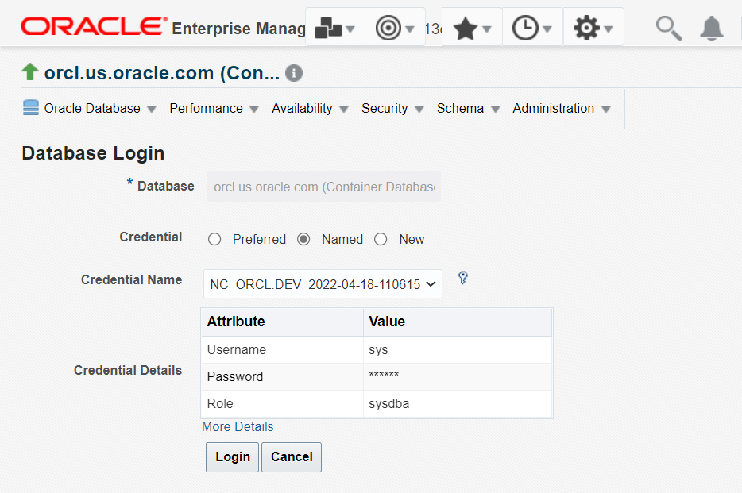

    The Automatic Undo Management page appears.

    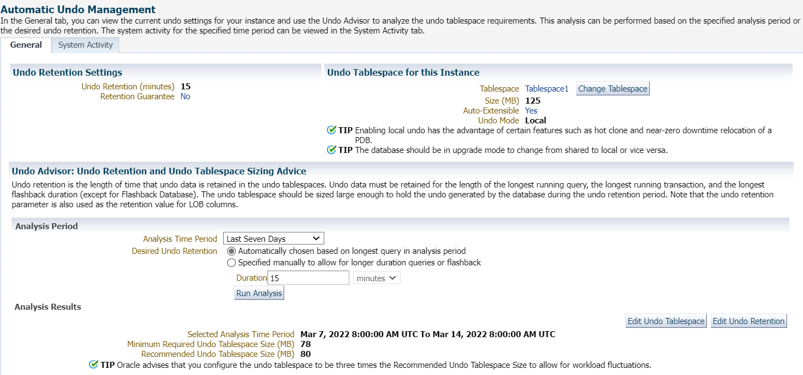

    The page displays the following information on the **General** tab:
    - the name and size of the tablespace
    - whether Auto-Extensible is enabled for the tablespace
    - the Undo Mode information

    It also shows information about the **Undo Advisor** settings such as:  
    - Analysis Time Period
    - Desired Undo Retention period
    - Minimum Required Undo Tablespace Size (in MB)  
    - Recommended Undo Tablespace Size (in MB)

> **Note:** The database instance can have multiple undo tablespaces, but only one can be active at a given time.

## Task 2: Options to compute the minimum undo tablespace size

Oracle Database automatically manages the undo data and the undo tablespaces. With the Undo Advisor, you can determine the minimum size requirement for the undo tablespace for a particular undo retention time.

You can either compute the minimum size of the undo tablespace automatically or set the undo retention period manually.

-   To compute it automatically, perform *Task 2A*.
-   To set the undo retention period manually, skip to *Task 2B*.

## Task 2A: Compute minimum undo tablespace size automatically

The automatically calculated undo retention time is based on the duration of the longest-running query and the undo generation rate. Oracle recommends to follow this task if you do not use the Oracle Flashback features. The Undo Advisor analyses the data collected over a specific periods of time.

In this task, you will configure Undo Advisor to compute the minimum undo tablespace size automatically.

1.  On the Automatic Undo Management page in the Analysis Period section, specify the following: 

     - **Analysis Time Period**: Select the time period for the analysis.   
	    For this lab, leave the default value *Last Seven Days*.
     - **Desired Undo Retention**:  Leave the default option, *Automatically chosen based on longest query in analysis period*.

		 > **Note**: The undo advisor automatically calculates this value depending on the duration of the longest-running query and the undo generation rate. These values are visible on the **System Activity** tab of this page.

    

2.  Click **Run Analysis** to analyze the minimum and recommended Undo Tablespace size.

	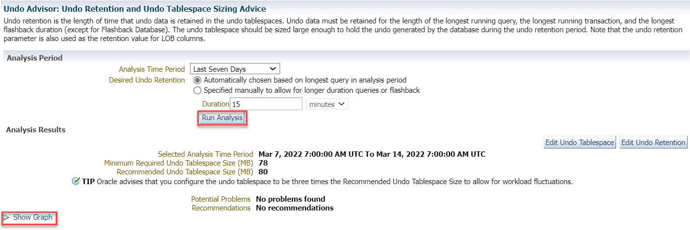

    The Undo Advisor evaluates and displays the Analysis Results.

3.   Click **Show Graph** to view the analysis results in the graphical format.

    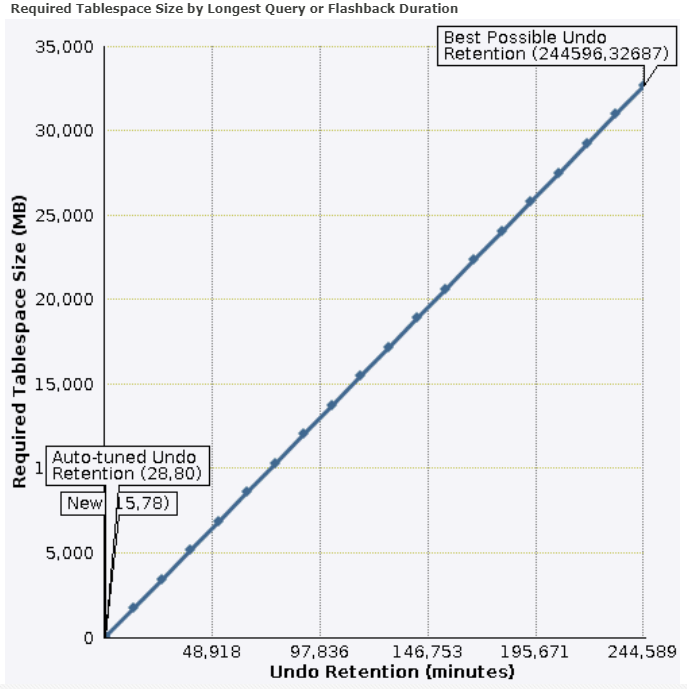

    > **Note:** Running an analysis or setting the minimum undo retention with the Undo Advisor does not change the size of the undo tablespace.

## Task 2B: Set the minimum undo retention period manually

In this task, you will specify the duration of the undo retention period.

1.  On the Automatic Undo Management page in the Analysis Period section, specify the following:

     - **Analysis Time Period**: Select the time period for the analysis.   
	   For this lab, leave the default value *Last Seven Days*.
	 - **Desired Undo Retention**: Select the *Specified manually to allow for longer duration queries or flashback option*.

    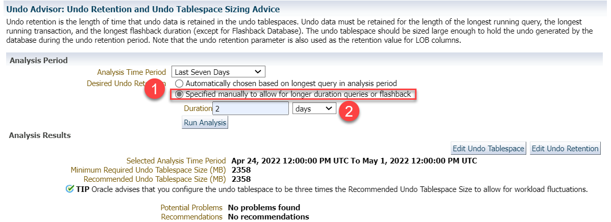

2.  For this task, enter the **Duration** of the desired undo retention as *2* and select the unit as *days*.

    > **Note:** This value must be greater than the longest-running active query. The maximum value for the longest undo retention is *2,147,483,647* seconds. If you enter a value greater than the maximum value, Oracle Database returns an Undo Management error.

    To determine the duration of your Desired Undo retention:   
    - Check the longest-running query for your workload
    - Determine the longest interval for Oracle Flashback operations
    - Determine the maximum of the above two values and enter this duration. For this lab, it is *2 days*.

3.  Go to the **System Activity** tab to see the duration of the longest-running query. In this example, it is *44* minutes.  
    The values may differ depending on the system you are using.

    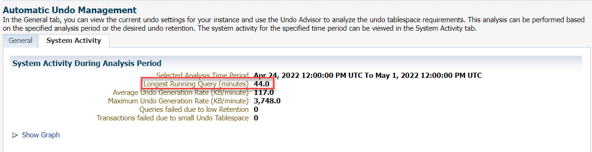

4.  Go back to the **General** tab and click **Run Analysis** to analyze the minimum and recommended Undo Tablespace size.  
    The Undo Advisor evaluates and displays the Analysis Results.

    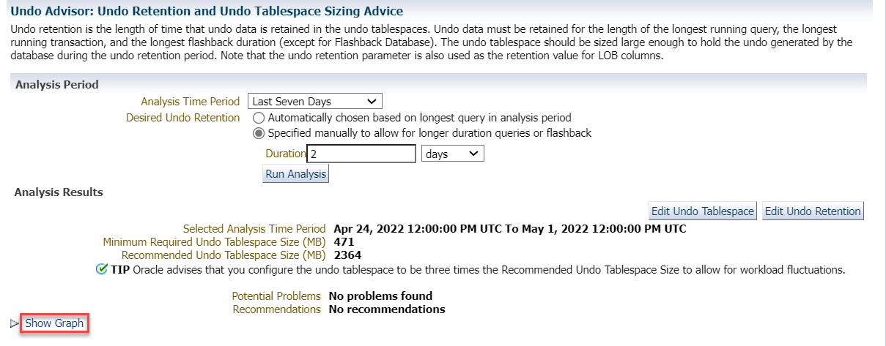

5.  Click **Show Graph** to view the analysis results in the graphical format.

    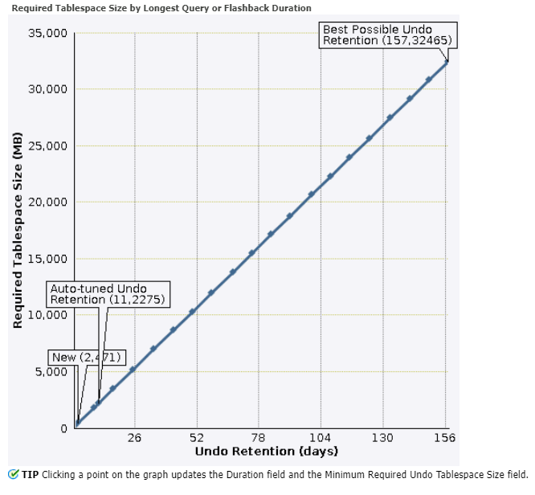

    > **Note**: By selecting any preferred value of undo retention period on any point on the curve, the **Duration** field changes to match the selected undo retention period and the **Minimum Required Undo Tablespace Size** field above the graph changes to reflect the matching required size.

## Task 3: Set the undo tablespace to a fixed size

You can configure the undo tablespace to have a fixed size. You first set the undo tablespace to its minimum required size in order to handle the workload. Then use Undo Advisor to set the undo tablespace to a fixed size for future long-running queries and for Oracle Flashback operations.

1.   On the Automatic Undo Management page under the Analysis Results section, click **Edit Undo Tablespace**.

    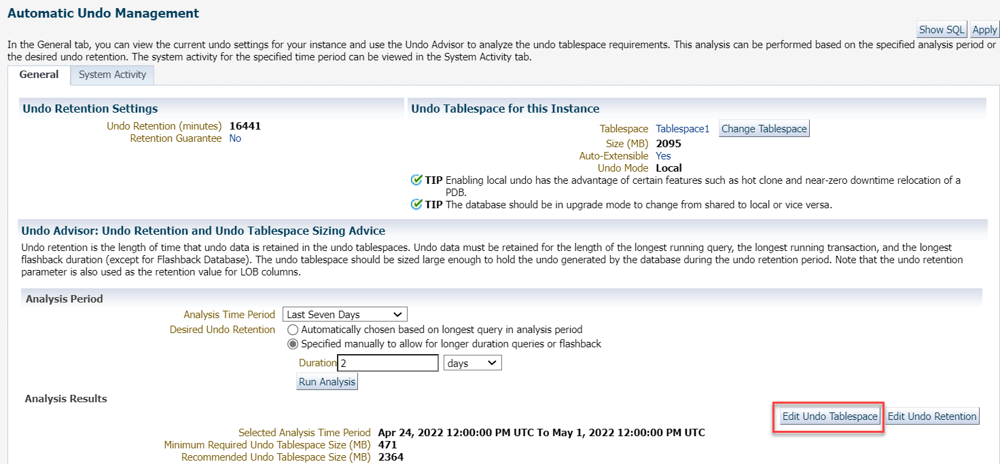

    The Edit Tablespace page opens with the **General** tab and displays the information about the tablespace.

2.  Under Datafiles, click **Edit**.

    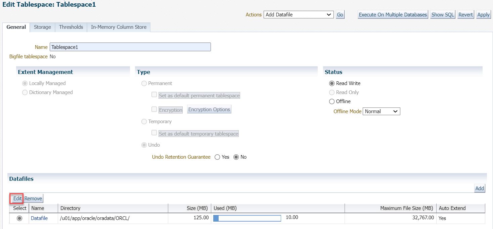

3.  On the Edit Datafile page, specify the following.

    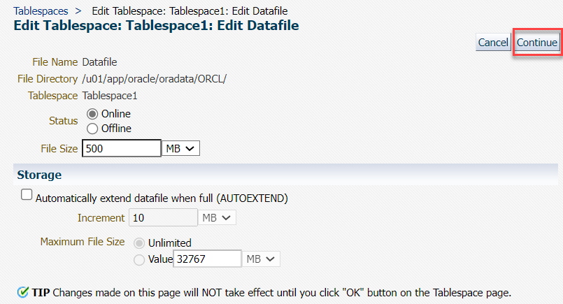

     - **File Size:** Enter *500 MB*.  
        This is the value of the minimum required undo tablespace size from the previous task.

	 - Leave the **Status** as default, *Online*.

		 > **Note**: If the status of the Tablespace is *Offline*, then you cannot access it. The Offline status is useful for recovering the data files of the tablespace in event of a failure.

     - Under Storage, deselect **Automatically extend data file when full (AUTOEXTEND)**.

    Click **Continue** to proceed. The window goes back to the Edit Tablespace page and displays a message to apply the changes.

4.  Click **Apply** to make the changes.

    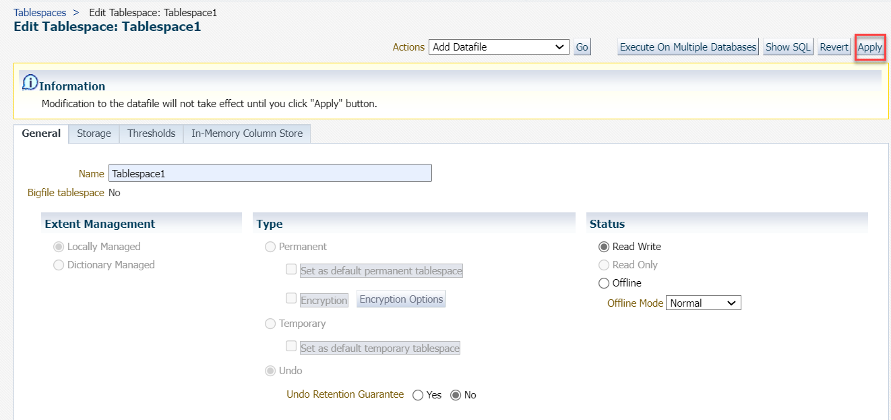

	Oracle EMCC displays a message to confirm that the tablespace has been modified.

    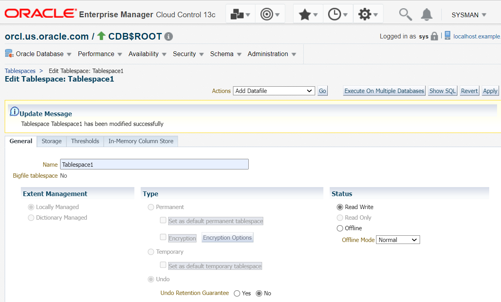

You have now modified the undo tablespace to a fixed size.

Congratulations! You have successfully completed the workshop on *Storage structures for Oracle Database*.

In this workshop you learned how to view control files, online redo log files, archived redo log files and undo data information. You also multiplexed the online redo log files and computed the minimum undo tablespace size from Oracle EMCC using Undo Advisor.

## Acknowledgements

- **Author** - Manisha Mati, Database User Assistance team
- **Contributors** - Suresh Rajan, Manish Garodia, Ashwini R, Jayaprakash Subramanian
- **Last Updated By/Date** - Manisha Mati, May 2022