# View and multiplex online redo log file information

## Introduction

This lab walks you through the steps to view and multiplex Online Redo Log File information of your Oracle Database.

Estimated time: 15 minutes

### Objectives

View and multiplex online redo log file information from Oracle Enterprise Manager Cloud Control (Oracle EMCC).

### Prerequisites

This lab assumes you have -

-   A Free Tier, Paid or LiveLabs Oracle Cloud account
-   Completed -
    -   Lab: Prepare setup (*Free-tier* and *Paid Tenants* only)
    -   Lab: Setup compute instance
    -   Lab: Initialize environment
-   Logged in to Oracle EMCC in a web browser as *sysman*

## Task 1: View Online Redo Log File

Oracle Database maintains online redo log files to protect it against data loss. Specifically, after an instance fails, the online redo log files help the database to recover committed data.

An online redo log consists of two or more online redo log files. Oracle Database requires a minimum of two files to confirm that one is always available for writing while the other is in archive mode.

View online redo log file of your Oracle Database as follows.

1.  From the **Targets** menu, select **Databases**.

    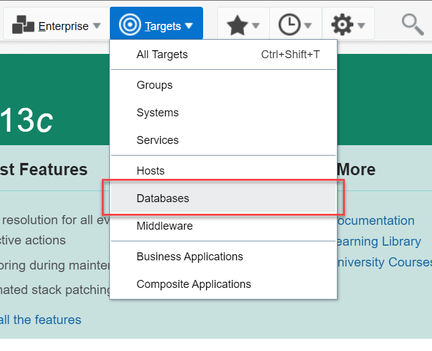

    The Databases page displays a list of Oracle Databases added to Oracle EMCC as managed targets.

    The values may differ depending on the system you are using.

	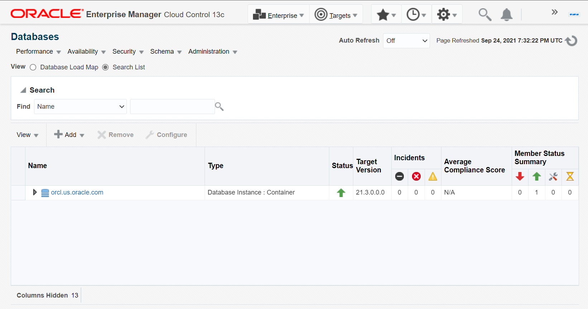

2.  On the Database pages, click the Database Instance name, for example, *orcl.us.oracle.com*.

    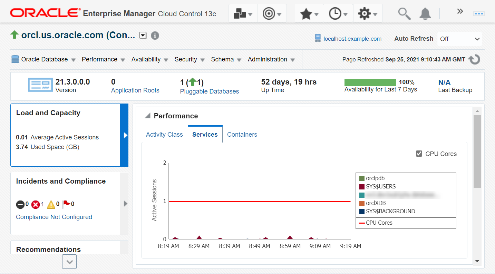

    It opens the instance home page.

3.  From the **Administration** menu, go to **Storage** and select **Redo Log Groups**.

    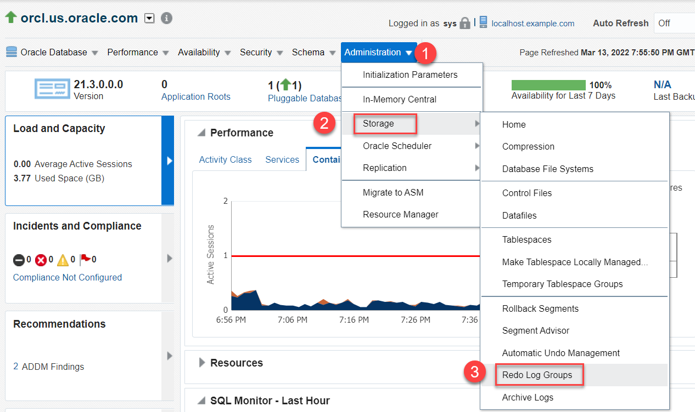

    The Database Login Credential page appears.

4.  Select the *Named Credential* option, if not already selected, and click **Login** to connect to the Oracle Database.

    The values may differ depending on the system you are using.

    

    The Redo Log Groups page appears. The values may differ depending on the system you are using.

    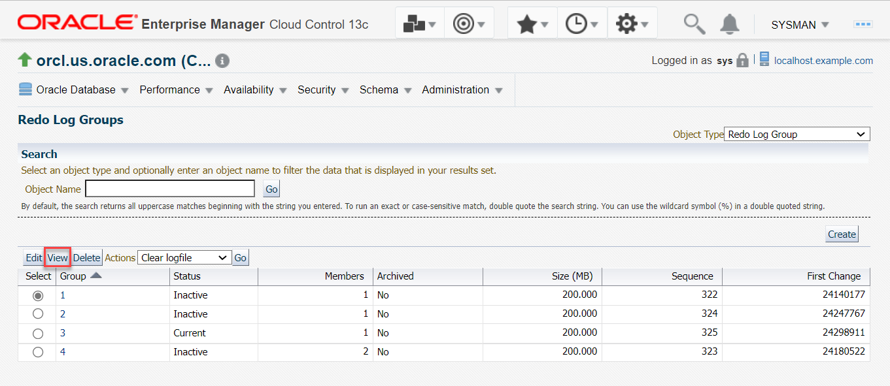

    This page contains the Redo Log Groups and displays the following information:
    - the **Group** of online redo log files. A group consists of an online redo log file and its multiplexed copies. It is a numerical value.
    - the **Status** attribute of the online redo log group. The online redo log group with the status *Current* is the one that the log writer is using to write to the disk.  
    - the **Members** of the online redo log group. Each identical copy of the online redo log file is a member of that group.
    - the **Archived** attribute of the online redo log group. It is set to *Yes* when you enable archiving of the online redo logs.
    - the **Size** of the online redo log group.
    - the **Sequence** attribute of the online redo log group.
    - the **First Change** attribute of the online redo log group.

5.  Click *Group 1* in the Select column and select **View** to view the online redo log files present in the Group 1.

	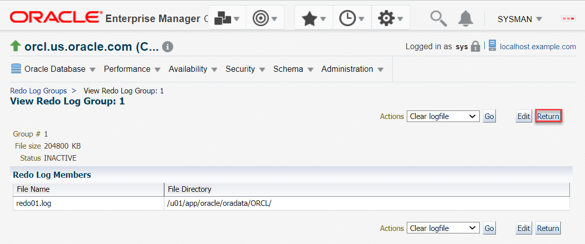	
	
	The View Redo Log Group page displays the number of redo log files present in that group. For this lab, it has one Redo Log file present in Group 1. It also displays the location of the Redo log file.

6. Select **Return** to go back to the Redo Log Groups page.	
	
## Task 2: Multiplex Online Redo Log information

When you multiplex the online redo log information, you maintaining multiple copies of the online redo log files. 

> **Note:** Oracle recommends that you maintain multiple members of an online redo log group. This protects the database against the loss of the redo log. 

For this lab, multiplex the online redo log file in *Group 1*.

1.  On the Redo Log Groups page, select a group number, for example, *Group 1* and click **Edit**.

    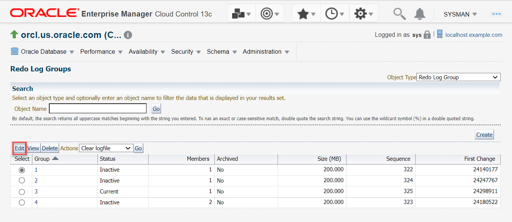

    The Edit Redo Log Group page appears.

2.  Click **Add** to add a new member to the Redo Log Group.  
	The values may differ depending on the system you are using.

    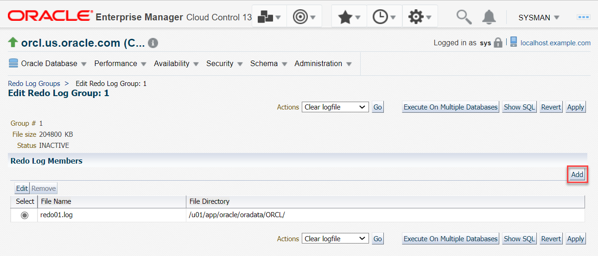

	The Add Redo Log Member page appears.

3.  For adding a redo log member, specify the following.

     - **File Name**: Enter a name for the redo log file, for example, *REDO01a.log*  
     - **File Directory**: Enter the location for the file. For this lab, the file directory is */u01/app/oracle/oradata/ORCL/*.

    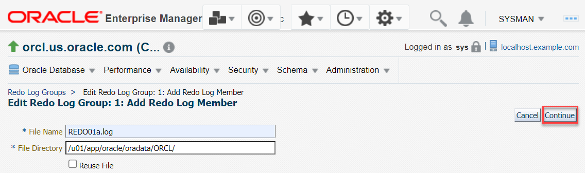

     > **Note**: To protect against a failure involving the redo log itself, Oracle recommends that you enter a different directory than the other member of the redo log file group. However, even if all copies of the redo log are on the same location, the redundancy can help protect against I/O errors, file corruption, and so on.

4.	Click **Continue** to proceed. The Edit Redo Log Group page displays the newly added member of the online redo group. The values may differ depending on the system you are using.

    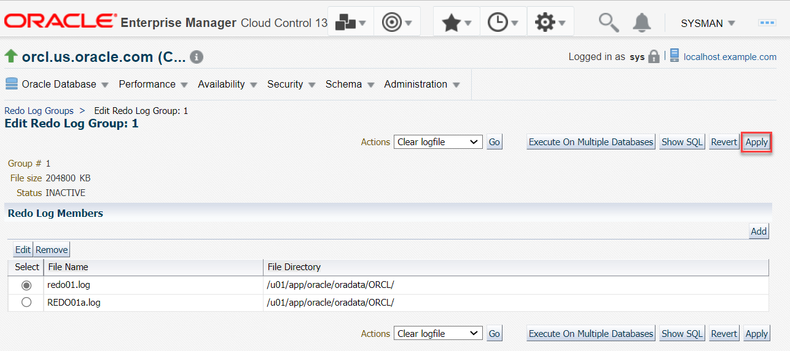

5.  Click **Apply** to multiplex the redo log file.  
	The values may differ depending on the system you are using.

    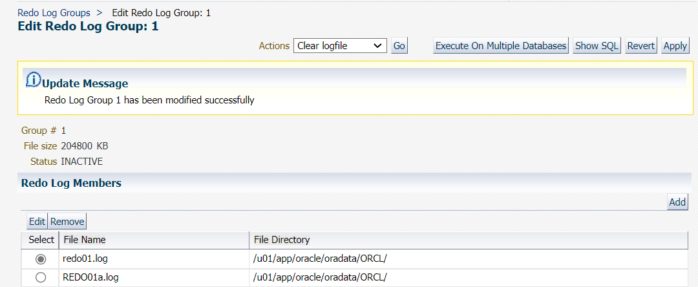

    An update message appears confirming that the *Redo Log Group 1* has been modified.

    > **Note**: Oracle Database does not require symmetrical multiplexed redo log files. For example, one online redo log group can have only one member, and other groups can have two members. However, an instance redo log must have at least two groups.

You may now **proceed to the next lab**.

## Acknowledgements

- **Author** - Manisha Mati, Database User Assistance team
- **Contributors** - Suresh Rajan, Manish Garodia, Ashwini R, Jayaprakash Subramanian
- **Last Updated By/Date** - Manisha Mati, May 2022