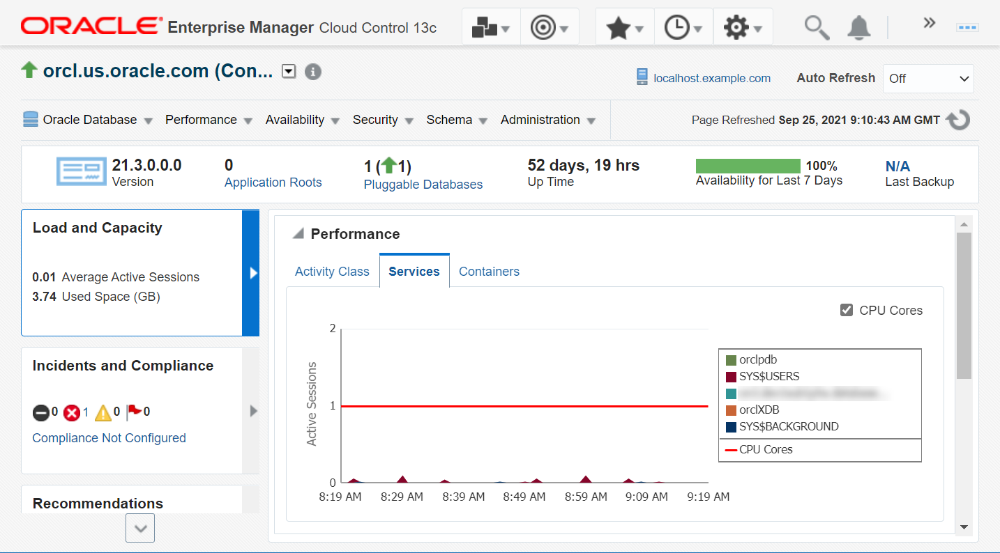
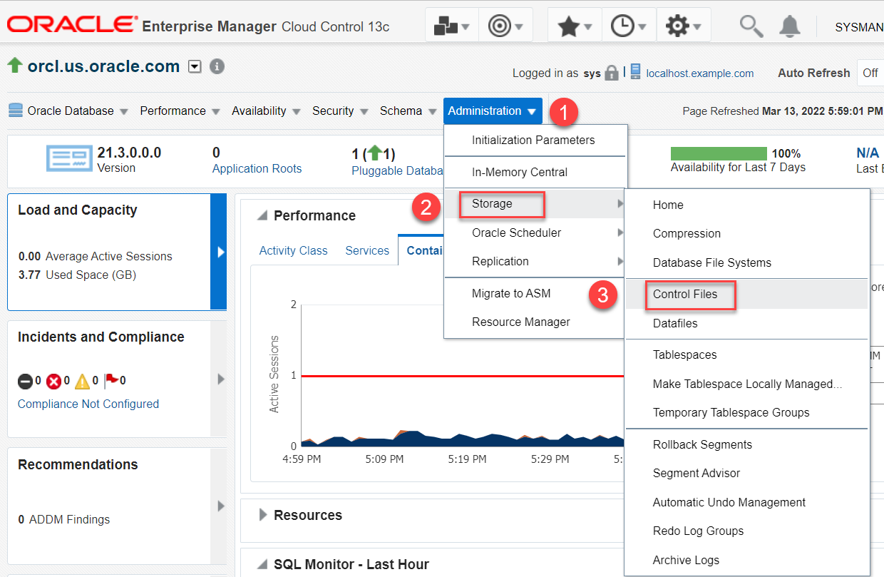
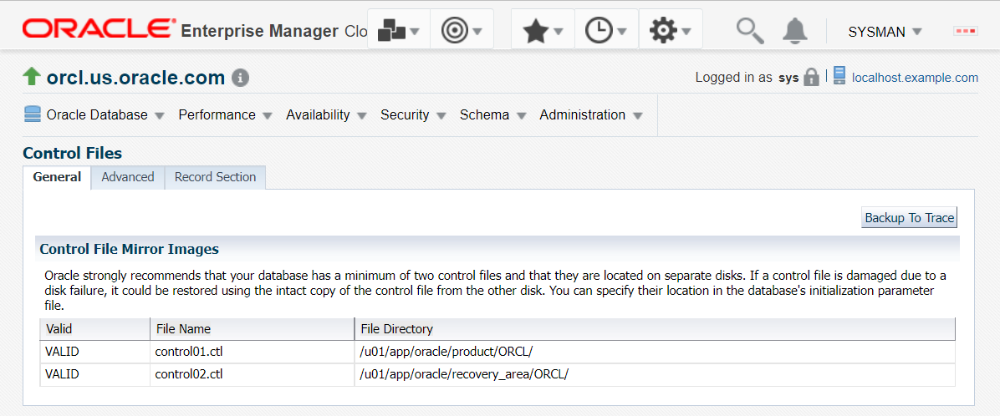
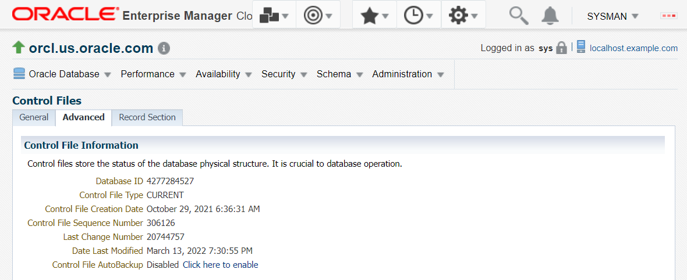
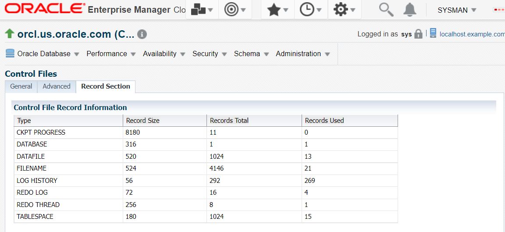
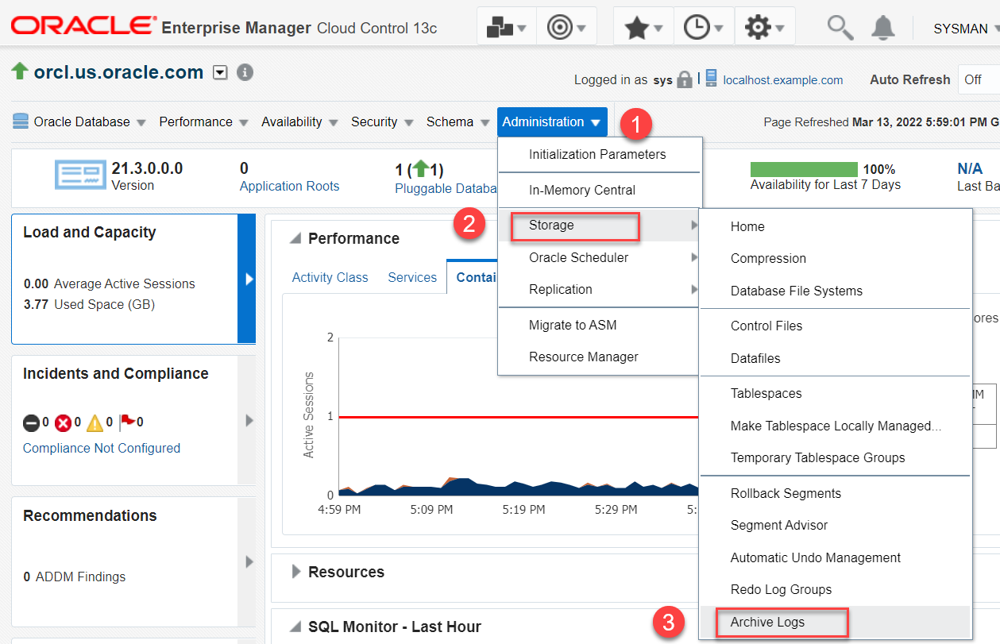
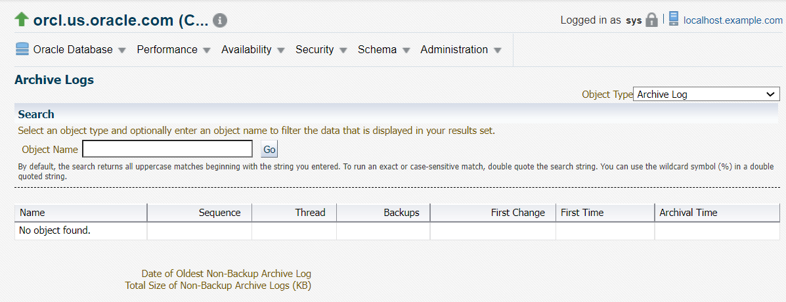

# View the storage structures in Oracle Database

## Introduction

This lab walks you through the steps to view storage structures in your Oracle Database.

Estimated time: 15 minutes

### Objectives

View Control Files and Archive Logs in your database from Oracle Enterprise Manager Cloud Control (Oracle EMCC).

### Prerequisites

This lab assumes you have -

-   A Free Tier, Paid or LiveLabs Oracle Cloud account
-   Completed -
    -   Lab: Prepare setup (*Free-tier* and *Paid Tenants* only)
    -   Lab: Setup compute instance
    -   Lab: Initialize environment
-   Logged in to Oracle EMCC in a web browser as *sysman*

## Task 1: View Control Files

Control files track the structural changes to the database. When you add, rename, or delete a data file or an online redo log file, the database updates the control files to reflect this change. You can view this information from the Control Files page.

For this lab, view the control file information from the database instance home page.

1.  From the **Targets** menu, select **Databases**.

    

	The Databases page displays a list of Oracle Databases added to Oracle EMCC as managed targets.  
	The values may differ depending on the system you are using.

    

2.  On the Database pages, click the Database Instance name, for example, *orcl.us.oracle.com*.

    

    It opens the instance home page.

3.  From the **Administration** menu, go to the **Storage** option and select **Control Files**.

    

    Oracle EMCC redirects to the Database Login page.

4.  Select the *Named Credential* option if not already selected, and click **Login** to connect to the Oracle Database.

    

    You will be directed to the Control Files page.

    On the Control files page, the **General** tab displays the control files and their location.  
	The values may differ depending on the system you are using.

    

     > **Note**: Oracle recommends that you maintain a copy of the control files on different disk drives.

5.   Click on the **Advanced** tab to view the status of the data stored in the control file.  
	The values may differ depending on the system you are using.

    

    This tab displays the following information.
	- the Database ID
    - the type of control file
    - the timestamp of control file creation
    - the current log sequence number
    - the last changed number
    - the timestamp of the last modification
	- whether the control file has AutoBackup enabled

6.  Click on the **Record Section** tab to view the control file record information.  
	The values may differ depending on the system you are using.

    

    This tab displays the names of associated data files and redo log files.  
	Click on the instance name, *orcl.us.oracle.com*, and go to the instance home page.

    

## Task 2: View Archive Logs

From Oracle EMCC, you can view the archive log information of your Oracle Database.

1.  On the Database Instance home page, from the **Administration** menu, go to **Storage** and select **Archive Logs**.

    

	If you are already logged in to Oracle Database, then Oracle EMCC does not redirect to the Database Login page. Select the *Named* Credential option to connect to the database, if this page appears.

    The window opens the Archive Logs page.

    

    If your database is in the `ARCHIVELOG` mode, you will see the archived redo log information on this page. 
	
	For this lab, the database is not in this mode, hence the table contains no records.

    You may now **proceed to the next lab**.

## Acknowledgements

- **Author** - Manisha Mati, Database User Assistance team
- **Contributors** - Suresh Rajan, Manish Garodia, Ashwini R, Jayaprakash Subramanian
- **Last Updated By/Date** - Manisha Mati, May 2022