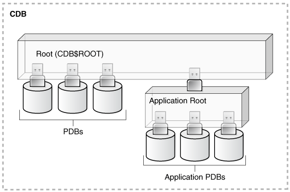
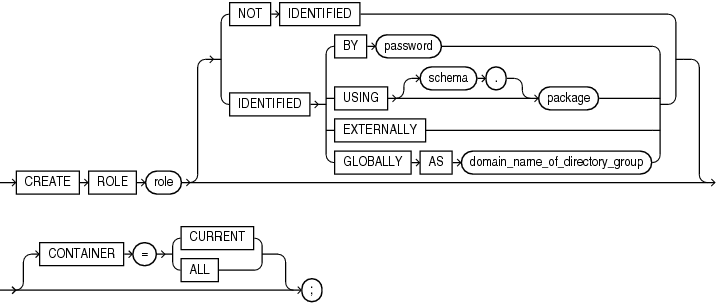

# User administration and security privileges in Oracle Database

## About this workshop

This workshop aims at explaining user administration and security management for your Oracle Database 21c from Oracle Enterprise Manager Cloud Control (Oracle EMCC). It helps you manage database user accounts, grant roles and access privileges to those accounts so that users can access Oracle Database with appropriate rights.

**Why database needs user administration?**

In most systems, it is time-consuming and error-prone to grant necessary privileges to each user individually. Oracle Database software provides an easy and controlled method for user administration and database security.

The roles and privileges granted to a user account determine the type of access the user has in the database. User privileges are designed to restrict user access to data and to control the SQL statements that users can execute, therefore, improving the security.

Estimated workshop time: 1 hour 30 minutes

### Objectives

In this workshop, you will learn how to:

 -   *view database user accounts and roles* from Oracle EMCC
 -   *create a new role* in Oracle Database
 -   *modify the roles* in your database
 -   *create a new user account* in Oracle Database
 -   *unlock the user accounts* in your database
 -   *log in to the database* as the newly created user

### Prerequisites

This lab assumes you have -

 - A Free Tier, Paid or LiveLabs Oracle Cloud account

## Appendix 1: Database user accounts, roles, and privileges

For users to access your Oracle Database, you require user accounts with appropriate roles and privileges. You create and manage user accounts for the people and applications that use your database.

### About user accounts

A user account, identified by a user name, defines the attributes the user has.

While creating a user account, you also define the following.

 -   the authentication method
 -   the account status (locked or open)
 -   the password status (expired or active)
 -   the default tablespaces for temporary and permanent data storage
 -   the tablespace quotas
 -   the roles, system privileges, and object privileges

Creating a user account implicitly creates a schema for that user. A **schema** is a logical container for database objects (such as tables, views, triggers, and so on) that the user creates. Usually, the schema name is the same as the user name, and refers to the objects owned by the user.

For example, `hr.employees` refers to the table named `employees` in the `hr` schema. If you want to delete schema objects, you may delete them individually or while deleting the user account.  

### Types of user accounts based on container

The figure below illustrates the access hierarchy of users in Oracle Database.

Database user accounts can be common (in the Container Database, CDB) or local (in the Pluggable Database, PDB).  

 -   **Common users in CDB**  
     A common user in the database has the same identity in the root and in every existing and future PDBs. Every common user can connect to and perform operations within the root, and within the PDBs where the common user has privileges.   

     > **Note:** While creating a common user, begin the user name with the characters `c##` or `C##`.  

    An application common user exists in an application root and is common only within the application container. Thus, the application common user does not have access to the entire CDB environment, like the CDB common users.  

 -   **Local users in PDB**  
     A user local to a PDB can operate only within that PDB. It cannot log in to other PDBs or to the root container. Neither can you create a local user in the root.

#### Who can create database user accounts?

Users having the `CREATE USER` system privilege can create user accounts in Oracle Database, including proxy users. The `CREATE USER` privilege is one of the primary administrative system privileges. Only a database administrator or a security administrator has this privilege.

> **Note:** Oracle recommends the principle of least privilege where you grant only those privileges required to perform the task. You grant each user with specific roles and privileges to perform a defined set of activities. For example, a database application developer can create and modify tables, indexes, views, and stored procedures, but cannot drop (delete) tablespaces or recover the database. Therefore, you create user accounts for specific purposes, and grant only a subset of roles and selective privileges to those accounts.

### Roles

Roles are named groups of related privileges. Users (primarily database administrators) create roles and grant them to users or to other roles.

While creating user accounts, you grant roles and privileges to:

 -   enable the user to connect to Oracle Database
 -   run queries and make updates
 -   create schema objects, etc.

The roles that exist in the database by default are common roles. However, you can create custom roles that can be either common or local. 

 -   **Common roles in CDB**  
     A common role exists in the root container. Common roles are useful for cross-container operations, ensuring that a common user has a role in every container.   

     > **Note:** While creating a common role, begin the name of the role with the characters `c##` or `C##`.  

 -   **Local roles in PDB**  
     A role local to a PDB exists only within that PDB. It can contain roles and privileges that apply within the container where the role exists.  

     > **Note:** Different PDBs in the same multitenant CDB may have local roles with the exact same name, for example `pdbadmin`. Though they are local, the roles are completely independent of each other.

In Oracle Database, you create roles, grant system and object privileges to the roles, and then grant roles to the users. You can also grant roles to other roles. Unlike schema objects, roles are not contained in any schema.

### Privileges in Oracle Database

User privileges provide a basic level of security to the database. The main user privileges in Oracle Database are:

 -   **System Privileges** —  
      It gives a user the ability to perform an action on any schema objects of a particular type.  
     For example:  
     The system privilege `CREATE TABLE` permits the user to create tables in the schema associated with that user.  
     The system privilege `CREATE USER` permits the user to create database user accounts.  

 -   **Object Privileges** —  
     It gives a user the ability to perform a particular action on a specific schema object. The privilege to select rows from the `EMPLOYEES` table or to delete rows from the `DEPARTMENTS` table are examples of object privileges.

A privilege or a role granted locally is available only to the container where it is granted. On the other hand, a privilege or a role granted commonly is exercisable in all existing and future containers. A privilege in itself is neither common nor local.

> **Note:** When you grant roles or privileges in Oracle EMCC, the container where the role or privilege is granted determines whether it is a commonly granted or locally granted privilege or role.

Local users, roles, and privileges are by definition restricted to a particular container. Thus, local users cannot grant roles and privileges commonly, and local roles and privileges cannot be granted commonly. However, administrative accounts and privileges have far greater control and authority over the objects and the operations of the database. 

## Appendix 2: Administrative accounts and system privileges

In addition to the custom user accounts that you create, Oracle Database includes several predefined administrative accounts and sample schemas that are automatically created during the database installation. 

**What are administrative accounts?**

Administrative accounts are highly privileged, powerful accounts assigned to individuals who can perform authoritative tasks, such as managing database users, managing memory and storage, starting up and shutting down the database, monitoring database objects, and so on.

The administrative accounts created during database installation are `SYS`, `SYSTEM`, and `DBSNMP`. The system privileges in Oracle Database are `SYSDBA` and `SYSOPER`.

 -   `SYS`  
    This account can perform all administrative functions. The `SYS` schema stores all base (underlying) tables and views for the database data dictionary.  

     > **Caution:** Do not modify or create any tables in the `SYS` schema.

    During the installation, Oracle Database grants the `SYSDBA` privilege to the `SYS` user. This enables the `SYS` user to perform advanced administrative activities, including backup and recovery.  

 -   `SYSTEM`  
    This account can perform all administrative functions except:
     -   backup and recovery
     -   database upgrade  

     > **Note:** Though you can use the `SYSTEM` account for day-to-day administrative tasks, Oracle recommends creating named user accounts for monitoring and administering the activities of your Oracle Database.

Another administrative account `SYSBACKUP` performs backup and recovery operations in Oracle Database. 

> **Caution:** Do not delete, rename, or modify the administrative accounts in the database.

### Administrative privileges in Oracle Database

Oracle Database requires administrative privileges, `SYSDBA` and `SYSOPER`, to perform advanced administrative operations. Both these privileges allow access to the Database Instance even when the database is not open.

 -   `SYSDBA` is for fully empowered database administrators.
 -   `SYSOPER` allows a user to perform basic operational tasks, but without the ability to look at user data. 

When you log in to Oracle Database as the `SYS` user, you can connect with either `SYSDBA` or `SYSOPER` privileges. 

> **Note:** Connecting to Oracle Database as the `SYS` user gives you unlimited privileges on the data dictionary tables. Ensure that you do not modify any data dictionary tables.

Click on the next lab to **Get started**. 

## Learn More

 -   [Managing Users and Securing the Database](https://docs.oracle.com/en/database/oracle/oracle-database/21/admin/managing-users-and-securing-the-database.html#GUID-6ECD7474-E756-4B3E-B5CF-2B92B1BCACA1)
 -   [Managing Security for Oracle Database Users](https://docs.oracle.com/en/database/oracle/oracle-database/21/dbseg/managing-security-for-oracle-database-users.html#GUID-8C779885-01F2-48E0-9612-E33508885B19)
 -   [Configuring Privilege and Role Authorization](https://docs.oracle.com/en/database/oracle/oracle-database/21/dbseg/configuring-privilege-and-role-authorization.html#GUID-89CE989D-C97F-4CFD-941F-18203090A1AC)

## Acknowledgements

 -   **Author** - Manish Garodia, Database User Assistance Development team
 -   **Contributors** - Team Database UAD
 -   **Last Updated By/Date** - Manish Garodia, May 2022
