# Manage roles

## Introduction

This lab shows the steps for creating and managing roles in your Oracle Database from Oracle Enterprise Manager Cloud Control (Oracle EMCC). 

Estimated time: 10 minutes

### Objectives

Perform these tasks from Oracle EMCC:
 -   View the existing roles in your Oracle Database
 -   Create a new role in Pluggable Database (PDB)
 -   Modify a role

### Prerequisites

This lab assumes you have -

 - A Free Tier, Paid or LiveLabs Oracle Cloud account
 -   Completed -
     -   Lab: Prepare setup (*Free-tier* and *Paid Tenants* only)
     -   Lab: Setup compute instance
     -   Lab: Initialize environment
 -   Logged in to Oracle EMCC in a web browser as *sysman* 

## Task 1: View roles in Oracle Database

Logging into Oracle EMCC as the *sysman* user gives you the privileges to view and manage roles in Oracle Database. In Oracle EMCC, go to the respective container, CDB or PDB, and view the roles in that container. 

For this lab, view the details of the role *CONNECT* in the PDB. 

1.  From the **Targets** menu, select **Databases** to open the Databases page.  

    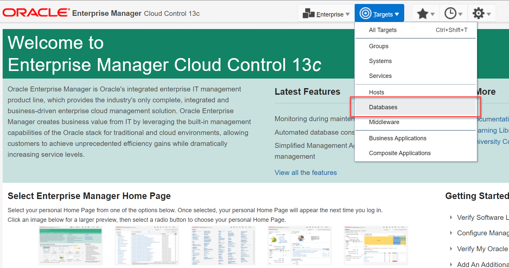  

1.  On the Database pages, expand the Database Instance name, for example, *orcl.us.oracle.com* and click on the PDB name, *ORCLPDB*.  
    The values may differ depending on the system you are using.  

    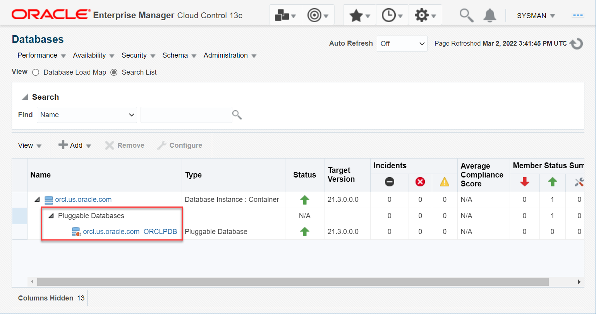

    It opens the PDB home page.

1.  From the **Security** menu on the PDB home page, select **Roles** to access the roles in the PDB.  
    The values may differ depending on the system you are using.  

    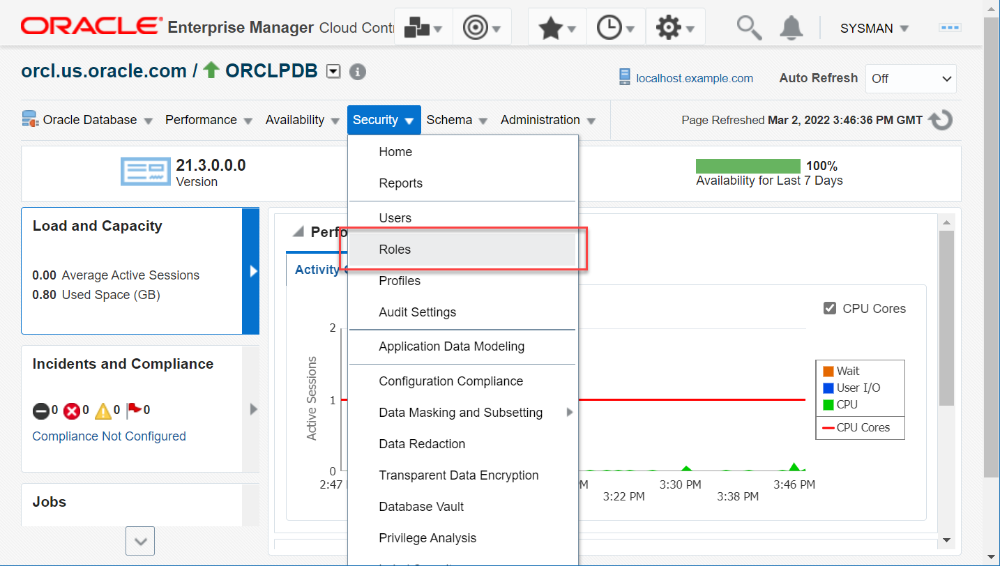

    Oracle EMCC redirects to the Database Login page.  

1.  Select the *Named* Credential option, if not already selected, and click **Login** to connect to the Oracle Database.  
    The values may differ depending on the system you are using.  

    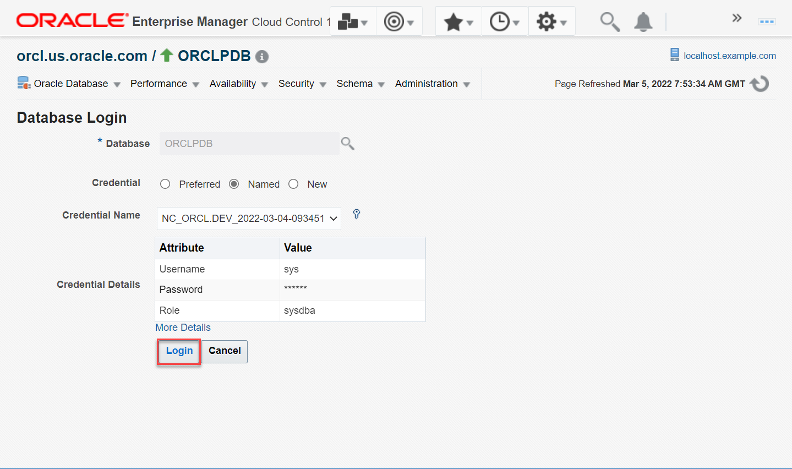

    The Roles page opens and displays all roles in the PDB. The values may differ depending on the system you are using.  

    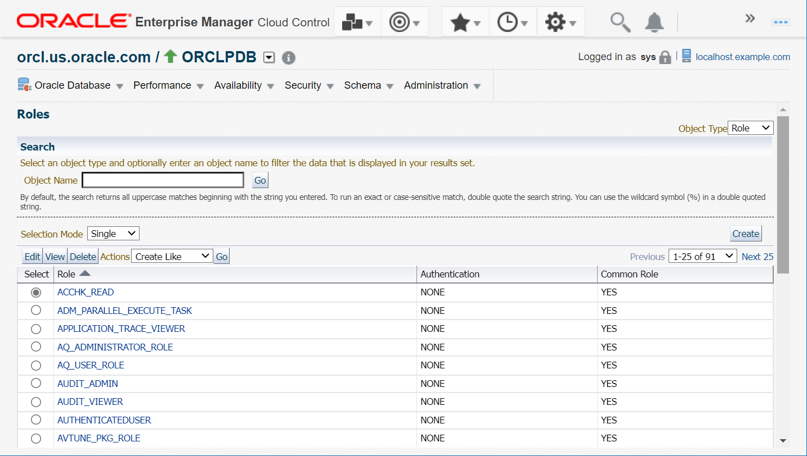  

    The table displays the following information for all roles:  
     - **Role** - the name of the role
     - **Authentication** - the type of authentication for the role, for example, NONE, PASSWORD, etc.
     - **Common Role** - whether the role is common across all containers in the Oracle Database   

    The table has the first role selected by default.  

1.  Select a role from the given table and view its details. For this lab, view the details of the role *CONNECT*.   
    In the **Object Name** field, enter the role name, *connect*, and click **Go** to search for the role.   
	The field is not case-sensitive. The table displays the *CONNECT* role selected.

	Click **View** to see the details of the selected role.  
    The values may differ depending on the system you are using.  

    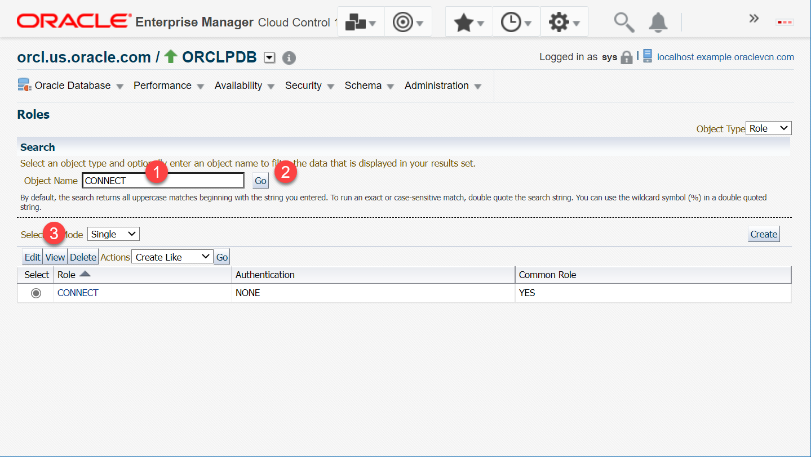  

    Alternatively, you may scroll down the table and click on the role name to view its details.  

1.  The View Role page displays the Authentication type and all the roles and privileges granted to the selected role.   
    The values may differ depending on the system you are using.  
    Note that there are no object privileges granted to the *CONNECT* role.   

    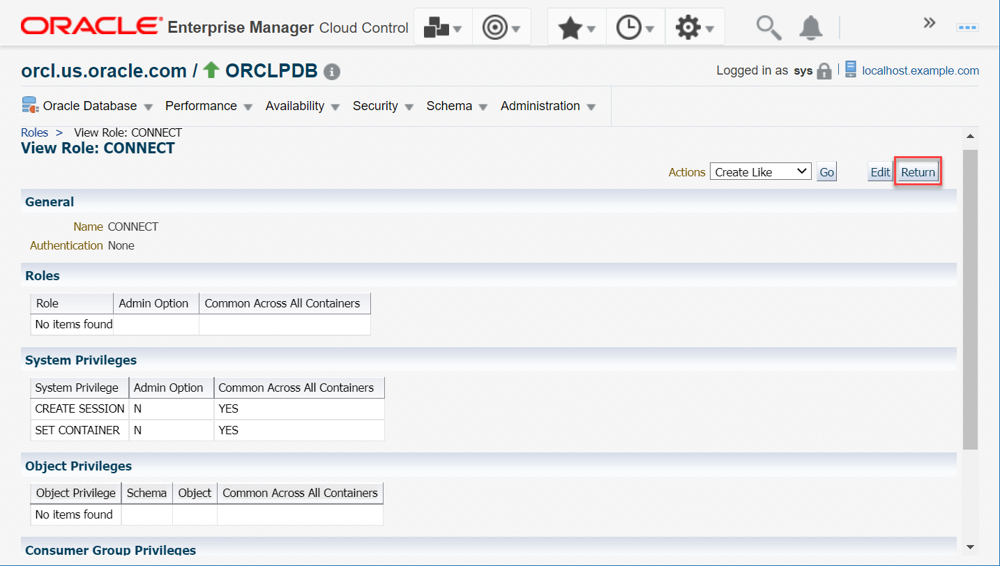  

    Click **Return** to go back to the Roles page.

Similarly, you can view the roles in the CDB from the Database Instance home page in Oracle EMCC. 

## Task 2: Create a role in PDB

You can create a role in your Oracle Database from Oracle EMCC. To create a role in the database, go to the container where you want to create the role. 

> **Note:** If the Oracle EMCC console remains inactive for 15 minutes or more while performing a database operation, you must restart the operation.

For this lab, create a role *appdev* in the PDB for application developers and grant system privileges to the role.

1.  On the Roles page, click **Create** to initiate creating a role in the PDB.  
    The values may differ depending on the system you are using.  

    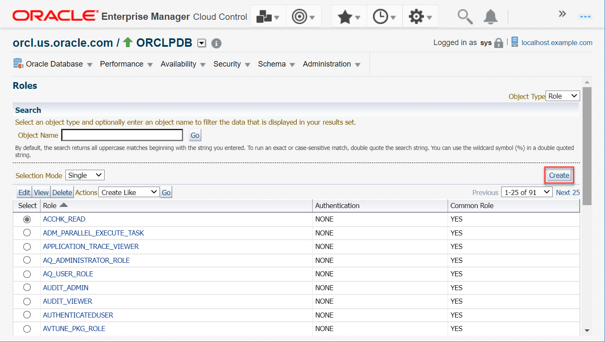  

     > **Note:** The **Create Like** option creates a new role in the database by duplicating an existing role. For this lab, do not use this option. 

1.  On the Create Role page in the **General** tab, enter a **Name** for the role.   
    For this lab, enter the role name as *appdev*. The field is not case-sensitive.  
    The values may differ depending on the system you are using.  

    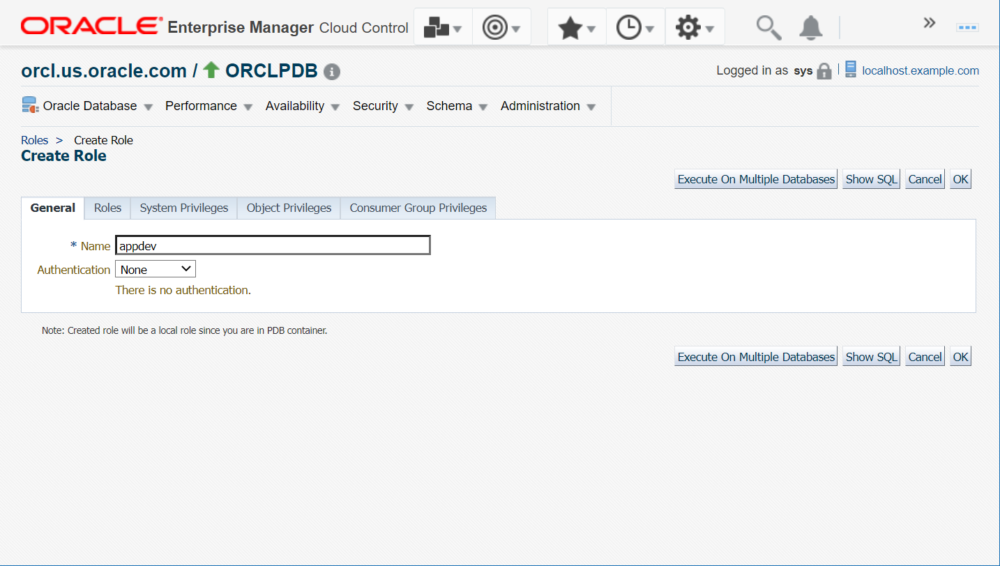  

    Optionally, you may select a type of **Authentication** for the role. For this lab, leave the default value, *None*.   

     > **Note:** You cannot modify the name after creating the role.  

1.  Go to the **System Privileges** tab and click **Edit List** to select system privileges.  
    The values may differ depending on the system you are using.  

    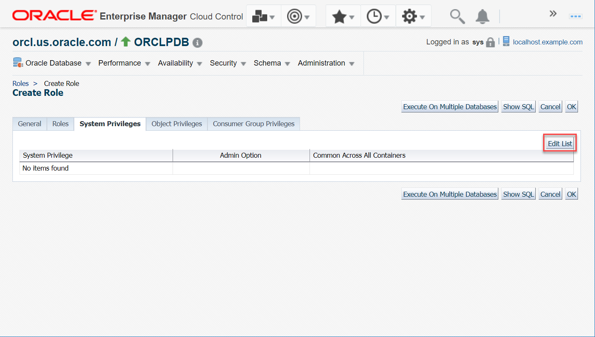  

     > **Note:** The system privileges table displays no records because Oracle Database does not grant any default privileges automatically. The other buttons are not relevant for this lab.  

1.  The Modify System Privileges page displays the **Available System Privileges** that you can grant to your role. The values may differ depending on the system you are using.  

     > **Note:** You can double-click an available system privilege to add it to the selected privileges list box. Similarly, double-click a system privilege to remove it from the selected privileges list box. To select multiple items, press the **ctrl** button on your keyboard and select the privileges.  

    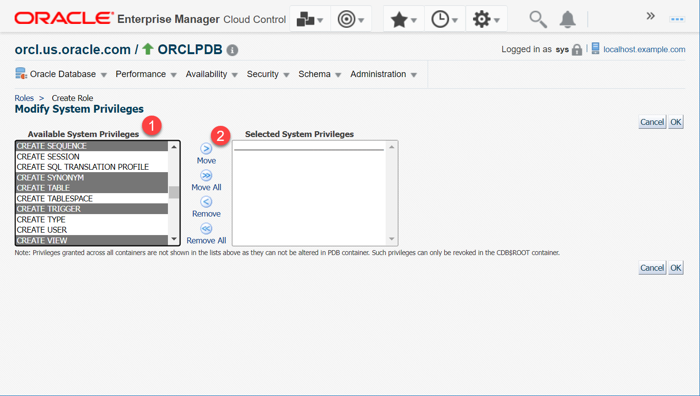  

    For this lab, select these privileges in **Available System Privileges** and click the **Move** button -   
     - `CREATE PROCEDURE`
     - `CREATE SEQUENCE`
     - `CREATE SYNONYM`
     - `CREATE TABLE`
     - `CREATE TRIGGER`
     - `CREATE VIEW`

    If you erroneously added a privilege to **Selected System Privileges**, click the selected privilege and click **Remove** to move it back to **Available System Privileges**. 

1.  The **Selected System Privileges** list box now displays the privileges you selected for the role in the previous step.   
    The values may differ depending on the system you are using.  

    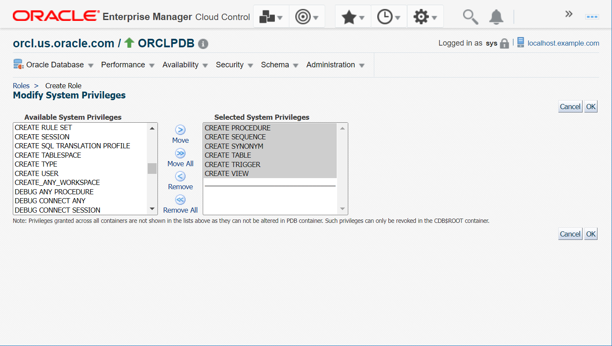  

    Click **OK** to grant the selected privileges.  

     > **Note:** The set of system privileges that you grant to the role depends on your requirements. Oracle recommends the principle of least privilege where you grant only those privileges required to perform the task. 

1.  Verify that the **System Privileges** tab displays the privileges that you granted to your role.  
    The values may differ depending on the system you are using.  

    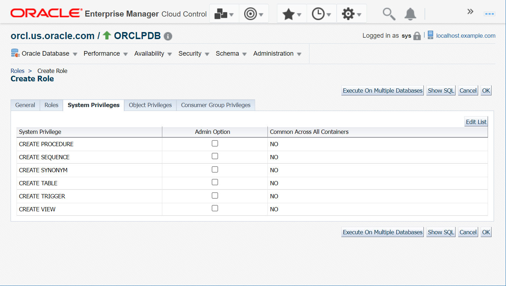  

     > **Note:** Since you are creating it locally in the PDB, the role *APPDEV* is not **Common Across All Containers**. In other words, this role is not available to other containers in your database. 

1.  Click **Show SQL** to view the SQL statement for this task.   
    The values may differ depending on the system you are using.  

    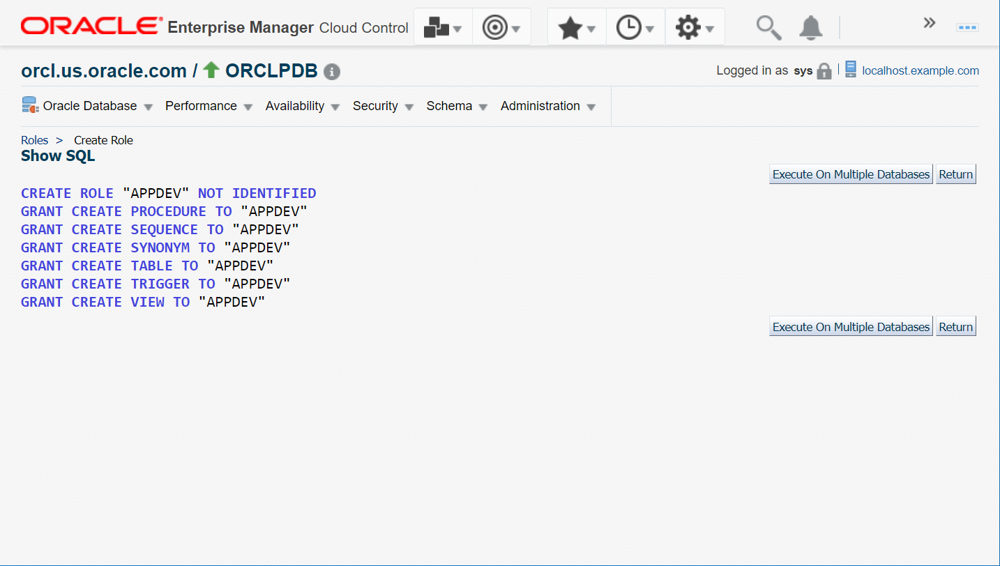  

    Click **Return** to go back to the **System Privileges** tab. 

1.  Leave the remaining tabs and fields and click **OK** to create the role in the PDB.  
    Oracle EMCC displays a confirmation message that you have created the role successfully.  
	The Roles page displays *APPDEV*, the role you created in this task. The values may differ depending on the system you are using.

	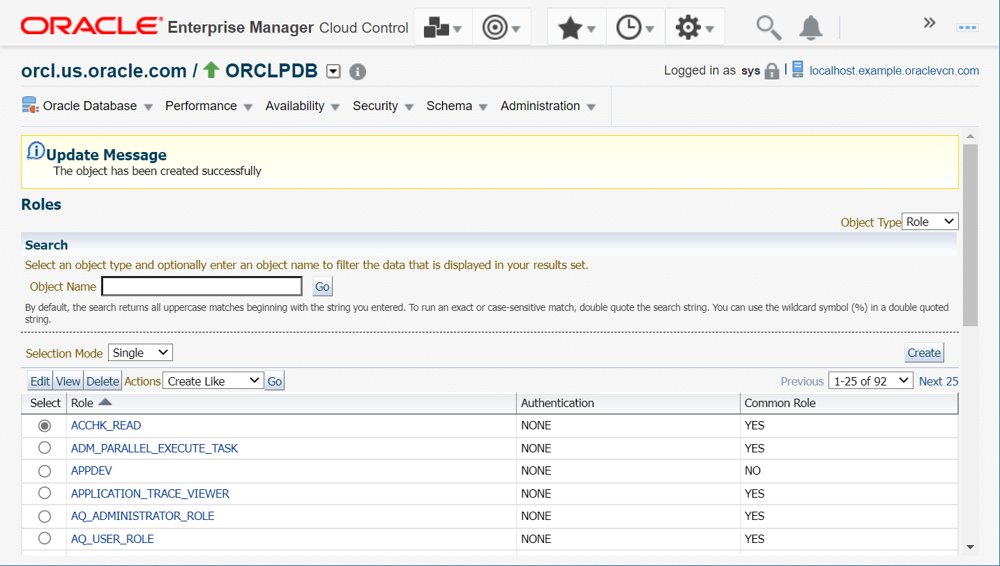   

Similarly, you can create roles in the CDB from the Database Instance home page. 

## Task 3: Modify a role

Suppose you want to grant more roles to an existing role in the container or edit the system privileges of a role. You can modify the roles in your Oracle Database from Oracle EMCC. To modify a role in the database, go to the container where the role exists and **Edit** the role. 

> **Note:** If the Oracle EMCC console remains inactive for 15 minutes or more while performing a database operation, you must restart the operation.

For this lab, modify the role *APPDEV* in the PDB that you created in the previous task. 

1.  On the Roles page, select the role *APPDEV* from the table below and click **Edit** to go to the Edit Role page.   
    The values may differ depending on the system you are using.  

    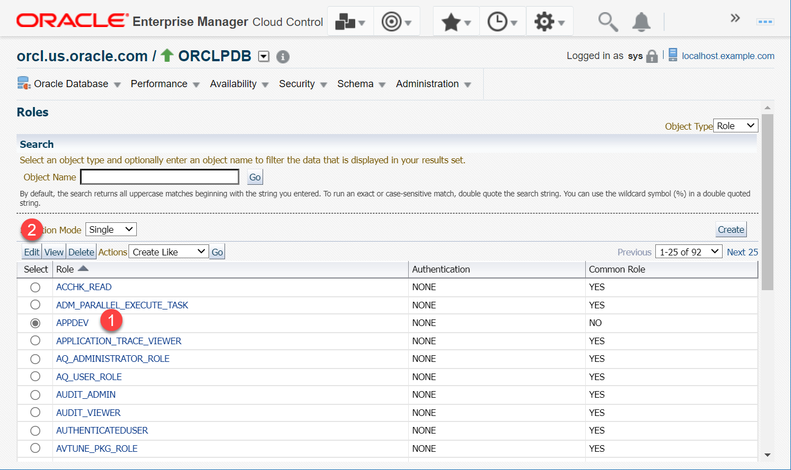  

    The Edit Role page opens for the selected role, *APPDEV*.  
    The values may differ depending on the system you are using.  

    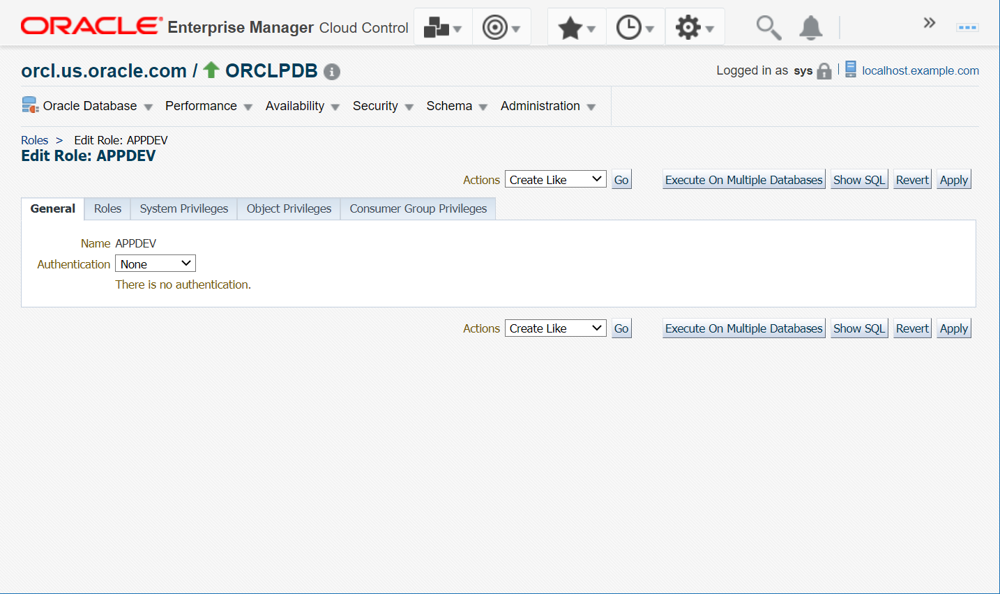  

    Note that you cannot modify the name of the role. 

1.  On the Edit Role page, go to the **Roles** tab and click **Edit List** to select the roles.   
    The values may differ depending on the system you are using.  

    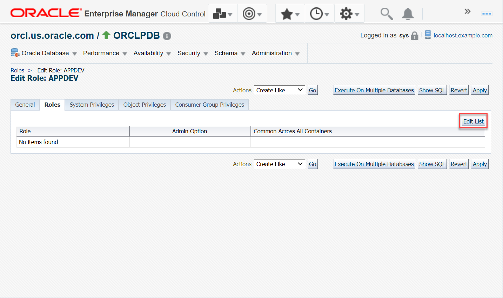  

     > **Note:** The roles table displays no records because Oracle Database does not grant any default roles automatically. The other buttons and options are not relevant for this lab.  

1.  The Modify Roles page displays the **Available Roles** that you can grant to your role. The values may differ depending on the system you are using.  

     > **Note:** You can double-click an available role to add it to the selected roles list box. Similarly, double-click a role to remove it from the selected roles list box. To select multiple items, press the **ctrl** button on your keyboard and select the roles.  

    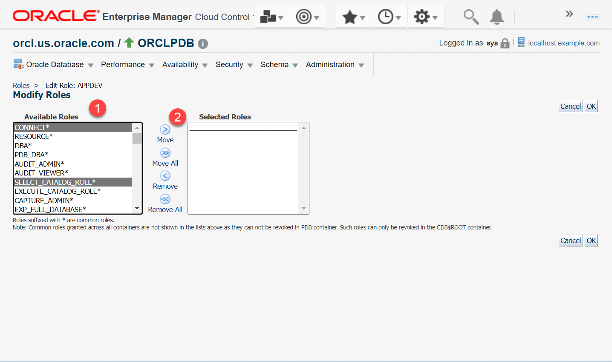  

    For this lab, select these roles in **Available Roles** and click the **Move** button -  
     - `CONNECT*`
     - `SELECT_CATALOG_ROLE*`

    If you erroneously added a role to **Selected Roles**, select the role and click **Remove** to move it back to **Available Roles**. 

1.  The **Selected Roles** list box now displays the roles you selected in the previous step.   
    The values may differ depending on the system you are using.  

    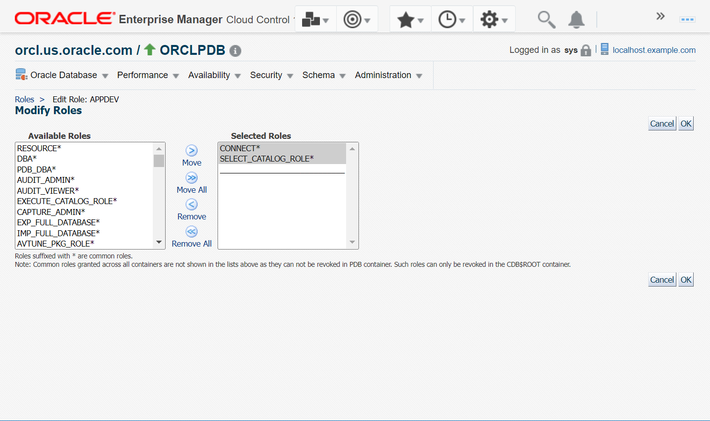  

    Click **OK** to grant the selected roles.  

     > **Note:** The roles with an asterisk (`*`) are common roles. 

1.  The **Roles** tab displays the roles that you granted to your role. Click the **Admin Option** check box for both roles.  
    This option enables the *APPDEV* role to grant roles to other users and roles in the container.   
    The values may differ depending on the system you are using.  

      

1.  Go to the **System Privileges** tab and click **Admin Option** for all the privileges.   
    This option enables the *APPDEV* role to grant system privileges to other users and roles in the container.   
    The values may differ depending on the system you are using.  

    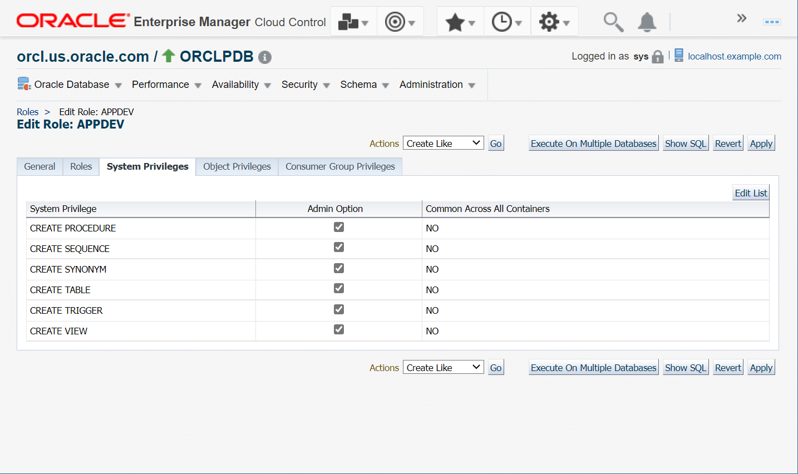  

     > **Note:** Since you created it locally in the PDB, the role *APPDEV* is not **Common Across All Containers**. In other words, this role is not available to other containers in your database. 

1.  Click **Show SQL** to view the SQL statement for this task.   
    The values may differ depending on the system you are using.  

    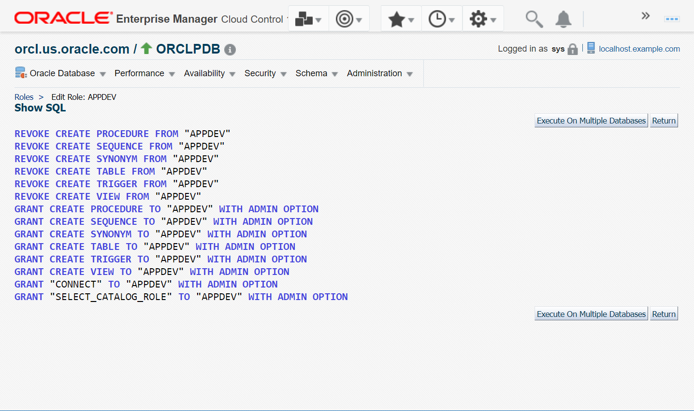  

    Click **Return** to go back to the Edit Role page. 

1.  Click **Apply** to modify the role.  
    Oracle EMCC displays a confirmation message that you have modified the role successfully.  
    The values may differ depending on the system you are using.  

    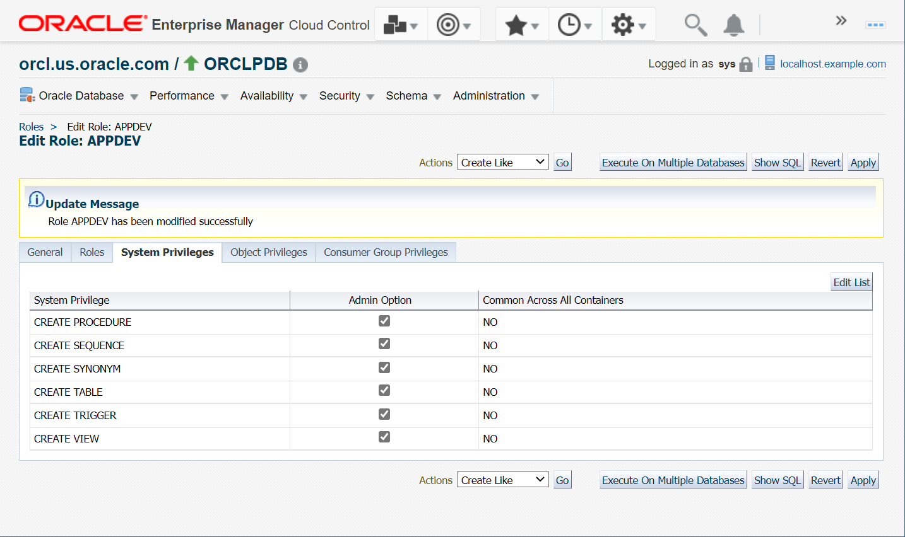  

From the **Security** menu, you may select **Roles** to go back to the Roles page.  

In this lab, you learned how to view existing roles in the PDB from Oracle EMCC. You also learned how to create a new role in your Oracle Database and modify the properties of a role.

You may now **proceed to the next lab**.

## Acknowledgements

 -   **Author**: Manish Garodia, Database User Assistance Development team
 -   **Contributors**: Ashwini R, Jayaprakash Subramanian
 -   **Last Updated By/Date**: Manish Garodia, May 2022
