# Manage database user accounts

## Introduction

This lab walks you through the steps for managing user accounts and security for your Oracle Database from Oracle Enterprise Manager Cloud Control (Oracle EMCC). 

Estimated time: 10 minutes

### Objectives

Perform these tasks from Oracle EMCC:

 -   View the existing user accounts in your Oracle Database
 -   Create a new user account in Pluggable Database (PDB)
 -   Unlock a database user account
 -   Log in to PDB as the new user

### Prerequisites

This lab assumes you have -

 - A Free Tier, Paid or LiveLabs Oracle Cloud account
 -   Completed -
     -   Lab: Prepare setup (*Free-tier* and *Paid Tenants* only)
     -   Lab: Setup compute instance
     -   Lab: Initialize environment
     -   Lab: Manage roles
 -   Logged in to Oracle EMCC in a web browser as *sysman* 

## Task 1: View user accounts in Oracle Database

Logging into Oracle EMCC as the *sysman* user gives you the privileges to view and manage user accounts in Oracle Database. In Oracle EMCC, go to the respective container, CDB or PDB, and view the users in that container. 

For this lab, view the details of the user account *DBUSER* in the PDB.

1.  From the **Targets** menu, select **Databases** to open the Databases page.  

      

1.  On the Database pages, expand the Database Instance name, for example, *orcl.us.oracle.com* and click on the PDB name, *ORCLPDB*.  
    The values may differ depending on the system you are using.  

      

    It opens the PDB home page.

1.  From the **Security** menu on the PDB home page, select **Users** to access the users in the PDB.  
    The values may differ depending on the system you are using.  

    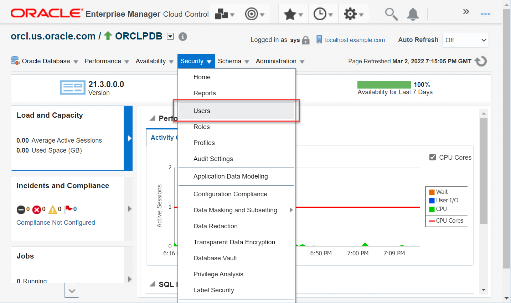  

    Oracle EMCC redirects to the Database Login page.  

1.  Select the *Named* Credential option, if not already selected, and click **Login** to connect to the Oracle Database.  
    The values may differ depending on the system you are using.  

      

    The Users page opens and displays all user accounts in the PDB. The values may differ depending on the system you are using.  

    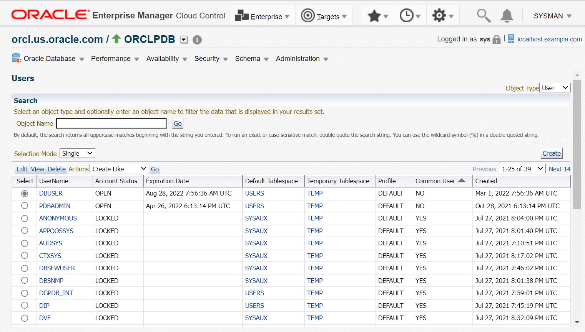  

    The table displays the following information for all users:  
     - **UserName** - the name of the user
     - **Account Status** - whether the user account is *LOCKED* or *OPEN*
     - **Expiration Date** - the date of expiry of the user account
     - **Default Tablespace** - the tablespace to use if the user does not explicitly specify
     - **Temporary Tablespace** - the tablespace to use for storing temporary data, for example, when SQL statements perform sort operations
     - **Profile** - the profile where the user account is located, usually *DEFAULT*
     - **Common User** - whether the user is common across all containers in the Oracle Database
     - **Created** - the creation date of the user account  

    The table has the first user account selected by default.  

     > **Note:** The *DEFAULT* profile assigns the default password policy to a user account. 

1.  Select a user account from the given table and view its details. For this lab, view the details of the user account *DBUSER*.  
    In the **Object Name** field, enter *dbuser* and click **Go** to search for the user account.   
	The field is not case-sensitive. The table displays the *DBUSER* user account selected.

	Click **View** to see the details of the selected user.  
    The values may differ depending on the system you are using.  

    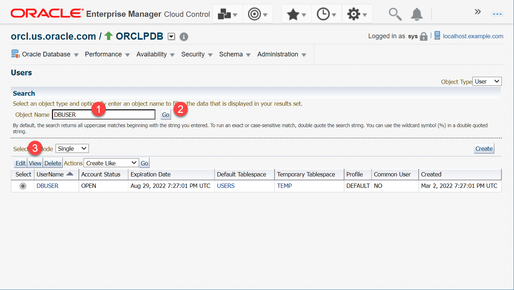  

    Alternatively, you may scroll down the table and click on the user name to view its details.  

1.  The View User page displays the following details of the selected user account.   

     - **General** - information such as profile, authentication type, default and temporary tablespaces, account status, etc.
     - **Roles** - that are granted to the user
     - **System Privileges** - that are granted to the user
     - **Object Privileges** - that are granted to the user
     - **Quotas** - for each tablespace in MBs
     - **Consumer Group Privileges** - that are granted to the user
     - **Proxy Users** - the users who can proxy for this user
     - **Proxied for Users** - the users who this user can proxy for

    The values may differ depending on the system you are using.  

    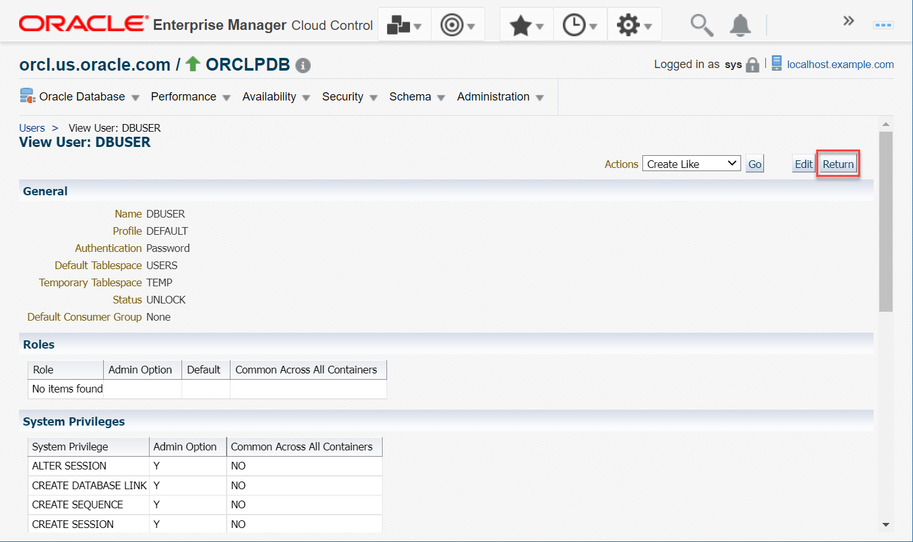  

    Click **Return** to go back to the Users page.  

Similarly, you can view the user accounts in the CDB from the Database Instance home page in Oracle EMCC. 

## Task 2: Create a user account in PDB 

To create a user account in Oracle Database, go to the container where you want to create the user. You can create a new user account altogether or duplicate an existing user account. 

> **Note:** If the Oracle EMCC console remains inactive for 15 minutes or more while performing a database operation, you must restart the operation.

For this lab, create a user account *appuser* in the PDB and grant the *appdev* role to the user.

1.  On the Users page, click **Create** to initiate creating a user account in the PDB.  
    The values may differ depending on the system you are using.  

    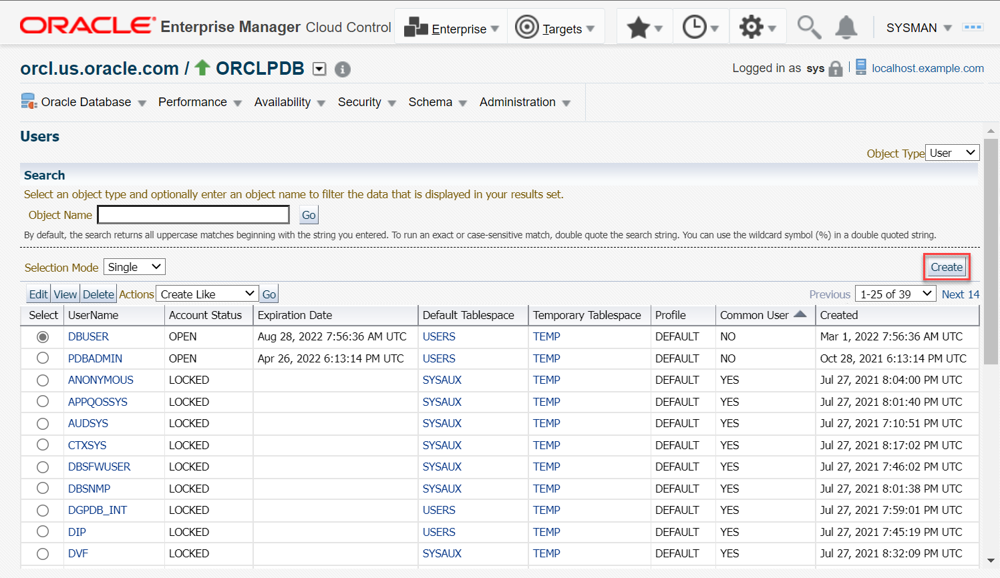  

     > **Note:** The **Create Like** option creates a new user account in the database by duplicating an existing user. For this lab, do not use this option. 

1.  On the Create User page in the **General** tab, enter the details of the user.   
    The values may differ depending on the system you are using.  

    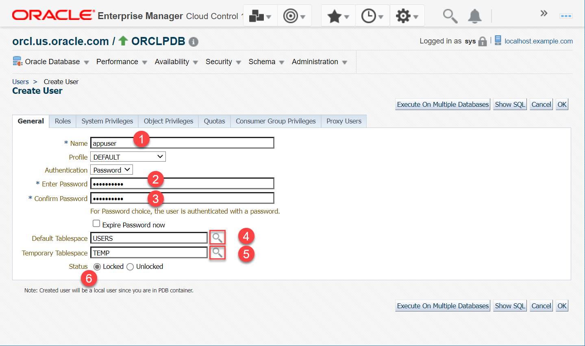  

    For this lab, specify the following.   

     - **Name** - *appuser*   
     The field is not case-sensitive.   

	 Leave **Profile** as *DEFAULT* and **Authentication** as *Password*.   

     - **Password** - Set a password for the user, for example, *mypassword*  
     Ensure to note this password because when you log in to the PDB as *appuser*, you will need this password.  

	 For this lab, do not select the **Expire Password now** option.   
	 This option enforces the user to create a new password the first time when the user tries to log in to the database.   

     - **Default Tablespace** - Click the magnifier icon, select a tablespace, for example, *USERS*, and click **Select**.   
     The `USERS` tablespace will store all schema objects that *appuser* will create.  

     - **Temporary Tablespace** - Click the magnifier icon, select a tablespace, for example, *TEMP*, and click **Select**.   

     - **Status** - Select *Locked*   

     > **Note:** You cannot modify the name after creating the user account.   

     See [Oracle Database Security Guide](https://docs.oracle.com/en/database/oracle/oracle-database/19/dbseg/keeping-your-oracle-database-secure.html#GUID-451679EB-8676-47E6-82A6-DF025FD65156) for more information on secure passwords.  

1.  Go to the **Roles** tab and click **Edit List** to select the roles.   

    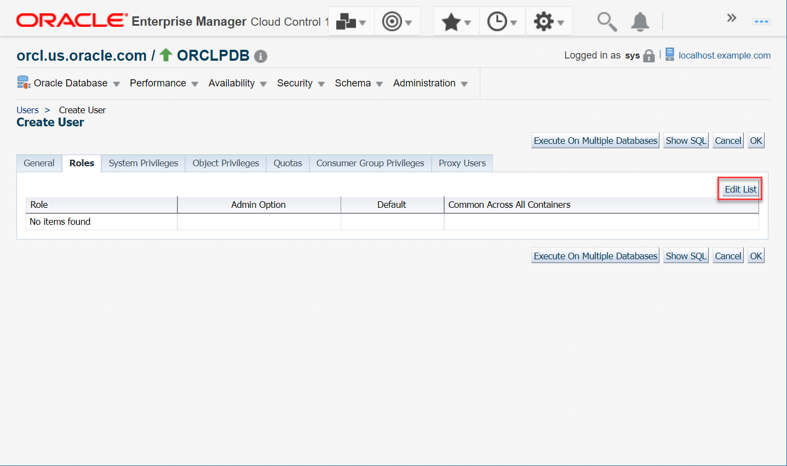  

     > **Note:** The roles table displays no records because Oracle Database does not grant any default roles automatically. The other buttons are not relevant for this lab.  

1.  The Modify Roles page displays the **Available Roles** that you can grant to your user. The values may differ depending on the system you are using.  

     > **Note:** You can double-click an available role to add it to the selected roles list box. Similarly, double-click a role to remove it from the selected roles list box. To select multiple items, press the **ctrl** button on your keyboard and select the roles.  

    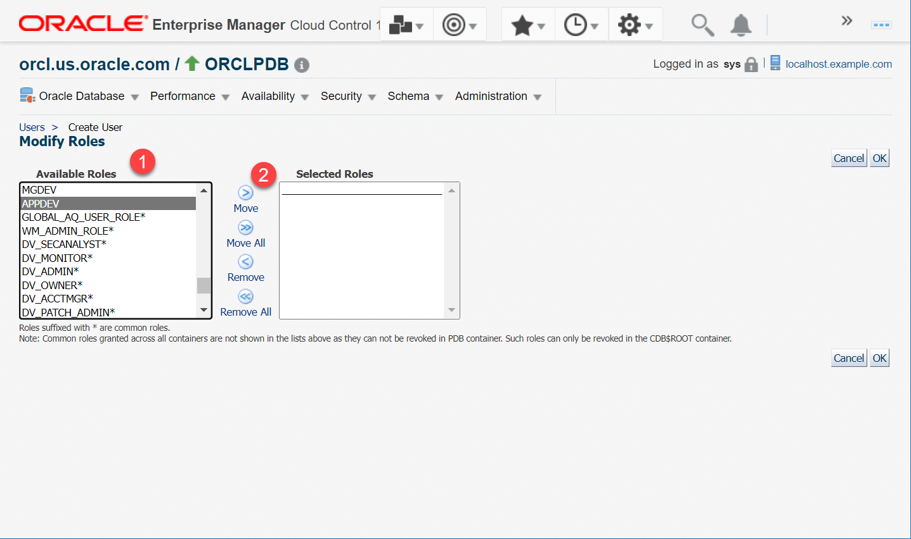  

    For this lab, select the role *APPDEV* in **Available Roles** and click the **Move** button.  
    If you erroneously added a role to **Selected Roles**, click the selected role and click **Remove** to move it back to **Available Roles**. 

1.  The **Selected Roles** list box now displays the *APPDEV* role you selected in the previous step.  
    The values may differ depending on the system you are using.   

    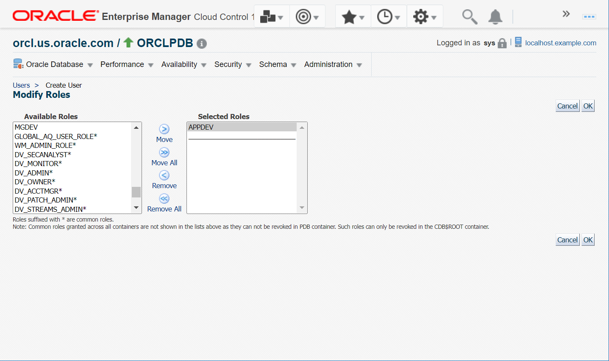  

     > **Note:** The roles with an asterisk (`*`) are common roles.

    Click **OK** to grant the selected role.  

1.  The **Roles** tab displays the *APPDEV* role and **Default** column selected.  
    Click **Admin Option** for the role *APPDEV*. This option enables the user to grant roles to other users and roles in the container.   

    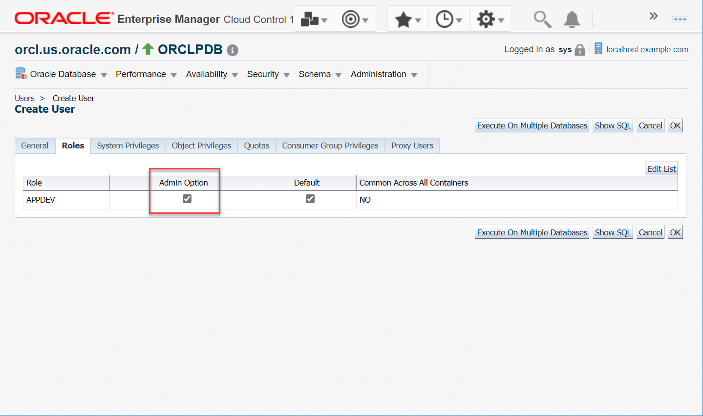  

     > **Note:** Since you created it locally in the PDB, the role *APPDEV* is not **Common Across All Containers**. In other words, this role is not available to other containers in your database.  

1.  Click **Show SQL** to view the SQL statement for this task.   

    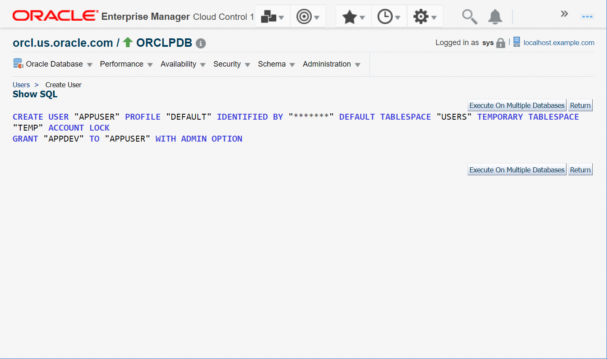  

    Click **Return** to go back to the Create User page. Leave the defaults for the remaining fields.  

1.  Click **OK** to create the user account in the PDB.  
    Oracle EMCC displays a confirmation message that you have created the user successfully.  

	The Users page displays *APPUSER* with an **Expiration Date** and **Account Status** as *LOCKED*.   

	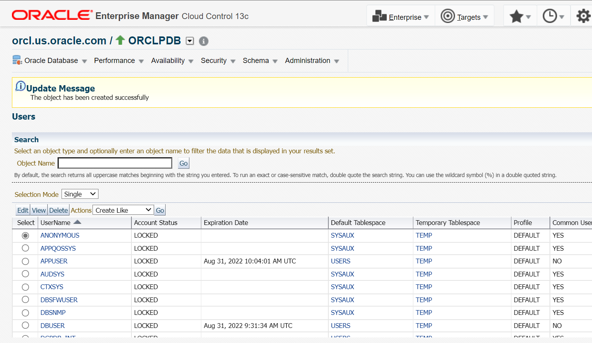

Similarly, you can create user accounts in the CDB from the Database Instance home page. 

## Task 3: Unlock a user account

To deny access temporarily to Oracle Database for a particular user account, you can lock the user account instead of deleting it. Deleting a user also deletes all schema objects owned by the user. On locking a user account, when the user attempts to connect, the database displays an error message and does not allow the connection. 

You can unlock the user account from Oracle EMCC to allow database access again to that user. 

> **Note:** If the Oracle EMCC console remains inactive for 15 minutes or more while performing a database operation, you must restart the operation.

For this lab, unlock the user account *APPUSER* in the PDB that you created in the previous task. 

1.  On the Users page, select the user *APPUSER* from the table below and click **Edit** to go to the Edit User page.   
    The values may differ depending on the system you are using.  

    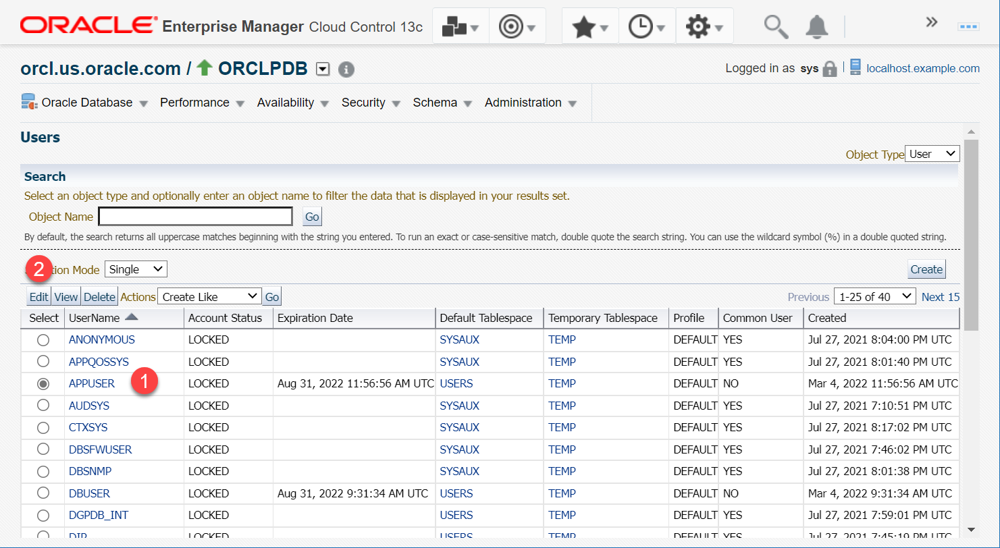  

1.  On the Edit User page in the **General** tab, change the **Status** field to *Unlocked*.   
    The values may differ depending on the system you are using.  

    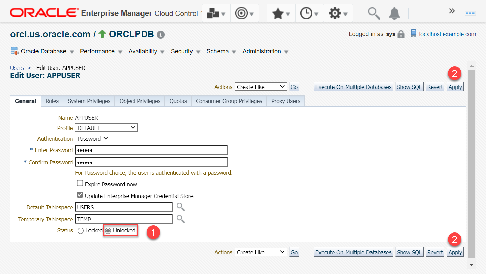  

    Note that you cannot modify the user name.  

1.  Click **Show SQL** to view the SQL statement for this task.   
    The values may differ depending on the system you are using.  

    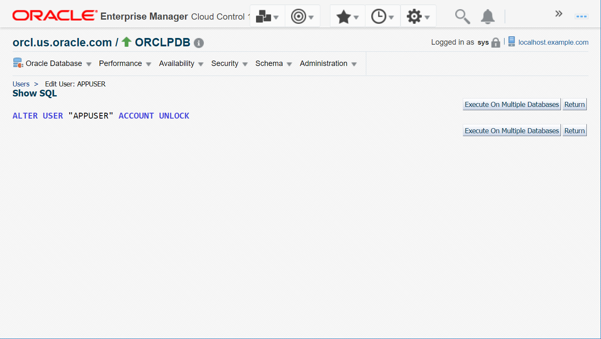  

    Click **Return** to go back to the Edit User page.   

1.  Click **Apply** to unlock the user account.   
    Oracle EMCC displays a confirmation message that you have modified the user successfully.  
    The values may differ depending on the system you are using.  

    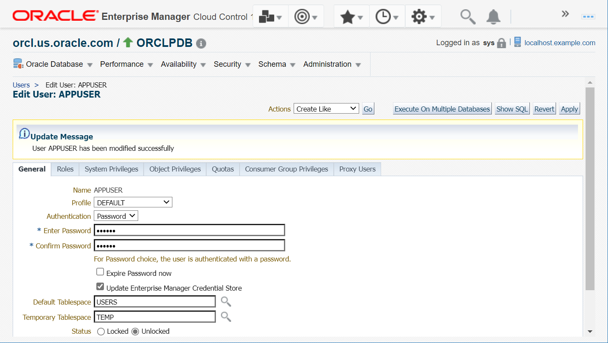  

1.  From the **Security** menu in PDB, select **Users** to go back to the Users page. The values may differ depending on the system you are using.  

    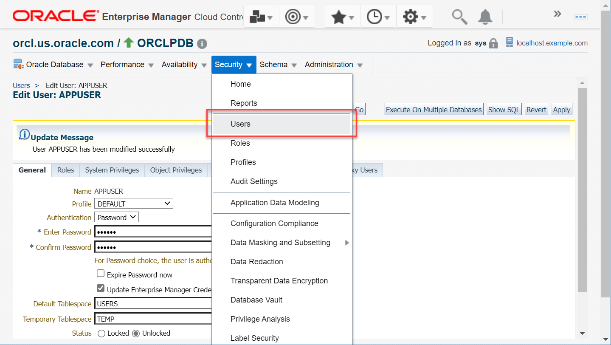  

    The Users page displays the **Account Status** for *APPUSER* as *OPEN*.   
    The values may differ depending on the system you are using.  

    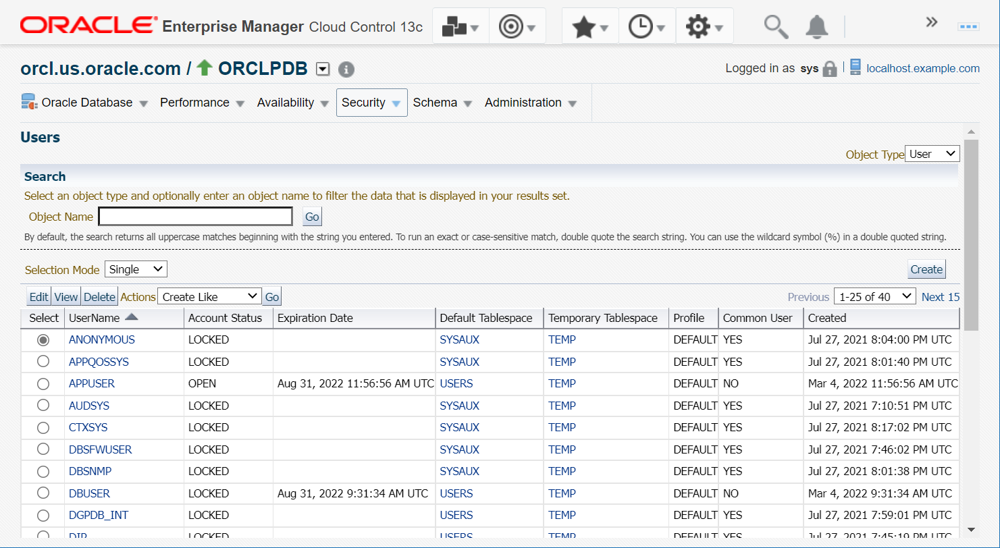  

     > **Note:** After unlocking a user account, the user can access the database and connect to the container where the user has appropriate privileges. 

You can now log in to the PDB as the newly created user, *appuser*.

## Task 4: Log in to PDB as appuser

You are currently logged in to PDB as the database admin user, *sys*. 

> **Note:** Each Oracle product has its corresponding admin user accounts.

 -   For Oracle Database, the admin user is *sys*.
 -   For Oracle EMCC, the admin user is *sysman*.

For this lab, you will log out of PDB and log back in as *appuser*, the user that you created earlier.

1.  Check the current user that is logged in to the PDB. Verify that it is *sys*.  
    The values may differ depending on the system you are using.  

    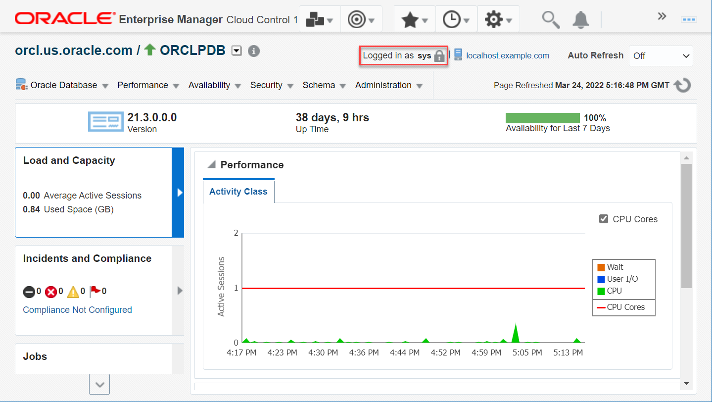  

1.  On the top-right, click the Oracle EMCC profile menu *SYSMAN* > **Log Out** to open the logout options.  
    The values may differ depending on the system you are using.  

    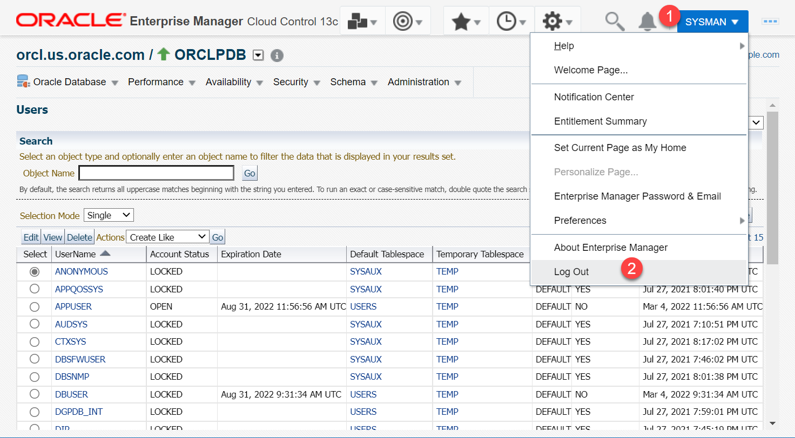  

    A pop-up window opens and displays the current users that are logged in to the PDB and to Oracle EMCC. The pop-up shows the default logout option, *ORCLPDB*, selected.  

1.  Leave the default logout option as *ORCLPDB* and click **Logout** to logout of the PDB.   
    The values may differ depending on the system you are using.  

    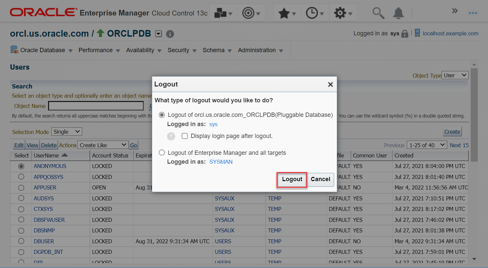  

    You are now logged out of the PDB as *sys* but still logged into Oracle EMCC as *sysman*.   

     > **Note:** Do not log out of Oracle EMCC.   

1.  To login as the new user, on the PDB home page go to one of the objects page.   
	For this lab, from the **Schema** menu, select **Database Objects** > **Tables** to access the tables.    
    The values may differ depending on the system you are using.  

    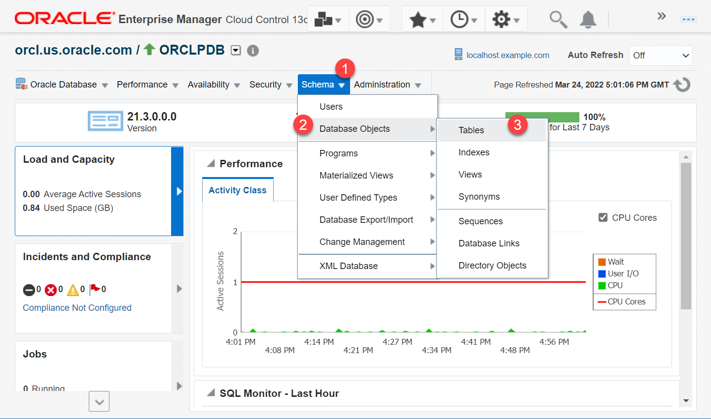  

    Oracle EMCC redirects to the Database Login page.  

1.  This time select the *New* Credential option to enter the login credentials.   
    The values may differ depending on the system you are using.  

    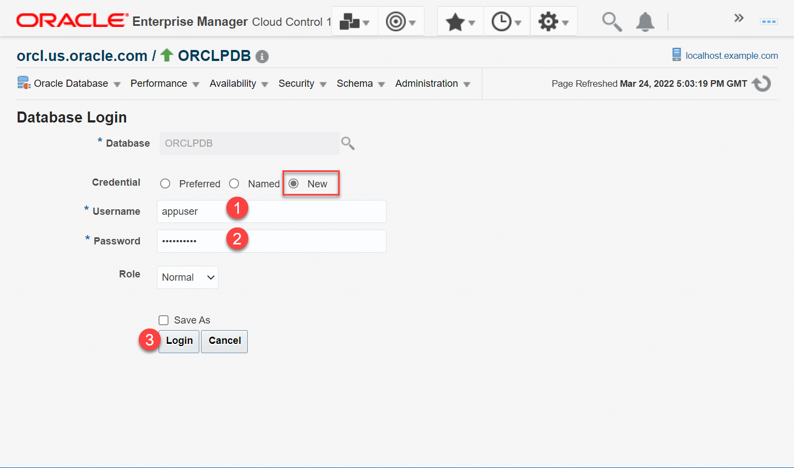  

    For this lab, enter the following:  
	 - **Username** - *appuser*  
      Enter the user name you created earlier.  
	 - **Password** - *mypassword*  
      Enter the password for the user.
	 - Leave the default **Role** *Normal*.  

     > **Note:** Optionally, you may click **Save As** if you want to save the credentials for future logins. While saving, you can also set this as your preferred credentials.   

    Click **Login** to connect to the PDB.  
    The Tables page appears but contains no data because you have not created any schema.  

1.  Verify the current user that is logged in to the PDB.  
    The values may differ depending on the system you are using.  

    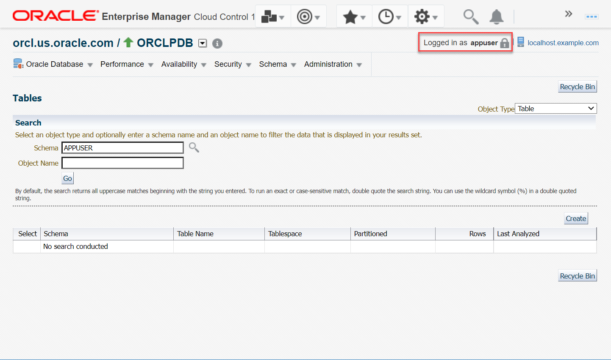  

    You have now logged in to the PDB as *appuser*. Similarly, you can change the current user and log in as another user if you have the credentials.

This brings you towards the successful completion of this workshop on *user accounts and security management* for Oracle Database 21c.

In this workshop, you learned how to view and create roles and user accounts in Oracle Database. You also learned how to modify the roles, unlock the user accounts, and log in to your Oracle Database as another user.

## Acknowledgements

 -   **Author**: Manish Garodia, Database User Assistance Development team
 -   **Contributors**: Ashwini R, Jayaprakash Subramanian    
 -   **Last Updated By/Date**: Manish Garodia, May 2022
