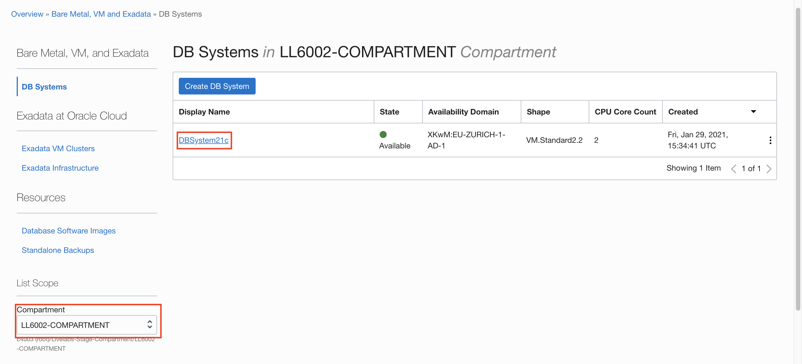
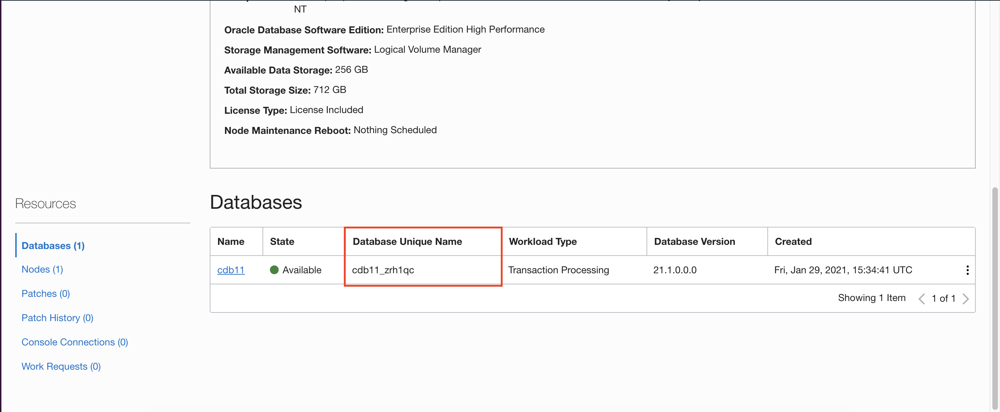
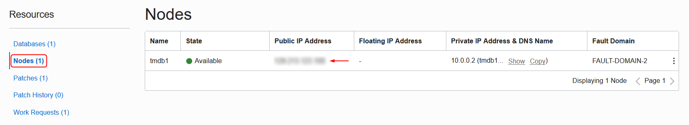

# Login to your Environment

## Introduction

This lab walks you through the steps to gather system details and connect to the Database using SSH. 

A virtual cloud network (VCN) provides the necessary network Infrastructure required to support resources, including Oracle Database instances. This includes a gateway, route tables, security lists, DNS and so on. 

Estimated Lab Time: 10 minutes

### Objectives
* Login to your environment

### Prerequisites

* LiveLabs Cloud Account
* SSH Keys
  

## Task: Gather system details and connect to the Database using SSH

1. Click the **Navigation Menu** in the upper left, navigate to **Oracle Database**, and select **Bare Metal, VM, and Exadata**.

	

2. Select the compartment you were assigned. Note that you have a fully provisioned Database. Select it. 
  

3. In the Databases section, jot down your **Database Unique Name**.  You will need this for the next lab.
  


4. On the resources tab, click **Nodes** to gather your IP address. Note your Public IP Address

  

5. In Cloud Shell or your terminal window, enter the following commands

    ```
    $ <copy>mkdir .ssh
    ```

    ```
    $ <copy>cd .ssh
    ```

    ```
    $ <copy>wget https://objectstorage.us-ashburn-1.oraclecloud.com/p/VEKec7t0mGwBkJX92Jn0nMptuXIlEpJ5XJA-A6C9PymRgY2LhKbjWqHeB5rVBbaV/n/c4u04/b/livelabsfiles/o/data-management-library-files/ssh-key-2021-03-03
    ```

    ```
    $ <copy>chmod 600 ssh-key-2021-03-03
    ```
6.  Enter this command, using your IP address:

    ```
    $ <copy>ssh -i ~/.ssh/ssh-key-2021-03-03 opc@(ip address)
    ```

7. Once connected, you can switch to the "oracle" OS user and connect using SQL*Plus:

    ```
    [opc@tmdb1 ~]$ sudo su - oracle
    [oracle@tmdb1 ~]$ . oraenv
    ORACLE_SID = [cdb1] ?
    The Oracle base has been set to /u01/app/oracle
    [oracle@tmdb1 ~]$ sqlplus / as sysdba

    SQL*Plus: Release 21.0.0.0.0 - Production on Sat Nov 15 14:01:48 2020
    Version 21.2.0.0.0

    Copyright (c) 1982, 2020, Oracle.  All rights reserved.

    Connected to:
    Oracle Database 21c EE High Perf Release 21.0.0.0.0 - Production
    Version 21.0.0.0.0

    SQL>
    ```

You may now [proceed to the next lab](#next).

## Want to Learn More?

* [Oracle Cloud Infrastructure: Creating Bare Metal and Virtual Machine DB Systems](https://docs.cloud.oracle.com/en-us/iaas/Content/Database/Tasks/creatingDBsystem.htm)
* [Oracle Cloud Infrastructure: Connecting to a DB System](https://docs.cloud.oracle.com/en-us/iaas/Content/Database/Tasks/connectingDB.htm)

## Acknowledgements
* **Author** - Kay Malcolm, Database Product Management
* **Last Updated By/Date** - Kamryn Vinson, January 2021

